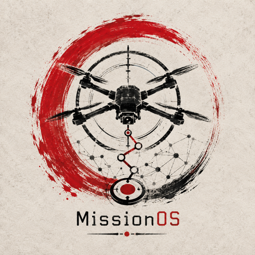
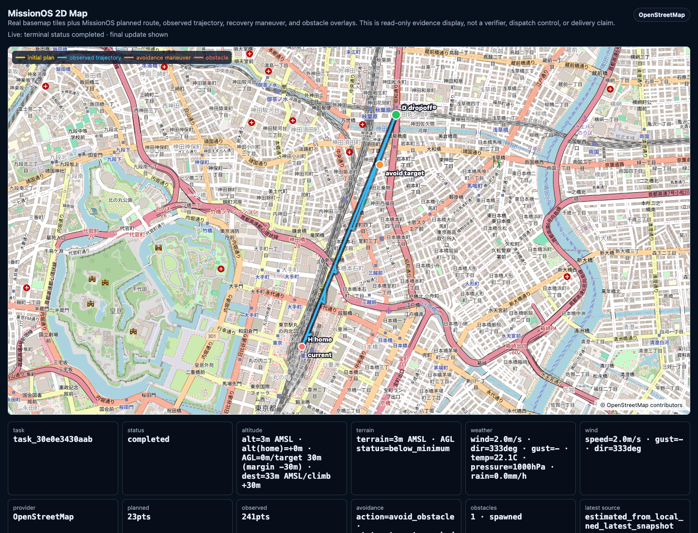
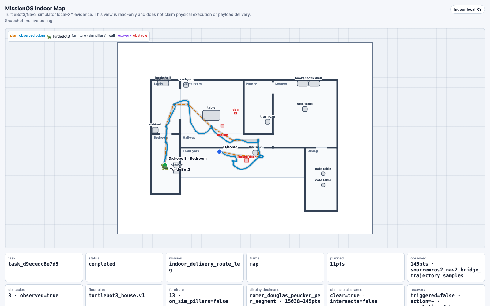

# MissionOS

<p align="center">
  
</p>

MissionOS is a control CLI for LLM-assisted drone missions.

The LLM proposes routes and recovery actions. A human approves them. MissionOS
records what was proposed, what was approved, what was sent to the execution
boundary, and what was actually observed.

The point is not to hand the LLM a joystick. The point is to let the LLM judge,
plan, and propose while MissionOS keeps approval, dispatch, ACK, observed
progress, and completion as separate facts. An ACK is not success. Observed
progress is not mission completion.

## Disclaimer

MissionOS is reference software for AI-assisted mission-control research and
simulation. It is not a certified autopilot, flight controller, safety system,
legal compliance system, or substitute for a qualified human operator.

Do not use MissionOS to operate drones, robots, vehicles, or other physical
systems unless you have independent safety controls, appropriate supervision,
applicable permissions, and a test environment designed for that use. Simulation
and hardware-related paths are opt-in surfaces and must be treated as
experimental.

MissionOS separates AI proposals, human approval, constrained dispatch,
runtime observations, verifier evidence, and completion claims. A proposal,
approval, ACK, simulator observation, or map display is not proof of safe
physical execution or delivery completion.

## Current Status

MissionOS is an early public snapshot. The public path documented here is:

```bash
MISSIONOS_GATEWAY_BACKEND=production missionos --timeout 240 chat --autostart
```

Use it with an explicit LLM backend. Local Gemma may need the longer timeout;
hosted Gemini usually responds faster. Other runtime and simulator paths exist
in the repository, but they are not presented as public quickstarts in this
snapshot unless separately verified.

MissionOS does not claim:

- unchecked LLM control
- physical execution
- real hardware flight
- delivery completion
- observed progress without evidence
- general-purpose destination planning

### Runtime Progress

Status as of 2026-07-08. This table is evidence-bounded: simulator evidence
does not imply physical execution, and ACK is not success.

| Track | Progress | Currently blocked by |
| --- | --- | --- |
| PX4 / Gazebo SITL | Most mature execution path. `missionos chat` has exercised PX4/Gazebo SITL with human approval, Recovery Agent proposals, operator-approved `avoid_obstacle`, and `watch` / `operate` / `map` evidence. A terminal SITL `completed` task state exists. | Real hardware flight, delivery completion, and physical execution are still unproven. The next boundary is HITL, bench, or field evidence with an independent safety case. |
| TurtleBot3 (TB3) / ROS2 Nav2 | Current reproducible indoor simulator baseline. Docker/Gazebo/Nav2, `turtlebot3_house`, normal chat -> Gateway -> task -> `operate` / `watch` / `map`, telemetry sidecar evidence, and obstacle-aware simulator evidence are in place. | Physical TB3 execution has not run. It still needs real actuator, E-stop, and floor-environment validation before `physical_execution_invoked=true`. |
| TurtleBot4 (TB4) / ROS2 Nav2 | Opt-in profile, task artifact shape, bridge contract, documentation, and safe blocked-by-default behavior are in place. | The Create3/Gazebo stack currently does not produce meaningful `/odom` motion. The controller, diffdrive, dock, or startup layer below MissionOS must move before Nav2 completion can be claimed. |
| Nova Carter / NVIDIA Isaac Sim | Opt-in `nova-carter` CLI/runtime profile, `execution_target=isaac_ros_nav2_nova_carter_sim`, live-proof scaffold, and manifest gates that reject ACK-only success are in place. | No live Isaac Sim evidence yet. It needs an RTX/GPU host with Isaac Sim, Isaac ROS, Nova Carter/Nav2, an operator-provided bridge command, and map/watch artifacts. |
| Nvblox / Isaac ROS perception evidence | The v1 perception-evidence contract, env/bridge payload ingestion, required gate, tests, and docs are in place. Nvblox evidence is explicitly not approval, dispatch, or obstacle-avoidance completion by itself. | No live Nvblox data yet. It needs depth/pose -> reconstruction -> Nav2 costmap evidence paired with trajectory/verifier clearance evidence. |

## What MissionOS Does

1. You ask MissionOS for a drone mission or recovery decision.
2. The LLM proposes a route or bounded recovery action.
3. A human operator approves or rejects the proposal.
4. MissionOS sends only approved actions through the execution boundary.
5. MissionOS records proposal, approval, command send, ACK, observed progress,
   and completion separately.
6. If evidence shows a problem, the LLM can propose the next repair or recovery
   action. It still cannot approve or execute by itself.

**Core principle:**

> LLM judges. Human approves. Rules constrain. Executor acts. Verifier checks.
> Repair loops.

The same loop drives an outdoor PX4 drone and an indoor ground robot. On the
left, a chat-planned PX4/Gazebo SITL delivery across Tokyo: the initial plan,
the observed trajectory, and an operator-approved obstacle-avoidance maneuver
on a real OpenStreetMap basemap. On the right, a TurtleBot3 in the stock
Gazebo `turtlebot3_house` world asked in chat to deliver to the bedroom: the
approved plan (orange) and the AMCL-corrected observed trail (blue) pass
through three real doorways from the front yard to the bedroom dropoff. Both
views are read-only evidence displays; MissionOS claims only sim results and
never claims physical execution or payload delivery.

| PX4 drone · city delivery with obstacle avoidance | TurtleBot3 · house delivery to a named room |
| --- | --- |
|  |  |

TurtleBot3 is used here because it is the current reproducible indoor
ROS2/Nav2 simulator baseline, not because MissionOS prefers older hardware.
TurtleBot4 support exists as an opt-in profile, but its current
Create3/Gazebo simulator stack has not yet produced the same repeatable
odometry-backed motion evidence. See
[Simulator Baseline](docs/concepts/simulator-baseline.md) for the migration
boundary.

## Chat Quickstart

Install the repository and CLI packages (requires Python 3.11+):

```bash
python3 -m venv .venv
source .venv/bin/activate
python -m pip install -e . -e packages/missionos-gateway -e packages/missionos-cli
missionos --help
```

Configure LLM credentials before running the intended MissionOS experience.
Gemini is the default hosted path; Ollama/Gemma is a local no-spend path that
can be slower and may need longer timeouts.

```bash
cp .env.example .env
# For the intended chat path, edit .env:
# MISSIONOS_LLM_BACKEND=gemini
# GOOGLE_API_KEY=...
#
# Or use local Ollama/Gemma:
# MISSIONOS_LLM_BACKEND=ollama
# MISSIONOS_OLLAMA_MODEL=gemma4:26b
```

Then start chat:

```bash
MISSIONOS_GATEWAY_BACKEND=production missionos --timeout 240 chat --autostart
```

`MISSIONOS_LLM_BACKEND=off` exists for development fallbacks and boundary tests.
It is not the main MissionOS product experience.

See [MissionOS Chat: Tokyo Station to Akihabara](docs/examples/missionos-chat-tokyo-akihabara.md)
for an actual LLM-backed chat run. In that run, MissionOS proposed a bounded
mission and asked for human approval; it did not approve, dispatch, observe
progress, or claim completion.

See [MissionOS Chat: Obstacle Recovery Run](docs/examples/missionos-chat-obstacle-recovery.md)
for an actual obstacle-context live SITL run with human-approved recovery
dispatches, `missionos watch`, `missionos operate`, and a map screenshot. That
run reached terminal completion through recovery/return evidence, but it still
does not claim delivery completion or physical execution.

## TurtleBot3 Simulator Quickstart

TurtleBot3 is the current indoor ROS2/Nav2 simulator baseline. It uses Docker to
start a local TurtleBot3/Gazebo/Nav2 Gateway, then enters the same MissionOS chat
loop as the PX4 path:

```bash
# Print the Docker/Gazebo/Nav2 startup command without launching it.
missionos chat --robot turtlebot3 --turtlebot3-dry-run

# First run: build the simulator image, start the Gateway, and enter chat.
MISSIONOS_LLM_BACKEND=gemini \
missionos --timeout 300 chat \
  --robot turtlebot3 \
  --turtlebot3-build-image \
  "TurtleBot3: run the indoor delivery route in the simulated house."
```

The TurtleBot3 path remains simulator-only:

```text
completion_scope=sim_action
physical_execution_invoked=false
mission_delivery_completion_claimed=false
```

Use `--turtlebot3-smoke` for the non-interactive Docker smoke instead of the
operator chat loop. See
[ROS2/Nav2 TurtleBot3 Simulator Bridge](docs/agents/ros2-nav2-turtlebot3-sim.md)
for the full runtime contract and troubleshooting notes.

## Why MissionOS Exists

Most current AI agent work stops at "the agent did something."

In the real world, that is not enough.

Physical agents need mission control, not a chatbot with a joystick.

When a mission stalls, an LLM can propose a recovery. MissionOS should not treat
that proposal as approval, execution, or success.

MissionOS exists because those situations require a system that stays honest.
Planning, recovery, rules, execution, and verification must remain separate
roles.

Without that separation, mission control is unlikely to scale beyond demonstrations.

The gap between "the agent did something" and "we can explain what actually happened" is where physical AI either matures or collapses under ambiguity. MissionOS is being built to close that gap without turning weak evidence into confident success claims.

## Repository Layout

```text
packages/
  missionos-cli/       Operator CLI
  missionos-gateway/   HTTP and WebSocket Gateway
  missionos-core/      Shared schemas and claim semantics
  missionos-sitl/      Simulator adapters
src/                   Copied MissionOS backend and runtime modules
scripts/               Runtime smoke scripts and maintenance utilities
simulators/            Simulator helper code and plugins
config/                Runtime configuration templates
docs/
  concepts/            Human-readable explanations
  examples/            Scenario writeups
  agents/              Detailed contracts for AI agents and maintainers
tests/
  contract/            Schema and contract tests
  e2e/                 Runtime boundary tests
```

## Documentation Guide

Start with the concepts if you want the reasoning. Jump to the packages if you want to run something.

**Concepts**

- [docs/concepts/README.md](docs/concepts/README.md)
- [docs/concepts/boundaries.md](docs/concepts/boundaries.md)

**Packages**

- [packages/missionos-cli/README.md](packages/missionos-cli/README.md)
- [packages/missionos-gateway/README.md](packages/missionos-gateway/README.md)
- [packages/missionos-core/README.md](packages/missionos-core/README.md)
- [packages/missionos-sitl/README.md](packages/missionos-sitl/README.md)

**For agents and maintainers**

- [docs/agents/README.md](docs/agents/README.md)
- [docs/agents/contracts.md](docs/agents/contracts.md)
- [docs/agents/claim-semantics.md](docs/agents/claim-semantics.md)
- [docs/agents/artifact-taxonomy.md](docs/agents/artifact-taxonomy.md)
- [docs/agents/e2e-verification.md](docs/agents/e2e-verification.md)
- [docs/agents/cli-parity-release-gate.md](docs/agents/cli-parity-release-gate.md)
- [docs/agents/publication-rules.md](docs/agents/publication-rules.md)
- [docs/agents/legacy-codename-rename-plan.md](docs/agents/legacy-codename-rename-plan.md)

## Documentation Layers

Human-facing docs (`docs/concepts/`, `docs/examples/`) should be short and readable.
Agent-facing docs (`docs/agents/`) should be precise enough for automated agents to modify the code without breaking core boundaries.

## Initial Development

The repository also carries simulator/runtime modules and maintenance scripts.
Anything that starts simulation or hardware-adjacent execution must remain
opt-in and evidence-bounded.

## License

MissionOS is licensed under the Apache License, Version 2.0. See
[LICENSE](LICENSE).
