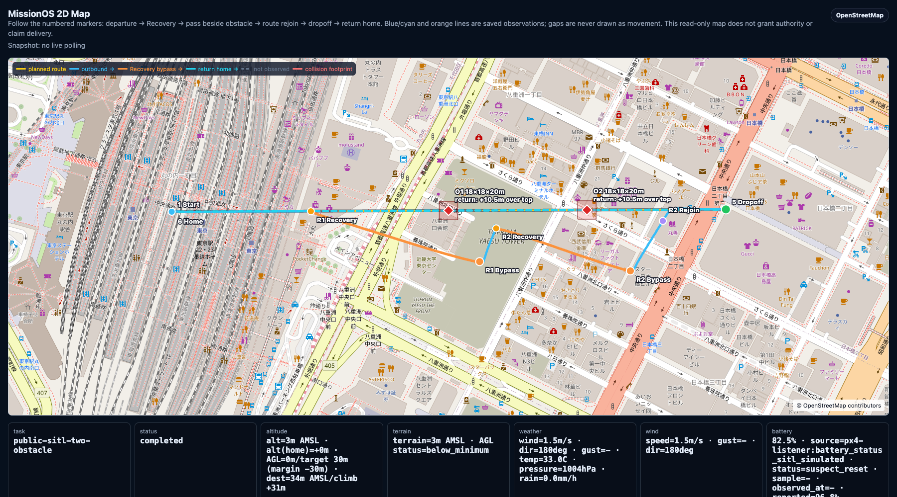

# MissionOS

<p align="center">
  
</p>

**Give the AI a control tower, not a joystick.**

MissionOS is a mission-control CLI for LLM-assisted drone and robot missions.

Putting an AI agent into the physical world is not a question of making the
model smarter. It is a question of which authority you hand it. An air traffic
controller never flies the aircraft: they propose, record, and wait for
confirmation. That separation of authority — not pilot skill alone — is what
lets aviation scale safely. MissionOS applies the same structure to LLM
agents.

The LLM sits in the tower. It plans routes, judges situations, and proposes
recovery actions. It holds no execution authority. A human approves or rejects
each proposal, only approved actions cross the execution boundary, and every
stage leaves its own record: what was proposed, what was approved, what was
sent, what was ACKed, and what was actually observed.

One consequence of this separation is that overclaiming becomes structurally
impossible. When proposal, approval, dispatch, ACK, observation, and
verification are separate facts, they cannot be collapsed into a single "the
agent did it." An ACK is not success. Observed progress is not mission
completion. This is not a slogan bolted onto the system — it falls out of the
control-tower architecture.

**Core principle:**
> LLM judges. Human approves. Rules constrain. Executor acts. Verifier checks.
> Repair loops.

## Disclaimer

MissionOS is reference software for AI-assisted mission-control research and
simulation. It is not a certified autopilot, flight controller, safety system,
legal compliance system, or substitute for a qualified human operator.

Do not use MissionOS to operate drones, robots, vehicles, or other physical
systems unless you have independent safety controls, appropriate supervision,
applicable permissions, and a test environment designed for that use.
Simulation and hardware-related paths are opt-in surfaces and must be treated
as experimental.

MissionOS separates AI proposals, human approval, constrained dispatch,
runtime observations, verifier evidence, and completion claims. A proposal,
approval, ACK, simulator observation, or map display is not proof of safe
physical execution or delivery completion.

Recovery delegation (the opt-in reflex/deliberation recovery split,
perception claims, shadow measurement, and action promotion described in
`docs/concepts/recovery-delegation.md`) is experimental. It widens what the
LLM may propose during a fault; it does not widen what may execute without
a recorded human approval, with one narrowly-scoped exception documented in
`docs/agents/recovery-delegation-authority.md`.

## What Happens in a Run

1. You ask MissionOS for a mission or a recovery decision.
2. The LLM — the controller in the tower — proposes a route or a bounded
   recovery action. At this point it has no authority at all.
3. A human operator approves or rejects the proposal. A rejection is recorded
   and grants nothing. An approval is recorded and is the only thing that
   creates execution authority.
4. MissionOS sends only approved actions through the execution boundary.
5. MissionOS records proposal, approval, command send, ACK, observed progress,
   and completion as separate facts.
6. If the evidence shows a problem — an obstacle, a stall — the LLM proposes
   the next recovery action. It still cannot approve or execute by itself.

The loop runs the same way in nominal and off-nominal conditions. Recovery is
not an escape hatch from governance; it goes through the same tower.

## The Same Tower Over Different Vehicles

The control loop does not care what the vehicle is. The same contract and
authority mechanism has now been exercised over three bounded simulator
paths:

| Path                            | Start here                                                                                                           | What to look for                                                                                                | Still not claimed                                                                   |
| ------------------------------- | -------------------------------------------------------------------------------------------------------------------- | ----------------------------------------------------------------------------------------------------------------- | ------------------------------------------------------------------------------------- |
| PX4 / Gazebo SITL               | Use the [Chat Quickstart](#chat-quickstart), then read the [obstacle recovery run](docs/examples/missionos-chat-obstacle-recovery.md). | LLM proposal, human approval, PX4/Gazebo dispatch, `watch` / `operate` / `map` evidence, and recovery evidence. | Physical flight, payload delivery, and delivery completion.                         |
| TurtleBot3 / ROS2 Nav2 / Gazebo | Use the [TurtleBot3 Simulator Quickstart](#turtlebot3-simulator-quickstart), then read the [TurtleBot3 bridge contract](docs/agents/ros2-nav2-turtlebot3-sim.md). | The same chat -> Gateway -> approval -> dispatch -> observed-motion loop on an indoor ground robot.             | Physical robot execution, real actuator/E-stop validation, and delivery completion. |
| GR00T N1.7 / LIBERO Panda       | Read the [v0.2.0 release boundary](docs/releases/v0.2.0.md) and the [parent-mission concept](docs/concepts/parent-mission-control.md). | Approved catalog selection, frozen contract, action lineage, exact simulator predicate, and post-episode operator review. | Free-form instruction delivery, independent controller ACK, in-episode external stop, real Panda execution, and physical safety. |

On the left, the OpenStreetMap recovery view shows an opt-in PX4/Gazebo SITL
route with two collision obstacles, placed near 50% and 75% route progress.
Each obstacle produced a separate LLM proposal and a separate human approval.
Solid blue/cyan lines are saved telemetry, orange lines are the separately
observed approved Recovery maneuvers, and the two red `18 x 18 x 20 m`
footprints are collision obstacles. The first Recovery proceeds into the next
obstacle epoch before a strict centerline rejoin is observed; the second rejoin
is observed. No gray connector is present because this saved display has no
unobserved gap. On the right, a
TurtleBot3 in the stock
Gazebo `turtlebot3_house` world asked in chat to deliver to the bedroom: the
approved plan (orange) and the AMCL-corrected observed trail (blue) pass through
three real doorways from the front yard to the bedroom dropoff.

| PX4 drone · two separately approved obstacle recoveries | TurtleBot3 · house delivery to a named room |
| -------------------------------------------------------- | --------------------------------------------- |
|  |  |

Both views are read-only evidence displays — radar screens, not cockpits. The
PX4 image is a sanitized, display-only summary derived from a reviewed SITL
run; raw task identifiers and runtime artifacts are intentionally not
published, and source task artifacts remain authoritative.
MissionOS claims only sim results and never claims physical execution or
payload delivery.

An outdoor MAVLink drone and an indoor Nav2 ground robot are entirely
different stacks, but the tower is the same: vehicles plug in as adapters
while the control plane — proposal, approval, dispatch, evidence — stays
fixed. TurtleBot3 is used as the indoor baseline because it is the current
reproducible ROS2/Nav2 simulator path, not because MissionOS prefers older
hardware. TurtleBot4 support exists as an opt-in profile, but its current
Create3/Gazebo stack has not yet produced the same repeatable odometry-backed
motion evidence. See [Simulator Baseline](docs/concepts/simulator-baseline.md)
for the migration boundary.

## Current Status

MissionOS is an early public snapshot. The public path documented here is:

```
MISSIONOS_GATEWAY_BACKEND=production missionos --timeout 240 chat --autostart
```

Use it with an explicit LLM backend. Local Gemma may need the longer timeout;
hosted Gemini usually responds faster. Other runtime and simulator paths exist
in the repository, but they are not presented as public quickstarts in this
snapshot unless separately verified.

Because the tower records every stage separately, the project's own progress
reporting follows the same discipline. MissionOS does not claim:

- unchecked LLM control
- physical execution
- real hardware flight
- delivery completion
- observed progress without evidence
- general-purpose destination planning

### Runtime Progress

Status as of 2026-08-02. This table is evidence-bounded: the v0.2.0 stable gate
keeps fixture status, reviewed live evidence, and implementation binding as
separate dimensions. Simulator evidence does not imply physical execution,
and ACK is not success.

| Track                                  | Progress                                                                                                                                                                                                 | Currently blocked by                                                                                                                                                                              |
| -------------------------------------- | ---------------------------------------------------------------------------------------------------------------------------------------------------------------------------------------------------------- | ----------------------------------------------------------------------------------------------------------------------------------------------------------------------------------------------------- |
| PX4 / Gazebo SITL                      | v0.1.0 stable evidence records this backend as `verified_feasible` through `missionos-core`, with explicit human approval, dispatch-time revalidation, and the same task visible in `chat` / `job-status` / `operate` / `watch` / `map`. Recovery proposals and operator-approved bounded actions remain evidence-scoped simulator behavior. | Real hardware flight, delivery completion, and physical execution are unproven. The next boundary is a separately safety-cased bench, HITL, or field adapter; simulator evidence remains `physical_execution_invoked=false`. |
| TurtleBot3 (TB3) / ROS2 Nav2           | v0.1.0 stable evidence records this backend as `verified_feasible` through the same Core contract, with Docker/Gazebo/Nav2, `turtlebot3_house`, source-backed dispatch revalidation, and operator-surface parity. | Physical TB3 execution has not run. It still needs real actuator, E-stop, and floor-environment validation before `physical_execution_invoked=true`. |
| TurtleBot4 (TB4) / ROS2 Nav2           | Opt-in profile, task artifact shape, bridge contract, documentation, and safe blocked-by-default behavior are in place.                                                                                  | The Create3/Gazebo stack currently does not produce meaningful `/odom` motion. The controller, diffdrive, dock, or startup layer below MissionOS must move before Nav2 completion can be claimed. |
| Nova Carter / NVIDIA Isaac Sim         | Opt-in `nova-carter` CLI/runtime profile, `execution_target=isaac_ros_nav2_nova_carter_sim`, live-proof scaffold, and manifest gates that reject ACK-only success are in place.                          | No live Isaac Sim evidence yet. It needs an RTX/GPU host with Isaac Sim, Isaac ROS, Nova Carter/Nav2, an operator-provided bridge command, and map/watch artifacts.                               |
| Nvblox / Isaac ROS perception evidence | The v1 perception-evidence contract, env/bridge payload ingestion, required gate, tests, and docs are in place. Nvblox evidence is explicitly not approval, dispatch, or obstacle-avoidance completion by itself. | No live Nvblox data yet. It needs depth/pose -> reconstruction -> Nav2 costmap evidence paired with trajectory/verifier clearance evidence.                                                       |
| Parent Mission / three executors        | PX4, Nav2, and GR00T/LIBERO concrete predicate packages fit one parent contract without backend branches in `missionos-core`. A reviewed manual run records all three bounded simulator stages under one parent identity. | Three satisfied stages are not projected into parent mission completion, shared-world identity, delivery completion, or physical execution. |
| GR00T N1.7 / LIBERO Panda VLA           | One reviewed bounded episode records policy responses, simulator step inputs and returns, exact official predicate observations, and content-bound lineage. Chat, approval, run, status, `operate`, `watch`, `map`, and one-shot post-episode repair have reviewed simulator evidence. | The public CI replays fixtures and checks evidence compatibility; it does not start an NVIDIA GPU. Independent controller ACK, instruction delivery into the policy, in-episode external stop, physical Panda execution, and real-world safety remain unverified. |

## Chat Quickstart

Install the repository and CLI packages (requires Python 3.11+):

```
python3 -m venv .venv
source .venv/bin/activate
python -m pip install -e . \
  -e packages/missionos-core \
  -e packages/missionos-gateway \
  -e packages/missionos-cli
missionos --help
```

Configure LLM credentials before running the intended MissionOS experience.
DeepSeek V4 is the primary hosted path and the default when the backend is
unset. Gemini remains supported; Ollama/Gemma is a local no-spend path that can
be slower and may need longer timeouts.

```
cp .env.example .env
# Primary hosted DeepSeek path through ADK LiteLLM:
# MISSIONOS_LLM_BACKEND=deepseek
# DEEPSEEK_API_KEY=...
# MISSIONOS_DEEPSEEK_MODEL=deepseek-v4-flash
#
# Or hosted Gemini:
# MISSIONOS_LLM_BACKEND=gemini
# GOOGLE_API_KEY=...
#
# Or use local Ollama/Gemma:
# MISSIONOS_LLM_BACKEND=ollama
# MISSIONOS_OLLAMA_MODEL=gemma4:26b
```

Then start chat:

```
MISSIONOS_GATEWAY_BACKEND=production missionos --timeout 240 chat --autostart
```

See [MissionOS Chat: Tokyo Station to Akihabara](docs/examples/missionos-chat-tokyo-akihabara.md)
for an actual LLM-backed chat run. In that run, MissionOS proposed a bounded
mission and asked for human approval; it did not approve, dispatch, observe
progress, or claim completion.

See [MissionOS Chat: Obstacle Recovery Run](docs/examples/missionos-chat-obstacle-recovery.md)
for an actual obstacle-context live SITL run with human-approved recovery
dispatches, `missionos watch`, `missionos operate`, and a map screenshot. That
run reached terminal completion through recovery/return evidence, but it still
does not claim delivery completion or physical execution.

## TurtleBot3 Simulator Quickstart

TurtleBot3 is the current indoor ROS2/Nav2 simulator baseline. It uses Docker
to start a local TurtleBot3/Gazebo/Nav2 Gateway, then enters the same
MissionOS chat loop as the PX4 path:

```
# First run: build the simulator image, start the Gateway, and enter chat.
MISSIONOS_LLM_BACKEND=gemini \
missionos --timeout 300 chat \
  --robot turtlebot3 \
  --turtlebot3-build-image \
  "TurtleBot3: run the indoor delivery route in the simulated house."
```

The TurtleBot3 path remains simulator-only:

```
completion_scope=sim_action
physical_execution_invoked=false
mission_delivery_completion_claimed=false
```

Use `--turtlebot3-smoke` for the non-interactive Docker smoke instead of the
operator chat loop. See [ROS2/Nav2 TurtleBot3 Simulator Bridge](docs/agents/ros2-nav2-turtlebot3-sim.md)
for the full runtime contract and troubleshooting notes.

## Why MissionOS Exists

Most current AI agent work stops at "the agent did something." In a chat
window, that is survivable. In the physical world, it is not.

When the pilot, the controller, and the inspector are the same entity,
"mission accomplished" means whatever that entity says it means. Aviation
solved this a century ago by splitting the roles: the pilot flies, the tower
directs, the recorder records, and no single party's word is the whole truth.

MissionOS applies that split to AI agents. Planning, recovery, rules,
execution, and verification are separate roles with separate records. When a
mission stalls, an LLM can propose a recovery — but the proposal is not
approval, approval is not execution, and execution is not success. Each
boundary is a recorded fact, not a narrative.

The gap between "the agent did something" and "we can explain what actually
happened" is where physical AI either matures or collapses under ambiguity.
MissionOS is being built to close that gap — not by making the agent promise
to be honest, but by making the tower's records the only currency of truth.

Physical agents need mission control, not a chatbot with a joystick.

## Repository Layout

```
packages/
  missionos-cli/       Operator CLI
  missionos-gateway/   HTTP and WebSocket Gateway
  missionos-core/      Shared schemas and claim semantics
  missionos-sitl/      Simulator adapters
src/                   Copied MissionOS backend and runtime modules
scripts/               Runtime smoke scripts and maintenance utilities
simulators/            Simulator helper code and plugins
config/                Runtime configuration templates
docs/
  concepts/            Human-readable explanations
  examples/            Scenario writeups
  agents/              Detailed contracts for AI agents and maintainers
tests/
  contract/            Schema and contract tests
  e2e/                 Runtime boundary tests
```

## Documentation Guide

Start with the concepts if you want the reasoning. Jump to the packages if you
want to run something.

**Concepts**

- [docs/concepts/what-happens-in-a-run.md](docs/concepts/what-happens-in-a-run.md) — the clearest single flow
- [docs/concepts/README.md](docs/concepts/README.md)
- [docs/concepts/boundaries.md](docs/concepts/boundaries.md)

**Packages**

- [packages/missionos-cli/README.md](packages/missionos-cli/README.md)
- [packages/missionos-gateway/README.md](packages/missionos-gateway/README.md)
- [packages/missionos-core/README.md](packages/missionos-core/README.md)
- [packages/missionos-sitl/README.md](packages/missionos-sitl/README.md)

**For agents and maintainers**

- [docs/agents/README.md](docs/agents/README.md)
- [docs/agents/contracts.md](docs/agents/contracts.md)
- [docs/agents/claim-semantics.md](docs/agents/claim-semantics.md)
- [docs/agents/artifact-taxonomy.md](docs/agents/artifact-taxonomy.md)
- [docs/agents/e2e-verification.md](docs/agents/e2e-verification.md)
- [docs/agents/cli-parity-release-gate.md](docs/agents/cli-parity-release-gate.md)
- [docs/agents/publication-rules.md](docs/agents/publication-rules.md)
- [docs/agents/legacy-codename-rename-plan.md](docs/agents/legacy-codename-rename-plan.md)

## Documentation Layers

Human-facing docs (`docs/concepts/`, `docs/examples/`) should be short and
readable. Agent-facing docs (`docs/agents/`) should be precise enough for
automated agents to modify the code without breaking core boundaries.

## Initial Development

The repository also carries simulator/runtime modules and maintenance scripts.
Anything that starts simulation or hardware-adjacent execution must remain
opt-in and evidence-bounded.

## License

MissionOS is licensed under the Apache License, Version 2.0. See [LICENSE](LICENSE).
