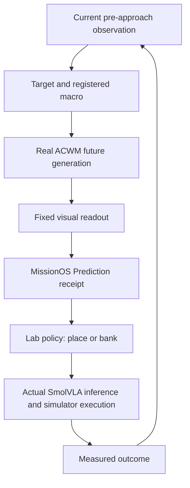
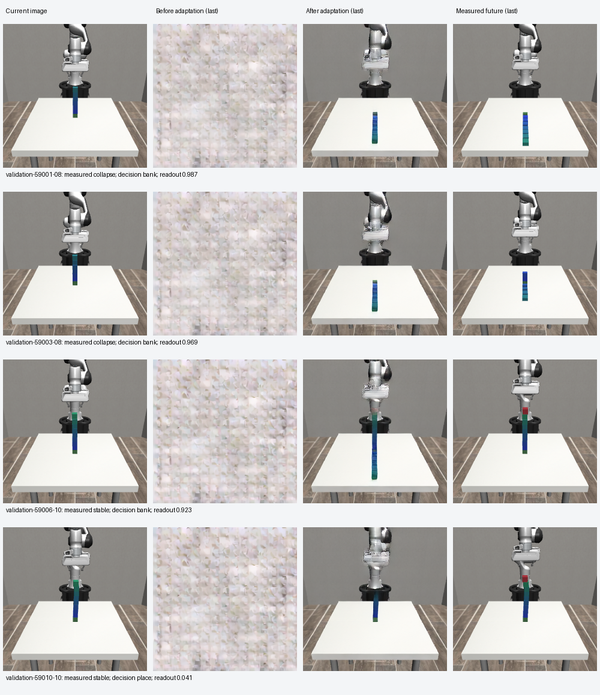
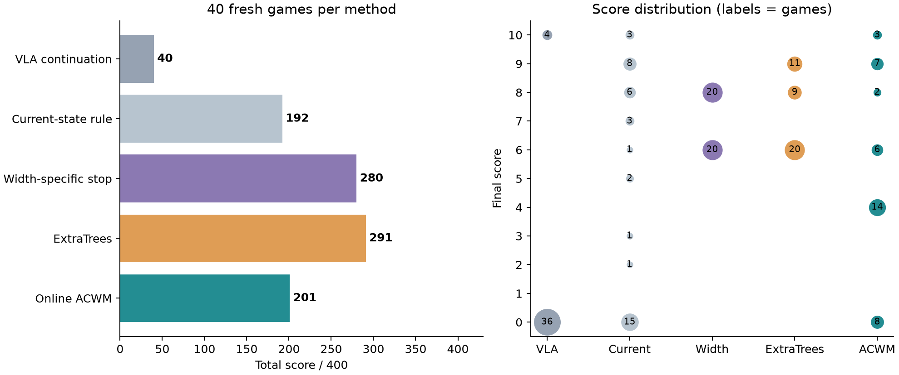
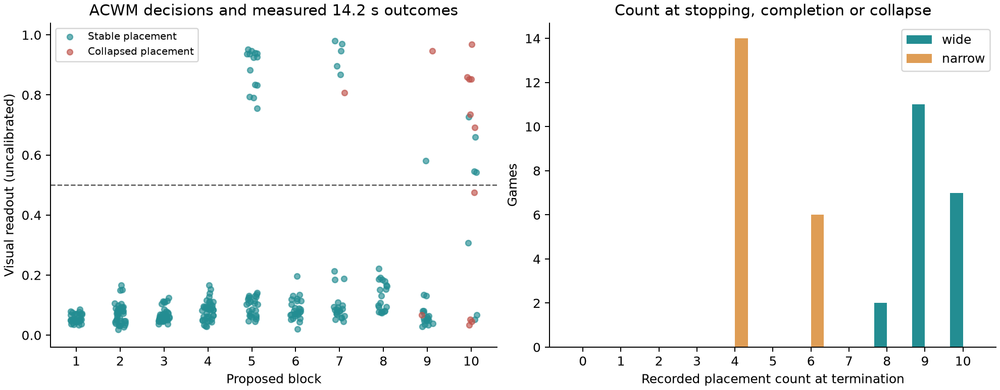
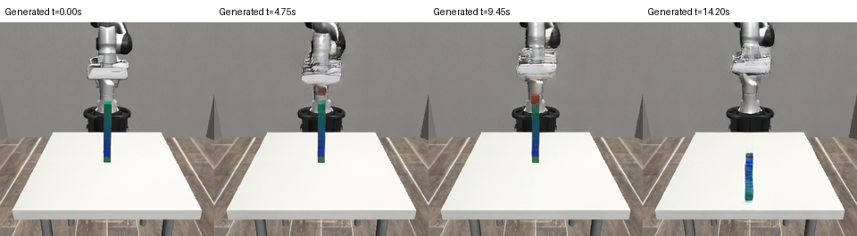
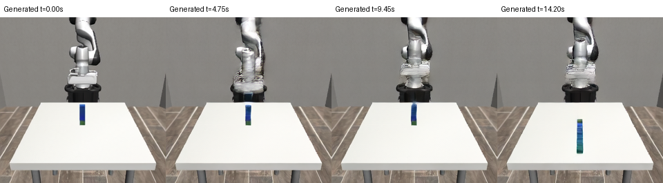
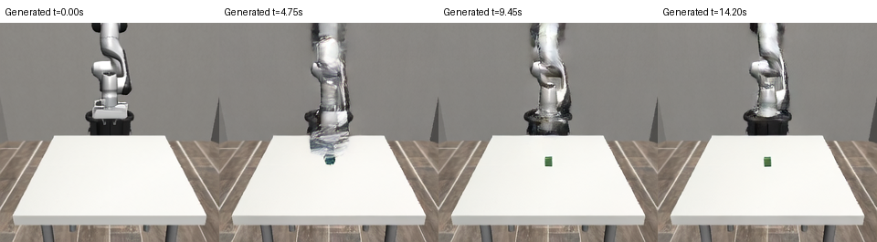
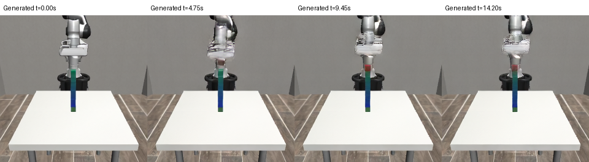

# Predict Before Acting: Online Video-World-Model Stopping Control for Block Stacking in MissionOS

**Technical research report · 21 September 2026**

**Keywords:** action-conditioned world models; video prediction; vision-language-action
models; online stopping; simulator evaluation; MissionOS.

Fixed benchmark: 40 fresh seeds, five independently executed methods.

## Abstract

We study whether a video-generating world model can decide when to stop a
robotic stacking mission using only information available before the next
placement. We adapt ACWM VideoDiT from conditioning on saved future motor
commands to conditioning on the current image, current physical state, a
placement target and a registered controller macro. Fine-tuning uses 36
placement examples; a fixed feasibility gate on 16 known validation placements
precedes a frozen evaluation on 40 fresh simulator seeds. Five stopping systems
independently execute each game with the same SmolVLA weights, physical
initialization and terminal stability check. Online ACWM scores 201/400, compared
with 40 for VLA continuation, 192 for a current-state rule, 280 for width-specific
stopping and 291 for frozen ExtraTrees. Its paired mean advantage over
continuation is 4.025 points (95% bootstrap interval 3.075–5.025); the difference
from the current-state rule is inconclusive. All 309 ACWM generations succeed,
with encoding/generation/readout latency of 1.655 seconds at the median and
1.723 seconds at the 95th percentile. The full record covers 200 games, 19,497
actual-game SmolVLA inference chunks and 483,652 motor steps. ACWM forecasts one
14.2-second placement, whereas ExtraTrees covers placement plus hold over 28.4
seconds. Three of ACWM's eight collapsed games occur after banking, exposing a
limit of predicting only the continue option. The experiment demonstrates a
pre-action video-prediction gate connected through MissionOS Prediction Core to
actual VLA simulator execution, with forecasts retained as model-inferred
evidence and execution recorded separately.

## 1. Question and contribution

Can a video-generating WAM predict one placement and use that prediction to decide
whether to execute it, without seeing the eventual VLA action tape? The earlier
[offline experiment](acwm-preaction-stacking-forecast-20260920.md) conditioned on
saved future actions. This experiment replaces that dependency, freezes the
model and evaluates new games.

Here **ACWM is a neural video-generating model**, using VideoDiT and the Wan VAE.
The separate **ExtraTrees baseline is a decision-tree ensemble**. Both names and
their different mechanisms are retained explicitly. The fixed visual readout is
a logistic classifier over generated-image features; it reads the ACWM forecast
rather than replacing future generation with direct state classification.



### 1.1 Contributions

| Contribution | Evidence |
|---|---|
| Online conditioning replaces saved future actions | Current-only input contract; inference and decision precede the proposed placement's VLA calls |
| Generated futures control an actual sequential game | 309 forecast decisions, followed by place/bank execution and measured outcomes |
| Fixed paired evaluation includes strong simple baselines | 40 preselected seeds × five independent methods, unchanged terminal scoring |
| Forecast provenance remains distinct from authority | Model/policy/observation binding, rejection tests and per-decision Prediction receipts |

### 1.2 Relation to prior work

[ACWM-Phys](https://github.com/xavihart/ACWM-Phys-dev) supplies an
action-conditioned latent video diffusion transformer and pretrained components
for physical-interaction forecasting. Our contribution is a mission-specific
conditioning and evaluation path built on that implementation, rather than a
new video-model architecture. [SmolVLA](https://arxiv.org/abs/2506.01844) supplies
the vision-language-action model used for learned placement/release phases.
[ExtraTrees](https://scikit-learn.org/stable/modules/ensemble.html#extremely-randomized-trees)
is the separately evaluated tree-ensemble predictor; it does not generate video.

The preceding MissionOS [offline ACWM study](acwm-preaction-stacking-forecast-20260920.md)
showed full-placement forecasting with saved future action conditioning. The
present experiment removes that information dependency and measures the resulting
stopping system on a new cohort. Earlier MissionOS authority integration remains
a separate system result; Section 7 identifies precisely the boundary exercised here.

### 1.3 Problem formulation

At gate t, let I_t be the current image, x_t the current physical and robot
state, g_t the next placement target, and m the registered macro/controller.
The frozen generator produces a video V_hat_t = G_theta(I_t, x_t, g_t, m; z)
with fixed noise seed z. A frozen readout r_t = h_phi(V_hat_t) maps that video
to an uncalibrated danger score. The policy chooses bank when r_t ≥ 0.5 and
place otherwise. Future VLA motor commands are generated only after place is
committed. The next gate receives the new measured state, not a rolled-forward
synthetic state.

For game j and method k, the terminal score S_jk is zero if collapse is measured;
otherwise it is the retained count, at most ten, after the common terminal hold.
The primary endpoint is the sum of S_jk over 40 games. Paired inference uses
d_j = S_j,ACWM − S_j,comparator. Prediction accuracy and latency are secondary
endpoints that help explain the score, rather than replacing it.

## 2. Tape-free conditioning and Phase 1

The model receives one current 240×240 RGB image, a 253-value pre-action state/context vector
(object poses and velocities, sizes, mass, friction, center-of-mass offsets,
robot/gripper state, commanded target and count), and 37 condition tokens. Each token contains
preselected target xyz, nominal time, macro identifier, approach offset and
clearance. The API accepts no future motor sequence, future frame or result label.
Measured future frames are used as supervised training targets only.

The inherited pre-action checkpoint has SHA-256
`3a0f20e4e100fc57b8cd03cec422397f770317e916c7397c35328d85c9a97b0b`.
We fine-tuned its VideoDiT and physical-context projection on the existing 36
training placements at learning rate 2e-5. The fixed 720-attempt training schedule
completed; one AMP/overflow event skipped an optimizer update, leaving 719
successful parameter updates. No additional step was added after inspecting
validation. The original protocol's "720 updates" wording is preserved as the
planned schedule; these counts describe the actual execution.
The frozen VAE encodes images. The final budgeted
checkpoint was used, with no validation-based checkpoint selection. The
inference-matched loss keeps the current latent clean and weights future block
regions during training.

The existing validation set has **16 placements from six seeds**; ten placements
are from seed 59000. It is a known feasibility set, distinct from the fresh online
games. Changing the action input without retraining produced poor forecasts;
additional training restored useful future generation.

| Validation condition | Mean mask IoU | Last-three IoU | Centroid error px | TP | FP | TN | FN |
|---|---:|---:|---:|---:|---:|---:|---:|
| Input changed, before training, noise 195 | 0.020 | 0.000 | 57.21 over 14 valid cases | 0 | 0 | 12 | 4 |
| After training, noise 195 | 0.751 | 0.703 | 7.03 | 4 | 1 | 11 | 0 |
| After training, noise 196 | 0.713 | 0.613 | 8.52 | 4 | 3 | 9 | 0 |

The second noise condition regenerates the same cases. The predeclared primary
gate required IoU ≥0.50, centroid error ≤15 px, TP ≥3, FP ≤5, FN ≤1, no generation
failure and generation p95 ≤120 s. All criteria passed. The current-image API
was then actually run on all 16 cases and reproduced the primary decisions.



[Phase 1 collapse video: forecast left, measured right](../assets/acwm-online-stacking-20260921/phase1-validation-59003-08-forecast-measured.mp4)
and [safe-placement video](../assets/acwm-online-stacking-20260921/phase1-validation-59010-10-forecast-measured.mp4).
These are validation videos, not recordings of the new 40-game cohort.

**Image metrics:** RGB is scaled to [0,1]. Foreground is the union of a cyan/blue
color threshold and a red-object threshold. IoU is averaged over future frames
1–36, excluding the known initial frame, then equally over cases. A jointly empty
mask has IoU 1. Centroid error uses frames where both masks are nonempty; missing
case values are reported rather than converted to zero. The last-three metric
uses frames 34–36. Per-case metrics are released with the evaluation records.

## 3. Frozen online benchmark

Seeds **68000–68039** were fixed before test execution: 20 wide and 20 narrow.
Every method starts its own simulator instance from the same seed and physical
properties. The target is vertically aligned; there is no forced cumulative
horizontal displacement. Per-block properties follow the existing v7 sampler:
nominal half-width 25 mm (wide) or 14 mm (narrow), multiplied by uniform
0.88–1.12; other half-sizes 20 mm; mass 45–95 g; sliding friction 0.35–1.1; and
small center-of-mass offsets. Initial target xy varies within ±4 mm.

The frozen SmolVLA and registered placement macro are shared by all methods.
The simulator uses staged grasp acquisition, followed by the same learned
placement/release phases. One placement lasts 284 control steps at 20 Hz
(**14.2 s**). Maximum stack size is ten; a measured drop above 30 mm is collapse
and scores zero. Banking retains the stable count. All game endings receive
another **14.2 s terminal stability check**. Intermediate diagnostic holds are
restored before the next actual decision.

| Method | Fixed stopping policy | Forecast horizon |
|---|---|---|
| VLA continuation | Continue to ten or collapse | None |
| Current-state rule | Bank if tilt >5° or horizontal drift >3 mm | None |
| Width-specific stopping | Bank at eight wide or six narrow | None |
| Frozen final ExtraTrees | Existing frozen continue/bank rule | 28.4 s |
| Online ACWM | Bank if fixed visual readout ≥0.5 | 14.2 s |

The ACWM threshold, noise seed 195, ten diffusion steps, checkpoint and readout
were frozen before the cohort. **The readout is not a calibrated collapse
probability.** ACWM predicts the placement option only; no synthetic bank
forecast is supplied. Both learned predictors receive exact current simulator information; ExtraTrees
also uses its inherited engineered features and accepted-pose references. The
differences in representation, training, horizon and policy are part of this
comparison of completed stopping systems.

All five methods run SmolVLA inference on the same L4 CUDA runtime. Its weights
are unchanged, but the hardware/runtime differs from historical MPS experiments;
previous v7 totals should not be treated as results on these new games.

## 4. Online ordering and measurement

At each gate the current image/state is saved. ACWM completes real video
inference, the readout is recorded through the public `StackingACWMPredictor`
and `PredictionRegistry`, and the lab decision is written before execution
starts. Actual VLA request/response identifiers and times are logged afterward.
The ACWM input contains no motor tape for the proposed placement.

When the policy banks, the actual bank branch and stability check run first.
Only then is the saved prestate restored to execute a diagnostic continuation.
That branch supplies the counterfactual collapse label. After actual placement,
a further hold supplies the long-horizon label; it changes the scored result only
at terminal completion, while earlier diagnostic holds are restored.

Common-prefix equality across independently run arms: **True**.
The public records include state and executed-action hashes at each shared gate,
not only an assertion that the methods used the same seeds. A model can make a
wrong prediction while this execution-order audit still passes: these measure
different properties.

## 5. Forty-game results

| Method | Total /400 | Mean | Collapse games | Bank collapses | Decision latency mean / p95 s | Technical failures |
|---|---:|---:|---:|---:|---:|---:|
| VLA continuation | 40 | 1.000 | 36 | 0 | <0.001 / <0.001 | 0 |
| Current-state rule | 192 | 4.800 | 15 | 6 | <0.001 / <0.001 | 0 |
| Width-specific fixed stopping | 280 | 7.000 | 0 | 0 | <0.001 / <0.001 | 0 |
| Frozen final ExtraTrees | 291 | 7.275 | 0 | 0 | 0.135 / 0.153 | 0 |
| Online ACWM + fixed visual readout | 201 | 5.025 | 8 | 3 | 2.841 / 2.963 | 0 |



ACWM gained **161 points over VLA continuation**. Its nine-point advantage over
the current-state rule has a paired interval spanning zero; superiority over
that rule is not established. Width-specific stopping and ExtraTrees scored
79 and 90 points more than ACWM, respectively. These results establish the
online forecast-to-action loop and expose the remaining prediction/readout errors.

Decision latency includes the actual boundary call and any service queue/network
wait, after shared observation rendering, state extraction and current-rule
metric extraction. For ACWM, the measured image encoding, future generation and readout segment
has p50 **1.655 s** and p95 **1.723 s**. GPU model loading is
excluded. Lightweight rules and the locally served ExtraTrees have different
latency components; these are deployed-path measurements.

Paired score differences use the same seed. The bootstrap resamples within width
groups (20,000 samples), and a two-sided paired sign-flip calculation uses 100,000
samples. Holm correction covers the four comparisons below. The game is the
statistical unit; decision points from the same tower are not independent games.

| Comparator (ACWM minus comparator) | Mean difference | Bootstrap 95% interval | Wins / ties / losses | Holm p |
|---|---:|---:|---:|---:|
| VLA continuation | +4.025 | [+3.075, +5.025] | 28 / 11 / 1 | 4e-05 |
| Current-state rule | +0.225 | [-1.000, +1.425] | 21 / 6 / 13 | 0.7931 |
| Width-specific fixed stopping | -1.975 | [-3.025, -1.000] | 10 / 8 / 22 | 0.00092 |
| Frozen final ExtraTrees | -2.250 | [-3.250, -1.325] | 4 / 14 / 22 | 4e-05 |

The cohort ends at 40 seeds, regardless of the result. Technical failures are
retained with no replacement; complete pairs form the primary comparison and
technical-as-zero scores are recorded separately.

## 6. Prediction errors and stopping behavior

| Predictor | Label horizon s | TP | FP | TN | FN |
|---|---:|---:|---:|---:|---:|---:|
| Online ACWM + fixed visual readout | 14.2 | 8 | 24 | 272 | 5 |
| Frozen final ExtraTrees | 28.4 | 27 | 13 | 291 | 0 |

TP means the policy banked and the diagnostic continuation collapsed within its
label horizon; FP means it banked before a stable continuation. TN/FN come from
actual continued placements. As a secondary diagnostic, scoring the same ACWM
decisions against the 28.4-second placement-plus-hold outcome gives TP
14, FP 18, TN 269, FN 8. This
extends the observed label window; the generated forecast remains 14.2 seconds.
Each policy visits its own states, so these counts
characterize each stopping system rather than a matched image-classification
contest. Delayed terminal collapse can occur beyond ACWM's forecast horizon.

All **309 ACWM generations** returned valid 37-frame arrays; actual-game and
diagnostic execution failures were both zero. The 32 bank judgments include
24 false alarms within the model's 14.2-second window. Five continued placements
collapsed within that window, and three actual bank branches collapsed during
the terminal hold (seeds 68006, 68022 and 68034). These five continued-placement
collapses and three bank collapses account for all eight ACWM collapse games.
Three games reached ten stable blocks.

The narrow group contributed **92 points**, versus 120 for width stopping:
fourteen games banked at four blocks, accounting for the 28-point group deficit.
The wide group contributed **109 points**, versus 160 for width stopping; all
eight ACWM game collapses occurred in this group. The errors therefore include
both early false stops and costly missed or post-bank collapses.

ACWM voluntary bank counts by width (collapse endings and ten-block completions
are excluded from these distributions):

- **wide:** 8 blocks × 2 games, 9 blocks × 10 games.
- **narrow:** 4 blocks × 14 games, 6 blocks × 6 games.



For example, **seed 68000** banked nine stable blocks after a 0.8527 readout for
the proposed tenth placement; the subsequent saved-state continuation collapsed.
VLA continuation scored zero on that seed, while width stopping and ExtraTrees
scored eight. The FP and FN examples below show why that useful case did not
translate into overall superiority.

The following examples are selected deterministically: the first seed/count in
each nonempty ACWM confusion cell. **The strips show generated futures only**;
measured collapse labels are from simulator branches in the released records.

**TP: seed 68000, proposed block 10.** Readout 0.8527, decision `bank`; measured placement collapse: true, placement-plus-hold collapse: true.



**FP: seed 68001, proposed block 5.** Readout 0.8349, decision `bank`; measured placement collapse: false, placement-plus-hold collapse: false.



**TN: seed 68000, proposed block 1.** Readout 0.0495, decision `place`; measured placement collapse: false, placement-plus-hold collapse: false.



**FN: seed 68008, proposed block 10.** Readout 0.0335, decision `place`; measured placement collapse: true, placement-plus-hold collapse: true.



## 7. MissionOS boundary

The adapter binds model and policy digests, mission/environment contracts,
observation identity, input schema, readout and forecast horizon. Forbidden
future fields and mismatched backend identities are rejected. Forecast receipts
remain `model_inferred`, with approval, dispatch authority, physical execution
and completion flags all false. The external lab harness consumes the evidence
and executes under the user's bounded experiment authorization.

This contribution is **online Prediction integration with actual VLA execution**.
It complements the previous governed DeepSeek/approval/Rules/Executor experiment;
this benchmark does not rerun that LLM/ticket chain. The public adapter is
opt-in and requires an explicitly supplied backend. Its interface and causal
verification requirements are documented in
[the adapter contract](stacking-acwm-online.md).

## 8. Discussion

### 8.1 What the online result establishes

The operational result is the ordering of prediction and action. A full future
video is generated from the available gate information, converted into a
stopping decision, and followed by actual SmolVLA execution only when selected.
The matched prefixes and timing/inference receipts make that ordering auditable.
The 161-point improvement over continuation shows useful intervention under
these game conditions. Stronger comparators demonstrate how much performance
remains available without video generation.

### 8.2 Stopping safely is a separate prediction problem

ACWM assesses the proposed placement, then banks when that future looks risky.
It does not generate a bank future. Seeds 68006, 68022 and 68034 show why this
matters: stopping the next placement did not keep the existing tower stable
through the terminal hold. Thus, detecting a dangerous continuation and
identifying a safe termination are different requirements.

The longer ExtraTrees horizon and its continue/bank treatment are plausible
contributors to the score difference. The experiment does not isolate their
individual effects from model representation, training or readout errors.
A next experiment could extend the generated horizon and add a bank branch,
then freeze both before evaluating fresh games. Those changes are future work,
not retrospective changes to this benchmark.

### 8.3 Conservative behavior and costly misses coexist

The 24 false alarms and five short-horizon misses rule out a simple explanation
that the system is merely too conservative. It often refuses a safe placement
and occasionally accepts a collapsing one. Fourteen narrow games stop at four,
while the stronger width rule reaches six. A late false negative, in contrast,
can erase an entire tall tower's score. Optimizing average image fidelity or
classification accuracy therefore need not optimize retained game score.

The readout is a separate learned component, and its score is uncalibrated.
This study measures the composed generator/readout/policy system; it does not
attribute each failure uniquely to video generation. A future readout-on-measured-
video diagnostic and a horizon-matched comparison could separate these effects.

### 8.4 Deployment relevance

A median 1.655-second generation path on one L4 makes a per-placement forecast
practical in this paused simulator setup. The approximately 2.84-second mean
end-to-end decision latency includes service overhead. A physical tower would
continue moving during that interval, so a deployment would also need to handle
observation freshness and state changes before execution. The present experiment
establishes the integration mechanism and its measured cost, with physical
real-time behavior left to a distinct deployment evaluation.

## 9. Evidence, costs and limitations

[Public individual evidence and verification](../assets/acwm-online-stacking-20260921/README.md)
include 200 attempts, per-decision outputs, terminal measurements, inference IDs,
common-prefix audits, Phase 1 per-case image metrics and artifact hashes. The
verification script regenerates counts, scores and summaries; `--statistics`
regenerates confidence intervals and p-values. Media decoding is a separate
explicit check. Model weights and full private simulator snapshots are excluded.

The GPU was time-limited and operated under the **$10 total authorization**, which
includes Phase 1. After collecting and checking the output archive, the Phase 2
VM and boot disk were deleted at **2026-09-21T05:27:05.644148+00:00**. Resource cleanup is
confirmed. Compute time plus conservative allowances for Phase 1, storage, IP
and transfer totals **$3.54 estimated**, below $10.
This estimate is separate from final cloud billing.

Scope is one registered stacking macro, small simulated training data and exact
current physical state. Phase 1 is known-validation feasibility; Phase 2 is fresh
online game evaluation. The benchmark measures simulation-time stability while
wall-clock execution pauses for remote inference. It is not a real-time physical
robot safety test. ACWM's 14.2-second horizon is shorter than ExtraTrees' 28.4;
its fixed readout can also introduce errors. The result evaluates the combined
forecast-plus-readout system. Additional training, threshold tuning and LLM
changes were not performed after test start.

## 10. Conclusion

The experiment moves action-conditioned video forecasting from saved-action
replay into a pre-action online loop: **observe, generate the placement future,
decide, then obtain and execute VLA actions, and measure the result**. The complete
fixed-cohort results preserve both useful decisions and prediction failures.
MissionOS carries this forecast as explicitly bound evidence, while the lab
control policy and actual execution remain separate responsibilities.


## References

1. ACWM-Phys authors. *ACWM-Phys: Investigating Generalized Physical Interaction
   in Action-Conditioned Video World Models.* [Implementation and released-model documentation](https://github.com/xavihart/ACWM-Phys-dev).
2. Shukor et al. *SmolVLA: A Vision-Language-Action Model for Affordable and
   Efficient Robotics.* 2025. [arXiv:2506.01844](https://arxiv.org/abs/2506.01844).
3. scikit-learn developers. *Extremely Randomized Trees.*
   [Ensemble documentation](https://scikit-learn.org/stable/modules/ensemble.html#extremely-randomized-trees).
4. MissionOS. *Predicting One Complete Block Placement Before Acting with ACWM.*
   20 September 2026. [Previous offline report](acwm-preaction-stacking-forecast-20260920.md).
5. MissionOS. *Online ACWM stacking evidence.* 21 September 2026.
   [Individual records, protocol, verification and media](../assets/acwm-online-stacking-20260921/README.md).

## Appendix A. Artifact identity and reproduction

The [frozen protocol](../assets/acwm-online-stacking-20260921/protocol.json)
identifies the final ACWM checkpoint, fixed visual readout, SmolVLA weights and
ExtraTrees model by SHA-256. The separate
[runtime freeze](../assets/acwm-online-stacking-20260921/runtime-freeze.json)
records the executed code hashes and the pre-test freeze condition.
`benchmark.json` contains all 200 game outcomes and paired scores;
`decisions.csv` exposes 1,643 decisions; `decision-evidence.json.gz` retains
complete decision-level provenance. These are linked from the evidence index.

To verify the released evidence from the repository root:

```sh
python docs/assets/acwm-online-stacking-20260921/verify_report.py --statistics
python -m pytest docs/assets/acwm-online-stacking-20260921/test_verify_report.py -q
python docs/assets/acwm-online-stacking-20260921/verify_media.py
```

The first command checks individual outcomes, causal ordering, common-prefix
agreement, aggregate scores, latency, paired statistics and manifest hashes.
The four corruption tests deliberately alter records and rebuild manifests so
that semantic failures must be detected. The media command loads seven PNGs and
fully decodes two MP4s. Statistics requires NumPy; media decoding requires Pillow,
ffmpeg and ffprobe. The standard-library verifier also runs without `--statistics`.

The actual opt-in run used `python online-phase2/run_games.py test` in the private
simulator harness. Its output is audited in the public packet; the full training
and simulator environment is not bundled. Published verification reproduces
calculations and checks recorded execution, rather than rerunning 200 games.
