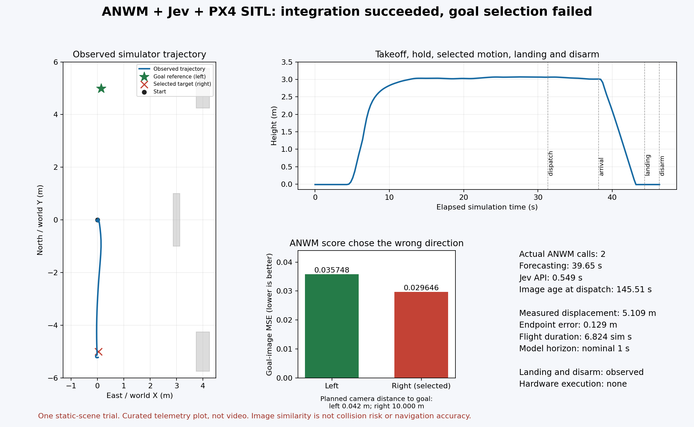

# ANWM・Jev・MissionOSをPX4へ接続した飛行検証

技術レポート — 2026年9月22日

公開済みの航空機向け世界モデルANWM、Jevの判断API、MissionOSの制約検査を接続し、
PX4/Gazebo SITLで離陸、選択した候補への移動、着陸、disarmまでを確認した。
実際のシミュレーター映像から生成した予測が判断に入り、その判断に対応する命令を
別のExecutorが実行した。選択された右方向への移動量は **5.10943 m**、指定した
候補終点との誤差は **0.12880 m** だった。

一方、宣言した視覚目標は左にあり、**目標方向の選択は失敗した**。
ANWMの画像誤差は右を優先し、Jevも右を選んだ。本試行はモデルから飛行までの
接続を実証したが、世界モデルによる航法改善、衝突回避、目標到達を実証していない。
この正負の結果を分けて報告する。

公開用の数値は[集計データ](../assets/aerial-wam-px4-20260922/summary.json)にまとめた。
下図は観測した飛行と目標選択の結果であり、未選択候補を実際に飛ばした結果ではない。



## 1. 検証した範囲

目的は、既存の積み木用モデルを流用することではなく、ドローン向けの公開モデルに
適合する観測・候補・判断・実行の境界をつくり、実際に一周させることだった。
積み木と航空機では状態、行動、センサー、評価量が異なるため、同じWAMという名称
だけで互換性は得られない。

| 対象 | 今回確認したこと | この結果が含まないこと |
| --- | --- | --- |
| PX4/Gazebo | 実センサー出力、ANWM実推論、実Jev API、制約検査、SITL飛行と終端状態 | 実機飛行、一般経路計画、動的障害物への対応 |
| TurtleBot3/Nav2 | fixture予測サービスと実HTTPクライアント、Assuranceグラフ、証拠採用・拒否の契約 | 学習モデルによるTB3走行、更新済みブリッジでの実costmap取得、航法性能 |
| 公開データ再生 | ANWMの実行、候補比較、Jevへの証拠入力 | その候補の実飛行、未見データでの性能、オンライン制御 |

PX4の飛行は独立した静的シーンでの単一試行である。左右5 mの候補をあらかじめ固定し、
両方の通路を幾何検査で通過可能と確認した。新しい世界モデル、学習手法、最適な
ルート生成器を提案するものではない。成果は入力・権限・鮮度・実行証拠を保った
接続と、その接続を通じて観測した失敗の切り分けにある。

## 2. 予測から実行までの役割分担

```text
実際のRGB-D観測と固定候補
  → ANWMの候補画像予測
  → 型・ハッシュ・鮮度を検査したPrediction証拠
  → Jevによる既存の選択肢の判断
  → 保持済みのユーザー承認と独立したRulesの再検査
  → 期限付き命令をExecutorが受理
  → PX4が飛行
  → テレメトリーによる移動・着陸・disarm確認
```

| 役割 | 今回の責務 |
| --- | --- |
| Prediction | 各固定候補に対する将来RGBと目標画像誤差を提供する。承認・実行権限を持たない。 |
| LLM judges | Jevが`continue`、`replan`、`operator_escalation`から選ぶ。今回は前二者を左・右へ明示的に対応付けた。 |
| Human approves | 実際のユーザー指示による、今回の限定SITL飛行に対する既存承認を保持する。モデルの出力から承認を生成しない。 |
| Rules constrain | 承認、候補、SDF幾何、領域、観測鮮度、機体状態、各証拠の一致を検査する。 |
| Executor acts | HMACと5秒以内の有効期限、未使用の命令識別子、現在のhoverを検査して固定候補だけを実行する。 |
| Verifier checks | 命令ACKと区別して、Gazebo位置、PX4状態、着陸判定、disarmを確認する。 |
| Repair loops | 前提が崩れた試行を停止し、証拠を残して修正後の別セッションで再検証する。 |

Jevの`replan`は任意の経路を生成する指示ではない。この試行では既存の`right_5m`を
選ぶ判断であり、許可・送信・飛行・着陸はそれぞれ別の記録で確認した。モデルや
Jevの証拠にある`physical_execution_invoked: false`と、後段ExecutorのSITL実行は
矛盾しない。記録が指す責務と境界が異なるためである。

## 3. モデルと観測入力

### 公開モデルを実行可能な契約へ合わせる

利用したのは[EmbodiedCityの公開ANWM](https://huggingface.co/EmbodiedCity/ANWM)の
チェックポイントである。コード、チェックポイント、補助VAEの版とハッシュを固定し、
重みをstrictに読み込んだ。公開設定には4枚の履歴を指定するものがあるが、取得した
重みの`pos_embed`は`(17, 196, 1152)`であり、16枚の履歴が必要だった。
重みの切り詰めや同じフレームの繰り返しでは合わせず、16枚を独立に取得した。
固定した版、依存関係、公開データでの初期実行は
[モデル評価記録](aerial-wam-model-evaluation.md)に示す。

UA-NWMも候補として調べたが、必要なDINOv3エンコーダーのアクセス条件を満たさず、
推論前に保留した。別エンコーダーへ置き換えてUA-NWMの実行結果とは報告していない。

### RGB-D、座標、時刻を結び付ける

飛行入力のsource kindは`px4_gazebo_frozen_capture`、capture scopeは
`px4_sitl_airborne_observation`とした。公開データ再生や接地状態の観測とは別契約である。
観測処理自体はアクチュエーター命令を送らず、保持した飛行セッションの記録と合わせて
実際のoffboard hover中の取得であることを確認する。

- 16組のRGB、depth、両CameraInfo、機体poseは、各組内で完全に同じGazebo時刻を持つ。
  実測区間は21.752–25.500 simulation秒、隣接間隔は0.248/0.252秒だった。
- RGBは640×360。SDF、CameraInfo、固定外部パラメーターを監査し、depthをRGB画素へ
  再投影した。準備時には元のraw bytesから登録結果を再計算し、保存配列との一致を検査する。
  その後にANWM既存のcropと224×224変換を適用する。
- 不明なdepthはNaNと真偽maskで保持する。モデル用には上流投影の`z > 0`条件に合わせて
  不明値を0へ変換するが、maskと元depthのハッシュを残す。不明領域を自由空間とは扱わない。
- GazeboのENUから局所NEDへは`(x, y, z) → (y, x, -z)`を使用する。
  opticalの右・下・前からセンサーの前・左・上への変換も明示する。機体中心とカメラの
  固定オフセット、Gazebo局所座標とPX4推定器の局所原点を混同しない。
- 鮮度の起点は最終履歴フレームの5メッセージ中、最も早いUTC受信時刻である。
  保存完了時刻、転送時刻、推論終了時刻で更新しない。今回の保存完了は観測から
  1.101秒後だったが、この差を観測の新しさに加算していない。

カメラ座標変換の実装と未検証範囲は
[RGB-D登録契約](px4-aerial-camera-registration.md)を参照されたい。
rawメッセージのハッシュは保持するが、保存済みJSONの全フィールドをprotobufから
独立に再復号したことまでは主張していない。

目標画像は別の静的Gazeboカメラから取得し、`declared_goal_reference`と宣言した。
目標画像は予測画像との比較だけに使い、ANWMの履歴へ混ぜない。候補実行後の映像、
未来の機体軌跡、到達・衝突ラベルは推論入力に含まれない。目標poseによる独立の
方向評価も、Jevに与えた選択根拠とは分けた。

## 4. 画像の近さと飛行可能性を分ける

ANWMの生成画像と目標画像のMSEは、正規化RGB空間での画像適合度である。
これを衝突確率へ変換せず、`risk_score: null`と次の型付き指標で受け渡す。

```json
{
  "schema_version": "missionos_goal_compatibility.v1",
  "metric_id": "anwm_goal_image_mse",
  "raw_cost": 0.029645971953868866,
  "lower_is_better": true,
  "risk_assessed": false
}
```

値は今回の右候補の結果である。有限・非負の数値、指標識別子、向き、リスク未評価の
宣言を厳密に検査する。`risk_score`の欠落、NaN、bool、不明な指標、矛盾した宣言は
受け入れない。従来の数値リスクを持つ予測とは契約を分ける。

飛行可能性は別に検査した。ポリシー生成時に実際の静的collision-box SDFを読み、
形状、pose、サイズ、シーンハッシュを再計算する。左右の機体中心の線分が、各軸に
0.6 m拡大した障害物と交差しないこと、地面との余裕を確認した。
候補終点は水平座標±6 m、高度2.8–3.2 m以内に限定した。
これは宣言済み静的シーンに対する幾何検査であり、動的環境一般の安全性ではない。

判断の前後では元観測の経過時間を180秒以内に制限し、現在テレメトリーを2秒以内、
機体位置を取得時から0.2 m以内、速度を0.2 m/s以内、yaw差を0.05 rad以内に制限した。
armed/OFFBOARD状態とシーン不変性も検査する。Jevが失敗・棄権した場合や証拠が
古くなった場合には命令を作らず、別の判断器へ自動で置き換えない。

## 5. 結果：接続成功と選択失敗

### 候補の比較

| 候補 | ANWM目標画像MSE ↓ | 投影のみのMSE ↓ | 計画したカメラ終点と宣言目標の距離 ↓ |
| --- | ---: | ---: | ---: |
| 左5 m | 0.03574784 | 0.03597068 | **0.04154 m** |
| 右5 m | **0.02964597** | **0.03578895** | 9.99991 m |

Jevは`replan`を返し、対応する右5 mが実行された。Jevが下流で誤った命令に変換された
のではなく、低い画像MSEを持つ候補を一貫して選んだ結果である。Jevは生成画像の
正確さを検証する独立センサーではなく、与えられた証拠の範囲で判断している。

投影のみの単純な比較でも、差は小さいが右が低かった。したがって、このSITL試行は
ANWMが単純な投影より有用な方向を選べた証拠にはならない。幾何学的な目標比較では
左が明確に近い。未選択の左候補は実行しておらず、この比較は計画終点の比較である。
また、両候補について対応する実未来映像を取得していないため、画像予測誤差そのものの
精度評価でもない。

先行した公開データ再生でも負の結果を保持した。そこではANWMが選んだ候補の
目標までの計画距離は11.35782 m、投影のみが選んだ候補は5.38516 mだった。
単純な比較がすでに最良候補を選んでおり、そのサンプルには選択を改善する余地がなかった。
この再生は飛行を伴わず、学習データに含まれる可能性もある。SITL試行と合算して
成功率や一般的な性能指標を作ることはしない。

### 実際に成立した処理と時間

| 境界 | 観測結果 |
| --- | --- |
| ANWM | NVIDIA L4上の実モデル呼び出し2回、seed 42、各候補250 sampling steps |
| モデル読込 | 16.4313秒 |
| 候補予測 | 合計39.6495秒、左20.0167秒・右19.6328秒 |
| GPUメモリ | PyTorch最大allocated量7,321,750,528 bytes。プロセス全体の使用量ではない。 |
| Jev | 実APIの`jev-1.13.0`、`replan`、review=`bounded`、549.18 ms |
| 観測からの経過時間 | 評価時145.376秒、dispatch時145.506秒 |
| dispatch | 命令発行の0.1294秒後に受理。5秒の有効期限内。 |
| dispatch時の状態 | テレメトリー約0.941秒前、観測入力時の機体位置からの差0.03381 m |
| 飛行 | 選択候補への実変位5.10943 m、指定終点との誤差0.12880 m |
| 飛行時間 | 候補の移動開始から到達観測まで6.824 simulation秒 |
| 終端 | 新しい着陸状態と地面付近のposeを観測し、その後`armed: false`を確認。終端エラーなし。 |

**約40秒の推論時間を40秒周期の制御性能とは扱わない。** 今回は転送や検査等を含み、
元画像が判断に使われるまで約145秒かかった。その間、固定シーンでhoverを維持し、
別系統の新しいテレメトリーで状態を再検査した。画像を継続的に取り直して経路を
修正するリアルタイムの閉ループ航法ではない。

同様に、4フレーム先・名目4 fpsから付けたモデルの**名目1秒**と、Executorの
実移動6.824 simulation秒は一致しない。シミュレーター内の取得周期は測定したが、
モデルの時間校正は未確認であり、`model_time_alignment_verified: false`、
`physical_frame_timing_verified: false`を維持した。速度1 m/sの候補実行器を使った
ことは、モデルの予測がその時間軸を再現した証拠にはならない。

独立監査では、入力配列から実行manifestを再構成し、予測画像・投影画像のハッシュ、
モデル記録、Jev記録、保持済み承認、ポリシー、受理命令、終端記録の一致を確認した。
実SDFから生成し直したポリシーも保存結果と一致した。移動中326テレメトリーサンプルは
宣言障害物の0.6 m余裕の外にあり、シーン不変を示した。ただし、これは標本化された
幾何の確認であり、独立した接触計測や衝突率の推定ではない。

Jevの0.97というconfidenceは目標到達確率ではない。応答に自由文の推論根拠はなく、
記録したrationaleはアダプターが選択内容を説明する定型文である。

## 6. 失敗した試行と修正

| 試行 | 観測と判断 | 対応 |
| --- | --- | --- |
| 1 | シミュレーター機体が制約領域を逸脱。候補のdispatchはなく、着陸・disarmも確認できなかった。 | 失敗記録を保持して隔離シミュレーターを停止・削除。起動時の物理設定を調査した。 |
| 2 | 重力設定後は離陸したが、収束前のhoverを参照位置にしていた。候補飛行前に観測時刻の扱いも修正対象となった。 | 予測結果を保持し、候補をdispatchせず着陸・disarm。既存証拠を書き換えず、新しい観測と別セッションでやり直した。 |
| 3 | 修正後、ANWM→Jev→Rules→PX4の候補飛行、着陸、disarmが成立。 | 接続成功と、宣言目標に対する選択失敗を別々に記録した。 |

第1試行では、使用したPX4起動スクリプトが速度係数だけを`set_physics`へ送り、
Gazeboの重力をゼロへ変える既知の問題に該当した。SDFの重力やIMU値が正常に
見えるだけでは、物理エンジンの設定を確認したことにならない。
上流の報告は[PX4 issue #27480](https://github.com/PX4/PX4-Autopilot/issues/27480)にある。

対策として、起動後・arm前に重力`(0, 0, -9.8)` m/s²、real-time factor `0.1`、
最大step `0.004`秒を明示して設定し、サービスの受理を記録した。受理は設定要求の
証拠に留まり、後続のhoverや着陸成功とは分けた。姿勢の強制配置や推力のつじつま合わせは
行っていない。

第2試行後はGazeboとPX4の観測済み原点差を再計測し、位置誤差0.05 m以内・
速度0.08 m/s以内を1 simulation秒保持してからhover参照を確定するようにした。
さらに、候補の原点とyawを最終撮影フレームの機体poseから作り、後で保存した状態が
0.2 mを超えて移動していれば準備を拒否する。観測時刻も撮影時のUTCに固定した。
この修正は古い予測に新しい時刻を付けて再利用するためのものではない。

## 7. E2E / Runtime Verification

実行手順、CLIの正確な引数、必要な環境変数、各境界の検証方法は
[PX4飛行契約のPortable orchestration](aerial-wam-px4-flight.md#portable-orchestration)に示す。
学習モデル環境を先に用意し、明示的なSITL opt-inと保持済みユーザー指示がある状態で
実行する。手順はシーン準備、目標取得、離陸・hover、16フレーム取得、RGB-D登録、
入力準備、推論、ポリシー生成、Jev評価、直後のdispatch、終端確認、削除の順である。
評価とdispatchの間に手作業を挟み、5秒の命令を失効させない。

通常の契約検証はシミュレーターも実APIも起動せず実行できる。

```sh
export PYTHONPATH=.:packages/missionos-core/src:packages/missionos-cli/src:packages/missionos-gateway/src
python scripts/smoke_navigation_wam_jev.py
python scripts/smoke_jev_modes_gateway.py
python -m pytest -q \
  tests/contract/test_px4_anwm_input.py \
  tests/contract/test_px4_aerial_wam_jev.py \
  tests/contract/test_build_px4_aerial_execution_policy.py \
  tests/unit/test_px4_aerial_flight_session.py
```

実装検証では全体3,058テストが通過し、その後の最終修正を含む対象137テストも通過した。
これらはPR準備前の検証記録であり、テスト件数を学習モデルの性能や実飛行回数と
解釈しない。fixtureで確認したHTTP・Gateway・ADKの境界と、本レポートの実モデル・
実Jev・SITL試行を合わせて評価する。PR時点の再実行結果はPRの検証欄に記録する。

飛行後のPRレビューでは、読み込み側のコード・VAE版の照合と、目標カメラposeの
SDF照合を追加で強化した。欠落・変更されたモデル識別情報と、画像を変えずに
目標座標だけ反転した入力を拒否する。関連181テストが通過し、保存済み観測を使った
CPUの準備CLIが実行時と同一の入力manifestを再生成した。元の公開データ再生結果も
APIを呼ばないCLIで再検証した。元の予測・Jev・飛行記録は変更しておらず、これを
追加のモデル推論や再飛行の成功とは数えない。

公開用データには独立した整合性検査を付けた。181点の観測軌跡と4つのイベントを
照合し、数値、時刻、終端状態、ファイル集合とハッシュを検査する。20件の変更検出
テストも通過した。これは公開集計の整合性検証であり、非公開の元記録に対する
第三者の実行証明ではない。詳細は[公開データの説明](../assets/aerial-wam-px4-20260922/README.md)に示す。

```sh
python docs/assets/aerial-wam-px4-20260922/verify_report.py
python -m pytest docs/assets/aerial-wam-px4-20260922/test_verify_report.py -q
```

PR追加検証では、インストール済み`missionos` CLI、隔離したloopback Gateway、
実Gazebo/Nav2のTurtleBot3で`chat`→明示的な`/approve`→`/run`を実行した。
同じタスクを`job-status`、`operate`、`watch`、`map`で照合し、Nav2の
`Reached the goal!`とオドメトリ移動2.730 m、屋内地図の計画2点・観測39点を確認した。
終端のスコープは`sim_action`、`physical_execution_invoked: false`であり、
家全体の巡回完了や配達完了ではない。提案のsourceは`keyword_fallback`だったため、
このrunをホスト型モデルの実呼び出しや学習WAMによるNav2運転の証拠にはしない。
実ROS2のcostmap読み取りは、初期poseが未確立のときframe変換不能で`blocked`、
初期pose確立後にglobal/localの内容hashと観測時刻を得て`validated`となった。
いずれも読み取りであり、回復案のdispatchは行っていない。

別の隔離PX4 SITL runでは、初回のarmがPX4のpreflight準備前に拒否され、
離陸・候補dispatchが起きないことを確認した。新しいセッションでは観測済みhover後、
期限切れの候補命令がdispatch入口で拒否され、命令inboxも作られなかった。
候補飛行イベントなしで明示的なlandを送り、PX4の着陸とdisarmを観測した。
このrunの`complete`は`false`であり、モデル選択の成功回数には数えない。

PX4側の`chat`は提案表示までで、承認後の同一タスクを使ったPX4/Gateway/
`operate`/`watch`/`map`横断と、実回復中の再検証は未実施である。
したがってLevel Bの全項目はまだ満たさず、PRはDraftを維持する。

Jevのキーはホスト上でGoogle Secret Managerから取得し、予測入力や公開成果物へ
含めない。HMAC鍵もローカルセッションに限定する。シミュレーターはネットワークを
隔離し、任意の機体endpointや実機デバイスへの接続を受け付けない。
公開成果物には集計と再現用コードを置き、秘密値、利用者の生の承認文、クラウドの
リソース識別子、私用パス、生の実行記録を持ち込まない。

試行後はシミュレーター、GPU VM、付属ディスクの削除を確認した。
累積のcompute・disk・IP費用見積もりは約**1.24米ドル**で、許可された10米ドル以内に
収まった。これは請求書の確定額ではなく、Jev APIの課金確定額も含まない。

## 8. 得られた知見と次の評価

本試行で確認できたのは、世界モデルの出力を型付きの判断材料として受け取り、
承認・制約・実行・検証を分離したまま実際のSITL動作へつなげられることである。
同時に、低い画像MSEが正しい目標方向を意味するとは限らず、Jevを追加しても
入力指標の意味や誤りが自動で解消されるわけではないことが具体的に現れた。

次に評価すべきなのは接続の再実装より、**幾何学的な目標到達を既知の比較基準に置いた
小規模な選択試験**である。候補とシーンを事前固定し、単純な目標距離と投影画像の
比較がどこで失敗するかを確認する。その改善余地がある条件でのみ、学習スコアの
価値を測る。実未来画像の収集とモデル時間軸の検証も、その性能主張に先立って必要になる。
今回の一試行から、実機利用、汎用航法、ルート最適化、衝突予測の精度は結論しない。
