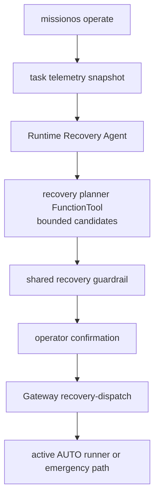
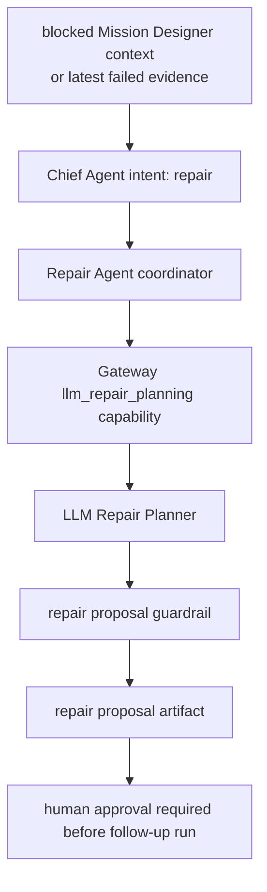

# Agent Architecture

This document describes the current MissionOS agent wiring. It is intentionally
more precise than the human-facing concept docs.

## Current Shape

MissionOS has a hierarchical agent topology, but the production safety path is
not ADK-native `transfer_to` delegation.

The current pattern is:

```text
Chief Agent returns JSON intent
-> deterministic MissionOS routing floor selects the specialist/capability
-> Gateway owns source checks, guardrails, approval, dispatch, and artifacts
```

The reason is practical and safety-related. Specialist agents are not attached
as ADK sub-agents to the Chief because ADK transfer tools can cause the model to
emit function calls instead of the JSON contract that Gateway audits.

The routing map lives in `src/intelligence/missionos_agent_runtime.py` as
`_CHIEF_TO_SPECIALIST`.

## Current Routing

| Chief intent | Specialist or boundary | Primary surface | Notes |
| --- | --- | --- | --- |
| `mission_designer_plan` | `missionos_flight_scenario_designer_agent` plus Gateway planner tools | `missionos chat` | Builds bounded mission proposals from source-backed route/weather/payload/terrain context. |
| `runtime_recovery` | `missionos_runtime_recovery_agent` | `missionos operate`, recovery chat requests | Proposes in-flight recovery actions. Parameterized actions must match planner-tool candidates. |
| `repair` | `missionos_repair_planner_agent` as coordinator plus `llm_repair_planning` capability | `missionos chat` `/repair` | Uses blocked evidence for post-block or next-run repair proposals. |
| `status` | `missionos_situation_judge_agent` | `missionos chat` | Explains current evidence and blockers. |
| `plan` / `revision` | `missionos_response_planner_agent` | `missionos chat` | Proposes response kinds, not approval or execution. |
| `approve` / `reject` | Gateway human review boundary | `missionos chat`, CLI commands | Records human operator intent. |
| `execute` | Gateway execution boundary | `missionos chat`, CLI commands | Can only proceed after approval and deterministic checks. |

The Safety Critic may be invoked after the chosen specialist. It can review the
proposal boundary, but it does not approve or execute.

Model backend selection is separate from routing. By default, ADK model calls
use the local Ollama/Gemma 4 backend. Gemini/API use requires explicit
`MISSIONOS_LLM_BACKEND=gemini`. See
`docs/agents/local-llm-backends.md` for global and per-agent model settings.

## Capability Ownership

Gateway owns internal capabilities. The Chief may propose using them, but does
not call tools directly or create authority.

Important capabilities:

| Capability | Owner | Coordinator | Output |
| --- | --- | --- | --- |
| `runtime_recovery` | Gateway | `missionos_runtime_recovery_agent` | Recovery assessment/proposal only |
| `llm_repair_planning` | Gateway | `missionos_repair_planner_agent` | Repair proposal artifact or blocked result |
| `form2a_response_selection` | Gateway | Chief-selected planner | Response selection and approval request artifacts |
| `form2a_operator_review` | Gateway | Human review boundary | Human approval/rejection artifact |
| `execution_handoff` | Gateway | Execution boundary | May execute only after approval and Gateway checks |

## Runtime Recovery Path

Runtime Recovery is the active mission path. It is the path behind
`missionos operate`.



Allowed proposals include `return_to_launch`, `land`, `adjust_altitude`,
`adjust_speed`, `reroute`, `avoid_obstacle`, and `operator_review`.

Rules:

- A recovery proposal is not approval.
- Parameterized actions must include bounded numeric parameters.
- Natural-language recovery requests may ask the agent to compute parameters,
  but the final request still goes through operator confirmation.
- `avoid_obstacle` must be source-backed by obstacle/building risk evidence.

## Repair Path

Repair is not the active mission path. It is post-block, post-run, or next-run
planning.



When Mission Designer context includes blocking reasons, Gateway can surface a
chat prompt:

```text
Mission blocked: wind_over_live_sitl_contract, payload_split_required.
Repair Agent can draft a next-run repair proposal.
Type `/repair` to analyze this blocked evidence.
```

The Repair Agent coordinates the handoff. The LLM Repair Planner writes a
proposal artifact only after guardrails pass. The artifact must keep these
authority facts false:

- `operator_approved`
- `dispatch_authority_created`
- `progress_counted`
- `drone_physics_affected`
- `physical_execution_invoked`

It must also set `operator_approval_required=true` for follow-up execution.

## Why Not Make Gateway "Just Call Agents" Everywhere?

Gateway is not an agent. Gateway is the network and authority boundary. It may
invoke an agent or capability, but it must still own:

- source-bound context resolution
- artifact persistence and hashes
- parameter bounds
- approval token checks
- dispatch suppression before approval
- execution routes
- verifier evidence

This keeps the MissionOS claim split intact even when LLM behavior changes.

## Future Direction

A future ADK Custom Agent or Workflow wrapper may be useful for traceability,
session state propagation, or composability. That should not move approval,
dispatch, execution, or verifier truth into LLM transfer delegation.

The durable target is:

```text
hierarchical agent topology
+ deterministic routing and guardrails
+ Gateway-owned authority boundaries
```
