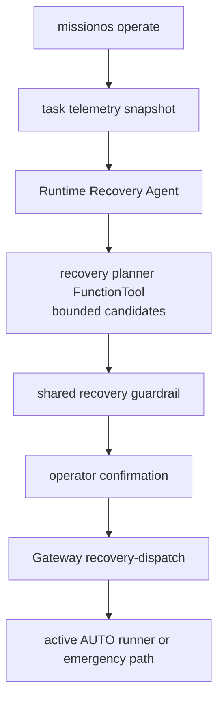
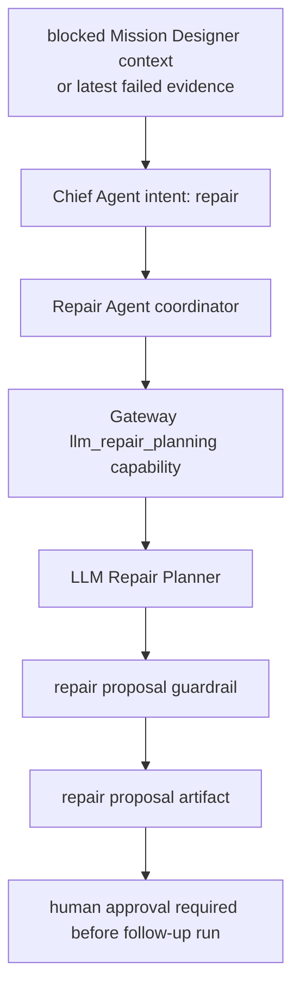

# Agent Architecture

This document describes the current MissionOS agent wiring. It is intentionally
more precise than the human-facing concept docs.

## Current Shape

MissionOS has a hierarchical agent topology, but the production safety path is
not ADK-native `transfer_to` delegation.

The current pattern is:

```text
Chief Agent returns JSON intent
-> deterministic MissionOS routing floor selects the specialist/capability
-> Gateway owns source checks, guardrails, approval, dispatch, and artifacts
```

The reason is practical and safety-related. Specialist agents are not attached
as ADK sub-agents to the Chief because ADK transfer tools can cause the model to
emit function calls instead of the JSON contract that Gateway audits.

The routing map lives in `src/intelligence/missionos_agent_runtime.py` as
`_CHIEF_TO_SPECIALIST`.

## Current Routing

| Chief intent | Specialist or boundary | Primary surface | Notes |
| --- | --- | --- | --- |
| `mission_designer_plan` | `missionos_flight_scenario_designer_agent` plus Gateway planner tools | `missionos chat` | Builds bounded mission proposals from source-backed route/weather/payload/terrain context. |
| `runtime_recovery` | `missionos_runtime_recovery_agent` | `missionos operate`, recovery chat requests | Proposes in-flight recovery actions. Parameterized actions must match planner-tool candidates. |
| `repair` | `missionos_repair_planner_agent` as coordinator plus `llm_repair_planning` capability | `missionos chat` `/repair` | Uses blocked evidence for post-block or next-run repair proposals. |
| `status` | `missionos_situation_judge_agent` | `missionos chat` | Explains current evidence and blockers. |
| `plan` / `revision` | `missionos_response_planner_agent` | `missionos chat` | Proposes response kinds, not approval or execution. |
| `approve` / `reject` | Gateway human review boundary | `missionos chat`, CLI commands | Records human operator intent. |
| `execute` | Gateway execution boundary | `missionos chat`, CLI commands | Can only proceed after approval and deterministic checks. |

The Safety Critic may be invoked after the chosen specialist. It can review the
proposal boundary, but it does not approve or execute.

## ADK v2 Conversation Proposal Graph

MissionOS uses the ADK v2 graph as the default primary conversation/proposal
generator. No promotion flag is required:

```text
MISSIONOS_ADK_V2_GRAPH_ROLLBACK=0
```

The graph evaluates the bounded input through these workflow nodes and adapts
the result to the existing `missionos_agent_runtime_result.v1` Gateway
contract:

```text
normalize_proposal_input
-> invoke_proposal_chief
-> invoke_proposal_specialist
-> invoke_proposal_safety_critic
-> finalize_primary_proposal
```

Shadow mode retains the corresponding `*_shadow_*` node names so stored
comparison evidence remains distinguishable from primary proposal evidence.

The graph uses the existing deterministic `_CHIEF_TO_SPECIALIST` allowlist. It
does not use ADK transfer tools and does not include the legacy `ControlLoop`,
human approval, Gateway dispatch, an executor, a backend adapter, or an outcome
verifier. Primary mode fixes `proposal_only=true`, `measurement_only=false`,
and all approval, dispatch, execution, effect, and progress facts to false.

Set `MISSIONOS_ADK_V2_GRAPH_ROLLBACK=1` to restore the previous sequential
proposal path. Rollback wins over every other graph flag and suppresses graph
invocation entirely. A primary graph failure is fail-closed as a blocked
proposal; it never silently falls back to a second execution engine.

For a bounded comparison run, set `MISSIONOS_ADK_V2_GRAPH_PRIMARY=0` and
`MISSIONOS_ADK_V2_GRAPH_SHADOW=1`. The sequential path then remains
authoritative and the graph independently evaluates the same input as
measurement-only evidence.

The comparison artifact is scoped explicitly as
`conversation_proposal_path_only`. It reports Chief, specialist, and Safety
Critic field agreement, while fixing `control_loop_compared=false`. It also
fixes the following authority facts:

- `measurement_only=true`
- `approval_created=false`
- `dispatch_authority_created=false`
- `executor_invoked=false`
- `physical_execution_invoked=false`
- `outcome_observed=false`
- `progress_counted=false`

The graph currently has these operational limits:

- primary mode makes one three-stage graph call sequence; shadow mode makes a
  second sequence after the sequential proposal path
- the shadow runs synchronously after the three-stage primary path; enabling it
  approximately doubles model-call count and can approximately double normal
  proposal latency
- `timeout_seconds` applies to each agent invocation, not the whole request, so
  a timeout-heavy request can approach the sum of the primary and shadow
  three-stage pipelines; the flag must remain off on latency-sensitive live
  paths unless that additional budget is intentional
- a graph failure is fail-open only for the shadow measurement; it cannot
  replace or block the production sequential result
- both primary and shadow modes use a one-shot `InMemorySessionService`
- graph resume, Redis restoration, HITL, retry, and execution are not enabled
- Chief, specialist, and Safety Critic run as `ctx.run_node()` children and use
  `rerun_on_resume=true`; pure normalize/finalize nodes remain reusable
- no proposal node has automatic retry configuration
- agent invocation evidence may be persisted, but node completion is not
  approval, dispatch, execution, observation, or progress

All production `Runner` call sites and the distinction between multi-stage
Workflow roots and valid standalone Agent roots are enumerated in
`docs/agents/adk-v2-runtime-inventory.md`.

The proposal graph is still one-shot, but its judgment nodes follow the
fresh-on-resume rule required by persistent workflows. Before connecting this
graph directly to Redis resume, approval, or dispatch:

- Chief, specialist, Safety Critic, and any other judgment node that reads
  telemetry must use fresh, checkpoint-bound input and rerun after resume
- cached pre-pause LLM output must not be treated as dispatch-time truth
- a deterministic pure node may reuse output only when its complete input is
  cryptographically bound to the resumed checkpoint
- fresh post-resume rules and dispatch-time verification remain mandatory;
  graph resume and node completion create no approval or dispatch authority

These resume rules remain a promotion gate before the graph can include
approval, dispatch, execution, or recovery side effects. `dispatch_ref`
idempotency and real Redis restart restoration are already separate proven
prerequisites; neither grants authority to this proposal graph.

The Redis backend requirement, ADK v2 event-field round trip, process-restart
verification, and post-resume fresh-state rules are defined in
`docs/agents/adk-v2-session-persistence.md`. Restored session data remains
orchestration state and does not replace canonical MissionOS artifacts.

## ADK v2 Dynamic ControlLoop

The `ControlLoop` used by the legacy-agent Gateway profile now runs as one ADK
v2 dynamic Workflow. Its orchestrator invokes Planner, Executor, verification
preparation, Verifier, and memory promotion with `ctx.run_node()`. The bounded
repair loop remains ordinary Python control flow inside the dynamic node.

Planner and Verifier rerun after ADK resume so their judgments use current
state. A completed Executor or memory-promotion node does not rerun, preventing
resume from replaying tool or publication side effects. Human approval still
comes from MissionOS session state and `resolve_human_approval()`; a
`needs_human` result stops before Executor. Workflow completion is not approval,
external execution, observed effect, or progress.

This slice changes the ControlLoop only. Gateway conversation orchestration and
proposal-primary promotion remain separate steps. The exact contract is in
`docs/agents/adk-v2-control-loop.md`.

## ADK v2 Legacy Gateway Conversation Workflow

The explicit `legacy_agent` Gateway profile now runs route selection,
optional specialist prepass, and optional root synthesis through one ADK v2
dynamic Workflow. Router and specialist Agents use isolated single-turn
sub-branches. The root Agent uses chat mode on the main branch so its
conversation history and supported collaboration behavior remain available.

The Workflow returns `control_loop` and `dynamic_agent` as decisions only.
Gateway performs those handoffs after the graph returns, so route selection or
node completion creates no approval, dispatch authority, execution, observed
effect, verifier passage, or progress. Browser and GUI infrastructure failure
continues to fail closed before root synthesis.

The former root Runner, routing Runner, and per-specialist Runner map have
been removed from `GatewayServer`. Cron-only route selection also invokes the
routing Agent as a child of a small v2 Workflow. Routing judgment reruns on
resume, while completed specialist and root nodes do not replay their possible
tool side effects. The full branch, history,
failure, authority, and loopback-smoke contract is in
`docs/agents/adk-v2-legacy-gateway.md`.

## ADK v2 Canonical Approval HITL

An independent opt-in workflow may pause on a Form 2A selection and resume
only with its exact canonical `approval_ref`. It requires Redis and is exposed
through:

```text
POST /missionos/adk-v2/hitl/form2a-approval/start
POST /missionos/adk-v2/hitl/form2a-approval/resume
```

The operator still creates approval through the existing MissionOS Form 2A
operator-review route. ADK `RequestInput` is only the pause/resume transport.
The post-resume node reruns and reloads the current approval artifact, proposal
hash, token expiry, bounded action, and dispatch reference. A plain `yes`
response is rejected before the workflow is resumed.

Successful validation reports an existing human approval; it does not create
approval, consume the token, grant dispatch authority, invoke an executor,
observe an effect, pass a verifier, or count progress. The full contract and
Redis process-restart verification command live in
`docs/agents/adk-v2-canonical-approval-hitl.md`.

## ADK v2 Guarded Execution

`MISSIONOS_ADK_V2_GUARDED_EXECUTION_ENABLED=1` adds one post-validation graph
node. It does not give ADK direct executor tools. The node calls a
MissionOS-owned handler that reruns canonical approval and source-snapshot
checks, enforces snapshot freshness and backend opt-in, creates deterministic
dispatch authority, claims the stable `dispatch_ref`, persists send-start, and
then invokes the existing execution boundary once.

Duplicate resume cannot re-enter the graph. Receipt replay cannot reinvoke the
executor. Ambiguous sender failure remains an unknown outcome and disables
automatic retry. The fixture adapter is separately marked, invokes no external
sender, and must never be enabled in production.

Every resumed node is projected into a same-task audit trace with the canonical
approval, candidate, hash, bounded-action, and dispatch refs. This correlation
does not turn ADK event IDs or node completion into execution evidence. See
`docs/agents/adk-v2-guarded-execution.md`.

## ADK v2 Bounded Recovery

`MISSIONOS_ADK_V2_RECOVERY_ENABLED=1` enables a conditional post-verifier node.
Only an explicit `verifier_status=failed` creates one new proposal. The router
changes the bounded-action and dispatch refs, marks the prior approval
non-reusable, creates a new approval request, and stops before approval,
dispatch authority, or Recovery execution.

Missing, unverified, or not-run verifier evidence does not trigger recovery.
Duplicate resume cannot recreate the proposal. See
`docs/agents/adk-v2-bounded-recovery.md`.

Implementation and comparison contracts live in
`src/intelligence/missionos_adk_v2_shadow_graph.py`. The production wrapper in
`src/intelligence/missionos_agent_runtime.py` either adapts the primary graph
result, runs the explicit sequential rollback, or attaches
`adk_v2_shadow_result` and `adk_v2_shadow_comparison` without changing the
sequential `runtime_status` or `proposal`.

Model backend selection is separate from routing. By default, ADK model calls
use the hosted DeepSeek V4 path. Set `MISSIONOS_LLM_BACKEND=gemini` for the
supported Gemini path, `MISSIONOS_LLM_BACKEND=ollama` for local Gemma/Ollama,
or `MISSIONOS_LLM_BACKEND=off` only for deterministic boundary tests. See
`docs/agents/local-llm-backends.md` for global and per-agent model settings.

## Capability Ownership

Gateway owns internal capabilities. The Chief may propose using them, but does
not call tools directly or create authority.

Important capabilities:

| Capability | Owner | Coordinator | Output |
| --- | --- | --- | --- |
| `runtime_recovery` | Gateway | `missionos_runtime_recovery_agent` | Recovery assessment/proposal only |
| `llm_repair_planning` | Gateway | `missionos_repair_planner_agent` | Repair proposal artifact or blocked result |
| `form2a_response_selection` | Gateway | Chief-selected planner | Response selection and approval request artifacts |
| `form2a_operator_review` | Gateway | Human review boundary | Human approval/rejection artifact |
| `execution_handoff` | Gateway | Execution boundary | May execute only after approval and Gateway checks |

## Runtime Recovery Path

Runtime Recovery is the active mission path. It is the path behind
`missionos operate`.


```mermaid
flowchart TD
    O["missionos operate"] --> T["task telemetry snapshot"]
    T --> A["Runtime Recovery Agent"]
    A --> P["recovery planner FunctionTool<br/>bounded candidates"]
    P --> G["shared recovery guardrail"]
    G --> C["operator confirmation"]
    C --> D["Gateway recovery-dispatch"]
    D --> E["active AUTO runner or emergency path"]
```

Allowed proposals include `return_to_launch`, `land`, `adjust_altitude`,
`adjust_speed`, `reroute`, `avoid_obstacle`, and `operator_review`.

Rules:

- A recovery proposal is not approval.
- Parameterized actions must include bounded numeric parameters.
- Natural-language recovery requests may ask the agent to compute parameters,
  but the final request still goes through operator confirmation.
- `avoid_obstacle` must be source-backed by obstacle/building risk evidence.

## Repair Path

Repair is not the active mission path. It is post-block, post-run, or next-run
planning.


```mermaid
flowchart TD
    B["blocked Mission Designer context<br/>or latest failed evidence"] --> C["Chief Agent intent: repair"]
    C --> R["Repair Agent coordinator"]
    R --> G["Gateway llm_repair_planning capability"]
    G --> L["LLM Repair Planner"]
    L --> Q["repair proposal guardrail"]
    Q --> A["repair proposal artifact"]
    A --> H["human approval required before follow-up run"]
```

When Mission Designer context includes blocking reasons, Gateway can surface a
chat prompt:

```text
Mission blocked: wind_over_live_sitl_contract, payload_split_required.
Repair Agent can draft a next-run repair proposal.
Type `/repair` to analyze this blocked evidence.
```

The Repair Agent coordinates the handoff. The LLM Repair Planner writes a
proposal artifact only after guardrails pass. The artifact must keep these
authority facts false:

- `operator_approved`
- `dispatch_authority_created`
- `progress_counted`
- `drone_physics_affected`
- `physical_execution_invoked`

It must also set `operator_approval_required=true` for follow-up execution.

## Why Not Make Gateway "Just Call Agents" Everywhere?

Gateway is not an agent. Gateway is the network and authority boundary. It may
invoke an agent or capability, but it must still own:

- source-bound context resolution
- artifact persistence and hashes
- parameter bounds
- approval token checks
- dispatch suppression before approval
- execution routes
- verifier evidence

This keeps the MissionOS claim split intact even when LLM behavior changes.

## Future Direction

The ADK v2 shadow graph provides proposal-path traceability without authority,
and the legacy-profile ControlLoop now uses an ADK v2 dynamic Workflow. Redis
process-restart restoration, `dispatch_ref` idempotency, canonical-approval
HITL, guarded execution, and bounded Recovery have separate contracts and
evidence. Positive outcome verification and Recovery execution remain separate
facts and must not be inferred merely because the graph API supports resume or
retry.

The durable target is:

```text
hierarchical agent topology
+ deterministic routing and guardrails
+ Gateway-owned authority boundaries
```
