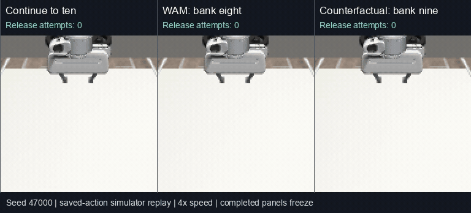

# Block Stacking with a VLA and a Learned World Model: Prediction, Stopping, and the Fixed-Count Confound

Technical report — 18 September 2026

Scope: simulated block-stacking experiments recorded in the 17 September experiment series, through the ten-start evaluation and its subsequent audit.

## Abstract

We investigated whether a world action model (WAM) can predict the state of
blocks after a robot action and improve a vision-language-action (VLA) policy's
score in a stacking game. The game allows at most ten blocks, awards the number
banked when the player stops, and awards zero after collapse. The desired benefit
is selective continuation: stop before a dangerous placement, but continue when
additional placements are safe.

Initial experiments with Cosmos Policy, RynnVLA-002, and ACWM-DiT did not establish
usable collapse prediction in the custom scene. Failures included a missed
collapse, malformed image generation, and loss of correspondence between input
and predicted objects. These are configuration-specific results, not a ranking
of the models or evidence that the model families lack physical understanding.

We subsequently fine-tuned SmolVLA for staged lowering and release, froze it, and
trained a 349,652-parameter object-state dynamics model on paired continue/bank
outcomes. A five-game offset pilot scored 12 with WAM versus 11 with a shared
current-state stopping rule. One matched-state intervention correctly anticipated
approximately 42 mm of falling motion and preserved one point.

A later, frozen-model evaluation used ten unused initial-position seeds and no
intentional per-level horizontal offset. Nine starts produced comparable scores:
10 for unconditional continuation, 35 for a current-state stopping rule, and 72
for WAM stopping. The tenth start had a VLA placement-readiness failure in both
the unconditional and WAM arms. Crucially, every completed WAM game banked eight
blocks; all reached WAM decisions matched a fixed-eight stopping policy at the
same decision timing. In a post-hoc counterfactual, a ninth placement predicted
to collapse was actually safe and banked nine points. Thus, score improvement
was observed, but superiority over a simple fixed-count policy and reliable
state-dependent collapse prediction were not established.

This is a bounded simulation study using exact simulator object states for the
learned WAM. It is not an RGB-only evaluation, autonomous object acquisition,
a hardware safety demonstration, or a deployment claim.

## 1. Research question and terminology

The prediction target is the **object state after an action**: whether the blocks
remain supported, translate, tilt, fall, or cause the tower to collapse. Correctly
generating gripper motion is insufficient. Likewise, a future image that changes
with an action is not necessarily a correct prediction of the object's response.

In this report:

- **VLA** denotes the actual learned SmolVLA action network used in the later
  experiments. The earlier scripted experiments did not use a VLA actor.
- **WAM** is the experimental role of predicting action-conditioned future state.
  The dedicated model predicts numeric object trajectories, not video.
- **Continue** means execute the frozen VLA's release/withdraw option for the next
  prepared block. **Bank** means terminate and attempt to preserve the already
  released blocks using a shared withdrawal/hold controller.
- **Stable** means no operational collapse was detected over the specified
  observation interval. It does not mean indefinitely stable or formally safe.

Three different claims must be tested separately:

1. The prediction corresponds to the input objects and responds to the action.
2. The predicted object outcome agrees with execution.
3. Using the prediction changes a decision and improves outcomes over meaningful
   alternatives, including simple stopping policies.

This separation is consistent with the repository's
[claim semantics](claim-semantics.md) and [publication rules](publication-rules.md).
The experiments do not establish a MissionOS Gateway or approval-chain runtime
integration. A learned forecast, a stop decision, simulator execution, and an
observed score are separate facts. Physical execution is not claimed.

## 2. Experiment progression

The cohorts below must not be pooled as a single benchmark. They used different
actors, observation contracts, horizons, stop rules, and development histories.

| Stage | Actor and prediction method | Evaluation unit | Result and interpretation |
| --- | --- | --- | --- |
| A | Scripted release with Cosmos Policy | 13 forecasts; two inspected states for a later action contrast | One actual collapse missed; action sensitivity did not imply correct block motion |
| B | Scripted release with RynnVLA-002 | One scene, release versus hold | Default output malformed; syntax-constrained output did not support reliable object-state scoring |
| C | Scripted release with ACWM-DiT | One official example and one custom paired scene | Official lift reproduced; custom object identity not maintained |
| D | Scripted stacking plus ACWM readout | Five rounds per arm | Scores 5 versus 0; WAM rejected the same first-step prediction in all rounds |
| E | Fine-tuned SmolVLA plus dedicated state WAM | Five unused offset-game starts | Current-rule 11, fixed-three plus rule 10, WAM plus rule 12; one verified useful intervention |
| F | Same frozen learned models; centered stacking | Ten unused starts, nine complete comparisons | Always-continue 10, current-rule 35, WAM 72; WAM decisions indistinguishable from fixed-eight on reached states |

Stages A–D are integration and prediction diagnostics. Stage E is a pilot, not
the final centered-game result. Stage F tests the clarified game without imposing
progressively larger placement offsets. The dedicated WAM was trained between
stages D and E; neither learned model was retrained between E and F.

## 3. Initial video-prediction diagnostics

### 3.1 Cosmos Policy

The tested checkpoint was
[Cosmos-Policy-LIBERO-Predict2-2B](https://huggingface.co/nvidia/Cosmos-Policy-LIBERO-Predict2-2B).
The custom evaluation used a MuJoCo Panda staged-grasp setup and a 0.8 s forecast
horizon. Ten centered placements and the first three placements of an 18 mm
per-level offset sequence produced 13 matched-input forecasts. The recorded
checks verified all 13 input correspondences and 91 collected-file hashes.

Visual judgments classified every prediction as non-collapse. Twelve outcomes
were non-collapse; the third offset placement fell by 81.638 mm and was missed.
The judgments were not blinded, and development outcomes were already known.
An apparent 12/13 accuracy is therefore neither an independent estimate nor
useful evidence of collapse sensitivity: always predicting non-collapse gives
the same result on this cohort.

A descriptive pixel analysis ruled out literal input copying, but did not show
useful dynamics. Mean full-frame RGB absolute errors, in intensity units 0–255,
were 5.682 for prediction versus input, 6.278 for prediction versus outcome, and
1.155 for copying input versus outcome. In the collapse case, error over the
block-color union was 115.956 for prediction versus outcome and 117.209 for the
copy-input baseline. Background-dominated error is not the primary physics
metric, and outcome-selected regions are only post-hoc diagnostics.

The later action contrast held observations, instruction, and seed fixed and
changed only the gripper sign in a 16-by-7 action array. Each of two states was
run with release, hold, and a repeated release: six forecasts, but only two
underlying states.

| State | Actual maximum drop, release | Actual maximum drop, hold | Release/hold forecast image MAE |
| --- | ---: | ---: | ---: |
| Centered | 2.436 mm | 0.296 mm | 2.297 |
| Offset | 81.638 mm | 0.370 mm | 3.286 |

Repeated release forecasts were pixel-identical. In the offset release case,
the predicted visible blue-region vertical displacement was −0.108 px, whereas
the actual displacement was +29.256 px, with downward positive. Hold gave
+0.112 px predicted and 0.000 px actual displacement. These are visible
same-color-group measurements, not individually tracked 3D block centers.
No camera/depth calibration justified conversion of generated-image pixels to
millimeters.

The supported conclusion is that action conditioning changed output, while the
required falling motion was not reproduced. These measurements do not establish
that the action input was ignored. No verified result in this series establishes
that a separate value output provided a useful collapse warning.

### 3.2 RynnVLA-002

The recorded model was `RynnVLA-002 World_model_512/libero_goal`, checkpoint
revision `be44787bfdf010799129dbd3752637f5c52ca957`, with source revision
`e548ccc2977ba4fc06013de18192fa6245e454a4`. The test used the same offset
three-block configuration for release and hold.

Attempts v1–v5 had an incorrect horizontal image orientation and were excluded
from capability conclusions. After correcting orientation, default generation
still produced malformed image tokens in both conditions. A separate diagnostic
constrained image syntax while allowing the model to generate visual codes;
it did not supply the true future image. This constrained-decoding result must
not be described as unmodified default inference.

Nine generated steps were compared with 0.45 s of simulation, assuming a 20 Hz
correspondence. Independent model-time calibration was not established, and the
horizon was chosen after observing collapse and decoding latency. Actual drops
were 57.575 mm for release and 0.226 mm for hold. The constrained front view kept
an upright block-like group; wrist views lost the blocks. Object disappearance
without verified correspondence is not a correct fall prediction. Appearance
and background changes prevented reliable per-object pose scoring.

The result is an unusable prediction under the tested adapter and decoding
conditions, with unresolved integration and time-calibration limitations.

### 3.3 ACWM-DiT official control and custom transfer

The Stack Cube checkpoint from
[ACWM-Phys](https://github.com/xavihart/ACWM-Phys-dev) was tested at checkpoint
revision `f24a2a2af19b915ba69c5aa309146d35be4080f4` and source revision
`9a5ce2babb18ba42c83b56dc5b70fef7e4ca4b0c`. Model and dataset attribution belongs
to the ACWM-Phys authors; the experiment recorded their model/data licensing as
CC-BY-4.0. This publication redistributes neither weights nor dataset media.

The configuration used seven action dimensions, 240-by-240 images, 37 frames,
50 generation steps, and seed 195. The loaded components totaled 346,209,587
parameters; missing and unexpected state-dict keys were empty. These facts
verify loading and invocation, not predictive correctness.

One official episode produced a recognizable lift. Its final visible yellow
region had about 9.05 px centroid error, with partial occlusion and blurred robot
geometry. This is a single positive integration control, not a calibrated 3D
pose result. Fifty network forwards and action-input delivery were recorded;
true future images were not inference inputs.

For the custom three-block scene, release caused 81.638 mm of drop and hold
0.758 mm over 1.8 s. Predictions replaced the input blue blocks with differently
colored objects and changed the background. Collapse labels were therefore
unscorable: input object identity and number were not maintained. These cases
must not be silently added to a binary false-negative count. An initial frame
that matches input is also insufficient evidence of correct conditioning when
the implementation explicitly fixes the initial latent frame from that input.

Distribution shift, preprocessing, action semantics, and model limitations remain
possible causes. The experiment did not isolate one cause, audit training-data
failure coverage, or establish that these models were trained only on successes.

### 3.4 The earlier scripted five-round game

The early game used intentional per-level offsets of 0, 6, 10, 14, and 18 mm.
The actor was scripted. A shared rule stopped when existing-block tilt exceeded
5 degrees or horizontal drift exceeded 3 mm. WAM added a color-region readout.

| Offset | Scripted baseline score | ACWM-assisted score |
| --- | ---: | ---: |
| 0 mm | 0 | 0 |
| 6 mm | 5 | 0 |
| 10 mm | 0 | 0 |
| 14 mm | 0 | 0 |
| 18 mm | 0 | 0 |
| Total | 5 | 0 |

The WAM arm released no block in any round. All five initial images were
identical and generation used the same seed. Offsets affected later blocks, so
five calls and 250 network forwards repeated one effective initial prediction
case. The stop reason was invalid object prediction, not a successful collapse
warning. The recorded zero scores mean zero blocks banked; for prediction
analysis these were unusable forecasts, not five independent physical failures.

The green-region area in input was 130 px. Allowed area ratios were 0.35–2.5;
within that range, downward movement over 8 px or horizontal movement over 12 px
triggered risk. At predicted frames 12, 24, and 36, area ratios were 0.362, 2.400,
and 3.854. The last frame was invalid; earlier frames also triggered motion.
Invalidity took precedence. Color-component motion without object identity did
not establish correct block motion.

The centered baseline released ten blocks but collapsed during final settling.
Its repeat verification matched all ten decision images and confirmed a maximum
drop of 356.629 mm. That repeat was an audit, not a sixth game. Short-horizon
non-collapse in the earlier Cosmos sequence and later collapse in this game are
not contradictory: execution and observation intervals differed. The early
video game also forecast 1.8 s while final release plus settling could span
3.6 s, creating a horizon mismatch.

### 3.5 Investigated but not executed

DreamDojo compatibility was investigated, but the checked robot/action contracts
did not establish a valid mapping from the Panda seven-dimensional commands.
No DreamDojo inference result is reported.

[PointWorld](https://github.com/NVlabs/PointWorld) and its
[public weights](https://huggingface.co/nvidia/PointWorld_models/tree/main) were
investigated as a 3D prediction candidate. Neither integration into this game nor
a tower-collapse inference test was completed. Availability of a checkpoint is
not evidence of compatibility or success in this task.

## 4. Dedicated learned system

### 4.1 Environment and staged task

The later experiments used MuJoCo 3.8.1, robosuite 1.4.0, a simulated Panda, and
ten 40 mm cubes. The nominal block-center heights were 0.822 m plus 0.040 m per
level. Control ran at 20 Hz. The camera supplied 128-by-128 RGB observations,
resized to 256-by-256 for the VLA vision input. Local inference and learning used
Apple MPS; the simulator ran in an arm64 container.

The setup parked unused blocks away from the tower, moved to an acquisition
pose, placed the next block into the gripper, set the gripper state, and reset
simulation velocities during staging. It then executed learned lowering and
release. Consequently, this is a staged placement benchmark, not a continuous
pick-and-place task. Resetting velocities can alter existing-tower dynamics;
although shared by all arms, it limits physical realism and transfer claims.

The commanded targets and phase transitions were scripted. Only the admitted
lowering and release/withdraw segments were produced by the learned VLA. The
common bank controller was also scripted. These boundaries matter: neither
language-based task planning nor autonomous grasp acquisition was evaluated.

### 4.2 SmolVLA training and admission

The base was [LeRobot SmolVLA](https://huggingface.co/lerobot/smolvla_base), recorded
at revision `d9f33c94a60fb382c90dea2164c96845bd955e28`. Fifty successful scripted
teacher episodes supplied 5,000 frames. Teacher actions are training examples;
they are not counted as learned-policy execution.

Inputs were current RGB, phase-specific language, and 12 state values:
end-effector XYZ, quaternion, two gripper joint positions, and commanded goal XYZ.
The second training attempt represented the last three features as goal minus
current end-effector position. Outputs were all seven normalized Panda
OSC_POSE action dimensions: translation, rotation, and gripper. The model
predicted chunks of 16 actions; execution consumed five before requesting a new
chunk. Observations and actions were normalized using stored statistics.

| Attempt | Training updates | Development admission | Treatment |
| --- | ---: | ---: | --- |
| 1 | 600 | 2/6 | Failed; checkpoint and evidence retained |
| 2 | 1,600 | 6/6 | Admitted, then frozen |

Attempt 2 used batch size four, AdamW at learning rate 0.0001, gradient clipping
at 10, and a mixture of early-motion and full-episode frame sampling. Admission
required at least five of six development starts to maintain grasp through
lowering, reach within 15 mm of target, release through learned actions, and
satisfy final placement/stability checks without teacher fallback. The same six
starts were reused after the first failure, so 6/6 is development admission,
not held-out generalization. Teacher/admission release used 40 learned steps;
the subsequent game and WAM option used 36. This timing difference is retained
in the interpretation of the admission result.

### 4.3 Outcome headroom before WAM training

Ten same-start branch probes compared one-more-placement with banking. The
oracle used actual outcomes only to estimate available improvement; it was
never presented as a learned predictor.

Unconditional continuation totaled 18 and the oracle 22. Applying the actual
current-state stopping rule raised the relevant baseline to 20, leaving an
oracle upper bound of **two points**, not four. The initial four-point number
belonged to a weaker comparator. This correction is material when estimating
how much benefit a WAM can add.

### 4.4 WAM data and model

The main collection attempted 45 starts: 36 designated training starts and nine
validation starts over one to nine existing supports. Four training offsets per
height sampled fractions 0.30, 0.85, 1.05, and 1.12 of a nominal geometric critical
offset, with an additional cap. Five zero-support starts were collected separately.
The split was assigned before model fitting; reachability filters then reduced it.

A state was eligible only if the frozen VLA still held the next block, placement
error was below 15 mm, and the existing tower had not already crossed the 30 mm
drop threshold. Failed preparation states were retained but excluded from
forecast training; they were not mislabeled as WAM prediction failures.

The main collection yielded 21 eligible starts, plus five zero-support starts:
21 training starts and five validation starts overall. Each contributed continue
and bank branches, giving **42 training samples and ten validation samples**.
These are paired branches, not 52 independent scenes. Eligible main-collection
counts by number of supports 1–8 were 5, 5, 4, 3, 1, 1, 1, and 1; no nine-support
start qualified. Tall towers were therefore sparsely represented.

The WAM was a multilayer perceptron, `124 → 256 → 256 → 980`, with SiLU hidden
activations and 349,652 parameters. Its inputs were:

| Feature | Dimensions |
| --- | ---: |
| Ten object positions and quaternions | 70 |
| Ten estimated XYZ velocities | 30 |
| Active-object mask | 10 |
| Robot state and commanded goal | 12 |
| Continue/bank one-hot option | 2 |
| Total | 124 |

Positions were expressed relative to the first block, robot goals relative to
the end effector, and inactive object features masked. Velocities used recent
object history over 0.25 s. Inputs were exact simulator observations, not
perception estimates. The option represented the frozen closed-loop VLA
release/withdraw behavior or the shared bank controller; it was not a realized
future action sequence.

Outputs were pose deltas at frames 1, 4, 8, 12, 18, 24, 30, 36, 48, 60, 72, 96,
120, and 132, for ten objects with seven pose components each. XYZ target deltas
were scaled by 0.1 m; quaternion components had loss weight 0.05. The training
mask excluded inactive objects and times beyond each option's horizon. AdamW
used learning rate 0.001 and weight decay 0.0001, batch size 32, and gradient
clipping at 10. The loop ran update indices 0 through 2500 inclusive. The
checkpoint at index 1000 was selected by minimum validation trajectory loss.

Quaternion outputs were not independently validated or constrained to valid
unit rotations. Operational scoring used height drop, so this work does not
claim a validated full-pose physics model. It is an option-conditioned dynamics
model, not a general continuous-action WAM.

### 4.5 Validation and stopping calculation

The development gate required both collapse classes, balanced classification
accuracy at least 0.75, and mean scored-object XYZ trajectory RMSE better than
copying current poses. The selected model detected both collapse branches, with
two false alarms among eight non-collapse branches: accuracy 0.80 and balanced
accuracy 0.875. The trajectory gate passed. These ten branches were also used
for checkpoint selection and must not be called an independent test set.

For each option, the forecast maximum downward displacement was computed across
scored objects and valid predicted times. Continue counted the held block as the
next released block; bank counted only already released blocks. Existing-block
reference heights were retained from acceptance, while the new block's reference
was its current pre-release height. A predicted drop over 0.030 m gave predicted
score zero; otherwise the score was the corresponding block count. Bank was
chosen when its score was at least the continue score. Non-finite forecasts also
caused banking. The numbers were deterministic score estimates, not calibrated
collapse probabilities or expected returns under an uncertainty distribution.

Continue predicted 72 control steps (3.6 s: 36 learned release/withdraw plus 36
settling); bank predicted 132 steps (6.6 s: 60 withdrawal plus 72 hold). The game
reconsidered after subsequent preparation, rather than always executing exactly
the one-more-then-settle trajectory. Thus, this is a receding stopping heuristic,
not an optimal whole-game planner. The different option durations and intervening
preparation are limitations even though they were kept consistent across arms.

## 5. Five-game learned-model pilot

Three development games selected a fixed stopping count from 1–10; count three
achieved the best development total of seven. The development oracle across
those count choices also totaled seven. This did not establish improvement
headroom over fixed-three on that particular development cohort.

The pilot then used five unused starts with deliberately increasing offsets.
All arms retained the common tilt/drift stop rule. WAM could add a stop veto,
but could not override that rule to keep stacking.

| Seed | Per-level offset | Current rule | Fixed-three plus current rule | WAM plus current rule |
| --- | ---: | ---: | ---: | ---: |
| 45100 | 0 mm | 4 | 3 | 4 |
| 45101 | 6 mm | 3 | 3 | 3 |
| 45102 | 10 mm | 2 | 2 | 2 |
| 45103 | 14 mm | 2 | 2 | 2 |
| 45104 | 18 mm | 0 | 0 | 1 |
| Total | — | 11 | 10 | 12 |

The descending scores reflect increasingly offset towers, not online learning
or deteriorating model weights. All five starts were valid, with five distinct
initial images, 28 verified matched decision prefixes, and 14 recorded forecast
decisions. Only one WAM intervention changed the outcome.

At seed 45104, before releasing block two, the predicted continue drop was
42.223 mm versus 0.762 mm for banking. WAM banked one block. A same-state
one-more-then-bank execution fell by 42.607 mm and scored zero. This establishes
a bounded instance of forecast, changed decision, and preserved score. It does
not establish broad accuracy, statistical superiority, or useful continuation
beyond the shared current-state rule.

## 6. Ten-start centered game with frozen models

### 6.1 Protocol

The clarified game was frozen before execution as follows:

| Item | Definition |
| --- | --- |
| Maximum | Ten released blocks |
| Collapse score | Zero |
| Voluntary termination | Released-block count if the bank operation and observation interval do not collapse |
| Initial conditions | Seeds 47000–47009; each seed selects a common tower XY target uniformly within ±10 mm |
| Intended placement | Same tower XY target at every height; zero imposed per-level offset |
| Always-continue arm | Execute VLA placements up to ten unless collapse or technical failure occurs |
| Current-rule arm | Stop for existing-block tilt above 5 degrees or horizontal drift above 3 mm |
| WAM arm | Choose continue or bank from predicted scores; no common current-state stop veto |
| Model changes | None; VLA, WAM, and normalization remain frozen |
| Retention | Keep all ten predefined starts; do not replace unfavorable or invalid starts |

The rule arm supplied a comparator capable of stopping early. The unconditional
arm cannot exhibit “stopped too early,” because it has no discretionary stop
policy. The VLA itself emits motion, not a stop token; the rule arm's termination
must not be attributed to autonomous VLA reasoning.

WAM decided **after lowering the next held block, before release**. “Next
placement” therefore refers to the release/withdraw option at this interface,
not the entire approach and lowering motion. A tower could collapse during
preparation before the next forecast. At seed 47006 this happened in the
unconditional arm after nine releases. This timing should be reconsidered in
future benchmark versions rather than hidden behind the binary decision label.

### 6.2 Pairing and information boundary

For each start, the unconditional arm ran actual SmolVLA inference. Other arms
replayed its recorded action prefix until deciding to terminate. These were not
three independent stochastic VLA inference runs. Replaying the same actions
isolated stop-policy differences and removed action-sampling variation between
arms at corresponding states.

At each reached comparison decision, simulator object poses matched the source
with absolute tolerance 1e-10 and zero relative tolerance, and RGB hashes
matched exactly. A later audit verified 126 decision prefixes, 252 action-array
prefix comparisons, and 11,628 replayed control steps. All ten initial image
hashes were distinct. Model and recorded implementation bindings were unchanged.
Distinct images do not imply ten independent domains or broad scene diversity.

Forecasts were computed offline from the unconditional trajectory's saved
current/recent observations before comparison-arm replay. The predictor did not
read future outcome arrays, future images, or realized future actions, and did
not invoke the simulator to obtain its forecast. The action replay executor did
use the stored action arrays. This separates inference inputs from execution
inputs, but is not a prospective real-time or blinded study; the orchestrator
had already run the unconditional trajectory.

### 6.3 Scoring, observation time, and failures

For each accepted block, the evaluator retained its center height immediately
before release. Collapse was latched if any accepted block fell more than 30 mm
below its reference at an observed control step. A later recovery in height did
not erase an earlier collapse. This predicate does not comprehensively measure
support topology, small slides, rotation, or continuous-time excursions between
samples.

Banking while holding the next block used 60 withdrawal steps and 72 holding
steps. Finishing ten blocks, or terminating without a held block, used 36
additional settling steps. Final settling was included in the score. Some raw
termination reasons retained `ten_completed` after reaching ten even if settling
subsequently collapsed; the audited interpretation uses the final `collapsed`
and score fields, not that reason string alone.

A missing grasp, pre-release error of at least 15 mm, or failure to release was
a technical failure with no numerical score. This distinction avoids silently
turning execution invalidity into either collapse or a successful bank. It also
means the reported paired total is conditional on successful trial execution.

### 6.4 Results

| Seed | Always continue | Current rule | WAM | Paired-score eligibility |
| --- | ---: | ---: | ---: | --- |
| 47000 | 0 | 4 | 8 | Included |
| 47001 | N/A | 3 | N/A | Placement readiness failed in two arms |
| 47002 | 10 | 3 | 8 | Included |
| 47003 | 0 | 3 | 8 | Included |
| 47004 | 0 | 3 | 8 | Included |
| 47005 | 0 | 9 | 8 | Included |
| 47006 | 0 | 2 | 8 | Included |
| 47007 | 0 | 4 | 8 | Included |
| 47008 | 0 | 3 | 8 | Included |
| 47009 | 0 | 4 | 8 | Included |
| Paired total, nine starts | 10 | 35 | 72 | Maximum 90 per arm |

At seed 47001, the fourth placement remained grasped but missed the readiness
limit: error was 15.208 mm against a strict 15 mm threshold. Both unconditional
and WAM arms reached the same failure. The rule arm had banked three earlier.
It is retained in the table but excluded from all three paired sums. Summing
all individually scored rule episodes would give 38 over ten episodes; comparing
that number to nine-episode totals would mix denominators.

On the nine complete comparisons, WAM exceeded unconditional continuation in
eight starts and scored two points less in one. Against the rule arm, it scored
more in eight and one point less in one. Unconditional continuation had eight
collapses and one ten-block completion; WAM banked eight in all nine. These are
descriptive results on a small, narrow cohort, not a population-level safety or
superiority estimate.

### 6.5 Fixed-eight equivalence and the false-alarm counterfactual

The strong-looking score difference does not isolate predictive value. A
post-hoc audit compared each reached WAM choice with “continue until eight blocks
have been released, then bank at the same next pre-release decision point.” All
choices matched, including the reached prefix of the technically invalid start.
No independent fixed-eight simulation arm was run, and eight was identified
after inspecting results. This is observed decision equivalence, not a
preselected held-out fixed-policy contest. It nevertheless demonstrates that
the observed WAM behavior required no state-dependent variation in stop count.

A further post-hoc counterfactual used the first test start, where WAM banked
eight before block nine. It replayed the same VLA prefix, released block nine,
and then settled and banked immediately, without attempting block ten.

| Seed 47000, ninth-placement diagnostic | Forecast | Actual matched execution |
| --- | ---: | ---: |
| Maximum downward displacement | 988.413 mm | 12.844 mm |
| One-more-then-bank score | 0 | 9 |
| Collapse at 30 mm threshold | Yes | No |

Thus, the forecast was a false alarm for the very next placement. Banking eight
avoided the later zero score of unconditional continuation, but the executed
nine-then-bank option was safe over its defined horizon and scored more. This
case must not be presented as a correct next-collapse prediction merely because
WAM's final game score beat the unconditional baseline.

At seed 47002 the unconditional arm safely completed ten while WAM banked eight.
At seed 47005 the current rule banked nine while WAM banked eight. These examples
make the opportunity cost of conservative stopping concrete.

### 6.6 Video: the same start, three termination choices

[Watch or download the MP4](../assets/block-stacking-20260918/centered-game-replay.mp4)
· [Static final frame](../assets/block-stacking-20260918/centered-game-replay-poster.png)
· [Video recreation checks](../assets/block-stacking-20260918/replay-verification.json)

The panels show seed 47000: unconditional continuation (left, zero points),
WAM banking eight (center, eight points), and the post-hoc ninth-placement
counterfactual (right, nine points). The footage was recorded for this report by
replaying the saved controls in the simulator; it is not original live inference
footage and adds no benchmark trials. No model inference was needed to create it.
The score, collapse flag, maximum drop, final object poses, and reached decision
images/choices matched their original runs exactly.

Frames were captured every four 20 Hz control steps and encoded at 20 frames per
second for 4× playback. Completed panels freeze while the other panels finish;
that frozen display is not additional simulated stability observation. The
inline GIF is an eight-frame-per-second display derivative of the MP4. The
staged acquisition can visibly insert a block into the gripper: this is the
setup mechanism described above, not learned autonomous picking. Labels count
release attempts during execution (the counter advances when the release segment
begins) and show the final score only after termination.
The held next block is excluded from the banked count; the fixed camera can
partly occlude upper blocks, so scores come from the state verifier, not visual
block counting.
The video illustrates the fixed-count confound and the false alarm; it must not
be presented as a demonstration that block nine would have collapsed.

## 7. What the combined evidence supports

The offset pilot and centered test answer different questions. The pilot retains
one verified, useful prediction-mediated intervention. The later false alarm
does not erase it. Conversely, that one pilot success does not establish that
the later 72-point total resulted from accurate state-specific prediction.

| Claim | Status |
| --- | --- |
| Actual learned VLA execution occurred in the later stages | Supported for lowering and release/withdraw, with scripted staging and routing |
| The dedicated WAM is learned and uses only current/past state plus option at inference | Supported by the inspected input contract and implementation |
| At least one offset-pilot stop correctly anticipated falling motion and saved a point | Supported for one matched state |
| WAM stopping improved centered-game paired scores over the two executed comparators | Supported: 72 versus 10 and 35 on nine valid starts |
| The centered-game WAM adapted its stop count to risk | Not demonstrated; every completed WAM game stopped at eight |
| WAM beat a preselected fixed-eight baseline | Not tested; post-hoc reached-decision equivalence was observed |
| The first centered-game warning correctly predicted collapse on block nine | Refuted by the matched nine-then-bank counterfactual |
| Reliable RGB-only, arbitrary-action, real-robot, or general collapse prediction | Not established |

Sparse tall-tower data is a plausible contributor to forecast errors, but no
ablation proves that cause. Other unresolved factors include option-policy
approximation, the mismatch between training branches and receding game
execution, unconstrained pose regression, lack of uncertainty calibration, and
limited initial-condition diversity. A direct collapse classifier, geometric
stability rule, or fixed-count policy may be sufficient; their relative value
has not been comprehensively tested.

The experiment is useful because its score objective is simple and its failure
penalty makes stopping consequential. It becomes misleading if any conservative
stop is counted as a correct prediction, invalid trials disappear, or a weak
unconditional comparator is the only baseline.

## 8. Recommended next protocol, not yet executed

Keep the present models frozen for the next confirmatory comparison. Add a
fixed-eight competitor **before** choosing or inspecting new test outcomes, with
exactly the same decision timing and banking procedure. Retain the current-state
rule and unconditional arm. A fixed count selected on a separate development
set is another useful comparator, but must not be chosen on the final test set.

Evaluate prediction and control separately. On a predefined set of eligible
states, execute both continue and bank from matched starts and record per-object
position errors, collapse false negatives, false positives, and invalid forecast
rates. Those diagnostic outcomes must remain unavailable to the decision-making
model. Compare with copy-current-state and a simple direct risk predictor.

For game evaluation, predefine seeds, observation horizon, technical-failure
accounting, and minimum valid sample count. Report all attempts and per-arm
failure rates alongside paired scores. Do not replace failed starts after seeing
which method benefits. Vary task conditions only through an explicitly defined
distribution; do not choose offsets merely to force WAM wins. Match the horizon
of the prediction target to the action actually executed before the next decision.

If the purpose includes protecting approach and lowering, move the decision
boundary before those motions and train/evaluate that longer option separately.
That is a new model contract, not a silent adjustment to the current result.
A prospective study should also prevent the evaluator from observing comparison
outcomes before decisions are locked.

Only after these tests should additional data collection or retraining be
considered. A new training cycle requires a fresh unused test set. A public
claim of WAM-specific value would need both reliable object-state prediction
and improvement over the fixed/simple alternatives under the same execution
budget and information conditions.

## 9. Provenance, availability, and reproducibility limits

This publication is a reviewed narrative and numerical summary. It does not
include private experiment directories, raw logs, workstation paths, model
weights, training data, simulator launchers, or a runnable replication package.
The only published scene media are the reviewed simulator replays described
below. Therefore, readers can check the reported arithmetic and protocol but
cannot independently rerun these experiments from this PR alone. The hashes
below identify the locally audited artifacts; they are not remotely downloadable
artifacts or independent proof of the reported runtime.

| Audited artifact | SHA-256 |
| --- | --- |
| Frozen fine-tuned VLA weights | `254ec40e3be4a44f62073be9cea999ed165ca533d26204beb7f1238890fd38b4` |
| Frozen WAM weights | `8521efd282e2125fa0f4346b7343bc8fee86baa2107329ce02a642287624e2a1` |
| VLA normalization | `6257cc029f9d27f450a06cd3385946f31cf08559d840b07e55b48eb5330120c7` |
| WAM normalization | `47b3a1aa23b3f1a214e85303114d87ba4e9cbb9d5cef1c525340fc4d93132aa0` |
| WAM implementation | `650636b0b52e23e653e08eefc2eb2e0a55001b3719e0f64f973fd5b6b73735f5` |
| Centered-game implementation | `0bbfd10cbdde0a468d23d2b2878191381383286f0d968ca612430db404376399` |

Publication preparation rechecked the recorded scores, failure details,
validation results, pilot intervention, counterfactual, and model bindings against
saved artifacts and inspected implementations. Early provisional provenance
fields were not used in place of final admission or frozen-model records. No new model inference, training, or current cloud billing audit was performed
for this report. The accompanying videos were recorded by rerunning the saved
controls in the simulator; their scores and object states were checked against
the original runs. These video replays are not additional evaluation trials.

Historical estimates for five earlier cloud execution groups totaled about
USD 2.154; these were allocation-based estimates, not verified invoices.
Recorded VM and disk deletion checks belonged to those runs and do not establish
the current state of an entire cloud account. The later dedicated-model training
and game evaluations created no new cloud resources. Their local policy server
and experiment containers were recorded as stopped after evaluation.

The principal contribution is an evidence-bounded experimental account: failed
transfer of existing image predictors, a small learned-state model with one
useful pilot intervention, and a subsequent score gain that did not survive the
stronger interpretation of state-dependent predictive value. The game is a
viable test vehicle, while WAM-specific superiority remains an open result.
