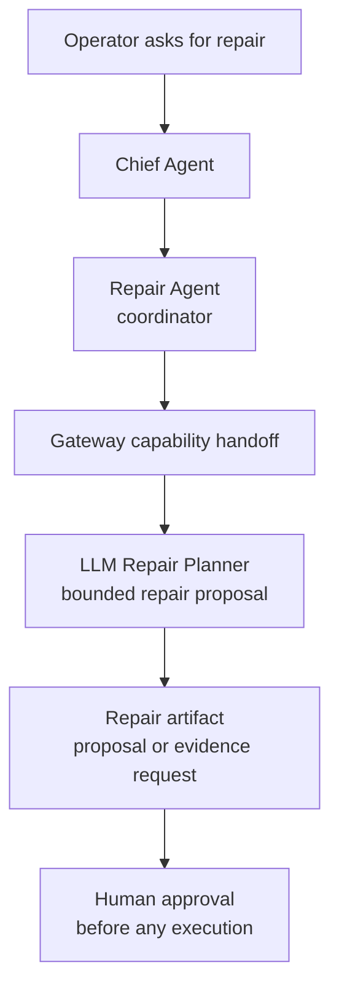

# MissionOS Contracts

MissionOS code should preserve these boundaries.

## CLI

The CLI is an operator surface. It may:

- submit operator instructions to the Gateway
- record approval or rejection intent through Gateway routes
- display task status, timeline events, runtime snapshots, and map artifacts
- send explicit operator-approved recovery commands

The CLI must not:

- turn an AI proposal into dispatch authority
- infer delivery completion from ACK alone
- hide missing runtime evidence behind successful command output

## Gateway

The Gateway is the network boundary. It may expose routes for:

- conversation and planning
- operator approval
- execution request creation
- task lookup and timeline lookup
- recovery dispatch
- map and status surfaces

The Gateway must preserve task records and timeline events as auditable
evidence. It should fail closed when required approval, dispatch, or runtime
evidence is missing.

## Core

Core packages own shared schemas and claim semantics. They should not import CLI,
Gateway server internals, simulator runtimes, or hardware adapters.

## SITL And Runtime Adapters

Runtime adapters are opt-in execution boundaries. They may produce runtime
evidence, but they must not rewrite prior proposal or approval facts.

## Runtime Recovery Maneuvers

The runtime recovery agent may propose these bounded actions:

- `continue`
- `hold`
- `return_to_launch`
- `land`
- `adjust_altitude`
- `adjust_speed`
- `reroute`
- `avoid_obstacle`
- `operator_review`

`adjust_altitude`, `adjust_speed`, `reroute`, and `avoid_obstacle` require
bounded numeric parameters in the proposal and in the operator-approved request.
The Gateway validates those parameters before queueing a request to the active
AUTO runner. Without an active runner, only the emergency LAND/RTL path may use
the direct emergency dispatcher.

Operator natural-language recovery requests, such as asking to climb or reroute
from `missionos chat`, are proposal requests only. They may ask the Runtime
Recovery Agent planner for bounded parameters, but they must not approve,
dispatch, execute, verify, or count progress. The resulting command still goes
through the standard operator confirmation and Gateway recovery-dispatch route.

Obstacle and building handling must remain source-backed. `avoid_obstacle` may
pass the recovery guardrail only when telemetry includes obstacle or building
risk evidence, and a Gazebo obstacle model is not claimed unless runtime
evidence explicitly shows that such a model was spawned or observed. The AUTO
runtime probe may materialize source-backed obstacles as static Gazebo box
models through `/world/default/create`, but `gazebo_obstacle_model_spawned=true`
requires pose readback from `/world/default/pose/info`; a service request alone
is not enough to claim the model exists.

## Repair Planning

The Repair Agent is a post-block, post-run, or next-run planning coordinator. It
is not the in-flight recovery controller. When a mission is blocked, fails
verification, or ends with incomplete evidence, it may ask the Gateway-owned
`llm_repair_planning` capability for a bounded repair proposal or an
evidence-collection step.

Repair planning may consider source-bound mission evidence such as weather,
battery, payload, speed, altitude, route progress, verifier findings, and
blocking reasons. It must not approve, dispatch, execute, alter a live vehicle,
claim progress, or claim delivery completion. Any proposed change to payload,
speed, altitude, route, retry conditions, or evidence collection still requires
the normal human approval and execution boundaries.

