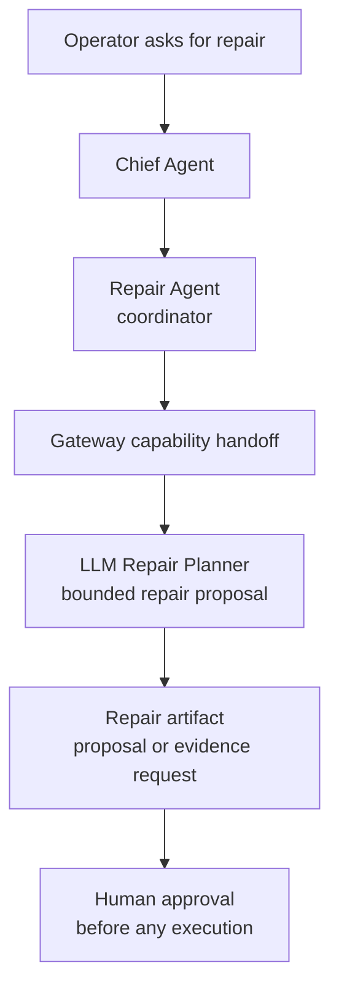

# MissionOS Contracts

MissionOS code should preserve these boundaries.

## CLI

The CLI is an operator surface. It may:

- submit operator instructions to the Gateway
- record approval or rejection intent through Gateway routes
- display task status, timeline events, runtime snapshots, and map artifacts
- send explicit operator-approved recovery commands

The CLI must not:

- turn an AI proposal into dispatch authority
- infer delivery completion from ACK alone
- hide missing runtime evidence behind successful command output

## Gateway

The Gateway is the network boundary. It may expose routes for:

- conversation and planning
- operator approval
- execution request creation
- task lookup and timeline lookup
- recovery dispatch
- map and status surfaces

The Gateway must preserve task records and timeline events as auditable
evidence. It should fail closed when required approval, dispatch, or runtime
evidence is missing.

## Core

Core packages own shared schemas and claim semantics. They should not import CLI,
Gateway server internals, simulator runtimes, or hardware adapters.

## SITL And Runtime Adapters

Runtime adapters are opt-in execution boundaries. They may produce runtime
evidence, but they must not rewrite prior proposal or approval facts.

## Hardware Adapter Contract

The Real Hardware Bridge v1 starts with hardware-adapter evidence contracts in
`src/runtime/hardware_adapter_contract.py`, a projection from the existing PX4
bench arm/disarm executor, and a bounded ROS2/Nav2 ground-robot adapter wrapper
and Unitree SDK2/MuJoCo adapter wrapper around injected client boundaries. It is
not a field robot, drone, MAVSDK, or outdoor integration.

`HardwareAdapter` is a structural protocol for future adapters. The current
runtime implementation is the existing PX4 props-removed bench executor plus
adapter artifacts plus Nav2 and Unitree client-wrapper slices, not a standalone
fake adapter route.

Hardware adapters must separate:

- capability declaration
- preflight
- dispatch candidate
- operator approval
- dispatch request
- ACK
- progress observation
- completion claim
- completion scope
- physical execution
- safe stop or abort

The contract tests prove that invalid evidence is rejected and that the existing
PX4 bench executor writes structured adapter artifacts for blocked preflight and
for executed arm/disarm results. Executed loopback results write
`missionos_hardware_adapter_evidence` after command send, ACK, and state
readback. Loopback execution remains `physical_execution_invoked=false`; real
serial bench execution remains opt-in and separate from flight or delivery
completion.

The ROS2/Nav2 ground-robot slice can call a supplied `Nav2DispatchClient` after
preflight and approval, but it does not import ROS2 and does not claim physical
execution. The TurtleBot4 simulator bridge may cross an opt-in external ROS2
command boundary and send a bounded Nav2 `NavigateToPose` action goal, but it
can claim only simulator completion and must reject physical-execution or
MissionOS-generated raw velocity/topic-command claims. Diagnostic simulator
shims must be reported separately and cannot satisfy completion without Nav2
success plus odometry motion. The Unitree SDK2/MuJoCo slice can call a supplied `UnitreeSimClient`
after preflight, approval, and opt-in, but it does not import Unitree SDK2,
start MuJoCo, issue raw motor or velocity commands, invoke special motions, or
claim physical execution. Sim completion uses `completion_scope=sim_action`,
not `adapter_action`.

A real ROS2 client wrapper, real Unitree runner, PX4/MAVSDK, cage, or field
adapter must preserve the same claim boundaries and add its own runtime smoke
before it touches any live controller.

## Runtime Recovery Maneuvers

The runtime recovery agent may propose these bounded actions:

- `continue`
- `hold`
- `return_to_launch`
- `land`
- `adjust_altitude`
- `adjust_speed`
- `reroute`
- `avoid_obstacle`
- `operator_review`

`adjust_altitude`, `adjust_speed`, `reroute`, and `avoid_obstacle` require
bounded numeric parameters in the proposal and in the operator-approved request.
The Gateway validates those parameters before queueing a request to the active
AUTO runner. Without an active runner, only the emergency LAND/RTL path may use
the direct emergency dispatcher.

Operator natural-language recovery requests, such as asking to climb or reroute
from `missionos chat`, are proposal requests only. They may ask the Runtime
Recovery Agent planner for bounded parameters, but the result must then pass
through the shared Mission Incident Workflow: Recovery judgment, source Rules
feasibility, Mission Assurance judgment, and checkpoint resolution. Only an
accepted action-aligned result creates a v4 durable proposal for standard
operator confirmation. A Mission Assurance `hold`, `continue`, or
`operator_escalation` result creates no dispatch candidate. Neither path may
approve, dispatch, execute, verify, or count progress.

After explicit operator confirmation, the Gateway does not resume or rerun the
Recovery and Mission Assurance judgment nodes. It starts the linked Mission
Incident continuation Workflow, validates the frozen v4 graph binding, and
records dispatch-time Rules revalidation, the executor boundary, verifier
output, and the next-observation attempt as separate facts. An unchanged
telemetry cursor is not a new MissionSituation. Missing or changed graph
bindings and failed revalidation stop before the executor.

Obstacle and building handling must remain source-backed. `avoid_obstacle` may
pass the recovery guardrail only when telemetry includes obstacle or building
risk evidence, and a Gazebo obstacle model is not claimed unless runtime
evidence explicitly shows that such a model was spawned or observed. The AUTO
runtime probe may materialize source-backed obstacles as static Gazebo box
models through `/world/default/create`, but `gazebo_obstacle_model_spawned=true`
requires pose readback from `/world/default/pose/info`; a service request alone
is not enough to claim the model exists.

For an immediate local route conflict, the deterministic safety layer first
queues the preauthorized `safety_hold`. The hosted Runtime Recovery Agent is
not invoked until two fresh telemetry snapshots confirm that HOLD. A proposal
then remains immutable while human approval is pending, and an unchanged
`decision_signature` must not trigger another hosted-model call. A material
change may create a new decision epoch, but it invalidates the old proposal and
requires a new checkpoint and approval.

The active PX4/Gazebo decision signature is
`missionos_runtime_recovery_decision_signature.v2`. The legacy thresholded
signature is preserved beside it for shadow comparison, but is deliberately
not nested inside the active v2 hash. The active signature combines stable
categorical facts (for example navigation/recovery state and obstacle risk)
with a versioned semantic numeric state machine for wind, cross-track error,
terrain margin, battery return margin, progress stall, and telemetry
staleness. This separation prevents transient v1 threshold jitter from
reopening a hosted-model decision epoch. Bands are relative to the active
policy limits rather than absolute vehicle-specific numbers.
Every band transition uses asymmetric hysteresis and requires two observations
separated by at least one telemetry bucket; severity jumps do not bypass this
debounce. A sufficiently large worsening slope within an unchanged band can
still open an epoch when the aggregate window shows a near-limit risk or an
urgent (`within_30s` or `within_10s`) time to the policy limit. Progress stall
and telemetry staleness use persistence bands instead of slope so that a short
pause or one-sample dropout does not churn the signature. One observation
window may change several dimensions, but it creates at most one decision epoch
and one hosted-model invocation. The audit payload records the changed
dimensions, old/new bands, trend, persistence, and time-to-limit estimate when
available. Only a confirmed worsening band, a qualifying within-band trend, or
worsening persistence after the risk is at the limit opens a new hosted-model
epoch. Improvements are saved as evidence and adopted as the next baseline
without another call. Historical stale samples remain auditable, but do not
represent current telemetry loss after the latest sample is fresh.

The live bridge retains a bounded set of v2 signatures already judged for the
task. If an identical semantic/categorical decision recurs, it reuses that
judgment instead of calling the hosted model again. A failed operator-approved
dispatch is the exception because it adds new executor evidence. Polls that are
only waiting for cadence or approval never replace the last judged baseline.

`missionos_runtime_recovery_semantic_numeric_state.v1` and
`missionos_runtime_recovery_semantic_numeric_delta.v1` are observation
artifacts only. They must keep `proposal_created`, `approval_created`,
`dispatch_authority_created`, `progress_counted`, and `completion_claimed`
false. A semantic delta discovered while approval is pending or Recovery is in
progress is retained for audit but must not mint another proposal or authority.
The legacy and semantic signatures are emitted together during the migration;
`signature_shadow_comparison.semantic_only_material_change=true` identifies a
new epoch that the old threshold-only signature would have missed.

Terrain clearance inside an explicitly accepted grace envelope is not by
itself a model-call trigger: only entry into the lower half of that envelope is
the `terrain_clearance_near_minimum` soft signal. The semantic numeric state
therefore measures the fraction of the accepted grace consumed when a
source-backed grace is present; it does not reinterpret a small negative margin
against the nominal target as a limit breach. While a matching local-avoid
proposal is held for approval, a transient telemetry gap blocks dispatch-time
freshness verification but does not replace the immutable proposal. A verified
successful Recovery also suppresses a second HOLD for the same still-visible
obstacle; a materially new observation is required for another decision epoch.

New PX4 Recovery proposals use the intent/compiler/verifier contract in
`docs/agents/recovery-intent-compiler-verifier.md`. The hosted judgment,
meaning-preserving compilation, conservative reachability support, human
approval, dispatch-time revalidation, executor effect, and outcome verification
are separate artifacts. None may be inferred from the existence of another.

Every generated proposal records `missionos_runtime_recovery_proposal_origin.v1`.
Hosted judgments preserve provider, model, invocation kind, prompt/response
hashes, FunctionTool-call hash, and guarded FunctionTool-result hash without
storing prompt or response text. When ADK ends the turn with
`function_tool_result_skip_summarization`, the recorded hosted tool call is the
LLM judgment and the guarded tool result is its deterministic compilation; the
absence of a redundant final JSON message is not a fallback condition.
Deterministic fallback and deterministic recompilation use distinct
`origin_kind` values. The origin hash is revalidated before dispatch authority
is minted and is copied through the active-runner request, dispatch receipt,
attempt evidence, and final run artifact. Missing legacy provenance is
observable; a present but mismatched hash is fail-closed.

The AUTO runtime monitor is a Phase 3 observation summary, not the final
completion authority. Its expected Phase 4/5/6 pending reasons are resolved by
the separately named waypoint, dropoff, payload-release, and SITL-delivery
gates. `final_verification_chain` records that relationship. Authorized
Recovery transitions are not mode loss only when the telemetry sample binds
AUTO.LOITER to `preauthorized_safety_hold` or OFFBOARD to
`approved_bounded_recovery`; an unbound non-AUTO state remains a guard failure.

## Repair Planning

The Repair Agent is a post-block, post-run, or next-run planning coordinator. It
is not the in-flight recovery controller. When a mission is blocked, fails
verification, or ends with incomplete evidence, it may ask the Gateway-owned
`llm_repair_planning` capability for a bounded repair proposal or an
evidence-collection step.

Repair planning may consider source-bound mission evidence such as weather,
battery, payload, speed, altitude, route progress, verifier findings, and
blocking reasons. It must not approve, dispatch, execute, alter a live vehicle,
claim progress, or claim delivery completion. Any proposed change to payload,
speed, altitude, route, retry conditions, or evidence collection still requires
the normal human approval and execution boundaries.

```mermaid
flowchart TD
    O["Operator asks for repair"] --> C["Chief Agent"]
    C --> R["Repair Agent<br/>coordinator"]
    R --> G["Gateway capability handoff"]
    G --> L["LLM Repair Planner<br/>bounded repair proposal"]
    L --> A["Repair artifact<br/>proposal or evidence request"]
    A --> H["Human approval<br/>before any execution"]
```
