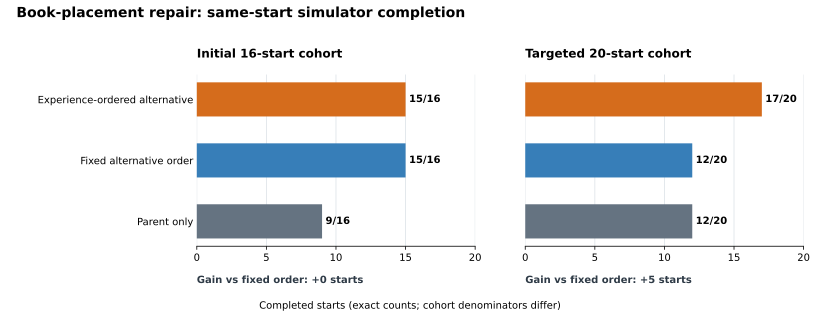

# Experience-Ordered Repair Trials: Public Research Report

15 September 2026. This report asks whether MissionOS can accumulate measured outcomes for saved repair programs and use that experience to recover more book-placement failures under the same bounded trial budget. In a **targeted, previously untested 20-start simulator cohort**, the parent and a pre-fixed alternative order each completed **12/20** starts; experience-ordered trials completed **17/20**, adding five recoveries without losing a parent success. In an earlier 16-start cohort, experience order and fixed order both completed **15/16**. The observed benefit is specific to the targeted cohort and comparator; it is not an estimate of performance on a random placement distribution.

## Task, outcome, and evidence boundary

The task is one book-placement failure class in a resettable CPU robotics simulator. Each trial began from the same saved foundation-policy action prefix and used registered repair programs. These experiments did not run new foundation-policy inference, GPU computation, paid calls, production deployment, or a physical robot.

A start counted as complete only when the book was supported, inside the receptacle, upright and slow, the robot contact was resolved, a stable hold was observed, and protected objects and previously achieved state remained intact. An unknown outcome or loss of protection was recorded separately rather than counted as a favorable result. **This MissionOS stable-placement outcome is distinct from the simulator's official task judgment.** The counts below do not establish official benchmark success, physical success, or transfer to other tasks.

The start set, extraction rule, parent and comparator programs, one-alternative budget, per-program execution limits, terminal conditions, and adoption gates were fixed before the outcomes of each cohort were observed. The outcome or successful program for an evaluation start was not included in the experience used to order that start's trials. Direct same-start simulator execution and Verifier outcomes, rather than a program's name or a language-model explanation, determined whether a proposed repair worked.

## Why the static selector was not adopted

The earlier design learned static conditions from past successful programs and retained the complete parent program as a fallback. It improved development-set totals, but each frozen comparison either lost a prior success or failed to add a recovery on its unused starts. No candidate met the preservation gate.

| Frozen comparison | Development starts: parent → candidate | Unused starts: parent → candidate | Decision-relevant loss |
| --- | ---: | ---: | --- |
| Static selector 1 | 101 → 107 / 116 | 11 → 11 / 16 | Three older-version-only successes lost; rejected |
| Static selector 2 | 112 → 121 / 132 | 8 → 8 / 16 | One new recovery, one parent regression, and one older-version-only regression; rejected |
| Static selector 3 | 120 → 131 / 148 | 11 → 9 / 16 | Two parent successes and one older-version-only success lost; rejected |

For two nearby starts, the same saved program succeeded on one and failed on the other. A direct replay of that program matched the composite candidate's requested action sequence and terminal outcome on both starts. This attribution check supports start-dependent program effects in those two cases; it does not establish that every static-selector failure had the same cause.

## What experience changes

The revised mechanism uses past measured success to choose **which saved program to trial first**, within an authorized resettable-simulator budget. The proposed order places the current parent program first. If the parent fails, registered alternatives are ranked by proximity between normalized, unit-aware entry observations and previous **measured-success** starts; the simulator runner trials at most one alternative. Prior failures and untried programs are not treated as successes. The alternative is recorded as successful for that start only after direct execution and a start-matched Verifier outcome confirm completion and preservation. Added recoveries in the targeted cohort were independently rechecked with another execution of the selected program from the same start.

No per-evaluation-case correction code or manually edited selector conditions were introduced. The measured improvement concerns the **selection and reuse of existing physical repair programs**; it does not show autonomous invention of a new physical action.

## Frozen simulator comparisons



*Figure 1. Exact completed-start counts are shown as numerator/denominator. Each panel has its own cohort denominator; the bars share a count axis and must not be pooled into a single success rate. The initial cohort shows no experience-specific gain over fixed order. The targeted cohort shows five additional completions over the pre-fixed order. These are deliberately selected simulator starts, so no sampling error bars or population-level inference are implied.*

| Pre-frozen cohort | Parent only | Fixed order, one alternative | Experience order, one alternative | Experience-only gains vs fixed | Fixed-only gains vs experience | Unknown / protection losses |
| --- | ---: | ---: | ---: | ---: | ---: | ---: |
| Initial 16 starts | 9/16 | 15/16 | 15/16 | 0 | 0 | 0 / 0 |
| Targeted 20 starts | 12/20 | 12/20 | **17/20** | **5** | **0** | **0 / 0** |

The first cohort demonstrates that bounded direct trials can recover starts the parent does not complete: both alternative orders reached 15/16 from a 9/16 parent baseline. It provides **zero evidence of an advantage for experience order over this fixed order**. The experiment used 30 actual Backend runs and 4,196 controls.

The targeted cohort was constructed from **all five** development starts, among 148 development records, where the parent and the fixed order's first alternative failed but another saved program had succeeded. The construction also included the nearest development parent-success control for each center. Each center and control was given two pre-fixed ±0.04 mm world x/y perturbations, yielding 20 starts whose outcomes were not used for ranking. This is a targeted near-neighbor test of a known fixed-order weakness, not a random or broad holdout sample.

Under the same parent-first and one-alternative limit, experience order recovered five starts that both the parent and fixed order failed. It retained all 12 parent successes, with three starts unresolved under both alternative orders. The five added recoveries include independent same-start replays of the selected saved programs. Across the targeted comparison, unknown outcomes, protected-object losses, and previously achieved-state losses were zero. The experiment used **41 actual CPU Backend runs and 6,835 controls**. These counts measure an advantage over the particular pre-fixed order under a one-alternative budget. Other fixed orders or larger trial budgets were not compared.

## Interpretation and limits

The targeted result demonstrates a concrete, bounded use of accumulated experience: measured outcomes changed the trial order, and that changed five terminal outcomes relative to the pre-fixed comparator on the selected starts. The initial cohort is equally important: there, the same experience-order mechanism added no completion over fixed order. The two cohorts were constructed differently, have different denominators, and should remain separate.

The targeted starts are near development cases already known to expose the fixed order's weakness. The experiment therefore does not estimate a general robotics success rate, show that experience ordering dominates every no-experience order, or establish statistical generalization. Replaying a simulator start requires a reset contract; matching observation facts or their digest alone does not prove equality of every hidden simulator variable. The private raw episodes, reset configuration, saved action prefix, and simulator runner are not part of this public repository, so the full simulator comparison cannot be reproduced from the public fixture.

The public [`empirical_repair_trials.py`](../../src/runtime/empirical_repair_trials.py) module proposes bounded trial orders and adjudicates start-matched Verifier receipts. It does not grant approval, relax Rules, dispatch commands, execute repairs, run a Backend, or replace final verification. The extracted public planner and adjudicator matched the qualified implementation's trial proposals and receipt decisions on all 20 fixed targeted starts. The opt-in public fixture exercises the affected production boundary:

```sh
PYTHONPATH=.:packages/missionos-core/src python -m scripts.smoke_empirical_repair_trials
```

This smoke verifies a failed parent followed by a directly confirmed saved-program recovery, retention of a successful parent, and a hold when entry observations are missing. **Fixture receipts do not reproduce the 20-start simulator outcomes.** The report preserves that distinction between public runtime-contract verification and the separate private simulator qualification.
