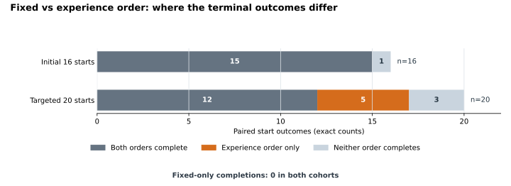

# Experience-Ordered Repair Trials for Book Placement: Research, Implementation, and Verification Report

**Scope:** One resettable CPU robotics-simulator failure class for stable book placement.

**Experiment date:** 15 September 2026. Static-selector and route-attribution comparisons preceded the two direct-trial cohorts.

**Public implementation evaluated:** [`empirical_repair_trials.py`](../../src/runtime/empirical_repair_trials.py), SHA-256 `12e46b2419107417fe9d7e6410badf1d23279bfda855724dbd39e5133d28b8a3`.

**Work performed for this report:** Reconciliation of saved aggregate results, publication-safe extraction of numerical analysis data, and regeneration of the figures. No new model calls, simulator trials, GPU use, or physical execution were performed for this report revision.

## Abstract

MissionOS had saved several complete repair programs from earlier book-placement work. The research question here is whether measured successes and failures can improve **which program is tried at a new start**, without assigning the result of a previous start to the new one. An earlier static selector fit past measurements but lost prior successes in three frozen unused-state comparisons. That failure motivated a bounded, resettable-simulator design: trial the complete parent first, then, if it fails, use nearby measured-success experience to order at most one registered alternative. A direct same-start Verifier result, not proximity alone, determines the result.

The first pre-frozen 16-start cohort completed **9/16** under the parent, **15/16** under a pre-fixed alternative order, and **15/16** under experience order. Experience contributed **zero additional completions over that fixed order**. A second, targeted 20-start cohort was constructed near development cases known to expose the fixed order's weakness, without using the 20 starts' outcomes in ordering. There, the parent and fixed order each completed **12/20**; experience order completed **17/20**. Five starts completed only under experience order, none completed only under fixed order, and all 12 parent successes were retained. The five added successes include independent same-start replays of the selected saved programs. Unknown outcomes and protection losses were zero in both cohorts.

The demonstrated contribution is a **measured, bounded improvement in selecting and reusing existing repair programs on targeted nearby simulator starts**. It is not autonomous generation of a new physical action, a random-distribution success estimate, an official benchmark result, a physical-robot result, or a claim that this order beats every other possible fixed order.

## 1. Research Questions and Evaluation Target

### 1.1 The problem

A saved program that succeeded once is not automatically a successful repair for a nearby start. A static learned route can select the wrong program and erase a success preserved by an older version. Conversely, a resettable simulator can test a bounded set of alternatives directly from the same entry state. Past experience can then be used to spend that limited trial budget on a more promising program without pretending that a prior episode proves the new result.

The evaluation target is the following causal and authority chain:

```text
Measure entry facts and bind the saved start
→ Retrieve verified outcomes for registered parent and alternatives
→ Propose parent-first order within a finite alternative budget
→ Restore the same simulator start for each permitted trial
→ Research runner executes the registered program within the trial budget
→ Verifier checks completion, protected objects, and achieved state
→ Record direct results, replay added successes, and compare frozen cohorts
→ Propose a program; later governed use requires separate approval and Rules
```

The public module implements trial planning and receipt adjudication. The separate research runner performed the simulator trials. The module does not contain that runner or an authority switch.

### 1.2 Questions and evidence

| ID | Question | Main check | Result in the reviewed records |
| --- | --- | --- | --- |
| RQ1 | Did a static selector preserve earlier capabilities on unused starts? | Parent, candidate, and older-version-only successes in three frozen comparisons | No; all three candidates failed the preservation gate |
| RQ2 | Can a finite same-start trial find a verified repair beyond parent-only execution? | Parent-first result, one direct alternative, terminal Verifier outcome | Yes; both alternative orders added six completions in the initial 16-start cohort |
| RQ3 | Does **experience order itself** outperform the particular fixed order at the same trial limit? | Paired terminal outcomes, same start and one alternative | No gain in the initial 16; five experience-only completions in the targeted 20 |
| RQ4 | Are existing successes and protected state retained? | Parent-only controls, losses, unknowns, independent replay | Zero parent-success losses and zero recorded unknown/protection losses in both direct-trial cohorts |
| RQ5 | What is publishable and reproducible? | Reviewed aggregate data, figure-generation code, public fixture, omitted inputs | Figures and interface smoke are reproducible; private simulator episodes and reset inputs are not published |

RQ3 is a comparison with **one preselected alternative**, not with the best possible alternative, every no-experience ordering, or unbounded search. RQ4 concerns these fixed starts and the recorded checks; it is not a blanket safety guarantee.

## 2. Terms, Roles, and Success Standard

| Term | Meaning in this experiment | Important boundary |
| --- | --- | --- |
| Entry start | A saved, restorable simulator state after a foundation-policy action prefix | Equality of exposed facts alone does not prove equality of hidden simulator state |
| Parent | The current complete registered repair program, tried first | A parent success ends the trial; no alternative is needed |
| Saved alternative | One of four earlier registered complete repair programs | The experiment reused programs; it did not synthesize a new action controller |
| Experience | Entry facts plus program-specific measured outcome and provenance | Failures and untried programs cannot witness a success |
| Fixed order | The same preselected saved program as first alternative for every failed-parent start | Only this fixed first choice was tested under the one-alternative budget |
| Experience order | Alternatives ranked by distance to their nearest measured-success entry | Distance proposes an order; it does not certify success |
| Same-start replay | A separate execution of the chosen program from the same restored entry | Confirms the selected result in this simulator; it is not independent task-distribution validation |
| Complete | MissionOS stable-placement conjunction and preservation | Not the simulator's official task judgment |

The stable-placement conjunction required the book to be supported, inside the receptacle, upright and slow, with robot contact resolved and a stable hold observed. Protected objects and previously achieved state also had to remain intact. An unknown or infrastructure-error outcome was not a success. A result that lost protection or achieved state could not be selected as a successful repair.

The official task judgment was not included in the numerator. The report does not silently replace that judgment with the MissionOS conjunction, or infer physical performance from simulator success.

## 3. Research History: From Static Rules to Direct Trials

### 3.1 Static program selection and its adoption gate

The static approach learned conditions for choosing earlier successful programs and retained the complete parent as fallback. In the development result table, the candidate totals were **matrix-fitted expected successes**, using already measured program outcomes. They were not new direct simulator successes by the fitted composite candidate. This distinction explains why an apparently improved development total did not establish transfer.

Each candidate was evaluated on 16 previously unused starts with an explicit preservation gate. Unknown results were kept separate; successes that only an older version had achieved were retained as protected capability. The candidates were rejected when those older successes or parent successes regressed.

### 3.2 Direct route attribution narrowed one cause

In a two-start attribution check, direct execution of the same saved program and execution through the composite candidate matched the **requested action-sequence digest** and terminal outcome at both starts. One start succeeded and one failed. This supports start-dependent effects for that program in those two starts. It does not prove that the static selector was the only cause of all three broader transfer failures.

### 3.3 Using experience to order physical trials

The revised method did not ask a language model to infer that a past success would repeat. It proposed a bounded trial order from recorded success entries and required direct same-start execution. The initial 16-start cohort was a mechanism and preservation check. Its zero advantage over fixed order was retained rather than relabeled as experience-learning success. The later 20-start cohort tested the specific condition under which fixed first choice had failed in development records. The 20-start results were not used to choose their own trial order.

## 4. Architecture and Authority Responsibilities

```mermaid
flowchart LR
    E[Saved entry facts and measured outcomes] --> P[Experience-order planner]
    P --> O[Parent-first bounded trial proposal]
    O --> G[Caller-controlled experiment budget]
    G --> X[Research runner and resettable simulator Backend]
    X --> V[Verifier completion and preservation]
    V --> R[Direct trial receipt and replay]
    R --> A[Adjudication: program proposal or hold]
    A --> U[Future experience update]
```



The planner can order immutable registered program IDs. It cannot approve its proposal or expand the caller's program list, alternate-trial count, fact set, execution limits, or protected conditions. Human-approved scope and Rules remain outside the planner. The private simulator qualification exercised a caller-bounded research runner; it did **not** establish that a full governed operational dispatch path was executed. Research-runner action and Verifier outcome remain separate facts. Receipt adjudication proposes a program only after a directly matched successful trial; it does not dispatch the proposed program for operational use.

This split matters for the result claim. A plan digest, distance rank, or prior successful witness is evidence of **a candidate to test**. A same-start execution and Verifier receipt are evidence of **a simulator outcome**. Neither is authority for physical operation.

## 5. Experience Representation and Trial Ordering

### 5.1 Recorded evidence

The public contract binds an entry fact map to a record ID and one measured arm for each registered program. Every measured arm includes its program ID, episode ID, entry-fact digest, status, and Verifier-owned `complete`, `protected`, and `achieved` values. The planner rejects duplicate records or episodes, mismatched programs or entry digests, missing/nonfinite ranking facts, and invalid scales. Unknown, infrastructure-error, and untried arms cannot act as success witnesses.

These bindings prevent a successful episode for one start or one program from being treated as if it came from another. They are factual checks; they do not teach the planner which physical correction is best.

### 5.2 Actual ranking features and budget

Both direct-trial cohorts registered four saved alternatives and used four entry coordinates: object-in-hand x/y and object-in-receptacle x/y, each in meters. The declared scale for each coordinate was **0.001 m (1 mm)**. For a proposed entry and a prior measured-success entry, ranking used Euclidean distance after dividing each coordinate by its declared scale:

```text
distance = sqrt(sum(((new_fact − success_fact) / 0.001 m)^2))
program score = distance to that program's nearest measured-success entry
```

The current parent was always first. An alternative with no measured-success witness was not ranked as successful. After a failed parent, at most **one** of the four alternatives could be tried. The fixed comparator used one preselected saved program in that same slot. Record IDs and program names did not replace the four physical observations as distance features.

The published interface additionally bounds its general input population to at most 256 experience records, four alternatives, and eight fact scales. Those are defensive interface limits, not evidence that the experiment measured 256 starts, eight features, or four alternative trials per start. At exactly equal distances, the current public implementation uses witness episode IDs and then program IDs for deterministic tie-breaking; tie-dependent behavior was not separately evaluated in the simulator comparisons.

## 6. Execution, Receipt, and Preservation Contracts

A trial plan binds the entry-fact digest, ordered program IDs, and successful witness episode IDs. The research runner restored the simulator entry for each permitted trial. The public adjudicator accepts only an ordered prefix of direct results whose program IDs and entry digest match the plan. A successful parent is retained without running a later alternative. Once any trial has a verified success, an additional trial is invalid.

An unknown direct result returns a hold. So does a result that loses a protected object or previously achieved state. A failed parent with an unexecuted planned alternative remains pending; all executed trials without success return `no_verified_recovery`. A directly successful arm returns a **program proposal** identified by its direct episode. Normal MissionOS authorization and final verification are still required before later action.

The evaluation's preservation gate required zero lost parent successes, zero unknown results, zero protected/achieved losses, and an independently replayed alternative for any added success. The targeted cohort additionally required at least one extra recovery against both parent and the fixed first alternative. These conditions were set before the respective trial outcomes, and were not relaxed after observing failures.

## 7. Frozen Cohort Construction and Trial Limits

The two direct-trial cohorts share the 148-record development matrix, four registered alternatives, parent-first order, four fact scales, one alternative after a failed parent, and the MissionOS stable-placement and preservation conditions. Their **start-selection rules differ**, so the two denominators must not be pooled.

| Item | Initial 16 starts | Targeted 20 starts |
| --- | --- | --- |
| Development centers | Four selected across saved prefixes: parent failure, at least one alternative success, maximum entry-receptacle x/y distance to a nearby parent-success development start | **All five** development starts where parent and pre-fixed first alternative failed but another saved program had succeeded |
| Controls | Nearest development parent-success control for each center | Nearest development parent-success control for each of the five centers |
| Entry construction | Two fixed ±0.04 mm world x/y perturbations per center and control | Two fixed ±0.04 mm world x/y perturbations per center and control |
| Unused evaluation starts | 16 | 20 |
| Alternative budget per failed parent | One | One |
| New Backend-arm cap | 64 | 80 |
| Per-arm cap | 300 controls and 20 tool calls | 300 controls and 20 tool calls |
| New foundation-policy inference / GPU / paid calls | None / none / zero | None / none / zero |

The 0.04 mm perturbation is applied around each chosen center or control. It does not mean the centers and their controls were only 0.04 mm apart. The development record determined the centers and controls; no evaluation-start terminal result was used to select or rank its own start. The targeted rule deliberately focuses on a failure family with a known weakness in the particular fixed order. That is a legitimate targeted mechanism test, but not a random holdout or an unbiased placement benchmark.

The parent result was shared across comparisons when it succeeded, and an alternative was not run after parent success. Thus the reported **actual Backend-run counts** are not three executions per start. Run counts and total controls are resource observations, not wall-time or efficiency measurements.

## 8. Static-Selector Results and Route Attribution

The following table keeps matrix-fitted development expectations apart from unused simulator completions. Every denominator and loss count comes from the reviewed aggregate data published with this report.

| Frozen static comparison | Development matrix: parent → candidate expected / starts | Unused simulator: parent → candidate / starts | Candidate-only gain | Parent-only loss | Older-version-only loss | Decision |
| --- | ---: | ---: | ---: | ---: | ---: | --- |
| Static 1 | 101 → 107 / 116 | 11 → 11 / 16 | 0 | 0 | 3 | Rejected |
| Static 2 | 112 → 121 / 132 | 8 → 8 / 16 | 1 | 1 | 1 | Rejected |
| Static 3 | 120 → 131 / 148 | 11 → 9 / 16 | 0 | 2 | 1 | Rejected |

Static 2's unchanged **8/16** is not a stable set of eight successes: it gained one start and lost another. Static 1 retained the parent count but erased three successes available only in older versions. Static 3 lost two parent successes. All three unused comparisons reported zero unknown outcomes and zero protected/achieved losses; their negative adoption decision follows from capability regressions, not missing simulator runs or a protected-object incident. They used 52, 60, and 52 recorded Backend runs respectively; those different run counts are not a fair speed comparison.

In the two-start direct attribution check, both requested action sequences and both terminal outcomes matched between direct saved-program execution and the composite candidate. One direct route completed, one did not. This check measured **whether the program's action survived composition** at those starts; it did not identify a universally correct selector condition.

## 9. Direct-Trial Results: Exact and Paired Outcomes

### 9.1 Two frozen cohorts


*Figure 1. Numerator/denominator labels give exact completed-start counts. Panels share a count axis but have different cohort denominators. The 16-start cohort shows no experience-specific gain over the fixed order; the targeted 20-start cohort shows five. No population sampling error bars are drawn because these are deliberately selected simulator starts.*

| Frozen cohort | Parent only | Fixed order, one alternative | Experience order, one alternative | Additional vs parent | Additional vs fixed | Parent-success losses | Unknown / protection losses |
| --- | ---: | ---: | ---: | ---: | ---: | ---: | ---: |
| Initial 16 starts | 9/16 | 15/16 | 15/16 | 6 | **0** | 0 | 0 / 0 |
| Targeted 20 starts | 12/20 | 12/20 | **17/20** | 5 | **5** | 0 | 0 / 0 |

The paired comparison is more informative than subtracting two unpaired totals:



*Figure 2. In the initial 16-start cohort, both orders completed 15 and neither completed one. In the targeted 20-start cohort, both completed 12, only experience order completed five, and neither completed three. Fixed-only completion was zero in both. These categories include parent success where an alternative was unnecessary.*

| Same-start fixed vs experience outcome | Initial 16 | Targeted 20 |
| --- | ---: | ---: |
| Both orders complete | 15 | 12 |
| Experience order alone completes | 0 | **5** |
| Fixed order alone completes | 0 | **0** |
| Neither order completes | 1 | 3 |

The first cohort used **30 actual Backend runs and 4,196 controls**. It confirms that a bounded saved-program trial can recover six parent failures, while showing **no marginal value from experience ordering** relative to this fixed first program.

The targeted cohort used **41 actual CPU Backend runs and 6,835 controls**. Experience order recovered five starts that both the parent and fixed order failed; the 12 parent-success starts were retained and three starts remained unresolved under both orders. Each of the five experience-only completions had a separately recorded same-start replay of its selected saved program. The result file reports zero unknowns, zero protection losses, no parent-success losses, no new foundation-policy inference, no GPU, zero paid calls, and no production deployment. Controls are executed motion steps; they are not model tokens or human approval counts.

### 9.2 Where the targeted gains occurred

The 20 targeted starts were deliberately balanced between perturbations of the five development failure centers and perturbations of their five nearest **development parent-success controls**, with two perturbations per base entry. The controls were parent successes in development; their perturbed evaluation starts were not guaranteed to remain parent successes.

| Targeted construction role | Starts | Parent complete | Fixed complete | Experience complete | Experience-only gain |
| --- | ---: | ---: | ---: | ---: | ---: |
| Failure-center perturbations | 10 | 6 | 6 | 9 | 3 |
| Parent-success-control perturbations | 10 | 6 | 6 | 8 | 2 |
| **Total** | **20** | **12** | **12** | **17** | **5** |

Thus the five gains were not confined to the center entries: three occurred near selected development failures and two near the development parent-success controls after perturbation. This is a within-construction breakdown, not evidence of broad transfer to unrelated book placements. The published JSON preserves these counts without exposing individual case IDs or raw states.

## 10. How Much the Direct Result Establishes

### 10.1 A causal contrast within the selected starts

The fixed and experience orders were frozen before the targeted starts ran. They had the same parent-first order, restored entry, completion condition, and one-alternative limit. For five targeted starts, the terminal result differed in favor of experience order. The relevant system change was **which already registered alternative was selected for the single available trial**. No per-evaluation-case correction code or manually edited branch condition supplied those five results.

The independent replays strengthen the claim that each selected saved program could complete its own restored start in the simulator. They do not prove that the experience rank would work equally well on arbitrary unseen positions, different object geometries, or hardware.

### 10.2 Negative results retained

The initial 16 starts are a direct negative comparator for an experience-specific gain: fixed and experience order were tied at 15/16. The static selector comparisons are negative preservation tests despite favorable matrix-fitted development totals. Three of the targeted 20 starts remained unresolved even with experience ordering. None of these results is discarded to report only the five favorable cases.

### 10.3 Distinct outcomes and authority

The 17/20 number is MissionOS stable placement in a simulator. It is not the official task judgment. The public module can return `proposed`, `pending`, `hold`, or `no_verified_recovery`; `proposed` is not approval, dispatch, action, or physical success. A successful simulator replay is evidence for that registered program at a restored start, not an operational authorization for a robot.

## 11. Resource Accounting and Efficiency Limits

| Reviewed run group | Actual Backend runs | Motion controls | New foundation-policy inference / GPU / paid calls |
| --- | ---: | ---: | --- |
| Static 1 unused comparison | 52 | 8,443 | Not included in the direct-trial cost comparison |
| Static 2 unused comparison | 60 | 8,829 | Not included in the direct-trial cost comparison |
| Static 3 unused comparison | 52 | 6,882 | Not included in the direct-trial cost comparison |
| Two-start route attribution | 2 direct routes | 279 | None / none / zero |
| Initial direct-trial cohort | 30 | 4,196 | None / none / zero |
| Targeted direct-trial cohort | 41 | 6,835 | None / none / zero |

The static rows' run counts and controls come from separate frozen cohorts and stage plans; they are retained as provenance, not normalized into a cross-method efficiency ranking. The reviewed public aggregate does not contain aligned wall times, simulator times per outcome, provider charges for earlier phases, or full action-by-action traces. This report therefore makes **no latency, energy, or cost-per-success superiority claim**. Zero paid calls refers to the two direct-trial cohorts and the route attribution, not a retrospective accounting of every historical development activity.

## 12. Statistical and Applicability Limits

These cohorts are small, intentionally chosen mechanism checks. The 20-start cohort was built from development cases where the parent and fixed first alternative failed but another saved program had succeeded. Nearby perturbed starts and paired parent-success controls probe whether that weakness persists; they do not represent a random draw from all book placements. The initial and targeted cohorts were constructed by different rules and must not be pooled into a single 32/36-style result. No prospective power analysis, random sampling, independent broad seed distribution, or population confidence interval supports a general success-rate claim.

| Factor | Confirmed scope | Unresolved boundary |
| --- | --- | --- |
| Task | One book-placement failure class | Other tasks, object types, and failure families not evaluated |
| Starts | Restored, near-development simulator entries | Unknown broad distribution and hidden-state reset equivalence |
| Alternatives | Four registered programs, one available after parent failure | Other saved-program libraries, different fixed first choices, or two-plus alternatives not compared |
| Ranking features | Four scaled entry x/y facts | Contact, orientation, force, temporal history, and richer condition features not evaluated here |
| Outcome | Stable-placement conjunction plus protected/achieved retention | Official task judgment and physical success not established |
| Replay | Five experience-only wins independently re-executed from the same start | Transfer to different starts and independent simulator implementations unverified |
| Authority | Planner and receipt adjudicator return proposals under existing scope | No autonomous permission expansion or production dispatch demonstrated |
| Efficiency | Recorded Backend runs and controls | Aligned wall time, energy, and cost-per-success not available |
| Publication | Aggregate numbers, public code, figures and fixture | Raw episodes, reset inputs, saved prefix and runner excluded |

Matching observation facts or their digest is a necessary receipt binding in the public interface; it does not by itself prove that every unobserved simulator variable matched. A resettable Backend must supply the stronger same-start execution contract. The result also does not show that experience ordering beats an optimally selected fixed program; only one pre-fixed first alternative was tested.

## 13. Public Artifacts and Figure Reproduction

| Published material | Purpose |
| --- | --- |
| [Reviewed aggregate analysis data](evidence/experience-ordered-repair-analysis-20260915.json) | Static-selector counts, route-attribution summary, direct-trial protocol limits, exact and paired outcomes |
| [Figure-generation code](evidence/plot_experience_ordered_repair.py) | Regenerates Figures 1 and 2 from published aggregate data only |
| [Implementation contract](empirical-repair-trials.md) | Field bindings, interface limits, proposal/receipt semantics and authority split |
| [Short human-facing concept](../concepts/experience-based-repair.md) | Purpose and applicability without implementation detail |
| [Public process smoke](../../scripts/smoke_empirical_repair_trials.py) | Synthetic receipt path through the actual public planner and adjudicator |

The aggregate JSON is a reviewed extraction, not a private task database or a raw experimental log. It omits case identifiers, episode IDs, raw actions, images, credentials, absolute local paths, simulator reset inputs, and the saved foundation-policy prefix. Its protocol SHA-256 fields identify the frozen local result records that were reconciled; **the hashes do not make the omitted inputs available or make the simulator trial independently reproducible**.

To regenerate the figures in an isolated analysis Python environment, install Matplotlib and run:

```sh
python3 -m pip install matplotlib
python3 docs/agents/evidence/plot_experience_ordered_repair.py
python3 -m json.tool docs/agents/evidence/experience-ordered-repair-analysis-20260915.json > /dev/null
```

This command reads only the published aggregate JSON and writes the two SVG figures. It invokes neither a model nor a simulator. The plotting script checks denominator, paired-category, gain and loss consistency before generating the images. For visual inspection it also supports `--preview-dir` to create PNG copies outside the publication assets.

To exercise the public runtime boundary without a simulator:

```sh
PYTHONPATH=.:packages/missionos-core/src python3 -m scripts.smoke_empirical_repair_trials
```

This fixture covers a failed parent followed by a directly confirmed saved-program recovery, retention of a successful parent, and a hold when entry observations are missing. **It does not reproduce the 16- or 20-start simulator outcomes.** Those require private raw episodes, reset configuration, saved prefix, and runner, none of which are in the public repository.

## 14. E2E / Runtime Verification and Claim Layers

For the simulator qualification, saved records report 30 and 41 actual Backend runs for the two direct-trial cohorts, their terminal outcomes, motion controls, unknown/protection counts, and five independent replays in the targeted cohort. This is stronger than fixture-only evidence for the selected simulator starts, but the runner and raw inputs are outside the public checkout. It is not a public, from-scratch simulator reproduction.

For the public implementation, the process smoke exercises the production planner/adjudicator boundary using fixture receipts. The extracted public planner and adjudicator matched the qualified implementation's proposed order and receipt decision on **all 20 targeted starts** in the saved parity check. That parity is an implementation-extraction check; it is not a new physical experiment. Python 3.11 and 3.13 CI checks passed for the source already under public PR review before this report expansion. CI and synthetic receipts do not substitute for the simulator qualification.

Verification of this report addition consists of checking aggregates against saved results, numerical and paired-outcome assertions, figure regeneration and visual inspection, local link checks, public-safety scans, and a rerun of the process smoke. No simulator action, model call, or paid computation was needed to write this report.

## 15. Adoption Decision and Next Research Question

The static selectors were **not adopted** because they lost prior capabilities on frozen unused starts. The initial 16-start direct-trial result passed its parent-preservation mechanism gate but did **not** establish experience-order superiority over the fixed first choice. The targeted 20-start result met its frozen simulator gate: at least one extra recovery against both parent and fixed order, zero parent-success losses, zero unknown/protection losses, and same-start replay of every added alternative win. The public interface is suitable for bounded, opt-in research use; the result does not authorize a robot deployment or a claim of broad task improvement.

The next meaningful test is a **preselected, broader cohort of parent-failed book placements** whose construction is not based on known failure of this fixed first alternative. Hold the registered programs, ranking features, one-alternative limit, parent, official-versus-stable completion distinction, and preservation checks fixed. Compare the experience order with parent-only and more than one predeclared no-experience first choice under identical same-start resets. Retain parent-success controls and all unresolved or regressed starts. If the experience effect disappears, the targeted result remains valid but its operating range is narrow. If it persists without lost success, the evidence for reusable experience-guided selection becomes stronger. This is a proposed protocol, not a completed outcome.

## 16. Conclusion

The research separated three facts that had previously been easy to conflate: matrix-fitted static selection looked favorable on development entries, static candidates nevertheless regressed on unused simulator starts, and directly measured, experience-ordered trials produced **five additional completions over a particular fixed first alternative in a targeted 20-start cohort** while an earlier 16-start cohort showed **no experience-specific gain**. The added wins were from reuse of saved programs and were independently replayed at their restored starts.

The value demonstrated here is a bounded mechanism that **uses accumulated outcome experience to change the next physical trial and verifies its actual simulator result**. Its proven scope is deliberately selected nearby book-placement starts in a resettable simulator, under one alternative after the parent and the MissionOS stable-placement condition. The published planner makes this mechanism reviewable without turning a proposal into approval, execution, or physical proof.
