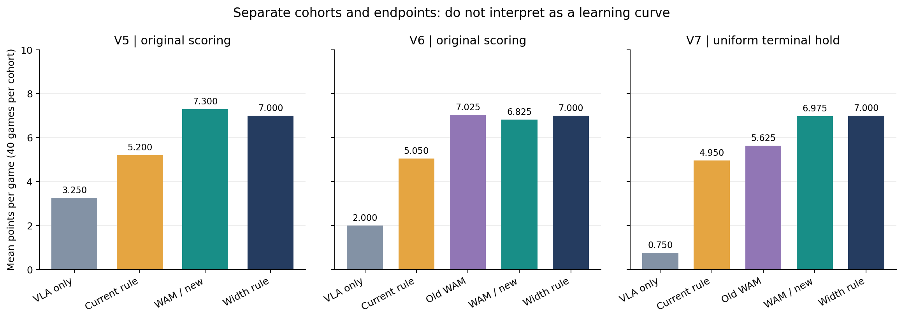
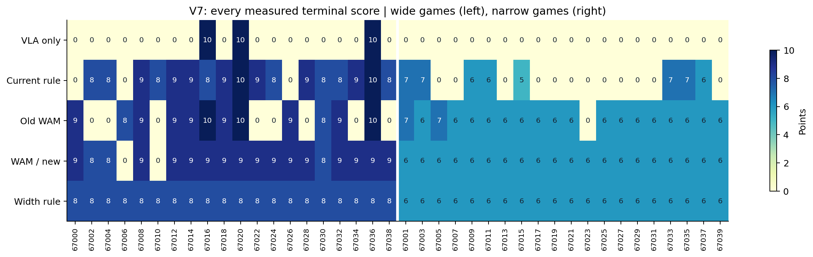
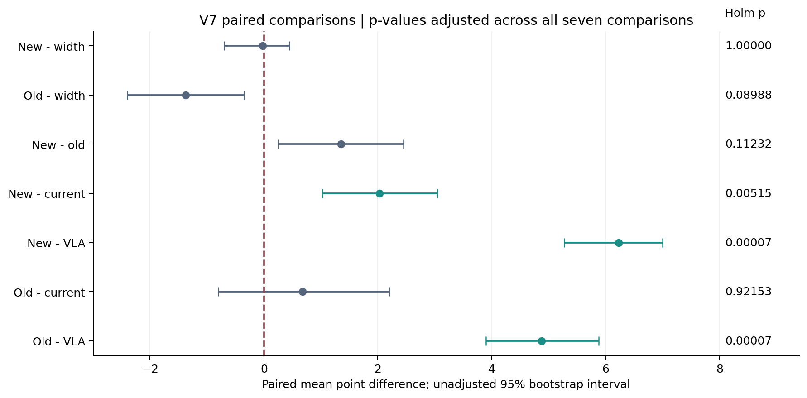
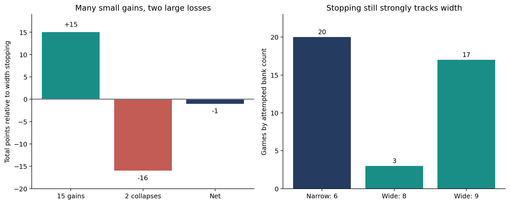
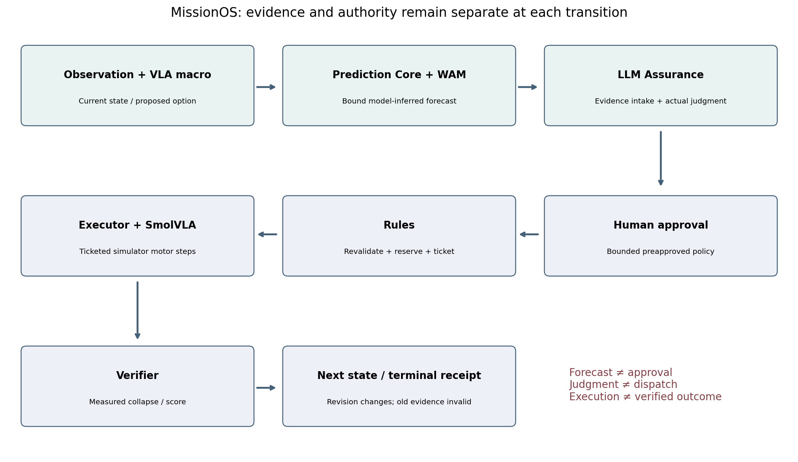
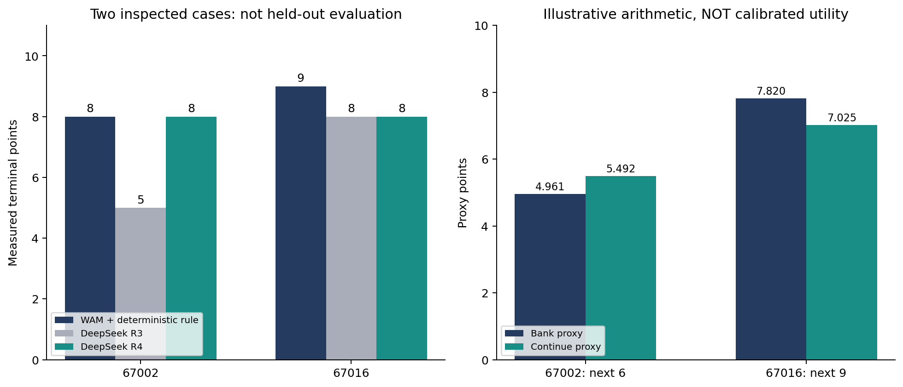

# Mission-Specific World Models in a Governed Robot Control Plane

## From block-stacking prediction to audited MissionOS execution

**Technical report · 19 September 2026 · Research and system integration record**  
**Scope:** PRs [#102](https://github.com/pome223/missionos/pull/102),
[#103](https://github.com/pome223/missionos/pull/103), and
[#104](https://github.com/pome223/missionos/pull/104).  
**Status:** bounded simulator evidence; no hardware validation or claim of general superiority.

## Abstract

We study two distinct questions: whether a lightweight, mission-specific world
model can improve stopping decisions for a learned manipulation policy, and
whether an imperfect forecast can be integrated into a mission control system
without being confused with observation, approval, or execution authority. The
task is a ten-block stacking game: a stable voluntary stop earns the number of
blocks retained; collapse earns zero. Early off-the-shelf video-model diagnostics
did not produce usable object-state predictions in the custom scene. We therefore
trained dedicated state predictors conditioned on a frozen SmolVLA placement
procedure and explicit simulator physical properties.

Three separate forty-game cohorts examine the fixed-count confound, longer
prediction horizons, and terminal-scoring consistency. Under the final uniform
terminal hold, the new WAM earned 279 points, versus 198 for a current-state rule,
30 for unconditional continuation, and 280 for a validation-selected width rule.
The WAM gained one point over width stopping in fifteen games but lost eight in
each of two collapses. Its advantage over the simple width rule was not
established. Prediction and score metrics also reveal false stops, delayed
collapse misses, and disagreement between classification and pose regression.

We then connect the frozen predictor to MissionOS through a mission-bound
Prediction contract, model-inferred Assurance evidence, real LLM judgment,
bounded human preapproval, Rules checks, ticketed execution, and measured
verification. Six known-case deterministic integrations reproduce both successes
and failures. A subsequent DeepSeek E2E demonstration traverses the complete
control path. Clarifying risk semantics and supplying explicit, uncalibrated
score-proxy arithmetic changes one premature stop on two inspected cases,
increasing their combined score from 13 to 16 while remaining below the prior
deterministic WAM reference of 17. This post-hoc result is a diagnostic correction,
not held-out evidence of an LLM or MissionOS performance advantage.

The supported system contribution is an implemented and exercised separation
between fallible predictive evidence and execution authority. The supported
capability finding is bounded utility relative to particular weaker comparators,
with unresolved superiority over simple stopping. Both contributions and their
limits are retained together.

**Keywords:** mission-specific world model; VLA; stopping policy; uncertainty;
Mission Assurance; bounded approval; simulator verification; failure analysis.

## 1. Questions, contributions, and claim structure

A useful world model should predict what happens to the **target objects** after
an operation. A moving gripper, changing background, or visually plausible frame
is insufficient if the blocks themselves remain incorrectly stationary or lose
identity. The first question is therefore operational: does the forecast preserve
object correspondence and anticipate the relevant outcome at the relevant time?

A second question concerns decision value. Correct predictions need not improve a
policy if a simple stopping rule already obtains similar outcomes. Conversely,
a high game score can result from conservative stopping even when the predicted
next-state hazard is wrong. We evaluate score, matched outcomes, same-depth
choices, simple baselines, and horizon-specific prediction errors separately.

A third question concerns system integration. A world-model output cannot safely
serve simultaneously as an observation, a judgment, and permission to move a
robot. MissionOS distinguishes these records and the responsible components.
This report documents an actual simulator path, rather than inferring execution
from the existence of a forecast JSON file or a passing schema test.

The contributions are deliberately scoped:

1. An experimental progression that preserves negative integration results and
   identifies fixed-count and terminal-time confounds.
2. A paired benchmark with explicit object properties, frozen policies, saved-state
   alternatives, and published scores for three independent forty-game cohorts.
3. A common Prediction interface that binds forecasts to the model, policy,
   mission, environment, input schema, and observation without granting authority.
4. Assurance evidence intake and a bounded, actually executed LLM-to-simulator
   receipt chain, including rejection tests and retained failure cases.
5. A diagnosis of risk-to-utility ambiguity and one explicitly post-hoc correction.

No contribution establishes universal physical understanding, hidden-property
inference from images, arbitrary-action dynamics, formal safety, or general
MissionOS performance improvement. This is a technical report, not a claim of
peer-reviewed novelty or a complete public replication package.

## 2. Evidence map and experimental chronology

The series contains different evaluation units. Repeated forecasts of one state
are not independent games; inspected integration seeds are not unused test seeds;
and a counterfactual branch is not another independently sampled mission.

| Stage | Evaluation unit | Principal result | Proper interpretation |
| --- | --- | --- | --- |
| Video-model diagnostics | Small sets of inspected scenes/forecasts | Missed collapse, malformed output, lost object correspondence | Configuration-specific negative evidence |
| Dedicated neural WAM pilot | Five offset games | WAM 12, current rule 11 | One useful intervention; small and intentionally offset |
| Centered evaluation | Ten starts, nine complete comparisons | WAM 72 over complete games; all banked eight | Fixed-count explanation unresolved |
| v4 development | 48 training, 16 validation, 20 test games | WAM 141, width rule 140 on test | Motivates a fresh primary comparison |
| v5 | Forty unused starts, 63000–63039 | WAM 292, width rule 280 | Simple-baseline superiority unestablished |
| v6 | Forty unused starts, 65000–65039 | New 273, old 281, width 280 | Longer target plus reselection; original endpoint |
| v7 | Forty unused starts, 67000–67039 | New 279, old 225, width 280 | Uniform terminal hold; no width-rule superiority |
| Prediction integration | Six already inspected v7 cases | Scores 8, 0, 0, 9, 9, 9 reproduced | Behavioral fidelity, including model errors |
| DeepSeek R3 | Two inspected cases | 5 and 8 | Real governed E2E, premature conservative stopping |
| DeepSeek R4 | Same two inspected cases after correction | 8 and 8 | Known-case decision correction, not generalization |

The chronology is **not a learning curve**. Test starts, model settings, judgment
mechanisms, and in one stage the scoring endpoint change. Cohorts are not pooled
for an overall significance claim. Publication of this report adds figures and
synthesis; it does not create new model inference, training, or simulator trials.

## 3. Task, simulator, and comparison protocol

### 3.1 Score and operational stability

A game allows at most ten placements. Let `b` be the number of retained blocks
when the game ends and `C` its operational collapse event. The score is
`S = b` when `C = false`, and `S = 0` otherwise. Collapse is latched when a
score-bearing block drops more than 30 mm from its accepted reference height.
This operational predicate is useful for reproducible scoring, but is not a
complete mechanical definition of all unsafe states.

In the final v7 protocol, every termination count, including ten completed
placements, receives the same 14.2-second terminal hold. Stability means surviving
this finite interval. It does not guarantee indefinite stability, survival under
external disturbance, or physical-robot safety. Stopping itself can fail: a tower
already moving can collapse during the bank/hold branch.

### 3.2 Physics variation and action scope

Targets share XY, with initial XY variation within ±4 mm. The later experiments
remove the intentional accumulating horizontal offset of the initial pilot.
Each forty-game cohort contains twenty wide and twenty narrow games. Wide block
widths range from 44 to 56 mm; narrow widths range from 24.64 to 31.36 mm. Depth
and height are 40 mm. This deliberate width grouping is a substantial distribution
factor, not merely microscopic variation in otherwise identical cubes.

Individual blocks have masses of 45–95 g and friction coefficients of 0.35–1.1.
Center-of-mass offsets range over ±25% of half-width and ±10% of half-depth and
half-height. Properties are sampled per block and remain fixed during the game.
The model receives them explicitly; the experiment does not ask it to infer
unobservable material properties from appearance.

The actor is a frozen, fine-tuned SmolVLA checkpoint within a staged manipulation
procedure. At 20 Hz, one 284-step continuation includes 60 approach steps,
20 grasp-staging steps, 60 learned lowering steps, 12 learned release steps,
60 withdrawal steps, and 72 settling steps. Shared controllers handle approach
and withdrawal; acquisition is staged. This is not unrestricted autonomous
pick-and-place from arbitrary initial grasps.

The predictor sees the registered VLA/controller macro and current state. The
future closed-loop motor tape is not known in advance and is not retrospectively
inserted into the WAM input. Actual VLA chunks are generated during execution.
Thus the learned dynamics are **policy- and macro-conditioned**, not demonstrated
as a universal model of arbitrary proposed action sequences.

### 3.3 Paired comparisons and baselines

Within a seed, all methods share initial state, physical properties, and the
actual VLA action prefix up to divergent stopping choices. Saved simulator states
allow continue and bank branches to be measured without changing the original
trajectory. Future branch outcomes are labels and audit material, never current
prediction inputs. A successful intervention requires that the chosen bank
actually remains stable; a predicted hazard alone earns no points.

The baselines are unconditional continuation through ten, a current-state rule
(tilt above 5 degrees or horizontal drift above 3 mm), and a validation-selected
width rule (stop at eight for wide games, six for narrow games). Fixed six,
seven, eight, and nine are additional references. The width rule is especially
important because it tests whether coarse task structure explains the gains.

### 3.4 Statistical unit and stopping discipline

Each later cohort contains forty predeclared games and stops at that sample size.
Paired bootstrap confidence intervals use 20,000 resamples preserving width
strata. Two-sided sign-flip tests use 100,000 draws. Multiplicity-adjusted p-values
use each cohort's stated Holm family: three comparisons in v5, four in v6, and
seven in v7. Intervals are unadjusted per comparison. Consequently an interval
excluding zero need not imply rejection after the stated multiplicity correction.

The binary failure event, score, and prediction errors measure different things.
Reached-state confusion counts are conditioned on a policy's decisions: different
policies reach different sample sets. They must not be treated as independent,
identically sampled prediction benchmarks. No trials are added until significance,
and no failed or inconvenient result is replaced by a better-looking seed.

## 4. From video diagnostics to a lightweight mission model

### 4.1 Negative transfer diagnostics

Cosmos Policy produced thirteen input-matched forecasts in the early scripted
scene. All were judged non-collapse; one actual offset placement fell about
81.638 mm. Twelve apparent correct labels therefore matched the trivial
always-safe baseline. Later action contrasts changed the output images, but the
required object falling motion was not reproduced. This distinguishes action
sensitivity from useful object dynamics and does not prove the input was ignored.

RynnVLA-002 experiments encountered orientation and decoding problems. Early
misoriented attempts were excluded. Syntax-constrained generation was a separate
diagnostic, not unmodified model inference; lost object correspondence prevented
reliable physical scoring. ACWM reproduced an official lift example but did not
preserve custom-scene identity. In the five-round game the same invalid first
prediction stopped all WAM rounds, so zero was an integration failure repeated
five times, not five independently detected collapse hazards.

These observations justify investigating a narrower predictor for this scene.
They do not rank model families, establish absent physical understanding, or rule
out a correctly adapted off-the-shelf model. Full historical details and video
qualifications remain in the [initial report](block-stacking-wam-technical-report-20260918.md).

### 4.2 Initial dedicated state model and fixed-count confound

The initial dedicated neural dynamics model had 349,652 parameters. In the
five-game offset pilot, current-state stopping scored 11, fixed-three plus the
shared rule 10, and WAM plus the rule 12. One saved-state release was predicted
to fall approximately 42.2 mm; actual release fell approximately 42.6 mm, while
withholding release preserved one point. This is a concrete useful intervention,
not a population-level estimate.

The subsequent centered test removed forced accumulating offsets. Nine complete
comparisons produced totals of 10 for unconditional continuation, 35 for current
state, and 72 for WAM. One additional start had a placement-readiness failure.
All completed WAM games stopped at eight, and reached decisions matched a fixed-eight
policy. A post-hoc ninth placement was safe despite a warning. The result supports
score protection relative to those baselines, but not state-dependent advantage
over count stopping. Later physical-variation experiments address this confound.

### 4.3 Exact-state ExtraTrees model and longer targets

Later WAMs are ExtraTrees classifiers plus future-pose/drop regressors, not the
initial neural checkpoint. Inputs include ten object poses and velocities,
dimensions, mass, friction, center of mass, accepted positions, robot state,
next target, count, and the registered procedure. Public adapter contracts validate
shape, binding, finite values, allowed options, and forecast horizons.

Training uses 48 games and validation 16, with 834 training and 280 validation
branch samples. The short-horizon model uses minimum leaf size one and threshold
0.2. For the long-horizon model, the same states/actions are replayed with an
additional hold on the prediction-label branch; 21 labels change from safe to
collapsed. Leaf sizes 1, 3, 6 and thresholds 0.1, 0.2, 0.35, 0.5, 0.65, 0.8 are
considered. Selection favors original validation-game score, then long-target
balanced accuracy, then larger leaf size. The selected long model uses leaf size
six and threshold 0.5. This changes horizon, fitted weights, and selected settings;
it is not a one-factor horizon ablation.

| Next block | Training safe / collapse, long target | Validation safe / collapse |
| --- | ---: | ---: |
| 1–5, each | 48 / 0 | 16 / 0 |
| 6 | 46 / 2 | 16 / 0 |
| 7 | 31 / 17 | 11 / 5 |
| 8 | 24 / 9 | 8 / 6 |
| 9 | 19 / 7 | 5 / 3 |
| 10 | 7 / 15 | 0 / 6 |

These are continuation-label counts, not the combined continue-and-bank totals.
The absence of safe tenth-placement validation examples is a plausible coverage
limitation. Its causal contribution to false stops was not experimentally isolated.

The stop rule is `continue_risk >= threshold` and `bank_risk < continue_risk`.
Risk is the positive-class output of a classifier trained with balanced class
weights. It is not established as a calibrated physical collapse probability.
Regression and classification are separate heads and may disagree.

## 5. Quantitative capability results



**Figure 1.** Mean terminal points on independent cohorts, each with forty games.
Axes share the full 0–10 range. v5/v6 use original scoring; v7 uses uniform
terminal hold. Totals should only be compared between methods within a panel.
The three panels must not be interpreted as improvement or degradation over time.

### 5.1 Frozen short-horizon v5

v5 totals are VLA 130, current rule 208, WAM 292, and width rule 280. The primary
WAM-minus-width difference is +0.300 points per game, unadjusted 95% interval
[−0.225, 0.625], Holm p=0.29670. The secondary current-rule difference is +2.100
[1.325, 2.800], p=0.00080; versus VLA it is +4.050 [3.150, 5.000], p=0.00003.
The primary superiority claim is not established.

All twenty narrow WAM games bank six. Wide totals are WAM 172, current rule 174,
width rule 160. Therefore aggregate improvement over current-state stopping is
not sufficient to prove that detailed physical forecasting caused the advantage.
At wide depth ten there are both continued safe and correctly stopped unsafe
cases, but one bank fails through delayed collapse. Mean final-XYZ RMSE is
9.51 mm versus 7.76 mm for a simple planned/current-pose predictor: higher score
does not imply uniformly better future-state regression.

### 5.2 v6 retraining and endpoint audit

On the same new forty games, long-horizon WAM scores 273, old WAM 281, width
rule 280, current rule 202, and VLA 80. New minus width is −0.175 points per game,
interval [−0.825, 0.300], Holm p=0.51918; new minus old is −0.200,
[−0.350, −0.050], p=0.07004. This does not establish a new-model advantage.

The original endpoint contains a mismatch: voluntary banking waits, while ten
completed placements are scored immediately at the placement endpoint. A separate
diagnostic terminal hold changes old WAM's total from 281 to 261; new remains
273 and width remains 280. Seven of eight common-path ten-point games collapse
during this extra wait. The diagnostic is retained separately, not substituted
for the original primary result after seeing it. It motivates v7's prospective
uniform scoring.

### 5.3 v7 uniform terminal stability

| Method | Total points | Mean per game |
| --- | ---: | ---: |
| VLA only | 30 | 0.750 |
| Current-state rule | 198 | 4.950 |
| Old WAM | 225 | 5.625 |
| New WAM | 279 | 6.975 |
| Width rule | 280 | 7.000 |
| Fixed six | 240 | 6.000 |
| Fixed seven | 203 | 5.075 |
| Fixed eight | 160 | 4.000 |
| Fixed nine | 144 | 3.600 |



**Figure 2.** Every v7 terminal score, reordered into wide and narrow groups for
comparison. The color scale is fixed at 0–10 and numeric labels are the recorded
scores. Zero remains zero whether caused by immediate collapse or collapse during
banking. Seed order is explicitly shown. This is not a selected success gallery.



**Figure 3.** Paired v7 mean differences with the originally reported unadjusted
95% intervals and seven-comparison Holm p-values. Green marks adjusted p<0.05.
Neither new-versus-width nor new-versus-old establishes significance under the
stated family, despite a positive new-versus-old point estimate.

New minus current is +2.025 [1.025, 3.050], Holm p=0.00515. New minus VLA is
+6.225 [5.275, 7.000], p=0.00007. New minus width is −0.025 [−0.700, 0.450],
p=1.00000. New minus old is +1.350 [0.250, 2.450], p=0.11232. The 54-point gain
over old WAM is a descriptive improvement whose adjusted test remains unresolved.

The complete recorded v7 audit checks 355 prediction-input hashes, 155 saved-state
placement replays, 4,598 actual VLA chunks, and 315 agreements between forecast
waiting and the corresponding bank branch. Every arm's score is reconstructed
from outcomes. All forty games complete without technical failures. These are
local recorded audits, not independent external replication.

### 5.4 Gains, catastrophic losses, and stopping structure



**Figure 4.** Left: fifteen +1 gains, two −8 losses, and a −1 net difference
against width stopping; twenty-three ties contribute zero. Right: attempted bank
counts, including the two nine-block bank attempts that collapse and score zero.
The strong width/count structure persists despite some state-dependent choices.

New WAM stops all forty games: narrow twenty at six; wide three at eight and
seventeen at nine. Two nine-block banks collapse. It achieves fifteen nine-point
scores and no tens. Narrow totals are WAM 120, width 120, current 51; wide totals
are WAM 159, width 160, current 147. A small number of missed hazards cancels the
reward from many additional placements, but those additional placements alone
do not prove reliable state discrimination.

New reached-state long-target confusion counts are TP 27, FP 13, TN 295, FN 2.
Against the immediate target the same model gives TP 12, FP 28, TN 297, FN 0.
Old reached states give TP 13, FP 18, TN 308, FN 2 on its immediate target; its
long-target diagnostic gives TP 24, FP 7, TN 301, FN 9. The old long-target row
is outside the trained horizon. A placement-then-stop hazard does not prove that
continuing immediately with another placement would also fail.

New long-target maximum-drop MAE is 27.59 mm. Mean final-XYZ RMSE is 13.83 mm
versus 17.81 mm for the planned/current-pose baseline. This reverses the regression
comparison seen in v5, but does not make every classifier warning correct.

### 5.5 Five priority errors and contrasting examples

| Seed | Decision | New continue risk | What actually matters |
| --- | --- | ---: | --- |
| 67006 | Before nine | 0.381 | Below 0.5; later banking collapses; new score 0, width 8 |
| 67010 | Before nine | 0.465 | Below 0.5; later banking collapses; new score 0, width 8 |
| 67016 | Before ten | 0.827 | Matched ten plus hold is safe; new stops at 9 |
| 67020 | Before ten | 0.804 | Matched ten plus hold is safe; new stops at 9 |
| 67036 | Before ten | 0.779 | Matched ten plus hold is safe; new stops at 9 |

One miss lies closer to the threshold than the other; all three safe-ten warnings
are high rather than borderline. This pattern does not isolate calibration,
feature insufficiency, or coverage as the cause. No feature attribution or
training-neighbor causal analysis is claimed.

Seed 67002 is a useful delayed-collapse warning: new risk 0.818 stops at eight;
old risk 0.193 permits nine, followed by collapse during banking. The width rule
also earns eight. Seed 67004 is a score-only counterexample: new WAM stops before
a safe ninth placement and earns eight, while old eventually collapses. New wins
the game even though that immediate warning is a false positive. The hindsight
best observed bank outcomes total 308, but this is an oracle bound on observed
options, not an implementable policy or guaranteed learning opportunity.

## 6. MissionOS Prediction contract and integration fidelity

Prediction Core accepts an observation-bound `PredictionRequest` with registered
options and a `PredictionBinding`. The binding includes model identity/digest,
policy digest, mission contract, environment contract, and input schema. A
`PredictionRegistry` checks these conditions before invoking the mission-specific
predictor. `OptionForecast` carries risk and future state at an explicit horizon.

Core validates identifiers, current observation timing, immutable input binding,
finite values, option membership, and supported horizons. It does not own a
stacking-specific collapse ontology. `bind_prediction_observation` binds matching
outcome references; collapse-to-TP/FP/TN/FN comparison belongs to the stacking
adapter. This separation allows another mission to define its own outcome
semantics without adding stacking assumptions to the common contract.

A lab predictor-unavailable fallback is a session policy, not universal permission
to execute heuristics. The governed Agent path has no silent substitute for
missing LLM judgment. Production freshness also requires execution identity,
revision and provenance, rather than timestamp age alone.

Six inspected cases are chosen to include a useful warning, two misses, and three
safe-ten false stops. The Core/CLI deterministic integration reproduces scores
8, 0, 0, 9, 9, 9 with 59 decisions, 16,756 selected motor steps, and 689 actual
VLA chunks. Input/trajectory agreement is checked at 1e-9 and forecast risk/pose
agreement at 1e-12. Failure fidelity is as important as success fidelity: the
adapter does not silently replace the model or improve its behavior.

The six-case live run was recorded at `ac2db1f`. A later Core/adapter comparison
refactor was checked with 29 tests and the actual HTTP path using a synthetic
predictor; the six cases were not rerun for that refactor. This historical
boundary is explicit. It prevents documentation from claiming live coverage at a
revision that only received boundary tests.

## 7. Assurance, approval, execution, and verification



**Figure 5.** Implemented responsibility chain. The human-approved policy is
provided in advance for the bounded simulator scope; the diagram does not imply
a new human click for every action. Revalidation and a dispatch ticket occur
after each judgment. Only actual measurements produce terminal score evidence.

### 7.1 Evidence intake

Assurance checks captured forecasts against independently supplied current
mission context. Adopted evidence is labeled `model_inferred` and placed in
uncertainty material, separately from observed facts and action feasibility.
Unavailable forecasts, stale observations, model/policy/environment mismatch,
and changed execution revision are rejected. Rejection removes stale prior
forecast material. Adoption means eligibility as judgment material, not proof
that an LLM used it or that an operation is safe.

In the E2E path, the existing `MissionAssuranceAgent` calls the actual configured
LLM. Raw prompt/response hashes and an updated situation digest bind what it
received to the adopted evidence. The LLM proposes `continue`, `hold`, or
`operator_escalation`; parameters remain empty. Continue maps to a registered
placement macro, hold to noncontact bank/hold, and escalation dispatches nothing.
The complete forecast, not just a selected risk scalar, is supplied.

### 7.2 Bounded human preapproval and Rules

The user approves named simulator seeds, frozen model/policy/environment bindings,
registered macros, at most ten decisions per game, and a two-hour expiry.
`individual_action_human_approval=false` records that this is bounded preapproval,
not a fabricated per-action click. The LLM cannot approve that policy.

Rules revalidate the decision digest, policy binding, current observation and
state hash, revision, freshness, macro, expiry, and remaining budget. A durable
reservation precedes the dispatch ticket. Duplicate dispatch, altered state,
approval mismatch, revoked policy, and stale evidence do not obtain authority.
Risk values themselves do not bypass these checks.

### 7.3 Executor and Verifier

The opt-in executor requires a valid ticket before simulation motor calls.
It records action-array hashes, actual VLA RPC identifiers, and invocation timing.
A continuation executes 284 steps; a bank executes 284 hold steps. Tenth-block
completion includes another 284 terminal hold steps in the authorized budget.
No new counterfactual branches are run during these governed games.

The measurement receiver requires the ticket, chosen option, and correct result
ordering. It verifies operational drop/collapse/count/score consistency. An
immediate 14.2-second continuation result is not silently compared with a
28.4-second forecast. Terminal placement plus hold supplies the matching long
horizon. The next decision requires verification of the previous operation;
revision changes invalidate the older context. A `mission_complete` receipt
means the game ended and was scored, including zero-point failure, not generic
mission success.

The implementation is a CLI and loopback simulator composition. It is not the
Gateway deployment path, an authenticated multi-user robot service, or the
separate Recovery continuation graph. Simulation pauses while the LLM thinks;
the 300-second freshness allowance is a lab convention, not a robot-control
latency target. The trusted simulator client is not authenticated physical
telemetry. These are deployment limits, not missing evidence silently filled
by architecture diagrams.

## 8. Actual LLM E2E results and risk-semantics correction

### 8.1 Retained execution history

| Run | Judgment backend | Seeds / scores | Actual judgments | Selected motor steps | VLA chunks |
| --- | --- | --- | ---: | ---: | ---: |
| R1 | Llama 3 | 67002: 0; 67016: 10 | 20 | 5,964 | 260 |
| R2 | Gemma 4 26B | 67002: 8 | 9 | 2,556 | 104 |
| R3 | DeepSeek flash | 67002: 5; 67016: 8 | 15 | 4,260 | 169 |
| R4 | DeepSeek flash, corrected framing | 67002: 8; 67016: 8 | 18 | 5,112 | 208 |

R1 continues in all twenty decisions, including a collapse. R2 is a post-hoc
stop-branch coverage check. At the user's request DeepSeek replaces Gemma for
the final backend; there is no fallback to a local model. The Llama 3 ten-point
completion must not be attributed to DeepSeek. These runs are not a controlled
ranking of LLMs: backends, some adapter revisions, and prompt framing differ.

### 8.2 Was the WAM forecast actually delivered?

Yes, as an audited runtime fact for these calls. Saved API prompts contain the
admitted forecast and the situation identity; response hashes, request bindings,
and raw judgment rationales correspond. DeepSeek explicitly cites forecast
risks. This establishes delivery and reported use in its rationale, not access
to the model's internal reasoning or a causal attribution to every feature.

R3 seed 67002 stops before six with continue risk 0.084593 and bank risk 0.007822.
Its rationale emphasizes the asymmetric loss of the five retained points and
claims stopping maximizes expected points. If those scores are provisionally
substituted for failure probabilities, one additional placement followed by bank
would instead give about 5.492 points versus 4.961 for immediate bank. The WAM
scores are uncalibrated, so these are not established true expectations; however,
the cited risk numbers alone do not support the asserted expected-score ordering.

### 8.3 The correction and its assumptions

R4 keeps the WAM, VLA, physics and seeds fixed. Before Assurance admission, the
stacking mission adds `constraints.stacking_score_comparison`, which is included
in the situation digest. It specifies the classifier score's meaning and gives
provisional arithmetic for count `n`:

`bank_proxy = n × (1 − bank_risk)`  
`continue_proxy = (n + 1) × (1 − continue_risk)`

Continue already refers to placement plus terminal hold, so bank risk is not
applied again. Collapse-to-zero loss is already represented; the prompt prohibits
an unspecified extra loss-aversion penalty under the game's linear point
objective. It asks the LLM to cite both proxy values and identify concrete extra
evidence if choosing against their ordering. It explicitly states that the
numbers are not calibrated expected points or optimal ten-step planning.

The helper returns no recommended option and creates no authority. The actual
LLM still proposes. Nevertheless, this is an intervention on decision framing:
the arithmetic aid and prompt constraints change together. It is not a neutral
measurement of an unchanged judge, and their individual effects are not isolated.



**Figure 6.** Left: measured scores on two already inspected cases, including the
unchanged deterministic WAM reference. Right: illustrative one-placement utility
proxies at the earlier stop states. The right panel is not a probability calibration
plot and must not be read as measured expected return.

### 8.4 Matched results and interpretation

At seed 67002 decision six, DeepSeek R4 cites bank 4.960892 versus continue
5.492440 and chooses continue. The actual placement remains stable. At decision
nine it cites bank 6.654698 versus continue 1.636099 and stops; the final hold
retains eight points. At seed 67016 decision nine it cites bank 7.819628 versus
continue 7.024974 and stops at eight again. The correction does not simply force
more continuation everywhere.

Pre-decision input arrays match R3 exactly through decision six for 67002 and
through nine for 67016. Forecast risks and poses match within 1e-12, and motor
tapes match wherever the prefix decisions agree. The observed decision change
therefore occurs at the same physical state with the same WAM forecast. Remote
LLM variability is uncontrolled, and the prompt is changed after inspecting the
cases. The score increase from 13 to 16 is descriptive, not a statistically
established or held-out improvement. Both games still stop at eight. The total
also remains below deterministic WAM's 17; adding LLM Assurance has not been
shown to improve this benchmark over WAM plus its original stop rule.

R4 verifies eighteen actual DeepSeek calls, 5,112 motor steps, 208 VLA chunks,
and six live pre-motion rejection probes. Both simulator games and both host
services exit zero. API usage is real: 81,279 prompt plus 7,130 completion tokens,
88,409 total. No currency cost is inferred and no cloud GPU is provisioned.
No further prompt iterations or seed searches follow this correction.

## 9. Reproducibility, provenance, and verification tiers

### 9.1 Frozen artifacts and public boundary

| Artifact | SHA-256 |
| --- | --- |
| SmolVLA policy | `254ec40e3be4a44f62073be9cea999ed165ca533d26204beb7f1238890fd38b4` |
| Short-horizon WAM | `3114956c577511c385436f625ecb9936fa98a8c2290fe77b7282f0b1823a7077` |
| Long-horizon WAM | `fac4cf0ea85e1d7eef3a0af361e842b88fbe60148003530ac00c337b4660730b` |
| R3 stacking mission adapter | `48c77e9ebbcbbdf931ce4604d848a17c0ec794608dcdb1ac366ed264cca173dc` |
| R4 stacking mission adapter | `fc302df01264b4dbc4deff058f4fbf0a423a315959adb9a1155417317240b431` |

The local learned-model runtime uses scikit-learn 1.9.1; trusted loading rejects
mismatched model digests or incompatible serialization. Remote DeepSeek weights
cannot be hashed, so the record uses requested/returned `deepseek-flash`, response
identifiers, usage and prompt/response hashes; the model-weight digest is null.
A model name and temperature zero do not guarantee bitwise reproducibility of a
hosted service.

Credentials are supplied only to the authorized host MissionOS process, never
saved in prompt artifacts or forwarded to the VLA/simulator. Raw private records,
weights, local paths, and external simulator packages are not imported into this
repository. Hashes identify audited artifacts; they are not downloadable weights
or a substitute for access to the original evidence.

### 9.2 Verification tiers and commands

There are three separate tiers. Public contract/HTTP/CLI tests verify semantics
with fixtures. Recorded real-model simulator runs verify the actual scoped
execution path. Report-generation checks verify transcription, arithmetic,
links, and figure correspondence. None independently certifies the physics or
establishes hardware safety.

The focused prediction/Assurance boundary suite recorded 68 passing tests for
R4. During merge preparation the full CI exposed an omitted smoke-inventory
registration; the new script and inventory-count expectation were updated.
That packaging correction does not change the model, judgment code, or recorded
R4 adapter hash. Full supported-version CI remains the merge gate; the focused
count is not presented as the repository's total test count.

```bash
PYTHONPATH=packages/missionos-core/src:packages/missionos-cli/src:. \
  python -m pytest -q tests/contract/test_assurance_prediction_evidence.py \
  tests/contract/test_mission_prediction.py tests/e2e/test_mission_prediction_http.py \
  tests/e2e/test_stacking_mission_boundary.py \
  tests/contract/test_missionos_core_action_feasibility.py \
  tests/contract/test_smoke_inventory.py

PYTHONPATH=packages/missionos-core/src:packages/missionos-cli/src:. \
  python scripts/smoke_assurance_prediction_evidence.py
python scripts/check_smoke_inventory.py --pretty
python docs/assets/missionos-wam-20260919/verify_report.py
uv run --no-project --with matplotlib \
  python docs/assets/missionos-wam-20260919/render_figures.py
git diff --check
```

The actual opt-in service and Docker executor invocations, required external
artifacts, exact boundaries, and historical revision coverage are in the
[governed E2E record](stacking-mission-e2e.md). Report publication does not rerun
live models. Standard `runtime_invocation_evidence.v1` records bind actual
subprocesses, exit codes, and output hashes. Their session timestamps include
startup/queued work and are not exact motor-loop latency measurements.

### 9.3 Figure data and media

All six figures have PNG and SVG versions in the
[figure directory](../assets/missionos-wam-20260919/README.md). The reviewed
[figure data](../assets/missionos-wam-20260919/figure-data.json) contains all 120
public cohort score rows, reported v7 interval summaries, and the bounded
DeepSeek comparison. The source renderer uses only this public data and does
not load models or run a simulator. Statistical intervals are transcribed from
the original reports, not silently recomputed with a different method.

Existing [pilot replay](../assets/block-stacking-pilot-20260918/offset-pilot-replay.mp4)
and [centered replay](../assets/block-stacking-20260918/centered-game-replay.mp4)
show historical 0/1/0 and 0/8/9 comparisons respectively. They are **not footage
of v5–v7 or the governed DeepSeek games**. The initial report contains GIF embeds,
playback speed, replay checks, and qualification of their counterfactual branches.
No visually illustrative clip is relabeled as footage of a later experiment.

## 10. Threats to validity and unresolved questions

**Task distribution and information privilege.** Exact simulator state, known
mass/friction/center of mass, staged grasps, and two width groups simplify the
problem. Generalization to noisy observation, unseen materials, a new VLA,
other control macros, hardware, or another mission remains untested. A common
interface is architectural generality, not demonstrated learned-model transfer.

**Policy confounding and simple baselines.** Narrow stopping remains effectively
fixed at six; width-dependent stopping matches aggregate performance. Same-depth
choices do not establish that mass, friction or center-of-mass features are
causally used. No physical-attribute ablation, count-only classifier ablation,
or learned policy-matched baseline establishes necessity of the full WAM.

**Horizon and endpoint sensitivity.** Delayed failure matters, but the long model
also changes training targets, parameters and selected settings. Original and
uniform-terminal scores answer different questions. Even the corrected finite
hold does not establish indefinitely safe banking.

**Prediction and utility mismatch.** Uncalibrated class scores are not empirical
failure frequencies. The R4 proxy is useful for making an assumption visible,
not validating it. Independent calibration, distribution-shift assessment and
uncertainty-sensitive decision utility are not completed. Separate pose and
classifier heads can disagree; correctly routed evidence can still be wrong.

**Selection and sample size.** The forty-game cohorts are fixed and separate,
but development decisions were informed by earlier experiments. The six-case
integration set is selected for known behaviors. Two-seed LLM reruns are explicitly
post-hoc; a three-point gain cannot establish a population effect. Statistical
significance versus a weak comparator does not imply general or practical
superiority over all simple alternatives.

**System and security boundary.** Loopback trusted-client tests and negative
binding probes establish bounded rejection behavior, not a security proof against
hostile telemetry or a compromised simulator. The Gateway, authenticated robot
channels, hardware interlocks, asynchronous world changes during reasoning, and
production monitoring are outside this demonstration. The LLM remains fallible;
Rules constrain authorization and consistency but do not guarantee safe physics.

**Reproducibility access.** Reviewed summaries, score rows, figures, contracts,
and fixture tests are public. Private raw evidence and trusted checkpoints are
not redistributed. Full independent replication would require separately available
model artifacts, simulator setup, training protocol/data, dependency environment,
and hosted-model controls. This report must not claim that publication alone
provides those components.

## 11. Conclusion and stopping point

The experiments show useful but limited predictive stopping behavior in a
well-defined simulated mission. Under uniform scoring the dedicated WAM exceeds
current-state stopping and unconditional continuation on the forty-game cohort,
but does not establish superiority over a validation-selected width rule. Fifteen
small gains are canceled by two large misses, and safe tenth placements remain
unnecessarily rejected. These are central findings, not residual footnotes.

MissionOS then preserves the predictor's behavior through a common contract and
extends it into an actually exercised governed loop. Real DeepSeek judgment,
bounded human preapproval, Rules, ticketed SmolVLA/simulator execution, and measured
verification are all recorded as different events. Correcting risk explanation
changes one known premature stop, while leaving the unresolved calibration and
performance questions visible.

The completed claim is: **VLA proposes motor actions. WAM predicts. LLM Assurance
judges. Humans approve. Rules constrain. Executor acts. Verifier checks.** This
chain has been demonstrated in the specified simulator composition. It is not a
claim that LLM Assurance improves WAM's predictive accuracy or outperforms the
original deterministic stop rule.

The series stops here. New training, calibration, wider cohorts, LLM comparison,
Gateway deployment and physical execution would be separately scoped studies,
not prerequisites retroactively added to this bounded contribution.

## References and detailed appendices

These are primary project records; no external literature survey or novelty
ranking is implied.

1. [Initial block-stacking report](block-stacking-wam-technical-report-20260918.md):
   video-model diagnostics, neural pilot, centered confound, replay details.
2. [Physical-variation follow-up](block-stacking-wam-physics-followup-20260918.md):
   training/settings, all 120 individual score rows, original statistics, v7 errors.
3. [Prediction contract](mission-prediction-contract.md): request/forecast/binding
   semantics and opt-in provider/executor requirements.
4. [Six-case integration verification](mission-prediction-stacking-integration.md):
   retained failures, exact matching, and historical revision coverage.
5. [Assurance evidence contract](assurance-prediction-evidence.md): adoption,
   rejection, independently supplied context, and observation separation.
6. [Governed stacking E2E record](stacking-mission-e2e.md): R1–R4 runtime evidence,
   actual commands, credentials boundary, score correction and limits.
7. [Machine-readable figure data](../assets/missionos-wam-20260919/figure-data.json)
   and [verification script](../assets/missionos-wam-20260919/verify_report.py):
   public transcription and arithmetic reproducibility, without live inference.
