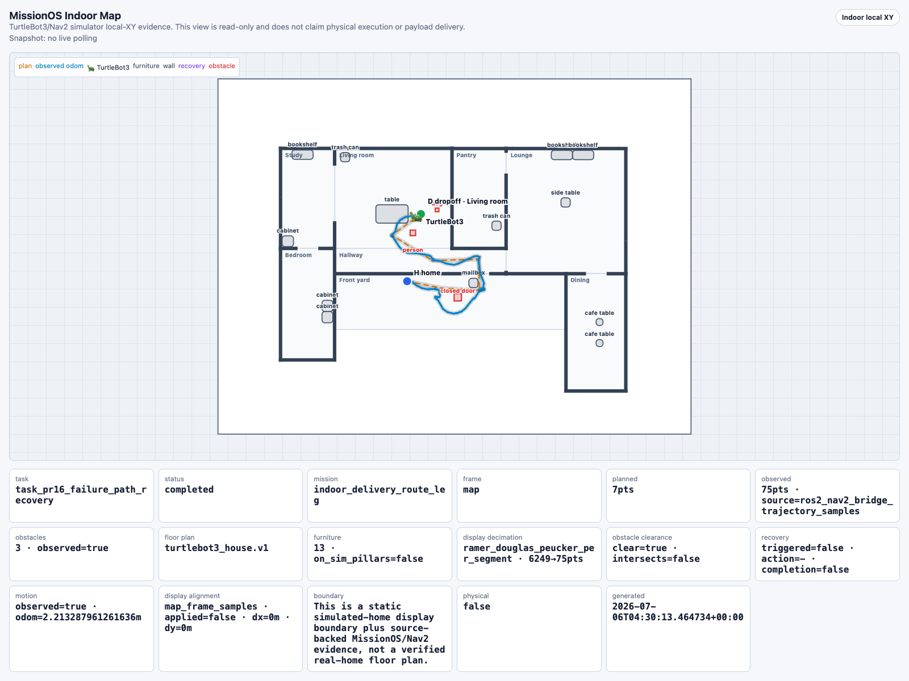

# ROS2/Nav2 TurtleBot3 Simulator Bridge

This page documents the TurtleBot3 simulator path for the ROS2/Nav2 hardware
adapter work. It exists because the TurtleBot4/Create3 stack reached controller
and dock-specific blockers before proving meaningful `/odom` motion. TurtleBot3
is the lower-friction simulator target for getting one end-to-end MissionOS ->
Nav2 -> simulator robot run.

## Boundary

The TurtleBot3 simulator path is still simulator-only:

- `physical_execution_invoked=false`
- diagnostic velocity probes are not MissionOS dispatch
- MissionOS completion may only be claimed through a bounded Nav2
  `NavigateToPose` goal, Nav2 success, and non-zero `/odom` motion
- Nav2 `succeeded` without observed robot motion must remain
  `completion_claimed=false`
- direct `/cmd_vel` publication is allowed only in opt-in diagnostics and must
  never be passed through the MissionOS dispatch bridge
- the Nav2 velocity relay is a simulator wiring shim; it may relay only
  Nav2-produced velocity and must report `velocity_generated_by_missionos=false`
- when the telemetry sidecar JSONL is configured, home-mission completion also
  requires sidecar `/odom` motion correlation; bridge-reported motion alone is
  no longer enough for the mission-level completion claim

## Docker Image

Build the TurtleBot3 image:

```bash
docker build \
  -f docker/ros2_nav2_turtlebot3/Dockerfile \
  -t missionos-ros2-nav2-turtlebot3:local \
  .
```

The image installs ROS2 Humble, Nav2, TurtleBot3 packages, Gazebo Sim/`ros_gz`
support, and the `feature-gazebo-sim-migration` branch of
`turtlebot3_simulations`.

## Motion Probe

Before attempting MissionOS or Nav2, verify that the TurtleBot3 simulator itself
can move. Start Gazebo and TurtleBot3 inside the image, then run the opt-in
motion probe:

```bash
source /opt/ros/humble/setup.bash
source /opt/turtlebot3_ws/install/setup.bash
export TURTLEBOT3_MODEL=burger
export RUN_MISSIONOS_ROS2_NAV2_TURTLEBOT3_MOTION_PROBE=1
python3 /work/missionos/scripts/ros2_nav2_turtlebot3_motion_probe.py
```

The probe publishes a small diagnostic `Twist` to `/cmd_vel` and checks `/odom`
before and after. It reports `missionos_dispatch_path=false`,
`dispatch_request_sent=false`, `diagnostic_raw_velocity_published=true`, and
`completion_claimed=false`. A successful motion probe proves only that the
TurtleBot3 simulator can move; it is not MissionOS control.

Verified local Docker result:

```text
robot_motion_observed=true
odom_delta_m=0.20572000010661604
dispatch_request_sent=false
completion_claimed=false
physical_execution_invoked=false
```

## MissionOS Bounded Dispatch Smoke

Launch TurtleBot3 Gazebo Sim with `turtlebot3_world`, TurtleBot3 Nav2, and the
opt-in Nav2 velocity relay. The relay is required in this Docker target because
Nav2 produces commands on `/cmd_vel_nav` while the Gazebo Sim TurtleBot3 model
listens on `/cmd_vel`.

```bash
source /opt/ros/humble/setup.bash
source /opt/turtlebot3_ws/install/setup.bash
export PYTHONPATH=/work/missionos:${PYTHONPATH:-}
export TURTLEBOT3_MODEL=burger

xvfb-run -a ros2 launch turtlebot3_gazebo turtlebot3_world.launch.py
xvfb-run -a ros2 launch turtlebot3_navigation2 navigation2.launch.py use_sim_time:=True

export RUN_MISSIONOS_ROS2_NAV2_NAV_VELOCITY_RELAY=1
export ROS2_NAV2_NAV_VELOCITY_RELAY_SOURCE_TOPIC=/cmd_vel_nav
export ROS2_NAV2_NAV_VELOCITY_RELAY_TARGET_TOPIC=/cmd_vel
python3 /work/missionos/scripts/ros2_nav2_turtlebot3_nav_velocity_relay.py
```

## Telemetry Sidecar

For PX4-like evidence quality, run the TurtleBot3 telemetry sidecar as an
independent read-only ROS2 observer. It subscribes to `/odom`,
`/battery_state`, and `/scan`, writes JSONL samples, and exposes no publish,
dispatch, action, or command surface:

```bash
python3 /work/missionos/scripts/ros2_nav2_turtlebot3_telemetry_sidecar.py \
  --output /tmp/missionos_turtlebot3_telemetry_sidecar.jsonl \
  --duration-s 600 \
  --max-samples 12000
```

Then pass the JSONL path to the MissionOS process that performs the chat or
dispatch smoke:

```bash
export MISSIONOS_TURTLEBOT3_TELEMETRY_SIDECAR_JSONL=/tmp/missionos_turtlebot3_telemetry_sidecar.jsonl
```

When this env var is set, MissionOS builds:

- `turtlebot3_telemetry_window`: read-only telemetry window with sample counts,
  `/odom` delta, latest battery percentage when present, `/scan` minimum range,
  and `raw_logs_ref`
- `turtlebot3_state_correlation`: bridge motion versus sidecar motion
  correlation

If Nav2 succeeds but the sidecar cannot confirm `/odom` motion, MissionOS keeps
`nav2_action_completion_claimed=true` as lower-level adapter evidence but the
home mission remains `completion_claimed=false` with
`telemetry_sidecar_motion_correlation_not_confirmed`.

## Process Log Bundle

To make the TurtleBot3 simulator evidence easier to audit after a run, pass the
known process-log paths as a JSON object:

```bash
export MISSIONOS_TURTLEBOT3_LOG_BUNDLE_PATHS='{"gazebo":"/tmp/missionos_gazebo_delivery.log","nav2":"/tmp/missionos_nav2_delivery.log","relay":"/tmp/missionos_relay_delivery.log","telemetry_sidecar":"/tmp/missionos_turtlebot3_telemetry_sidecar.log"}'
```

MissionOS uses this only as a read-only log reference bundle. The artifact keeps
per-source line counts, byte counts, SHA-256 digests, short excerpts, and
`raw_log_ref` values. It does not persist raw log text, approve dispatch, count
progress, verify delivery, or claim physical execution.

When a Nav2 process log is present, MissionOS also builds a read-only
`missionos_turtlebot3_nav2_log_diagnostics.v1` artifact. It classifies log
signatures such as controller progress failures, `follow_path` aborts, costmap
clears, spin recovery behavior, goal rejection, timeout, and cancel signals.
The diagnostic output is a repair hint for the next run; it is not dispatch
authority, a verifier, or a completion claim.

When configured, the Nav2 adapter evidence and home-mission summary carry the
same `raw_logs_ref`:

```text
raw_logs_ref=turtlebot3_process_log_bundle:<stable-ref>
log_bundle_status=ready
nav2_log_diagnostics_status=ready
raw_logs_included=false
physical_execution_invoked=false
```

Run the MissionOS bounded dispatch smoke in the same ROS2 graph:

```bash
export RUN_MISSIONOS_ROS2_NAV2_BOUNDED_DISPATCH_SMOKE=1
export RUN_MISSIONOS_ROS2_NAV2_TURTLEBOT3_BRIDGE=1
export ROS2_NAV2_BRIDGE_COMMAND="python3 /work/missionos/scripts/ros2_nav2_turtlebot3_bridge.py"
export ROS2_NAV2_BRIDGE_TIMEOUT_S=420
export ROS2_NAV2_GOAL_X_M=0.75
export ROS2_NAV2_GOAL_Y_M=0.0
export ROS2_NAV2_INITIALPOSE_ENABLE=1
export ROS2_NAV2_INITIALPOSE_X_M=0.25
export ROS2_NAV2_INITIALPOSE_Y_M=0.0
export ROS2_NAV2_INITIALPOSE_PUBLISHES=10
export ROS2_NAV2_TF_READY_TIMEOUT_S=20
export ROS2_NAV2_REQUIRE_TF_READY=1
export ROS2_NAV2_LIFECYCLE_READY_TIMEOUT_S=20
export ROS2_NAV2_REQUIRE_LIFECYCLE_READY=1
export ROS2_NAV2_VELOCITY_OBSERVE_ENABLE=1
export ROS2_NAV2_GOAL_RESULT_TIMEOUT_S=90
export ROS2_NAV2_POST_RESULT_SETTLE_S=2.0
python3 /work/missionos/scripts/smoke_ros2_nav2_turtlebot3_bounded_dispatch.py
```

The `initialpose_x=0.25` and `goal_x=0.75` coordinates are intentional: both
land on free cells in the TurtleBot3 navigation map. Starting at `0,0` is
ambiguous because that map cell is unknown, which can make the planner recover
or abort instead of producing a deterministic path.

Verified local Docker result:

```text
dispatch_request_sent=true
goal_accepted=true
nav2_status=succeeded
odom_delta_m=0.26284855643199917
robot_motion_observed=true
completion_claimed=true
completion_scope=sim_action
physical_execution_invoked=false
```

## MissionOS Chat Home Mission

The chat path can turn a plain-language home-robot request into the same bounded
Nav2 adapter action:

```bash
MISSIONOS_GATEWAY_BACKEND=production missionos gateway restart
missionos chat --autostart "TurtleBot3で家の中を一周して"
```

The expected operator flow is:

```text
chat instruction -> TurtleBot3 home mission proposal
approve          -> scoped approval for bounded Nav2 simulator route segments
run              -> ROS2/Nav2 bridge dispatch when the bridge env is opted in
```

Default Gateway behavior is safe: without the bridge env, the `run` step returns
blocked evidence with `dispatch_request_sent=false`, `completion_claimed=false`,
and `physical_execution_invoked=false`.

To connect chat to the real TurtleBot3 simulator bridge, start the simulator and
relay described above, then start the Gateway with the bridge env present:

```bash
export RUN_MISSIONOS_ROS2_NAV2_BOUNDED_DISPATCH_SMOKE=1
export RUN_MISSIONOS_ROS2_NAV2_TURTLEBOT3_BRIDGE=1
export ROS2_NAV2_BRIDGE_COMMAND="python3 /work/missionos/scripts/ros2_nav2_turtlebot3_bridge.py"
export ROS2_NAV2_BRIDGE_TIMEOUT_S=420
export ROS2_NAV2_INITIALPOSE_ENABLE=1
export ROS2_NAV2_INITIALPOSE_X_M=-2.0
export ROS2_NAV2_INITIALPOSE_Y_M=-0.5
export ROS2_NAV2_INITIALPOSE_PUBLISHES=10
export ROS2_NAV2_TF_READY_TIMEOUT_S=20
export ROS2_NAV2_REQUIRE_TF_READY=1
export ROS2_NAV2_LIFECYCLE_READY_TIMEOUT_S=20
export ROS2_NAV2_REQUIRE_LIFECYCLE_READY=1
export ROS2_NAV2_VELOCITY_OBSERVE_ENABLE=1
export ROS2_NAV2_GOAL_RESULT_TIMEOUT_S=180
export ROS2_NAV2_POST_RESULT_SETTLE_S=2.0
export MISSIONOS_GATEWAY_BACKEND=production
missionos gateway restart
missionos chat "TurtleBot3で家の中を一周して"
```

This chat slice may claim that a bounded Nav2 simulator route completed only
when every planned route segment reports Nav2 success and `/odom` motion is
observed. The route depends on the active world profile (see the next
section). In the default `turtlebot3_house` world an indoor delivery runs from
the front yard through the real front-door opening to the named destination
room (six segments and about 10.2 m for the default living-room dropoff, ten
segments and about 17.4 m for the bedroom). In the opt-in pillar arena it uses
the historical ten-segment local-XY loop of about 8.0 m. The Docker smoke
scene places three small simulated blockers: a closed door, a person marker,
and a dog marker. These markers are scenario objects spawned in the simulator,
not discovered real home objects, people, or pets. It
still does not claim:

- whole-home loop completion
- cleaning completion
- payload pickup or payload delivery completion
- physical execution
- mission delivery completion

Cleaning requests are converted to a cleaning-inspection leg. Payload requests
are converted to a payload-transport rehearsal leg. Both can exercise bounded
movement, but neither can claim the cleaning or payload effect without a
separate actuator and verifier.

Obstacle and battery requests add MissionOS judgment points to the same chat
proposal:

- `battery_envelope_before_dispatch`: blocks before bridge dispatch when the
  operator-provided or default battery envelope is below the minimum reserve.
  The envelope includes `planned_route_distance_m`,
  `estimated_consumption_pct`, and `minimum_required_pct`, so LLM recovery
  proposals can judge battery margin from the same source-backed route plan
  without inventing telemetry.
- `obstacle_avoidance_runtime_observation`: allows dispatch, but requires the
  ROS2/Nav2 bridge to report `obstacle_avoidance_observed=true` and the
  display-aligned odom trajectory to clear the obstacle bbox before the home
  mission can claim obstacle-avoidance completion.
- `runtime_battery_recovery`: when the operator asks for mid-mission battery
  recovery, MissionOS may interrupt the remaining route after the configured
  segment, ask the recovery planner for a bounded action, classify it through the
  autonomy envelope, and dispatch `return_home` only if the envelope permits it.
- `runtime_obstacle_recovery`: when the operator asks for an obstacle that
  appears during the mission, MissionOS lets the route reach the configured
  observation segment, asks the recovery planner for a bounded action, classifies
  it through the same autonomy envelope, dispatches a bounded `avoid_obstacle`
  Nav2 recovery waypoint only if permitted, and then resumes the remaining
  delivery route. This is the TurtleBot3 analogue of the PX4 operator-approved
  `avoid_obstacle` recovery dispatch path.

Battery and obstacle recovery use the shared mission-autonomy envelope:

- `llm_recovery_proposals_allowed=true` means an LLM proposal may be recorded
  from battery/home-distance observations.
- The envelope classifies execution authority after the proposal is recorded:
  `auto_executable`, `requires_human_approval`, or `blocked_but_reportable`.
- Policy must not delete or suppress an LLM recovery proposal merely because the
  proposed action is unsafe to execute. For example, `raw_velocity` may be
  recorded as a proposal but must classify as `blocked_but_reportable`.
- `return_home`, `hold`, and bounded `avoid_obstacle` are the recovery actions
  preapproved by the TurtleBot3 envelope after the operator approves the mission
  envelope. This classification still does not send a recovery dispatch by
  itself; the executor only acts from the approved runtime recovery path.
- `home_distance_envelope` is the source-bound home-distance input for the
  recovery planner. In this slice it is either an operator-provided estimate or
  a planned Nav2 goal projection, not runtime odom telemetry.
- The LLM must not invent `distance_to_home_m`. If it reports a distance that is
  absent from or different from `home_distance_envelope`, the recovery planner
  guardrail blocks the LLM proposal and MissionOS falls back to the deterministic
  proposal path.
- Every LLM `input_observations` key must be source-backed by the battery,
  home-distance, or runtime obstacle envelope. Observation aliases such as
  `battery_pct` are blocked unless MissionOS explicitly supplied that exact key
  as a source observation.
- The emergency harness may bypass LLM proposal generation only for immediate
  stop/hold cases such as critical battery, imminent collision, or operator
  e-stop, and must record the skip reason.

The default chat smoke keeps LLM backends disabled, so its low-battery recovery
proposal is marked `proposal_source=deterministic_fallback`, not `llm`. It
exercises the same envelope/classification boundary without claiming an external
LLM was invoked.

The mid-mission recovery smoke is different from the pre-dispatch low-battery
block. It lets the first route segment complete, simulates battery depletion,
records a recovery proposal, dispatches `return_home`, and claims only
`recovery_completion_claimed=true`. The interrupted delivery route remains
`completion_claimed=false`.

The dynamic obstacle recovery smoke is different from the static obstacle route.
The static route can plan around a known obstacle from the start. The dynamic
obstacle recovery path records a runtime `avoid_obstacle` proposal, dispatches a
bounded recovery waypoint, resumes the remaining delivery route, and may claim
the simulator route completion only when the resumed odom trajectory clears the
obstacle bbox.

The guardrail fallback smoke is the negative pair for that dynamic obstacle path.
Set `MISSIONOS_CHAT_TURTLEBOT3_RECOVERY_GUARDRAIL_FALLBACK_SMOKE=1` together with
`MISSIONOS_CHAT_TURTLEBOT3_DYNAMIC_OBSTACLE_RECOVERY_SMOKE=1`. The Docker wrapper
then injects `scripts/turtlebot3_recovery_planner_guardrail_fault_fixture.py`,
which intentionally claims `dispatch_request_sent=true` and invents
`fabricated_distance_to_home_m`. MissionOS must report
`recovery_planner_status=guardrail_blocked`,
`recovery_proposal_source=deterministic_fallback`, still dispatch only the
bounded `avoid_obstacle` recovery waypoint, and then either resume and complete
the delivery route or stay recovered/blocked without claiming route completion.

The Docker TurtleBot3 Gateway and smoke wrappers default the Gateway and the
TurtleBot3 recovery planner to hosted Gemini. Load `GOOGLE_API_KEY` from an
external env file before running the LLM-backed path:

```bash
# Hosted Gemini path (default for the Gateway and TurtleBot3 recovery planner)
export MISSIONOS_LLM_BACKEND=gemini
export MISSIONOS_AGENT_MISSIONOS_TURTLEBOT3_RECOVERY_PLANNER_AGENT_LLM_BACKEND=gemini
export MISSIONOS_AGENT_MISSIONOS_TURTLEBOT3_RECOVERY_PLANNER_AGENT_MODEL_ID=gemini-3.1-flash-lite
export MISSIONOS_TURTLEBOT3_RECOVERY_PLANNER_ADK_ENABLED=1
export MISSIONOS_TURTLEBOT3_RECOVERY_PLANNER_TIMEOUT_SECONDS=180
```

Use this separate override when the run must stay on local Gemma/Ollama:

```bash
export MISSIONOS_LLM_BACKEND=ollama
export MISSIONOS_AGENT_MISSIONOS_TURTLEBOT3_RECOVERY_PLANNER_AGENT_LLM_BACKEND=ollama
export MISSIONOS_OLLAMA_MODEL=gemma4:26b
export MISSIONOS_TURTLEBOT3_RECOVERY_PLANNER_ADK_ENABLED=1
export MISSIONOS_TURTLEBOT3_RECOVERY_PLANNER_TIMEOUT_SECONDS=180
```

When this path is configured, `recovery_proposals[0].proposal_source` becomes
`llm` and the proposal carries `llm_invocation_evidence`. The same autonomy
envelope still classifies execution after proposal recording; the LLM proposal
does not approve, dispatch, count progress, or claim physical execution.
Set `MISSIONOS_LLM_BACKEND=off` only when intentionally validating deterministic
fallbacks or claim boundaries without any LLM-backed ADK path.

The obstacle judgment point does not mean MissionOS spawned an obstacle. The
TurtleBot3 simulator world, map, or costmap must provide the obstacle, and the
bridge must observe it. If Nav2 reaches the goal and `/odom` moves but the bridge
does not report obstacle avoidance, or if the reported trajectory intersects the
obstacle marker bbox, MissionOS may keep the lower-level
`nav2_action_completion_claimed=true` evidence while the home mission remains
`completion_claimed=false` with `blocking_reasons` including
`obstacle_avoidance_not_observed`.

For an indoor-delivery request, MissionOS may claim only the simulated route
arrival at the dropoff waypoint. It must still report
`mission_delivery_completion_claimed=false`,
`payload_delivery_completion_claimed=false`, and
`physical_execution_invoked=false` because TurtleBot3 has no payload handoff
actuator or payload verifier in this slice.

The loopback HTTP smoke for this chat surface is:

```bash
python3 scripts/smoke_missionos_chat_turtlebot3_home_mission.py
```

It starts a real Gateway on a temporary loopback port and verifies the default
blocked boundary. Set
`RUN_MISSIONOS_CHAT_TURTLEBOT3_HOME_MISSION_SMOKE_WITH_BRIDGE=1` only when the
ROS2/Nav2 simulator bridge is already running and the bridge env above is
available.

The full Docker E2E smoke starts Gazebo, inserts a simulator obstacle, starts
Nav2, starts the relay, starts the read-only telemetry sidecar, starts the
production Gateway, sends the chat plan/approve/run sequence, and requires both
bridge evidence and sidecar `/odom` motion correlation before the home mission
may claim completion. It also requires the bridge to observe obstacle costmap
evidence plus odom trajectory deviation before the home mission may claim
obstacle avoidance. By default this Docker smoke keeps the separate
mid-mission recovery chat disabled so obstacle delivery, telemetry correlation,
and process-log collection stay one deterministic runtime boundary. Set
`MISSIONOS_CHAT_TURTLEBOT3_MID_RECOVERY_SMOKE=1` to add the recovery chat that
dispatches `return_home` after the first route segment. When enabled, the
recovery chat runs before the normal delivery chat so it starts from the fresh
Gazebo spawn state. Publishing `/initialpose` resets Nav2 localization, but it
does not teleport the simulated robot body.

```bash
scripts/smoke_ros2_nav2_turtlebot3_obstacle_delivery_docker.sh
```

Verified local Docker result:

```text
sim_obstacle_spawn_status=0
sim_obstacle_spawned_count=3
plan_route=mission_designer_plan
approve_route=approve
execute_route=execute
home_robot_mission_kind=indoor_delivery_route_leg
home_distance_m=2.795
home_distance_source=planned_nav2_goal_projection
dispatch_request_sent=true
robot_motion_observed=true
robot_motion_observation_source=ros2_telemetry_sidecar_jsonl
odom_delta_m=2.7860450431330563
telemetry_sidecar_required=true
telemetry_sidecar_motion_correlation_confirmed=true
telemetry_window_ref=turtlebot3_telemetry_window:turtlebot3_telemetry_window_3cb830a02887
telemetry_raw_logs_ref=turtlebot3_telemetry_sidecar_jsonl:9d8e3c92e536faf4
log_bundle_status=ready
raw_logs_ref=turtlebot3_process_log_bundle:6e4637ff84553cc1
log_bundle_observed_source_count=5
log_bundle_source_count=5
nav2_log_diagnostics_status=ready
nav2_log_observed_patterns=["controller_failed_to_make_progress","costmap_clear_recovery_observed","follow_path_action_aborted","nav2_goal_received","nav2_timeout_signal_observed"]
nav2_log_failure_hypotheses=["controller_progress_blocked_or_goal_inside_constrained_costmap","follow_path_action_aborted","nav2_goal_result_timeout_or_slow_recovery","recovery_goal_stalled_after_costmap_clear"]
planned_segment_count=10
segment_dispatch_count=10
segment_completion_count=10
multi_segment_mission_claimed=true
llm_recovery_proposals_allowed=true
proposal_first_classification=true
recovery_planner_status=not_required
costmap_obstacle_observed=true
bridge_obstacle_avoidance_observed=true
obstacle_trajectory_clearance_observed=true
obstacle_trajectory_intersects_obstacle=false
trajectory_lateral_deviation_observed=true
max_lateral_deviation_m=0.19642801453812522
obstacle_avoidance_observed=true
obstacle_avoidance_completion_claimed=true
dropoff_arrival_claimed=true
indoor_delivery_route_completion_claimed=true
completion_claimed=true
completion_scope=sim_action
mission_delivery_completion_claimed=false
physical_execution_invoked=false
low_battery.status=blocked
low_battery.dispatch_request_sent=false
low_battery.home_distance_m=2.795
low_battery.home_distance_source=planned_nav2_goal_projection
low_battery.recovery_planner_status=not_configured
low_battery.recovery_proposal_source=deterministic_fallback
low_battery.recovery_action_suggested=return_home
low_battery.recovery_execution_permitted_by_envelope=true
low_battery.recovery_dispatch_request_sent=false
low_battery.blocking_reasons=["battery_below_minimum_required"]
mid_mission_recovery_enabled=false
mid_mission_recovery.status=null
```

A separate opt-in run with `MISSIONOS_CHAT_TURTLEBOT3_MID_RECOVERY_SMOKE=1`
keeps the recovery branch as an explicit assertion. A successful recovery run
reports:

```text
mid_mission_recovery_enabled=true
mid_mission_recovery.status=recovered
mid_mission_recovery.dispatch_request_sent=true
mid_mission_recovery.completion_claimed=false
mid_mission_recovery.runtime_recovery_triggered=true
mid_mission_recovery.route_interrupted_for_recovery=true
mid_mission_recovery.planned_segment_count=10
mid_mission_recovery.segment_dispatch_count=1
mid_mission_recovery.segment_completion_count=1
mid_mission_recovery.recovery_action_suggested=return_home
mid_mission_recovery.recovery_dispatch_request_sent=true
mid_mission_recovery.recovery_completion_claimed=true
mid_mission_recovery.nav2_log_diagnostics_status=ready
mid_mission_recovery.nav2_log_observed_patterns=["nav2_goal_received","nav2_timeout_signal_observed"]
mid_mission_recovery.nav2_log_failure_hypotheses=["nav2_goal_result_timeout_or_slow_recovery"]
mid_mission_recovery.mission_delivery_completion_claimed=false
mid_mission_recovery.physical_execution_invoked=false
```

An additional opt-in run with
`MISSIONOS_CHAT_TURTLEBOT3_DYNAMIC_OBSTACLE_RECOVERY_SMOKE=1` exercises the
PX4-like obstacle recovery loop. The normal static obstacle delivery route still
proves that a known obstacle can be planned around from the start. The dynamic
case separately proves that a runtime obstacle observation can produce an
`avoid_obstacle` recovery proposal, dispatch a bounded Nav2 recovery waypoint,
resume the delivery route, and verify the resulting obstacle clearance:

```text
dynamic_obstacle_recovery_enabled=true
dynamic_obstacle_recovery.status=completed
dynamic_obstacle_recovery.dispatch_request_sent=true
dynamic_obstacle_recovery.completion_claimed=true
dynamic_obstacle_recovery.runtime_recovery_triggered=true
dynamic_obstacle_recovery.runtime_recovery_action_kind=avoid_obstacle
dynamic_obstacle_recovery.route_resumed_after_recovery=true
dynamic_obstacle_recovery.route_completed_after_recovery=true
dynamic_obstacle_recovery.recovery_action_suggested=avoid_obstacle
dynamic_obstacle_recovery.recovery_dispatch_request_sent=true
dynamic_obstacle_recovery.recovery_completion_claimed=true
dynamic_obstacle_recovery.obstacle_avoidance_completion_claimed=true
dynamic_obstacle_recovery.obstacle_trajectory_clearance_observed=true
dynamic_obstacle_recovery.obstacle_trajectory_intersects_obstacle=false
dynamic_obstacle_recovery.indoor_delivery_route_completion_claimed=true
dynamic_obstacle_recovery.mission_delivery_completion_claimed=false
dynamic_obstacle_recovery.physical_execution_invoked=false
decision_demo.enabled=true
decision_demo.scenario=dynamic_obstacle_recovery
decision_demo.judgment_required=true
decision_demo.llm_recovery_judgment_count=1
decision_demo.mission_operator_approval_count=1
decision_demo.fresh_recovery_operator_approval_count=0
decision_demo.rules_execution_class=auto_executable
decision_demo.requires_new_human_approval=false
decision_demo.physical_execution_invoked=false
decision_demo.mission_delivery_completion_claimed=false
```

The `decision_demo` block is the standard audit surface for "LLM participated in
control." It counts only accepted, guardrail-passing LLM recovery proposals in
`llm_recovery_judgment_count`. Rejected LLM output is counted separately as
`guardrail_blocked_llm_output_count`, so a fallback run cannot be described as
an accepted LLM judgment. The mission approval count is the original operator
approval for the bounded envelope; `fresh_recovery_operator_approval_count=0`
means the runtime recovery action did not mint a new human approval artifact.

Use `MISSIONOS_CHAT_TURTLEBOT3_DECISION_DEMO_SMOKE=1` when the purpose of the
run is to prove the recovery-decision loop rather than final delivery
completion. In this mode a blocked result can still pass if the evidence shows a
source-backed LLM proposal, autonomy-envelope classification, no fresh recovery
approval artifact, no physical execution claim, and no mission-delivery
completion claim.

Use the paired guardrail-fallback run to prove a bad planner output is rejected
and the deterministic floor remains executable:

```bash
MISSIONOS_CHAT_TURTLEBOT3_DYNAMIC_OBSTACLE_RECOVERY_SMOKE=1 \
MISSIONOS_CHAT_TURTLEBOT3_RECOVERY_GUARDRAIL_FALLBACK_SMOKE=1 \
MISSIONOS_EXPECT_TURTLEBOT3_RECOVERY_PROPOSAL_SOURCE=deterministic_fallback \
scripts/smoke_ros2_nav2_turtlebot3_obstacle_delivery_docker.sh
```

The passing output must include:

```text
recovery_guardrail_fallback_injection_enabled=true
dynamic_obstacle_recovery.recovery_planner_status=guardrail_blocked
dynamic_obstacle_recovery.recovery_planner_blocking_reasons=["raw_llm_output_forbidden_authority_key:dispatch_request_sent","unsupported_observation_claim:fabricated_distance_to_home_m"]
dynamic_obstacle_recovery.recovery_proposal_source=deterministic_fallback
dynamic_obstacle_recovery.recovery_dispatch_request_sent=true
dynamic_obstacle_recovery.recovery_completion_claimed=true
dynamic_obstacle_recovery.route_resumed_after_recovery=true
dynamic_obstacle_recovery.physical_execution_invoked=false
```

If the resumed route cannot finish after the fallback recovery, the guardrail
fallback smoke may report `dynamic_obstacle_recovery.status=recovered`,
`dynamic_obstacle_recovery.route_completed_after_recovery=false`, and
`dynamic_obstacle_recovery.completion_claimed=false`. That is still a pass for
the guardrail/fallback fault case because the bad planner output was rejected,
the bounded recovery action completed, and MissionOS did not claim simulated
route completion.

If the recovery branch blocks, it must remain a blocked run and expose the Nav2
log diagnostics instead of claiming recovery completion. For example, a
`nav2_goal_result_not_succeeded` recovery result can carry
`controller_failed_to_make_progress`, `follow_path_action_aborted`, or
`costmap_clear_recovery_observed` as diagnostic patterns while keeping
`recovery_completion_claimed=false`.

The same localization/body mismatch class is retained as an explicit
fault-injection case:

```bash
MISSIONOS_CHAT_TURTLEBOT3_MID_RECOVERY_SMOKE=1 \
MISSIONOS_CHAT_TURTLEBOT3_LOCALIZATION_DRIFT_FAULT_SMOKE=1 \
scripts/smoke_ros2_nav2_turtlebot3_obstacle_delivery_docker.sh
```

This deliberately runs a normal delivery first, then starts the recovery chat in
the same simulator process with a deliberately bad `/initialpose` (default
`x=8.0`, `y=8.0`) for the second Gateway process. That reproduces a
localization/body mismatch class similar to kidnapped robot, bad initial pose,
or severe odometry drift. The pass condition is fail-safe, not success:

```text
localization_drift_fault_injection_enabled=true
mid_mission_recovery.status=blocked
mid_mission_recovery.completion_claimed=false
mid_mission_recovery.recovery_completion_claimed=false
mid_mission_recovery.mission_delivery_completion_claimed=false
mid_mission_recovery.physical_execution_invoked=false
mid_mission_recovery.nav2_log_diagnostics_status=ready
mid_mission_recovery.blocking_reasons=["nav2_goal_result_not_succeeded"]
mid_mission_recovery.nav2_log_observed_patterns=["costmap_clear_recovery_observed","follow_path_action_aborted","nav2_goal_received","nav2_timeout_signal_observed","spin_recovery_behavior_observed"]
mid_mission_recovery.nav2_log_failure_hypotheses=["follow_path_action_aborted","nav2_goal_result_timeout_or_slow_recovery"]
decision_demo.scenario=localization_drift_failure_recovery
decision_demo.mission_operator_approval_count=1
decision_demo.fresh_recovery_operator_approval_count=0
decision_demo.physical_execution_invoked=false
```

Runtime verification on 2026-07-06 used the process runner with hosted Gemini
as the default recovery planner:

```bash
GOOGLE_API_KEY=<set> \
RUN_MISSIONOS_TURTLEBOT3_SIM_PROCESS_RUNNER=1 \
MISSIONOS_TURTLEBOT3_SIM_PROCESS_RUNNER_SCENARIO=localization_drift_fault \
MISSIONOS_TURTLEBOT3_WORLD_PROFILE=house \
MISSIONOS_TURTLEBOT3_SIM_PROCESS_RUNNER_FULL_OUTPUT=1 \
MISSIONOS_CHAT_TURTLEBOT3_HOME_MISSION_MAP_MODEL_OUT=/work/missionos/output/turtlebot3_smoke/failure_path_indoor_map_model_20260706T041750Z_gemini.json \
MISSIONOS_CHAT_TURTLEBOT3_HOME_MISSION_HTTP_TIMEOUT_SECONDS=900 \
ROS2_NAV2_BRIDGE_TIMEOUT_S=540 \
ROS2_NAV2_GOAL_RESULT_TIMEOUT_S=240 \
python3 scripts/smoke_turtlebot3_sim_process_runner.py
```

Observed result:

```text
scenario_passed=true
process_run_id=turtlebot3_sim_process_run_ff3bea3d5121
exit_status=completed
parsed_status=completed
parsed_completion_scope=sim_action
parsed_mid_recovery_status=blocked
runtime_failure_recovery_triggered=true
mid_mission_recovery.recovery_proposal_source=llm
mid_mission_recovery.recovery_action_suggested=return_home
mid_mission_recovery.recovery_dispatch_request_sent=true
mid_mission_recovery.recovery_completion_claimed=false
mid_mission_recovery.mission_delivery_completion_claimed=false
mid_mission_recovery.physical_execution_invoked=false
mid_mission_recovery.runtime_recovery_motion_context.odom_delta_m=2.8688396820142383
mid_mission_recovery.runtime_recovery_motion_context.robot_motion_observed=true
mid_mission_recovery.recovery_proposals[0].llm_invocation_evidence.provider=google_adk_gemini
mid_mission_recovery.recovery_proposals[0].llm_invocation_evidence.model_id=gemini-3.1-flash-lite
```



This is a recovery-judgment verification, not a recovery-completion claim. The
normal delivery phase may complete in the same smoke, but the injected
localization-drift recovery leg is allowed to finish as `blocked` while proving
that the LLM was convened with source-backed motion delta, the rules envelope
classified the proposal, the recovery dispatch was attempted, and the verifier
withheld recovery, delivery, and physical-execution completion claims. The image
above is the same E2E run's read-only indoor map context for the completed
normal delivery phase; the fault-injection recovery leg is represented by the
`decision_demo` and `mid_mission_recovery` evidence fields above rather than by a
separate map completion claim.

The same run also reported the relay as a simulator shim:

```text
shim=ros2_nav2_turtlebot3_nav_velocity_relay
source_topic=/cmd_vel_nav
target_topic=/cmd_vel
nonzero_velocity_relayed=true
velocity_generated_by_missionos=false
cmd_vel_published_by_missionos=false
dispatch_request_sent=false
physical_execution_invoked=false
```

This is MissionOS simulator control parity for the Nav2 adapter. It is not
physical execution, not mission delivery completion, and not evidence that the
same bridge will work on a physical robot without a separate hardware adapter
bench.

## World Profiles: turtlebot3_house (default) and the pillar arena

`MISSIONOS_TURTLEBOT3_WORLD_PROFILE` selects the simulator world for the chat
home mission, the Docker smoke, and the gateway wrapper:

- `house` (default, also when the env is unset): the stock `turtlebot3_house`
  Gazebo world with real walls, door openings, and furniture. The floor plan
  and the Nav2 map are derived deterministically from the house model SDF box
  collisions with `scripts/turtlebot3_house_map_from_sdf.py` (door lintels are
  filtered by the robot lidar height band); the generated assets are committed
  under `config/turtlebot3_house/`. Because the stock
  `turtlebot3_house.launch.py` still targets Gazebo Classic, the Docker
  wrappers reuse the migrated gz-sim world launch with the house world swapped
  in. House goals declare an 8.0 m operating volume covering the full floor
  plan; each goal's own bound is propagated into adapter preflight.
- `arena`: the historical `turtlebot3_world` pillar arena, kept for the
  regression corpus (fault-injection smokes, recovery loop evidence). The
  arena map draws the wall polygon simplified from the Nav2 SLAM occupancy
  grid and the nine pillars from the world SDF; furniture labels sit on real
  pillar footprints. Arena-era contract tests pin
  `MISSIONOS_TURTLEBOT3_WORLD_PROFILE=arena` with an autouse fixture.

### Room-addressable deliveries (house)

Chat instructions may name a destination room in Japanese or English; the
route passes only through real door openings extracted from the SDF and the
map dropoff marker shows the room (for example `D dropoff · Bedroom`):

| Room | Terms | Doors on the way |
| --- | --- | --- |
| Living room (default) | living / リビング / 居間 | front door |
| Study | study / 書斎 / 勉強部屋 | front door, study door |
| Bedroom | bedroom / 寝室 / ベッドルーム | front door, study door, bedroom door |
| Lounge | lounge / ラウンジ / 応接 | front door, lounge door |
| Dining | dining / ダイニング / 食堂 | front door, lounge door, dining door |
| Pantry | pantry / パントリー / 納戸 | front door, lounge door, pantry door |

Example: `亀さん、bedroomへ荷物を届けて` plans the ten-segment bedroom route.
The instruction must be a delivery request (`配送` / `届けて` / deliver);
other verbs classify as different mission kinds with their own blocked claims.

### Live mission progress

The gateway creates the execution task with `status=running` before dispatch
and the dispatch loop streams claim-safe partial summaries (segment counts
plus a running indoor map model, `completion_claimed` always false) into the
task artifacts after every route and recovery segment, so `missionos map` /
watch / operate show the robot advancing room by room during the run.
Displayed trails are AMCL-corrected map-frame samples (odom-frame fallbacks
and unconfirmed single-sample jumps are dropped from display only; raw bridge
samples stay in `bridge_responses`).

### Runtime failure recovery

An unplanned Nav2 segment failure convenes the same recovery machinery as the
scripted battery/obstacle triggers: the recovery planner (LLM with
source-binding guardrails, deterministic return-home floor as fallback)
proposes, the autonomy envelope classifies, and only an envelope-permitted
`return_home` is dispatched immediately under the existing mission approval.
Any other proposal is attached to the blocked result for the operator. The
failure context is recorded source-bound as `runtime_failure_context`.

### Gateway and chat commands

```bash
# start / restart the full sim + gateway stack (house by default)
bash scripts/start_ros2_nav2_turtlebot3_gateway_docker.sh

# pillar arena instead
MISSIONOS_TURTLEBOT3_WORLD_PROFILE=arena bash scripts/start_ros2_nav2_turtlebot3_gateway_docker.sh

# stop / inspect
docker rm -f missionos-turtlebot3-gateway
docker logs -f missionos-turtlebot3-gateway

# chat pinned to the TurtleBot3 entrypoint (recreates the container)
missionos chat --robot turtlebot3

# regenerate the house map assets after a sim image update
docker run --rm missionos-ros2-nav2-turtlebot3:local \
  cat /opt/turtlebot3_ws/install/turtlebot3_gazebo/share/turtlebot3_gazebo/models/turtlebot3_house/model.sdf \
  > /tmp/house_model.sdf
python scripts/turtlebot3_house_map_from_sdf.py /tmp/house_model.sdf config/turtlebot3_house
```

Gateway and mission-planning code is imported at container start, so runtime
changes require recreating the container; bridge scripts run as a subprocess
per dispatch and take effect on the next `run`.

## CLI Entry

The operator-facing CLI entry for the TurtleBot3 simulator path is:

```bash
missionos chat --robot turtlebot3 "TurtleBot3で屋内配送ルートを走って。障害物を避けて、目的地まで届けて。"
```

This starts a Docker-backed TurtleBot3/Gazebo/Nav2 Gateway and then enters the
normal MissionOS chat loop. The operator flow is the same shape as the PX4
chat path:

```text
chat instruction -> bounded TurtleBot3 home mission proposal
approve          -> scoped approval for the Nav2 simulator route
run              -> opt-in ROS2/Nav2 bridge dispatch
operate/watch/map -> read the resulting MissionOS task
```

If a runtime recovery proposal is classified as
`requires_new_human_approval=true`, chat can approve that specific pending
proposal without turning the LLM proposal into authority:

```text
LLM proposes -> rules classify requires_new_human_approval -> operator types
/approve-recovery <task_id> or "承認します" -> Gateway recovery-dispatch records
explicit_recovery_dispatch_approval=true -> executor/verifier report the result
```

The command reads the task's source-backed recovery proposal and dispatches only
through the existing operator-gated `recovery-dispatch` route. The
`turtlebot3_recovery_decision_summary` remains read-only and
`decision_summary_creates_dispatch_authority=false`.

When the `run` step creates a TurtleBot3 task, chat opens the same companion
surfaces used for PX4 (`missionos operate`, `missionos watch`, and
`missionos map`) against that task id. The Docker Gateway is exposed on the
selected `--gateway-url` localhost port so those surfaces read the same
TaskStore task through the same Gateway.

The indoor map is a read-only evidence display. TurtleBot3 bridge trajectory
samples may arrive in odom-local coordinates even when the planned route is in
the Nav2 `map` frame, so the map model records a `display_alignment` transform
that translates observed points onto the planned home pose for visualization.
This transform does not modify raw bridge responses, sidecar `/odom` evidence,
completion claims, delivery claims, or physical-execution claims.

If the default Gateway at `http://127.0.0.1:18791` is already running, the
TurtleBot3 chat entry automatically uses `http://127.0.0.1:18792` unless
`--gateway-url` is passed explicitly. Companion commands inherit the selected
Gateway URL.

Useful options:

```text
--turtlebot3-build-image      build the Docker image first
--turtlebot3-dry-run          print the Gateway/simulator startup command
--turtlebot3-smoke            run the non-interactive Docker smoke instead
```

The CLI entry must preserve the same boundary as the script:

```text
completion_scope=sim_action
physical_execution_invoked=false
mission_delivery_completion_claimed=false
```

## Process Runner

`src/runtime/turtlebot3_sim_process_runner.py` wraps the Docker smoke as an
opt-in process boundary. The default remains blocked:

```bash
python3 scripts/smoke_turtlebot3_sim_process_runner.py
```

The runner does not start Docker/Gazebo unless
`RUN_MISSIONOS_TURTLEBOT3_SIM_PROCESS_RUNNER=1` is set. When enabled, it runs
`scripts/smoke_ros2_nav2_turtlebot3_obstacle_delivery_docker.sh` by default and
evaluates one of three scenarios:

```text
MISSIONOS_TURTLEBOT3_SIM_PROCESS_RUNNER_SCENARIO=obstacle_delivery
MISSIONOS_TURTLEBOT3_SIM_PROCESS_RUNNER_SCENARIO=mid_recovery
MISSIONOS_TURTLEBOT3_SIM_PROCESS_RUNNER_SCENARIO=localization_drift_fault
```

The runner records command, exit status, stdout/stderr refs and digests,
parsed MissionOS smoke fields, and scenario assertions. It is a lifecycle and
evaluation harness only:

```text
process_launch_attempted=false unless explicit opt-in
docker_lifecycle_invoked=false unless explicit opt-in
dispatch_authority_created=false
physical_execution_invoked=false
mission_delivery_completion_claimed=false
```

The smoke script prints a compact projection by default so long Docker runs
remain readable. Set
`MISSIONOS_TURTLEBOT3_SIM_PROCESS_RUNNER_FULL_OUTPUT=1` to emit the full
`missionos_turtlebot3_sim_process_run.v1` model.

## Episode Review

`src/runtime/mission_episode_review.py` is a vehicle-agnostic, read-only episode
review layer. TurtleBot3 home-mission execution attaches a
`mission_episode_review.v1` artifact to the summary. The review can pass a
simulator episode only when the source remains inside the claim boundary:

```text
execution_mode=sim
completion_scope=sim_action when completion_claimed=true
robot_motion_observed=true when completion_claimed=true
mission_delivery_completion_claimed=false
physical_execution_invoked=false
```

Blocked source episodes remain review-blocked with `episode_blocked`; the review
does not create approval, dispatch authority, progress, physical execution, or
reuse memory.

## Negative Gate

The adapter must not claim completion if Nav2 reports `succeeded` but `/odom`
motion is not observed. In that case evidence must remain:

```text
completion_claimed=false
completion_scope=none
blocking_reasons includes nav2_completion_without_robot_motion_observed
unproven_claims includes nav2_completion_without_robot_motion_not_claimed
```

## Relationship To TurtleBot4

The human-facing rationale for keeping TurtleBot3 as the current indoor
simulator baseline is documented in `docs/concepts/simulator-baseline.md`.

The TurtleBot4 work remains useful diagnostic evidence, but it is not the current
fast path. Its latest verified blocker is below MissionOS and below Nav2:
direct diagnostic velocity to the active Create3 diffdrive controller did not
produce meaningful wheel or `/odom` motion, pure Create3 drive actions accepted
goals and then timed out, and swapping the installed xacro plugin strings from
`ign_ros2_control` to `gz_ros2_control` was not enough to make the robot move.
TurtleBot3 is being used to avoid continuing that simulator-specific detour in
the public baseline.
