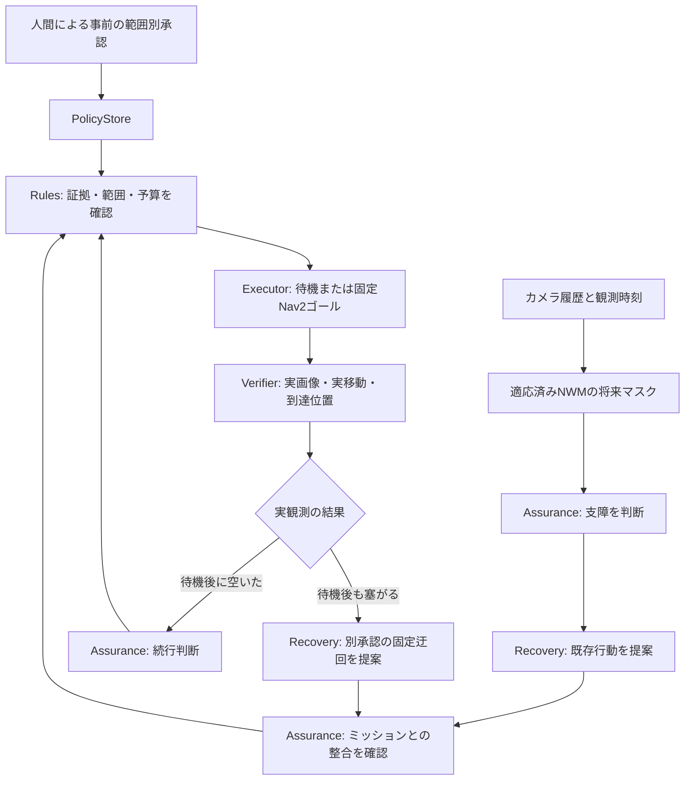

# NWM予測と実観測を用いたTB3の承認付き回復：研究・実装・検証レポート

**対象**：MissionOSのローカルTB3／Gazebo／Nav2統合。

**実験日**：2026年9月15日。先行比較は2026年9月14〜15日。

**公開実装の検証対象**：`614361147ccd6d1263d8c4b538105b350d13de2c`。

**本レポートの作業**：保存済み実行記録の再照合・分析・図表化。新しいモデル呼び出し、追加学習、シミュレータ試験は行っていない。

## 要旨

本研究の目的は、世界モデルの予測をAgentに読ませること自体ではなく、予測を用いた判断を、承認された実行と実観測による到達確認に結び付けることである。最初の対象は、横切る障害物が通り過ぎるのを待つTB3の既知場面とした。先行実装は待機後に通路が空けば到達できたが、待機後も塞がっている場合や、Agent処理中に予測が期限切れになってから通路が空いた場合には、承認可能な次の実行経路が不足していた。

公開実装では、既存のAssurance、Recovery、PolicyStore、Rules、Nav2実行、観測Verifierを接続し、二つの経路を追加した。第一に、待機失敗を実画像で確認した後、Recoveryが固定迂回を提案し、別途承認された範囲内で実行する。第二に、予測期限切れ後に再観測し、実際に空いていれば、待機とは別に承認された元経路の続行を提案・実行する。

公開ソースを固定した7試験では、待機失敗後の迂回が2件とも到達、期限切れ後の続行が1件到達、既存の待機後直進が2件とも到達した。必要な追加承認を与えない2件は、ゴール指令を一度も出さず停止した。全件で実行所有コンテナの削除を確認した。これは「5件の到達と2件の意図した権限停止」であり、一般的な成功率や速度優位性の推定ではない。

詳細分析では、到達とは別に判断品質の問題も見つかった。1件では予測閉塞値が判断基準を超えていてもRecoveryが待機を選び、その説明は「待てば空く」根拠を十分に示していない。また1件では、AgentがPNGファイルと生RGBデータのハッシュ差を別フレームの可能性と解釈したが、PNGを復号したRGBのハッシュは観測記録と一致した。したがって本成果は、**不確かな初期判断からも実観測と承認付き回復を経て到達できる限定的な実行能力**であり、Agentの判断や説明の全般的な正確さを保証するものではない。

## 1. 研究上の問いと評価対象

### 1.1 解決したい問題

従来の「予測が空きを示すので待つ」という腕は、予測が外れた後の行動まで含めなければ、利用可能な能力として狭い。待機後も障害物が残ると、観測Verifierが正しく止めても目的地には着かない。一方、予測が古くなった後に実際には通路が空いていても、待機専用の入口しかなければ続行できない。

本研究は、これらを停止判定だけで終わらせず、次の承認可能な行動へ接続する。評価対象は「Agentを呼べたか」ではなく、次の因果・権限連鎖である。

```text
障害物の速度・開始位置・遅延条件を要求
→ シミュレータへ適用
→ 障害物位置と時刻の変化を観測
→ カメラで待機後の閉塞／空きを確認
→ Assuranceがミッションへの影響を判断
→ Recoveryが根拠付きの既存行動を提案
→ 別途承認済みのPolicyとRulesで実行範囲を確認
→ ExecutorがNav2へ固定ゴールを送る
→ 実移動・到達位置・ネイティブ結果を確認
```

### 1.2 研究質問

| ID | 問い | 主な観測・判定方法 |
| --- | --- | --- |
| RQ1 | 待機で通れないと分かった後に回復して到達できるか | 待機失敗画像、Recovery提案、Rules予約、2ゴールの実行結果、実位置 |
| RQ2 | 回復判断は実観測を根拠にしているか | 正規化した観測参照の一致、画像ハッシュ・時刻、提案理由と観測値の整合 |
| RQ3 | 人間の承認範囲を守れるか | 該当承認を外した対照、ゴール要求数、1回限りの予算、固定座標 |
| RQ4 | 予測が古くなっても正しい観測手順へ移れるか | 期限切れイベント、履歴再取得、続行の別承認、待機予約を使わない実行 |
| RQ5 | 既存の待機後直進を維持できるか | 待機、実画像での空き確認、待機後Assurance、同じ目的地への到達 |
| RQ6 | どのコスト・精度・再現性の制約が残るか | 実時間とシミュレータ時間、呼び出し数、トークン、端点誤差、外部モデル依存 |

RQ1・RQ3・RQ4・RQ5にはこの既知場面で肯定的な実行証拠が得られた。RQ2は、回復段階の観測参照と行動には整合した証拠がある一方、初期待機の妥当性と自然言語説明に後述の課題が残る。RQ6は適用範囲の記述であり、広い運用条件の認証ではない。

## 2. 用語と先行研究との関係

NWMは **Navigation World Models** を指す。公式論文と実装は、ナビゲーションにおける行動条件付きの予測とConditional Diffusion Transformer（CDiT）を扱う。本実験はその公式ベンチマークの追試ではなく、NWM由来の実装・重みから適応したタスク専用の将来障害物マスクをMissionOSに接続したものである。[論文](https://arxiv.org/abs/2412.03572)、[公式実装](https://github.com/facebookresearch/nwm)。

| 用語 | 本実験での意味 | 本実験が示していないこと |
| --- | --- | --- |
| 世界モデル／WAMの活用 | 行動条件付きの先読み情報を判断に利用する研究上の総称 | 任意のWAMで同じ成果が出ること |
| NWM予測器 | 適応済みCDiTから4秒後の障害物マスクを得るホスト側サービス | 公開標準重みだけで同じ数値が再現できること |
| Agent | 明示された観測・予測・許可候補から構造化提案を返すLLM | 座標、許可、実行結果を自由に作る主体 |
| Recovery | 待機、既定の迂回、元経路続行などの既存行動を選ぶ役割 | 新しい制御器や経路アルゴリズムの学習 |
| Repair | 既存手段で解けない場合に手順やスキルを変更・生成する役割 | 今回の実行でRepairが働いたという主張 |
| Chief | ミッション全体の目的・優先順位・計画変更の判断 | 今回のCLIからChiefまで統合したという主張 |
| VLA | 視覚・言語から行動を扱う別のモデル群 | 今回の試験でVLA推論を実行したという主張 |

今回の追加学習はゼロである。ただし「追加学習していない」は「未適応のNWMをそのまま使った」という意味ではない。以前に作成されたタスク適応重みを再利用しており、その学習データ、訓練過程、独立評価の完全な追試は本レポートの対象外である。

## 3. 研究の経緯：何を改善してきたか

### 3.1 先読みの利益をAgent経由で維持する先行比較

最初の有効性比較は、画像履歴のみ、規則＋NWM、Agent＋NWMの3方式を各2回走らせた別の6試験である。保存済みの実行receiptと参照証拠のハッシュを、本レポート作成時に再確認した。以下はその歴史的な比較であり、今回の公開7試験へ合算しない。

| 方式 | 1回目 sim s | 2回目 sim s | 平均 sim s | 到達時の行動 |
| --- | ---: | ---: | ---: | --- |
| 画像履歴のみ | 25.780 | 26.286 | 26.033 | 迂回 |
| 規則＋NWM | 15.214 | 15.482 | 15.348 | 待機後直進 |
| Agent＋NWM | 16.528 | 16.980 | 16.754 | 待機後直進 |


計算は次の通りである。

- Agent＋NWMによる短縮：`26.033 − 16.754 = 9.279 sim s`。
- 画像履歴比の短縮率：`9.279 / 26.033 = 35.64%`。
- 規則＋NWMで得た利益：`26.033 − 15.348 = 10.685 sim s`。
- その利益の維持率：`9.279 / 10.685 = 86.84%`。
- 規則＋NWMに対する追加時間：`16.754 − 15.348 = 1.406 sim s`。

この結果はAgent自体の高速化ではなく、経路選択を変える先読みの利益をAgent経由でも活かせたことを示す。先行記録には、同じAgent入力画像4枚を用いた画像履歴規則のオフライン再生が迂回を選んだことも残る。ただしこれは同じAgentからNWMだけを除いたライブ比較ではない。モデル情報の限界寄与とAgent構成の影響を完全に分離した実験ではない。

最初の開発試行には、予測期限切れ後に停止したAgent実行や、走行は到達したが実行中のソース変更でreceiptが無効になった例がある。それらを成功例へ置換せず、ソースを固定し直した上記6試験と区別した。

### 3.2 速度を変えると、待機だけでは不足した

先行の速度・遅延評価では、障害物速度0.30 m/sのAgent経路は待機後直進で到達した一方、0.18 m/sでは待機後の実観測が塞がったままで停止した。既存の規則経路は迂回に移れるため到達できた。この停止はVerifierの故障ではなく、観測に対応する回復実行の不足を示した。

また、各予測後に8壁時計秒の遅延を入れ続ける試験では、再観測を行っても次の入力がまた古くなり、上限で停止した。今回の「最初の1回だけ8秒遅延」とは異なる故障条件である。繰り返し遅延からの停止を、今回の単発遅延の到達で解消済みとはしない。

### 3.3 経路実行の改善は適用範囲を限定して維持

別の先行試験では、迂回中間点の向きを次区間方向（outgoing）から現在位置→中間点の方向（incoming）へ変更した。独立した4試験の確認結果は以下の通りで、保存済みreceiptと証拠ハッシュを再照合した。

| 試験 | 時間 sim s | 最終位置誤差 m |
| --- | ---: | ---: |
| outgoing-agent-r1 | 40.874 | 0.0121 |
| incoming-agent-r1 | 36.542 | 0.0399 |
| incoming-agent-r2 | 31.876 | 0.0613 |
| outgoing-agent-r2 | 42.780 | 0.0521 |

平均はoutgoing 41.827、incoming 34.209 sim s、差は7.618 sim s／18.21%だった。これはLLMの速度や学習能力の改善ではなく、既存Nav2に与える中間姿勢制約の局所的な変更である。中間点では約0.25〜0.27 mの誤差を許容したため、細い通路の正確な通過へ拡張できない。

この確認より前の8試験には、outgoing Agentの予測期限切れ後、ゴール指令前で停止した1件があり、当初の全到達ゲートは不合格だった。その失敗を後の4試験へ置換していない。今回もincomingは明示的な選択に限定し、標準のoutgoingと既存制御器設定を維持する。追加の速度調整は行わない。

## 4. システム構成と責務分担



図は役割の関係であり、すべての再評価が任意回数実行できることを意味しない。実装は有限の再観測回数と一回限りの実行予算を持つ。初期Assuranceの`continue`は観測を求める提案であり、直接ゴール指令にはならない。

| 段階 | 入力 | 出力 | 許されない飛躍 |
| --- | --- | --- | --- |
| Assurance | 予測・実観測・ミッション状況 | 支障や続行可否の提案 | 自分で承認する |
| Recovery | 参照付き証拠・利用可能な既存手段 | 行動名と根拠 | 新しい座標や承認を発明する |
| Assurance graph | Recovery提案と根拠 | ミッションとの整合判定 | 判定だけで実行済みとする |
| PolicyStore／Rules | 事前承認、参照、鮮度、回数上限 | 制約を満たす実行予算の予約 | 別行動の承認を流用する |
| Executor | 予約された既存行動 | 待機、または固定ゴールの送信 | Agentの自由文を直接制御命令にする |
| Verifier | 実カメラ、Nav2結果、実位置 | 観測結果・到達確認 | ファイル生成を物理的成果とみなす |

人間はCLIのフラグで、その試験に限る範囲別の権限を事前に与える。試験中の各提案ごとに新たな人間入力を得たという意味ではない。PolicyStoreの事前承認と、個別の人間再承認の有無は区別する。

## 5. 予測器とAgent入力の設計

### 5.1 入力と出力

カメラは320×240、設定更新率8 Hz。推論は履歴から0.5秒間隔で4枚を選び、停止行動を仮定した4秒先のマスクを得る。条件入力は停止変位・停止回転であり、自由な飛行や任意の行動列をこの試験で最適化していない。

適応済みCDiT-S/2の将来マスク推論は、単一の決定的forwardとして記録される。初期化・ウォームアップに親モデルの処理があることと、オンライン判断で一般の拡散動画を毎回生成することは同義ではない。マニフェストが識別する今回の入力動きスケールは4.0、文脈周期は0.5秒である。実行デバイスはホストのApple Silicon MPS。

Agentに与える共通証拠には、観測時刻、予測対象時刻、参照ハッシュ、現在の露出、将来マスクスコア、画像履歴から見た接近傾向、閾値、不確実性を含める。決定規則がすでに選んだ行動名はAgentへの根拠から除く。予測はランタイムが事前取得して入力へ同封し、モデルが必要に応じて同じ読み取り専用ツールを参照できる。「ランタイムが先に読んだ」と「モデルがツール呼び出しを要求した」は区別して記録する。

シーン名、設定した障害物速度、将来の正解画像、隠れた障害物位置は予測器の入力にしない。障害物の真の位置は試験条件の実現確認や事後可視化に用いる。これはシミュレータを信用境界の外へ完全に分離した設定ではなく、シミュレータ側の観測アダプタを信頼する実験である。

### 5.2 二つの閾値を混同しない

| 指標 | 値・処理 | 解釈 |
| --- | --- | --- |
| 実観測の中央領域赤色占有率 | 通行確認閾値0.06 | 合成赤色障害物が中央領域を覆う程度 |
| 学習済み将来マスクのスコア | 予測側の判断基準0.20 | 別の出力分布上の指標。実観測と同一尺度に校正された確率ではない |
| 接近傾向 | 履歴画像上の物体移動から判定 | 現在中央が空でも、接近する障害物がある可能性を扱う |
| マスク／画像の切れ | 物体が視野端で切れる場合に不確実性を残す | 画像上の移動だけでは将来を確定しない |

4秒先の予測と、処理・再計画を挟んだ後の観測を単純に引き算して「予測誤差」とはしない。時刻、表現、閾値、対象となる画像が異なるためである。本研究では予測精度のMAE、IoU、校正誤差を計測していない。

## 6. 権限・鮮度・回復の実行契約

### 6.1 事前承認の分割

- `--run-sim`：このローカルシミュレータ実行を許可する。
- `--approve-bounded-wait`：固定目的地を維持する1回の停止待機を許可する。基本4秒の予測窓と、実観測で進展がある場合だけ最大1秒の延長。
- `--approve-bounded-detour`：待機失敗後の固定2ゴール迂回を別途許可する。
- `--approve-observed-continue`：待機を実施せず、実際の空きを確認して元ゴールへ進む1回の行動を別途許可する。

追加承認は既定で無効。今回のCLIでは二つの追加承認もAgent方式と待機の基本承認を前提とするが、元経路続行が待機予算を消費するわけではない。Agentの出力には承認を作成する権限がない。

### 6.2 待機と延長

待機終了は元の予測対象時刻を基準にする。Agent応答が返ってきた時点から4秒を再起算しない。したがって、処理中に使った時間の分だけ実行上の残り待機は短くなる。

追加1秒の観測延長は、初回の実観測が `0.06 < exposure <= 0.25` かつ判断時の露出から0.10以上改善している場合だけ許す。延長中に初回観測より0.05超悪化すれば打ち切る。壁時計側にも上限があり、任意の時間待ち続けない。この延長は新しい実観測に基づくもので、NWMが5秒先まで予測したことにはしない。

### 6.3 期限切れと観測の再取得

最初の予測に対する観測時刻と対象時刻を保持し、Agent処理後にも確認する。古ければ新しい4枚の履歴へ移る。計画試行は最大3回。シミュレータと障害物は、モデル推論・Agent判断・故障注入中も進み続ける。

新しい観測で通路が空なら、元経路について観測参照とNav2計画を作成し、Recovery・Assurance・別のRules予算を経る。Agent処理後にも画像・静止状態・経路を確認し、2シミュレータ秒の指令期限を守る。カメラコールバックが時計より0.05秒未満先行する小さな順序差には、最大0.25壁時計秒だけ実際の時計追従を待つ。証拠時刻を書き換えて鮮度を作る処理ではない。

### 6.4 固定経路と到達条件

開始位置はおおむね`(-1, 0)`、最終ゴールは`(1, 0)`。迂回は`(0.35, -0.70)`を経て同じ最終ゴールへ進む。最大要求速度は0.20 m/s、最終向きはyaw=0のまま。Agentは座標や向きを生成しない。

到達は、ネイティブNav2成功、実移動、実端点、適切な承認連鎖、証拠の整合、所有コンテナの削除を合わせて判定する。incoming経路では中間点・最終点とも要求座標から0.30 m以内を確認する。到達許容幅は停止位置の観測基準であり、周囲の障害物との離隔ではない。

## 7. 公開7試験の実験計画

ソース・モデル・順序を実行前に固定し、途中のソース／プロンプト変更や不都合な試験の置換を禁止した。シナリオ名は期待する条件のラベルであり、実際の画像判定を上書きしない。各CLI呼び出しはホスト側420壁時計秒で制限し、所有コンテナの後片付けが確認できなければ次へ進まない。

| 順序・試験名 | 障害物速度 m/s | 開始y m | 最初のAgent入力遅延 wall s | 迂回承認 | 別続行承認 | 意図した検証 |
| --- | ---: | ---: | ---: | --- | --- | --- |
| 1 `wait-direct-r1` | 0.29 | -0.88 | 0 | 無 | 無 | 元の待機後直進 |
| 2 `blocked-no-detour` | 0.16 | -0.80 | 0 | 無 | 無 | 待機失敗時の権限制御 |
| 3 `blocked-recovery-r1` | 0.16 | -0.80 | 0 | 有 | 有 | 実観測からの迂回 |
| 4 `expired-no-continue` | 0.18 | -0.95 | 8 | 有 | 無 | 期限切れ後の続行権限制御 |
| 5 `expired-continue` | 0.18 | -0.95 | 8 | 有 | 有 | 再観測による元経路続行 |
| 6 `blocked-recovery-r2` | 0.18 | -0.95 | 0 | 有 | 有 | 別の遅い条件での迂回 |
| 7 `wait-direct-r2` | 0.30 | -0.95 | 0 | 無 | 無 | 元の待機後直進の再確認 |

`r1/r2`という名前でも、同じ条件の独立反復ではないものがある。迂回2件は速度も開始位置も異なり、待機後直進2件も条件が異なる。したがって、それらの単純平均を固定条件の精密な平均性能として扱わない。

シーンの障害物は赤い直方体で、設定寸法は0.4×0.6×0.6 m。既定の位置系列を適用して移動させる合成アクターである。接触から反応を学習する自律動体のモデルではない。要求位置の適用結果と保存位置系列は試験条件の実現確認に使うが、それだけで現実的な動力学や接触特性を検証したことにはならない。

条件の実現も保存系列から再照合した。障害物yが増加し、上限付近（1.59 m以上）に達していない連続サンプルについて、位置差／時間差の中央値を算出すると、各行の設定速度0.29、0.16、0.16、0.18、0.18、0.18、0.30 m/sに一致した。記録された位置適用receiptは全件acceptedだった。acceptedだけで実現を主張せず、実位置の変化を併せて確認している。サンプル数と方法は分析JSONに収録した。

## 8. 全終端結果と時間の分解

| 試験 | 観測された終端 | ゴール指令数 | decision→end sim s | 最終誤差 m | 残り待機 sim s | 再観測回数 |
| --- | --- | ---: | ---: | ---: | ---: | ---: |
| wait-direct-r1 | 待機後直進で到達 | 1 | 16.502 | 0.2254 | 1.472 | 0 |
| blocked-no-detour | 待機後閉塞、承認範囲で停止 | 0 | 3.724 | 到達せず | 1.350 | 0 |
| blocked-recovery-r1 | 待機失敗後に迂回して到達 | 2 | 34.658 | 0.0424 | 1.014 | 0 |
| expired-no-continue | 再観測後、続行権限なく停止 | 0 | 7.102 | 到達せず | 未実行 | 1 |
| expired-continue | 再観測後、元経路で到達 | 1 | 23.580 | 0.2258 | 0.000 | 1 |
| blocked-recovery-r2 | 待機失敗後に迂回して到達 | 2 | 32.108 | 0.0117 | 0.550 | 0 |
| wait-direct-r2 | 待機後直進で到達 | 1 | 16.792 | 0.2180 | 0.792 | 0 |

停止行の最終位置は初期位置付近で、目的地から約2.0004 m離れている。これを「到達誤差」の成功集計には入れない。一方、直進到達の約0.22 mの誤差を迂回の約0.01〜0.04 mと混ぜ、「全体が数cm精度」とも言わない。今回の合格条件は0.30 mである。


横軸は最初の判断観測からのシミュレータ時間。灰色は最初のゴール指令まで、青・緑は各Nav2ゴールの実行区間、斜線は指令を出さず停止した区間。灰色には予測、Agent、待機、観測、経路計画などを含むため、純粋なLLM遅延ではない。短い停止を速い到達と比較しない。

### 8.1 代表的な区間時間

| 試験 | 判断観測→最初のゴール指令 sim s | 第1ゴール sim s | 第2ゴール sim s |
| --- | ---: | ---: | ---: |
| wait-direct-r1 | 5.302 | 11.200 | ― |
| blocked-recovery-r1 | 10.042 | 9.134 | 15.482 |
| expired-continue | 12.392 | 11.188 | ― |
| blocked-recovery-r2 | 9.744 | 8.842 | 13.522 |
| wait-direct-r2 | 4.920 | 11.872 | ― |

ここから、迂回の総時間には2回のゴール処理だけでなく、待機失敗とその後の判断・再計画も含まれると分かる。時間は補助指標であり、今回の主な採用理由は、失敗した待機から回復できたことである。

## 9. ケース分析：どの証拠がどの行動につながったか

### 9.1 待機失敗から迂回した `blocked-recovery-r1`

最初の現在露出は0、将来マスクスコアは0.1644だった。現在の中央領域が空でも画像履歴に接近傾向があり、AssuranceとRecoveryは停止待機を選んだ。実際に残り1.014 sim s待機した後、露出は初回0.6940で、延長対象にはならなかった。

経路計画後の再観測でも0.6328と閾値0.06を超えていた。Recoveryは、その失敗観測と参照を根拠に固定迂回を提案した。Assurance graphの整合判定と別のRules予算の予約を通し、経路を再計算・再確認した後に実行した。

- 最初のゴールはepisode時刻12.046で開始し、21.180で成功。
- その実端点は約`(0.1650, -0.5450)`。要求中間点そのものではなく、許容域内に到達した。
- 最終ゴールは36.662で成功し、実端点は約`(1.0423, 0.0025)`。
- 判断観測時刻2.004を引いた総時間は34.658 sim s、最終誤差は0.0424 m。

対応する`blocked-no-detour`は同じ速度・開始位置で待機失敗を観測し、ゴールを一度も送らず停止した。これが本実装の直接的な能力差である。ただし二つの実行のAgent遅延と画像は一致しない。両フラグが変わる比較でもあり、迂回だけの厳密な単一因子比較ではない。実際に予約されたのが迂回の予算であることを証拠連鎖で確認している。

また、迂回指令開始時にはアクター中心yは約1.1168へ進んでいた。「待機後のある時点で塞がっていた」は確認できるが、「さらに待つ／再び空きを調べるより迂回が最適だった」とは言えない。この比較は回復の成立を示し、最適経路選択を示すものではない。

### 9.2 予測が古くなった後の `expired-continue`

8壁時計秒の故障注入により最初の予測が古くなり、履歴を1回取り直した。新しい画像で中央露出が0となり、初期Assuranceは介入不要と判断した。この返答から直ちにゴールは送らない。

次に、元の目的地について実観測と経路計画を作り、Recoveryが`resume_original_route`を提案した。観測時刻は12.130、カメラ時刻は12.126で、露出0、ロボット静止を確認。別続行承認のRules予算を予約し、実行直前の観測・再計画を経て1ゴールを送った。最終誤差0.2258 m、総時間23.580 sim sで到達した。待機実行時間は0で、待機用Rules予約は使っていない。

対応する`expired-no-continue`も期限切れを検知して再観測するが、別続行承認がないので指令ゼロで停止する。これは承認を偽装して正の待機時間を作る修正ではなく、観測された空きに対応する別の実行経路である。

### 9.3 元の待機後直進

`wait-direct-r1/r2`は追加迂回承認・別続行承認を持たない。それぞれ待機後露出0を確認し、`post_wait_assurance`を経て元ゴールへ到達した。これは新しい「待機なしの別続行」へすり替えた回帰確認ではなく、元の待機後分岐を実行した証拠である。

### 9.4 実際の軌跡


青線は保存した実位置系列、星は要求最終ゴール、橙の菱形は要求中間点、青い白抜き丸はネイティブ成功時の実端点。淡色の円は0.30 mの観測許容域である。表示は保存サンプルの5点ごとと最終点を選び、平滑化していない。メトリックの経路長は間引く前の系列から計算した値を使う。

赤い点線は障害物中心が通る座標の参考表示であり、特定時刻の物体外形や安全離隔ではない。時刻基準は受信時点の最新シミュレータ時計で、位置センサーとの完全同期を主張しない。

## 10. 到達だけでは見えない判断品質の課題

### 10.1 予測が閉塞側でも待機した例

`blocked-recovery-r2`の予測スコアは **0.4135**、予測側の基準は **0.20**。初期Assuranceの理由も、予測が基準を超え、障害物が接近すると述べていた。それでもRecoveryは待機を選び、その理由は「現在は露出ゼロだが4秒先に接近障害物を予測する」という内容だった。

これは介入や停止を選ぶ理由にはなるが、「待てば通れる」ことを積極的に説明してはいない。実際、待機後露出は0.6940で、待機は通行可能性を回復しなかった。その後の固定迂回によって到達した。

したがって、この行を「NWMで適切な待機を選んだ成功」と集計してはいけない。**回復して到達した点は成功、初期の待機選択の根拠は不十分**と分ける。Rulesが権限・鮮度・回数を正しく制約することと、候補選択の意味的・時間的な最適性を保証することは別である。正しい初期選択だったかを決めるには、同じ観測での待機・即時迂回・短い再観測などの比較が必要である。


左は各実行の最後に保存された予測値であり、期限切れ行では再観測後の予測である。右は待機後の実観測で、待機を行っていない場合はN/A。両者は同時刻の正解・予測ペアではなく、この図から予測誤差や校正精度を算出しない。

### 10.2 ハッシュの違いに対するAgentの説明を検証した

`expired-continue`のRecoveryは、検証記録の画像ハッシュと観測記録の画像ハッシュが違うため、少し異なるフレームを参照している可能性があると述べた。実装を確認すると前者は**PNGファイル全体**、後者は**カメラの生RGBバイト列**のSHA-256であり、同じフレームでもハッシュが違う。

本レポートではPNGをRGBへ復号して再計算し、観測記録の生RGBハッシュと一致することを確認した。同じ確認を迂回2件の根拠画像にも行い、3件とも一致した。時刻も、PNG記録と観測記録で一致していた。

ここから言えることは「この3件の検証画像と観測は、表現変換を考慮すると一致する」である。単に「Agentが不確実性を述べたので良い」と評価すると、誤った理由まで肯定してしまう。今回のハッシュに関する説明は誤解であり、到達成功とは別に記録する。

これはレポート作成時の事後監査で、実行時に新しい検証処理を追加したものではない。今後は表現名・ハッシュ対象・復号後一致を明示した証拠を渡すことが候補になるが、今回のコードやプロンプトは変更していない。

### 10.3 自由文検査の限界

Recoveryの自由文が衝突回避や安全を保証する表現を含む場合、現在の実装は既知の語形を検出してRulesの前で拒否する。実行側の説明は、経路計画成功が無衝突の保証ではないことを別に記録する。

ただし文字列検査は一般的な意味検証ではない。表現を変えた誤主張を完全に検出できるとも、長い説明が正しいとも言えない。観測参照の一致、行動の固定、承認の制約は重要だが、それらだけで自然言語推論全体が正しいと結論しない。

## 11. 時間、呼び出し数、利用量

### 11.1 時間の定義

| 指標 | 開始・終了 | 含むもの／含まないもの |
| --- | --- | --- |
| decision→end sim s | 最初の判断観測から終端まで | オンライン処理中に進む世界時間。起動は含まない |
| decision→end wall s | 同区間のホスト時計 | 実際に待った経過時間。シミュレータ時間と異なる |
| CLI wall s | CLI実行開始からreceipt完了まで | モデル初期化、準備、実行、後片付けを含む |
| Agent call wall s | 個々の推論呼び出し区間 | 複数呼び出しを重複除去して合計。純粋なGPU計算時間ではない |
| readiness wall s | シーン生成前の実モデル準備確認 | 起動確認。ミッション判断の試験数には含めない |

| 試験 | decision→end wall s | CLI wall s | ミッション内の一意推論数 | 推論区間合計 wall s |
| --- | ---: | ---: | ---: | ---: |
| wait-direct-r1 | 29.396 | 52.850 | 4 | 5.328 |
| blocked-no-detour | 6.578 | 27.891 | 3 | 3.840 |
| blocked-recovery-r1 | 71.206 | 93.510 | 6 | 12.619 |
| expired-no-continue | 12.483 | 34.713 | 1 | 0.980 |
| expired-continue | 41.371 | 64.575 | 3 | 7.328 |
| blocked-recovery-r2 | 65.524 | 89.258 | 6 | 12.558 |
| wait-direct-r2 | 29.245 | 52.020 | 4 | 5.647 |

シミュレータ時間／壁時計時間を固定係数で換算しない。処理負荷やシミュレーション速度の影響を受ける。また、この表の推論合計をシミュレータ時間から引いて「Agentなしなら何秒」と推定しない。世界状態と次の観測・経路選択自体が変わり得る。

### 11.2 トークンと費用の境界

保存された呼び出し記録をプロンプトと応答のハッシュの組で重複除去した。同じ推論証拠がAssurance graphの中にも参照されるため、単純な再帰合算では二重計上になる。

| 集計範囲 | 一意呼び出し | 入力トークン | 出力トークン | 入力内のキャッシュ分 |
| --- | ---: | ---: | ---: | ---: |
| 7試験のミッション内判断 | 27 | 154,706 | 4,524 | 30,976 |
| シーン開始前のreadiness | 7 | 2,569 | 35 | 本表では分離集計しない |

入力キャッシュは入力総数に含まれ、追加で加算しない。モデル識別は保存証拠の`deepseek-v4-flash`。以上は保存されたprovider usageの範囲であり、研究開発全期間、失敗した過去の呼び出し、課金明細を含む会計監査ではない。

金額は測定していない。価格、キャッシュ課金、請求単位を確認せず金額に換算しない。今回の公開7試験は既存のローカルNWM資産を再利用し、新規クラウドGPUや追加学習は行っていない。ただしホスト計算資源の電力・機会費用もゼロと主張しない。本レポート作成自体は保存データの処理であり、追加のAgent API利用はない。

## 12. 比較から言えること・言えないこと

### 12.1 主な能力差

1. 同じ速度・開始位置の待機失敗条件で、従来の待機承認だけでは停止したのに対し、追加の回復経路は実観測を受けて迂回し、到達した。
2. 期限切れ後に空いた条件で、予測の更新だけでは実行権限が不足する問題を、別の観測続行契約で扱えた。
3. 承認を外すと指令が抑制され、到達のために権限を広げた振りをしていない。
4. 元の待機後Assurance経路が公開ソースでも実行され、到達した。

### 12.2 今回は立証していない優位性

- 同じAgentからNWMだけを除いたライブ対照を今回実行していないため、今回の7件からNWMの限界寄与だけを因果分離できない。
- 現行の規則＋NWMと同条件で繰り返し比較していないため、今回の回復Agentが規則より速い／正確とは言えない。
- 追加の画像履歴スモークは44.122 sim sで到達したが、別目的の1回である。これを今回のAgent到達時間との差で新しい短縮率にしない。
- 異なる世代の比較には、制御設定や経路姿勢、処理条件の差がある。先行26.033 sim sと今回44.122 sim sを、Agent統合による退行の証拠として直接比較しない。
- 迂回中間点の許容幅があるため、到達した軌跡が最短・最適・精密とは言えない。
- 今回の役割分担を、単一Agent構成や異なるモデルと比較していない。多役割が必ず優れるという主張はしない。

### 12.3 統計上の制約

試験は小規模で、既知の合成場面に意図的な条件差を置いた機構確認である。ランダム抽出、盲検、広いシード群、事前の検出力設計はない。`r1/r2`でも異なる速度・開始位置があるため、信頼区間や有意差を機械的に付ける方が誤解を招く。

「5/5到達すべき試験が到達、2/2抑制すべき試験が抑制」はこのプロトコルの観測事実であって、将来成功率100%ではない。研究の中心は、どの条件・どの証拠で回復が成立したかという追跡可能な事例である。

## 13. 限界、失敗モード、適用範囲

| 要因 | 現在確認できた範囲 | 残る限界 |
| --- | --- | --- |
| 環境 | 既知の単一合成TB3場面、赤い横断障害物 | 未知の色・形状、複数障害物、狭路、実機へ未検証 |
| 動き | 設定速度0.16、0.18、0.29、0.30 m/sと記載開始位置 | 停止・反転・加速・長時間閉塞の全面的網羅ではない |
| 遅延 | 最初の入力に8 wall sを1回注入 | 継続的な遅延・障害・プロバイダ変動への到達保証なし |
| 予測 | 適応済み4秒先マスク | Stock NWM、別WAM、別デバイスで同じ効果は未確認 |
| 判断 | 観測を根拠に回復行動へ接続 | 初等待機の根拠不足、ハッシュ表現の誤解が残る |
| 承認 | 範囲別の事前承認、有限予算、固定行動 | 任意ミッションや動的権限の一般化ではない |
| 位置 | 0.30 mの端点条件で到達確認 | 正確な中間点通過、数cm精度の一般保証なし |
| 接触 | 全7件の接触メッセージ数は0、イベント数はnull | 未観測を無衝突と解釈できない |
| センサー | 実カメラと最新位置・時計を記録 | 完全時刻同期ではない。観測アダプタを信頼する |
| 統合 | 専用CLIからAssurance／Recovery／Rules／Nav2 | Gateway chat、Chief、Repair、PX4、実機のE2Eではない |
| 再現 | 公開コード、設定仕様、検証済み数値、図生成コード | 学習済み適応資産は非同梱。完全な外部再現は未達 |

接触データの欠落は重要である。Nav2の成功やカメラ上の空きから、衝突ゼロ、衝突率改善、安全性認証を導かない。経路計画の結果も`collision_free_claimed=false`を保持する。

## 14. 再現方法と証拠の階層

### 14.1 公開物

| 公開物 | 役割 |
| --- | --- |
| [短い運用例](../examples/tb3-observed-recovery.md) | 利用者向けの目的、試し方、適用境界 |
| [実装契約とセットアップ](tb3-predictive-navigation.md) | CLI、承認フラグ、モデル資産の条件、実行コマンド |
| [7試験の要約証拠](evidence/tb3-observed-recovery-20260915.json) | 全終端、試験条件、公開ランタイムのハッシュ |
| [本レポートの分析値](evidence/tb3-research-analysis-20260915.json) | 区間時間、使用量、画像同一性監査、表示用軌跡、先行比較の選別済み数値 |
| [図生成コード](evidence/plot_tb3_research.py) | 公開済みの数値だけで4図を再生成 |

分析JSONは生のAgent会話やモデル資産の配布ではない。合成場面の数値、必要なフェーズ名、参照ハッシュだけを選別して公開している。原画像、生の設定、認証情報、ローカルパス、学習重み、タスクデータベースは含めない。図は測定値の表示であって追加のロボット実験ではない。

図だけを再生成する場合は、任意の解析用Python環境にmatplotlibを導入して次を実行する。外部APIやシミュレータは呼ばない。PNGとSVGの両形式を出力する。

```sh
python -m pip install matplotlib
python docs/agents/evidence/plot_tb3_research.py
python -m json.tool docs/agents/evidence/tb3-research-analysis-20260915.json > /dev/null
```

### 14.2 実行の入口

環境準備は実装契約を参照する。モデルなしで確認する場合は次を使う。

```sh
missionos navigation run tb3 --policy image-history \
  --config examples/navigation/tb3-history.json \
  --output output/tb3-history
```

これはプレビューである。`--run-sim`を付けてローカル実行し、完了後に`missionos navigation status output/tb3-history`で証拠を再確認する。出力ディレクトリは毎回新しいものを使う。

モデル資産を別途準備した場合の、回復経路を含む入口は次の形になる。

```sh
missionos navigation run tb3 --policy agent-nwm \
  --config output/local/agent-config.json \
  --output output/tb3-agent-recovery \
  --run-sim --approve-bounded-wait \
  --approve-bounded-detour --approve-observed-continue
```

7件と同じ比較を行うには、すべてに全フラグを付けるのではなく、実験計画の表に合わせて追加承認を外す。速度・開始位置・最初だけの遅延も表どおりに固定する。拒否対照のexit 1は意図した終端であり、勝手に再試行して成功へ置換しない。

### 14.3 ハッシュと再現性

公開7試験の固定プロトコルSHA-256：
`79911575a407a59801f174b39b31e3f039eb1768be81a19fc24765dc8557fd25`。

タスクモデルのマニフェストSHA-256：
`c0267966223a3d673d48224fb20eec59708f23f6ce3e42ab2f75e562ad422825`。

NWMの参照実装リビジョン：
`3f6cd8e70d6f2d1e2b9684acff510710135f0f41`。

ハッシュは「どの記録・資産を使ったか」の同一性を識別するが、その資産を取得可能にするものでも、その内容の科学的妥当性を証明するものでもない。StockのNWM重みだけで、今回の適応済みマスク出力を再現できると説明しない。

外部モデル資産には独自の利用条件がある。NWMの[公式ライセンス](https://github.com/facebookresearch/nwm/blob/main/LICENSE.md)を参照し、MissionOSのライセンスがモデルの利用権を追加するとみなさない。保存済みのGardenイメージを再利用した試験であり、公開Dockerfileの完全な新規ビルド再現はこのコホートで確認していない。

### 14.4 E2E / Runtime Verification

測定時は公開チェックアウトを独立環境にインストールし、`missionos navigation run`から実モデル、ライブAgent、共有Assurance graph、PolicyStore、Rules、シミュレータ実行、Nav2のネイティブ結果、実観測、削除まで通した。`navigation status`も全件実行し、成功と停止の両方のreceiptを確認した。

公開実装の全テストは2,668件成功。CIのPython 3.11／3.13も測定対象コミットで成功した。ただしCIはシミュレータや外部モデルを起動する代わりではない。契約テストには、古い証拠、誤った参照、承認の欠落・流用・再利用、計画の欠落、座標逸脱、到達証拠の改変などが含まれる。

本レポート追加の検証は、保存証拠ハッシュの照合、数値集計の整合、PNG→RGB同一性確認、図の再生成・目視、文書リンク・書式検査である。アプリの実行ロジックは変更していない。

## 15. 採用判断と次の研究課題

**採用できる成果**は、既知のTB3横断障害物場面において、先読みで待機した後の失敗を実観測で受け止め、承認された迂回へ移って到達する経路と、予測期限切れ後の実際の空きに対応する別続行経路である。既存経路を維持した限定的な選択肢として扱う。

次に科学的な証拠を強くする場合は、速度調整を再開するより、以下を独立したプロトコルで扱う価値がある。これらは本レポートの提案であり、実行済みではない。

1. **判断の意味的な整合**：将来スコアが閉塞側のとき、待機を選ぶ理由を定義し、同じ入力で規則・Agent・NWMなしAgentを比較する。
2. **証拠表現の明確化**：画像内容とファイル表現のハッシュを区別し、Agentが誤った不確実性を述べないか評価する。
3. **観測から行動までの変化**：失敗観測後にすでに通路が空いた場面で、迂回・再確認後直進・短い待機の選択を比較する。
4. **到達可能範囲**：速度だけでなく開始位置、停止・反転、継続閉塞、複数物体、遅延分布を事前に固定し、全停止を残す。
5. **独立再現とモデル資産**：公開可能な適応レシピ・データ・重みの利用条件を別途整理し、別環境での再現を確認する。
6. **接触の検証**：接触センサーの実データを検証した上で、初めて衝突率を評価項目に加える。

## 16. 結論

本研究では、予測をAgentへ接続する段階から一歩進め、予測に基づく待機が失敗した後も、実観測・別承認・Rulesを経て目的地に到達する一例を公開実装で確認した。期限切れ後に観測された空きを、架空の待機や権限流用なしに続行へ結び付ける経路も確認した。

同時に、初期の候補選択や自然言語説明の正しさは、到達と別に評価すべきことが実データから分かった。研究上の貢献は、万能なAgentや新しい一般世界モデルの獲得ではなく、**予測の不確かさ、処理遅延、実観測、承認境界を保ったまま回復を実行結果に結び付けた、検証可能で限定された能力拡張**である。
