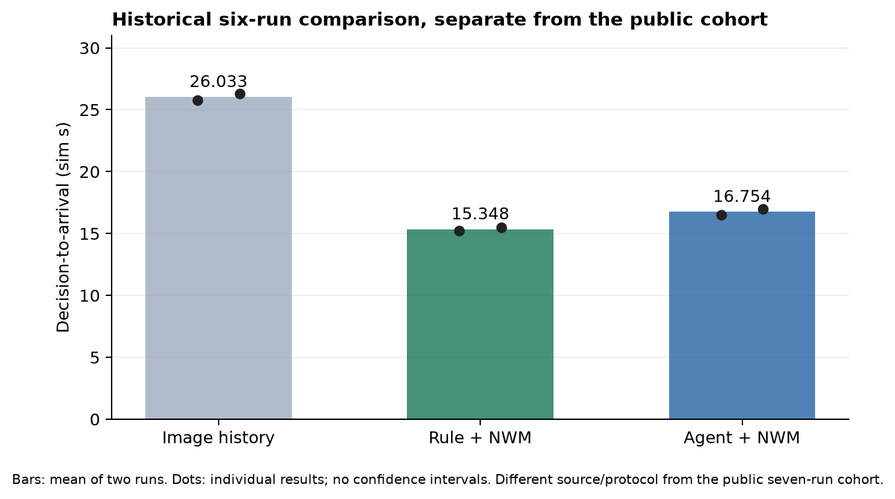
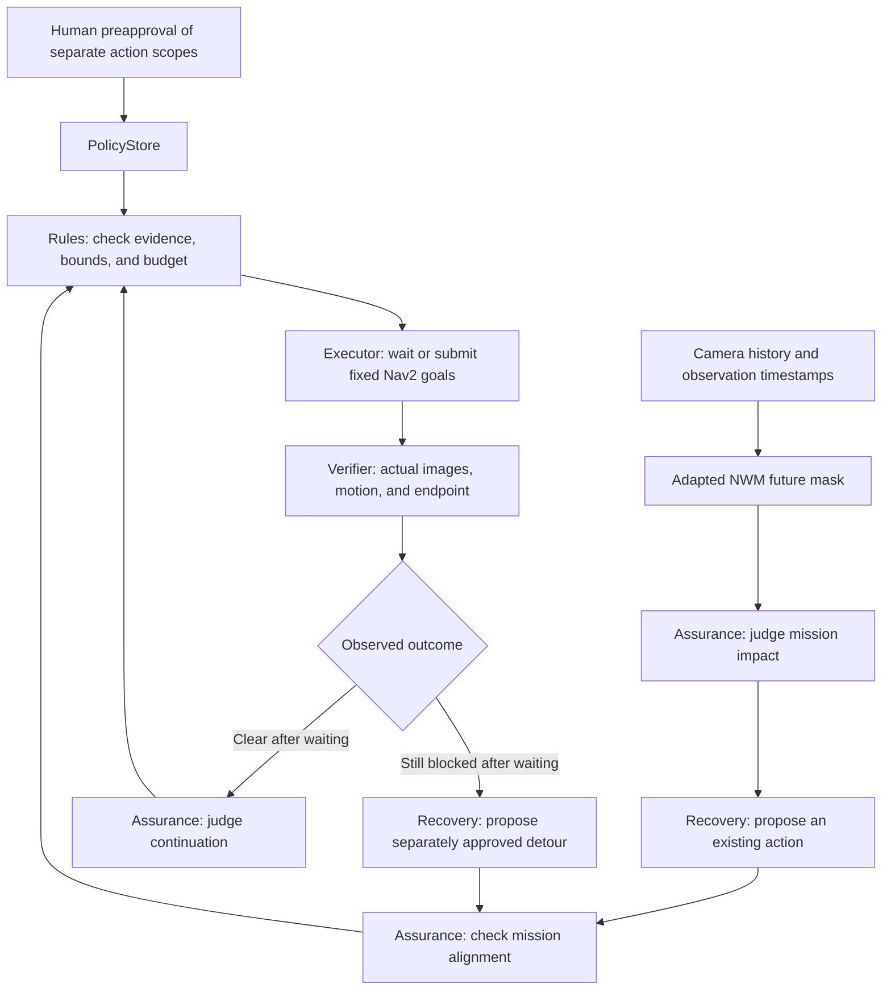
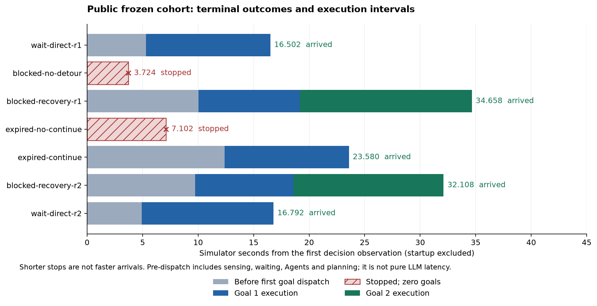
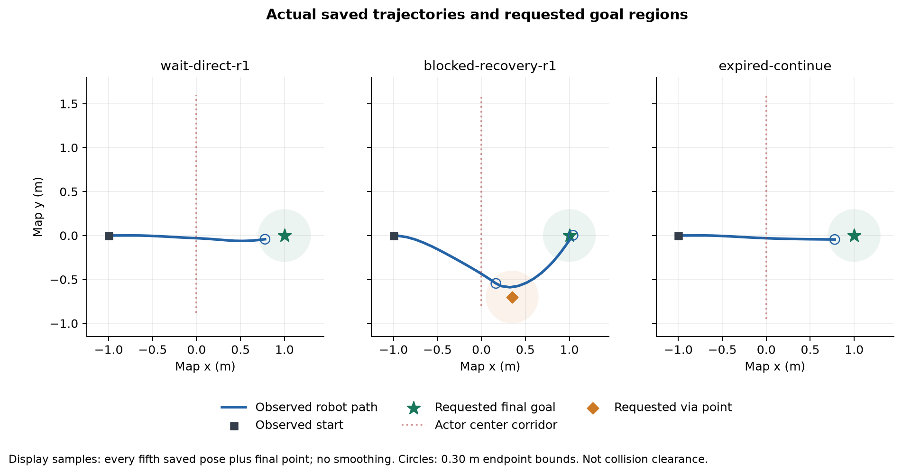
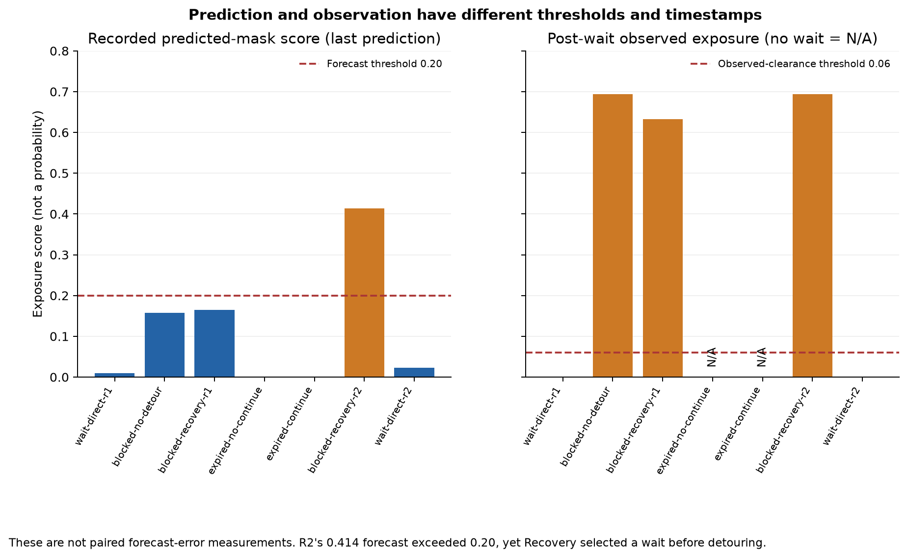

# Approved TB3 Recovery Using NWM Predictions and Actual Observations: Research, Implementation, and Verification Report

**Scope:** MissionOS local TB3 / Gazebo / Nav2 integration.

**Experiment date:** September 15, 2026. Historical comparisons: September 14–15, 2026.

**Public implementation evaluated:** `614361147ccd6d1263d8c4b538105b350d13de2c`.

**Work performed for this report:** Reconciliation, analysis, and visualization of saved execution records. No new model calls, additional training, or simulator trials were performed.

## Abstract

The objective of this work is to connect prediction-informed Agent judgment to approved execution and observation-verified arrival, beyond merely making world-model predictions available to an Agent. The initial task was a known TB3 scene in which the robot waits for a crossing obstacle to pass. The preceding implementation could reach the goal when the route cleared after waiting. However, it lacked an authorized next execution path when the route remained blocked, or when the prediction expired during Agent processing and the route subsequently became clear.

The public implementation connects the existing Assurance, Recovery, PolicyStore, Rules, Nav2 execution, and observation Verifier components through two additional paths. First, after a camera observation confirms that waiting failed, Recovery can propose a fixed detour that executes under a separate approval. Second, after prediction expiry and reobservation, Recovery can propose continuation to the original goal under a separate continuation approval if the route is actually clear.

In seven trials with frozen public source, both failed-wait detours reached the goal, one expiry/reobservation continuation reached the goal, and both original wait-then-direct trials reached the goal. Two controls without the required additional approval stopped without issuing any goal requests. Owned-container removal was verified in every trial. These are five observed arrivals and two intended authority stops, not an estimate of general success rate or speed superiority.

Detailed analysis also identified judgment-quality issues distinct from arrival. In one trial, Recovery selected waiting even though the forecast obstruction score exceeded its decision threshold; its explanation did not adequately establish why waiting would clear the route. In another, the Agent interpreted different PNG-file and raw-RGB hashes as a possible frame mismatch, although decoding the PNG reproduced the observation's RGB hash. The demonstrated capability is therefore **bounded execution that can recover from uncertain initial judgment through actual observations and separately approved actions**, rather than a guarantee of generally correct Agent decisions or explanations.

## 1. Research Questions and Evaluation Target

### 1.1 The problem

A capability that waits because a forecast suggests clearance remains narrow unless it also handles the next action when the prediction is wrong. If an obstacle remains after the wait, a correctly stopping Verifier still leaves the mission incomplete. Conversely, if the route becomes clear after the forecast expires, a wait-only entry contract may prevent continuation despite the new observation.

This work connects those observations to subsequent authorized actions. The evaluation target is the following causal and authority chain, rather than whether an Agent was invoked:

```text
Request obstacle speed, initial position, and delay conditions
→ Apply them to the simulator
→ Observe changes in obstacle position and time
→ Check post-wait blockage or clearance with the camera
→ Assurance judges the mission impact
→ Recovery proposes an existing action with supporting evidence
→ Check the separately approved Policy and Rules constraints
→ Executor submits fixed Nav2 goals
→ Verify actual motion, endpoint position, and native results
```

### 1.2 Research questions

| ID | Question | Main observations and checks |
| --- | --- | --- |
| RQ1 | Can the system recover and reach the goal after waiting fails? | Failed-wait image, Recovery proposal, Rules reservation, two native goal results, actual position |
| RQ2 | Is the recovery decision grounded in actual observation? | Canonical observation-reference equality, image hashes and timestamps, consistency between rationale and measurements |
| RQ3 | Does execution remain within human-approved bounds? | Controls without the relevant approval, goal-request counts, one-use budgets, fixed coordinates |
| RQ4 | Can expired predictions lead to appropriate reobservation? | Expiry events, renewed history, separate continuation approval, execution without consuming a wait reservation |
| RQ5 | Is the original post-wait direct path preserved? | Waiting, observed clearance, post-wait Assurance, arrival at the same goal |
| RQ6 | What cost, accuracy, and reproducibility constraints remain? | Wall and simulator time, invocation counts, tokens, endpoint error, external model dependencies |

RQ1, RQ3, RQ4, and RQ5 have positive execution evidence in this known scene. For RQ2, the recovery-stage observation references and actions have consistent evidence, but the initial wait selection and natural-language explanations retain the issues discussed below. RQ6 describes the applicability boundary; it does not certify a broad operating envelope.

## 2. Terminology and Relationship to Prior Research

NWM stands for **Navigation World Models**. The official paper and implementation address action-conditioned prediction for navigation using a Conditional Diffusion Transformer (CDiT). This experiment is not a reproduction of the official benchmark. It connects a task-adapted future-obstacle-mask predictor derived from NWM implementation and weights to MissionOS. See the [paper](https://arxiv.org/abs/2412.03572) and [official implementation](https://github.com/facebookresearch/nwm).

| Term | Meaning in this experiment | What this experiment does not establish |
| --- | --- | --- |
| World-model / WAM use | An umbrella term here for using action-conditioned predictions in decisions | The same result with an arbitrary WAM |
| NWM predictor | A host service producing a four-second future mask from an adapted CDiT | Reproduction of these numbers from stock public weights alone |
| Agent | An LLM returning a structured proposal from explicit observations, predictions, and permitted candidates | An entity free to invent coordinates, permissions, or execution results |
| Recovery | A role selecting existing actions such as waiting, a predefined detour, or original-route continuation | Learning a new controller or path-planning algorithm |
| Repair | A role modifying or generating procedures or skills when existing means are insufficient | Invocation of Repair in these trials |
| Chief | A role judging mission-wide objectives, priorities, and plan changes | End-to-end Chief integration through this CLI |
| VLA | A separate class of models relating vision, language, and actions | VLA inference in these trials |

No additional training was performed in this experiment. This does not mean that unadapted NWM was used directly. The experiment reused previously created task-adaptation weights; a complete reproduction of their training data, training process, and independent evaluation is outside this report's scope.

## 3. Research History: What Changed

### 3.1 Preserving the benefit of prediction through the Agent

The initial useful comparison ran image history only, deterministic Rules + NWM, and Agent + NWM twice each in a separate six-trial cohort. The saved execution receipts and referenced evidence hashes were rechecked during preparation of this report. The following historical comparison is not pooled with the current seven public-source trials.

| Method | First run, sim s | Second run, sim s | Mean, sim s | Action leading to arrival |
| --- | ---: | ---: | ---: | --- |
| Image history only | 25.780 | 26.286 | 26.033 | Detour |
| Rule + NWM | 15.214 | 15.482 | 15.348 | Wait, then direct |
| Agent + NWM | 16.528 | 16.980 | 16.754 | Wait, then direct |



The calculations are:

- Agent + NWM time saved: `26.033 − 16.754 = 9.279 sim s`.
- Reduction relative to image history: `9.279 / 26.033 = 35.64%`.
- Benefit achieved by Rule + NWM: `26.033 − 15.348 = 10.685 sim s`.
- Fraction of that benefit retained: `9.279 / 10.685 = 86.84%`.
- Additional time relative to Rule + NWM: `16.754 − 15.348 = 1.406 sim s`.

The result shows that the benefit of prediction-driven route selection could survive Agent mediation; it does not show that the Agent itself made processing faster. The historical record also contains offline replay of the image-history rule on the exact four Agent-input camera frames, which selected a detour. However, this was not a live ablation removing only NWM from the same Agent. The experiment does not completely separate the marginal contribution of model information from differences in Agent configuration.

Initial development attempts included Agent runs that stopped after prediction expiry and a run in which the simulated robot reached the goal but whose receipt was invalidated by source changes during execution. These were not replaced with successes. They remain distinct from the six trials performed after freezing the source again.

### 3.2 Changing obstacle speed exposed the limits of waiting alone

In the preceding speed-and-delay evaluation, the Agent path reached the goal by waiting and then proceeding directly at an obstacle speed of 0.30 m/s. At 0.18 m/s, it stopped because the post-wait observation remained blocked. The existing rule-based path could transition to a detour and reach the goal. This stop indicated a missing recovery execution path corresponding to the observation, rather than a Verifier malfunction.

Trials that injected eight wall-clock seconds after every prediction also stopped at the retry limit: even after reobservation, the next input became stale again. This is a different fault condition from the current experiment's eight-second delay on the first call only. Arrival under a single delay does not establish that repeated-delay failures have been resolved.

### 3.3 Retaining a bounded route-execution improvement

A separate preceding experiment changed the intermediate detour heading from the direction of the next segment, `outgoing`, to the bearing from the current position to the intermediate point, `incoming`. A four-trial independent confirmation produced the following results. Saved receipts and evidence hashes were rechecked for this report.

| Trial | Time, sim s | Final-position error, m |
| --- | ---: | ---: |
| outgoing-agent-r1 | 40.874 | 0.0121 |
| incoming-agent-r1 | 36.542 | 0.0399 |
| incoming-agent-r2 | 31.876 | 0.0613 |
| outgoing-agent-r2 | 42.780 | 0.0521 |

Mean time was 41.827 sim s for outgoing and 34.209 sim s for incoming: a difference of 7.618 sim s, or 18.21%. This was a local change to the intermediate pose constraint supplied to existing Nav2 control, not an improvement in LLM speed or learning. Intermediate-position errors of approximately 0.25–0.27 m were tolerated, so the result cannot be extended to precise passage through narrow waypoints.

An earlier eight-trial cohort included one outgoing Agent trial that stopped before goal dispatch after prediction expiry; its original all-arrivals gate failed. That failure was not replaced by the later four-trial confirmation. Incoming remains explicitly selected in the current experiment, while outgoing remains the default and the existing controller settings are preserved. No additional speed tuning is performed.

## 4. System Architecture and Responsibilities



The diagram describes role relationships; it does not imply unlimited reassessment. The implementation has a finite reobservation limit and one-use execution budgets. Initial Assurance `continue` requests an observation; it does not dispatch a goal directly.

| Stage | Input | Output | Prohibited inference or action |
| --- | --- | --- | --- |
| Assurance | Prediction, actual observation, mission situation | Proposed impact or continuation judgment | Approving its own proposal |
| Recovery | Referenced evidence and available existing responses | Action name and rationale | Inventing new coordinates or permission |
| Assurance graph | Recovery proposal and evidence | Mission-alignment assessment | Treating assessment as completed execution |
| PolicyStore / Rules | Preapproval, references, freshness, use limits | Reservation of a constrained execution budget | Reusing another action's approval |
| Executor | A reserved existing action | Waiting or fixed-goal submission | Executing Agent free text as a control command |
| Verifier | Actual camera, Nav2 result, actual position | Observed outcome and arrival verification | Treating artifact creation as physical achievement |

The human grants trial-specific, separately bounded authority in advance through CLI flags. This does not mean that a new human response was obtained for every proposal during the trial. PolicyStore preapproval is distinct from an individually renewed human approval.

## 5. Predictor and Agent Input Design

### 5.1 Inputs and outputs

The camera is configured at 320×240 and 8 Hz. Inference selects four history frames spaced 0.5 seconds apart and predicts a mask four seconds ahead under a hold action. The conditioning action represents zero displacement and rotation. The experiment does not optimize free flight or arbitrary action sequences.

Online future-mask inference from the adapted CDiT-S/2 is recorded as a single deterministic forward pass. Parent-model processing during initialization and warmup does not mean that a general diffusion video is generated for every online decision. The manifest identifies an input motion scale of 4.0 and a context period of 0.5 seconds. Execution uses Apple Silicon MPS on the host.

The common evidence supplied to the Agent includes observation time, prediction target time, reference hashes, current exposure, future-mask score, image-history approach assessment, thresholds, and uncertainty. The action already selected by the deterministic supervisor is excluded from the Agent's evidence. The runtime prefetches the prediction into the inference input; the model may request the same read-only tool result if needed. Runtime prefetch and a model-requested tool call are recorded as distinct facts.

The predictor does not receive the scene name, configured obstacle speed, future ground-truth images, or hidden obstacle position. Actual obstacle position is used to verify condition materialization and for retrospective visualization. This remains an experiment that trusts the simulator-side observation adapter; it is not a complete separation of the simulator from the trust boundary.

### 5.2 Do not conflate the two thresholds

| Metric | Value or processing | Interpretation |
| --- | --- | --- |
| Observed central-region red occupancy | Clearance threshold 0.06 | How much the synthetic red obstacle covers the central image region |
| Learned future-mask score | Forecast decision threshold 0.20 | A metric from a different output distribution, not a calibrated probability on the same scale as observed exposure |
| Approach assessment | Derived from object movement in image history | A possible approaching obstacle even when the central region is currently clear |
| Clipped object or mask | Uncertainty retained when the object is clipped at the image boundary | Image motion alone does not determine the future |

A four-second prediction and an observation taken after processing and replanning are not simply subtracted to obtain a forecast error. Their timestamps, representations, thresholds, and source images differ. This study did not measure prediction MAE, IoU, or calibration error.

## 6. Authority, Freshness, and Recovery Execution Contracts

### 6.1 Separate preapprovals

- `--run-sim`: Authorizes this local simulator invocation.
- `--approve-bounded-wait`: Authorizes one stationary wait while preserving the fixed goal: a four-second forecast window plus at most one additional second only when actual observations show clearance progress.
- `--approve-bounded-detour`: Separately authorizes the fixed two-goal detour after observed wait failure.
- `--approve-observed-continue`: Separately authorizes one original-goal continuation after observed clearance, without requiring an executed wait.

Additional approvals default off. The current CLI requires the Agent policy and basic wait approval for either additional grant, but original-route continuation does not consume the wait budget. Agent output cannot create approval.

### 6.2 Waiting and extension

Waiting ends relative to the original prediction target time. A new four-second wait does not start when the Agent response arrives. Consequently, time spent processing reduces the remaining executor wait.

The additional one-second observation extension is eligible only when the first actual observation satisfies `0.06 < exposure <= 0.25` and has improved by at least 0.10 relative to decision-time exposure. If exposure worsens by more than 0.05 relative to the first post-wait observation, the extension stops. A wall-clock deadline also applies; waiting is not unbounded. This extension is justified by new actual observations, not by claiming a five-second NWM forecast.

### 6.3 Expiry and renewed observation

The first prediction's observation and target times are retained and checked after Agent processing. A stale prediction causes acquisition of a new four-frame history. At most three planning attempts are allowed. The simulator and obstacle continue advancing during inference, Agent judgment, and injected delays.

When the new observation is clear, the runtime constructs an observation reference and Nav2 plan for the original goal, then invokes Recovery, Assurance, and a separate Rules budget. It checks imagery, stationarity, and the route again after Agent processing and enforces a two-simulator-second dispatch deadline. For a small callback ordering discrepancy in which the camera is less than 0.05 seconds ahead of the clock, it waits at most 0.25 wall seconds for the actual clock to catch up. It does not rewrite evidence timestamps to manufacture freshness.

### 6.4 Fixed route and arrival conditions

The initial position is approximately `(-1, 0)` and the final goal is `(1, 0)`. The detour passes through `(0.35, -0.70)` before reaching the same final goal. Maximum requested speed remains 0.20 m/s and final yaw remains zero. The Agent does not generate coordinates or headings.

Arrival requires native Nav2 success, actual motion, observed endpoints, the appropriate authority chain, evidence consistency, and owned-container removal. The incoming path checks both intermediate and final endpoints within 0.30 m of their requested coordinates. This bound is an endpoint acceptance condition, not obstacle clearance.

## 7. Experimental Design of the Public Seven-Trial Cohort

Source, model, and order were frozen before execution. Source/prompt edits and replacement of unfavorable trials were prohibited within the cohort. Scenario labels describe expected conditions; they do not override actual image assessment. Each CLI invocation was bounded to 420 host wall seconds, and no subsequent trial could start after unverified owned-container cleanup.

| Order and trial | Obstacle speed, m/s | Initial y, m | First Agent-input delay, wall s | Detour approval | Separate continuation approval | Intended check |
| --- | ---: | ---: | ---: | --- | --- | --- |
| 1 `wait-direct-r1` | 0.29 | -0.88 | 0 | No | No | Original wait-then-direct path |
| 2 `blocked-no-detour` | 0.16 | -0.80 | 0 | No | No | Authority control after failed waiting |
| 3 `blocked-recovery-r1` | 0.16 | -0.80 | 0 | Yes | Yes | Observation-grounded detour |
| 4 `expired-no-continue` | 0.18 | -0.95 | 8 | Yes | No | Continuation authority after expiry |
| 5 `expired-continue` | 0.18 | -0.95 | 8 | Yes | Yes | Original-route continuation after reobservation |
| 6 `blocked-recovery-r2` | 0.18 | -0.95 | 0 | Yes | Yes | Detour in another slow-obstacle condition |
| 7 `wait-direct-r2` | 0.30 | -0.95 | 0 | No | No | Confirmation of the original wait-then-direct path |

Despite the `r1/r2` names, some pairs are not independent repetitions of an identical condition. Both speed and initial position differ between the two detour trials and between the two wait-then-direct trials. Their simple averages should therefore not be treated as precise mean performance for a fixed condition.

The obstacle is a red box configured at 0.4×0.6×0.6 m. It is a synthetic actor moved through a prescribed position sequence, not an autonomous dynamic object learning reactions from contact. Position-application results and saved position series verify condition materialization, but do not establish realistic dynamics or contact properties.

Materialization was also rechecked from the saved series. For consecutive samples with increasing obstacle y below the cap region, defined as y < 1.59 m, the median position difference divided by time difference matched each configured speed: 0.29, 0.16, 0.16, 0.18, 0.18, 0.18, and 0.30 m/s. All recorded position-application receipts were accepted. Acceptance alone was not treated as materialization; actual position changes were checked as well. Sample counts and the method are included in the analysis JSON.

## 8. All Terminal Outcomes and Time Decomposition

| Trial | Observed terminal outcome | Goal requests | Decision-to-end, sim s | Final error, m | Remaining wait, sim s | Reobservations |
| --- | --- | ---: | ---: | ---: | ---: | ---: |
| wait-direct-r1 | Arrived after waiting, then direct execution | 1 | 16.502 | 0.2254 | 1.472 | 0 |
| blocked-no-detour | Still blocked after waiting; stopped within approved scope | 0 | 3.724 | No arrival | 1.350 | 0 |
| blocked-recovery-r1 | Arrived by detouring after failed waiting | 2 | 34.658 | 0.0424 | 1.014 | 0 |
| expired-no-continue | Reobserved; stopped without continuation authority | 0 | 7.102 | No arrival | Not executed | 1 |
| expired-continue | Arrived on the original route after reobservation | 1 | 23.580 | 0.2258 | 0.000 | 1 |
| blocked-recovery-r2 | Arrived by detouring after failed waiting | 2 | 32.108 | 0.0117 | 0.550 | 0 |
| wait-direct-r2 | Arrived after waiting, then direct execution | 1 | 16.792 | 0.2180 | 0.792 | 0 |

The stopped trials ended near the initial position, approximately 2.0004 m from the goal. These distances are not included in successful arrival-error aggregates. Conversely, direct-arrival errors of approximately 0.22 m must not be pooled with detour errors of approximately 0.01–0.04 m to claim that the entire system has centimeter-level accuracy. The acceptance bound in this cohort is 0.30 m.



The horizontal axis is simulator time since the first decision observation. Gray represents time before the first goal request; blue and green represent the respective Nav2 goal intervals; hatching represents termination without a goal request. Gray includes prediction, Agents, waiting, observation, and planning, so it is not pure LLM latency. A shorter stop is not a faster arrival.

### 8.1 Representative interval durations

| Trial | Decision observation to first goal request, sim s | Goal 1, sim s | Goal 2, sim s |
| --- | ---: | ---: | ---: |
| wait-direct-r1 | 5.302 | 11.200 | — |
| blocked-recovery-r1 | 10.042 | 9.134 | 15.482 |
| expired-continue | 12.392 | 11.188 | — |
| blocked-recovery-r2 | 9.744 | 8.842 | 13.522 |
| wait-direct-r2 | 4.920 | 11.872 | — |

Detour duration includes the failed wait and subsequent judgment and replanning, in addition to the two goal executions. Time is a secondary metric. The primary adoption rationale is the ability to recover after waiting fails.

## 9. Case Analysis: How Evidence Led to Actions

### 9.1 `blocked-recovery-r1`: detouring after failed waiting

Initial current exposure was zero and the future-mask score was 0.1644. Although the central region was currently clear, image history indicated an approaching obstacle, and Assurance and Recovery selected stationary waiting. After the remaining 1.014 sim s wait, the first observed exposure was 0.6940, which was ineligible for extension.

Reobservation after route planning still measured 0.6328, above the 0.06 threshold. Recovery cited this failed-wait observation and its reference to propose the fixed detour. The proposal passed Assurance graph alignment and reservation of a separate Rules budget. Execution followed renewed route planning and verification.

- Goal 1 started at episode time 12.046 and succeeded at 21.180.
- Its observed endpoint was approximately `(0.1650, -0.5450)`: inside the acceptance region, not exactly at the requested intermediate point.
- The final goal succeeded at 36.662, with observed endpoint approximately `(1.0423, 0.0025)`.
- Subtracting decision-observation time 2.004 gives 34.658 sim s total, with final error 0.0424 m.

The corresponding `blocked-no-detour` trial used the same speed and initial position, observed a failed wait, and stopped without sending a goal. This is the direct capability difference demonstrated by the implementation. However, Agent latency and camera frames were not identical. Both additional approval flags changed between the trials, so this is not a strict single-factor detour-only comparison. The evidence chain confirms that the budget actually reserved was the detour budget.

The actor center had already advanced to approximately y=1.1168 when detour dispatch began. The record establishes that the route was blocked at a post-wait observation, but not that detouring was optimal compared with waiting longer or checking clearance again. The comparison demonstrates recovery, not optimal route selection.

### 9.2 `expired-continue`: continuing after the prediction became stale

An eight-wall-second injected delay made the first prediction stale, and camera history was acquired again once. New images showed zero central exposure, and initial Assurance judged that intervention was unnecessary. That response did not immediately dispatch a goal.

The runtime next created an actual observation and plan for the original goal. Recovery proposed `resume_original_route`. Observation time was 12.130 and camera time was 12.126, with zero exposure and a stationary robot. A separate continuation Rules budget was reserved, followed by pre-dispatch observation and replanning, then one goal request. The run arrived in 23.580 sim s with final error 0.2258 m. Executed wait was zero and no wait Rules reservation was consumed.

The corresponding `expired-no-continue` trial also detected expiry and reobserved, but stopped with zero requests because separate continuation approval was absent. The change adds an execution path for observed clearance; it does not fabricate a positive wait or misuse another action's authority.

### 9.3 The original post-wait direct path

`wait-direct-r1/r2` had neither additional detour approval nor separate continuation approval. Each verified zero post-wait exposure, passed through `post_wait_assurance`, and arrived at the original goal. These are executions of the original post-wait branch, rather than regression checks silently redirected through the new no-wait continuation path.

### 9.4 Actual trajectories



Blue lines are saved actual position series. Stars mark requested final goals, the orange diamond marks the requested intermediate point, and open blue circles mark observed endpoints at native goal success. Shaded circles represent the 0.30 m observed acceptance regions. Display sampling selects every fifth saved sample plus the final point, without smoothing. Path-length metrics use the full series before display subsampling.

The red dotted line shows the actor center's coordinate corridor for reference; it is not an object footprint at a particular time or a safety clearance. Pose times use the latest simulator clock at receipt and do not establish exact synchronization with the position sensor.

## 10. Judgment-Quality Issues Hidden by Arrival Alone

### 10.1 Waiting despite a forecast above the obstruction threshold

The forecast score in `blocked-recovery-r2` was **0.4135**, against a forecast threshold of **0.20**. Initial Assurance also explained that the forecast exceeded the threshold and that an obstacle was approaching. Nevertheless, Recovery selected waiting, with a rationale stating that current exposure was zero but the forecast predicted an approaching obstacle within four seconds.

This supports intervening or stopping, but does not positively explain why waiting should clear the route. Post-wait exposure was in fact 0.6940, so waiting did not restore passability. The subsequent fixed detour reached the goal.

This trial should not be counted as a successful example of selecting an appropriate wait using NWM. **Recovery and arrival succeeded; the initial wait rationale was insufficient.** Rules correctly constraining authority, freshness, and use counts is distinct from guaranteeing semantic or temporal optimality of candidate selection. Determining whether waiting was the right initial choice requires comparing waiting, immediate detouring, short reobservation, or other permitted candidates under the same observation.



The left panel shows the last saved prediction in each run; in expiry trials, it is the prediction after reobservation. The right panel shows actual post-wait exposure, with N/A when no wait occurred. These are not same-time prediction/ground-truth pairs, and the figure must not be used to calculate prediction error or calibration accuracy.

### 10.2 Checking the Agent's explanation of differing image hashes

Recovery in `expired-continue` stated that the verification image hash differed from the observation image hash, suggesting a slightly different frame reference. Inspection of the implementation showed that the former hashes the **entire PNG file**, whereas the latter hashes the **raw camera RGB bytes**. Even for the same frame, these hashes differ.

For this report, the PNG was decoded to RGB and hashed again. The result matched the observation's raw-RGB hash. The same check was performed on the supporting images in both detour trials; all three matched. PNG-record timestamps also matched the corresponding observation timestamps.

This establishes that the verification image and observation agree after accounting for representation in these three cases. Treating the Agent's mention of uncertainty as inherently desirable would endorse an incorrect explanation. The hash interpretation was a misunderstanding and is recorded separately from successful arrival.

This was a retrospective audit during report preparation, not a newly added runtime check. Explicitly supplying the representation, hash target, and decoded-content match is a potential follow-up, but neither production code nor prompts were changed for this report.

### 10.3 Limits of free-text checks

The current implementation rejects known wording that claims collision freedom or safety in Recovery free text before Rules evaluation. The runtime separately states that successful route planning does not guarantee collision-free motion.

String checks are not general semantic verification. They do not establish that every paraphrased false claim will be detected or that a longer explanation is correct. Observation-reference equality, fixed actions, and approval constraints are necessary parts of the design, but they do not establish correctness of the entire natural-language reasoning process.

## 11. Timing, Invocation Counts, and Usage

### 11.1 Timing definitions

| Metric | Start and end | Included and excluded components |
| --- | --- | --- |
| Decision-to-end, sim s | First decision observation to terminal outcome | World time advancing during online processing; excludes startup |
| Decision-to-end, wall s | Same interval on the host clock | Actual elapsed wall time; distinct from simulator time |
| CLI wall s | CLI execution start to completed receipt | Model initialization, preparation, execution, and cleanup |
| Agent call wall s | Individual inference-call intervals | Sum after deduplicating invocations; not pure GPU compute time |
| Readiness wall s | Actual model readiness check before scene creation | Startup check; excluded from mission-judgment counts |

| Trial | Decision-to-end, wall s | CLI wall s | Unique mission inference calls | Sum of inference intervals, wall s |
| --- | ---: | ---: | ---: | ---: |
| wait-direct-r1 | 29.396 | 52.850 | 4 | 5.328 |
| blocked-no-detour | 6.578 | 27.891 | 3 | 3.840 |
| blocked-recovery-r1 | 71.206 | 93.510 | 6 | 12.619 |
| expired-no-continue | 12.483 | 34.713 | 1 | 0.980 |
| expired-continue | 41.371 | 64.575 | 3 | 7.328 |
| blocked-recovery-r2 | 65.524 | 89.258 | 6 | 12.558 |
| wait-direct-r2 | 29.245 | 52.020 | 4 | 5.647 |

Simulator and wall time should not be converted using a fixed factor: both processing load and simulation rate matter. The inference total must not be subtracted from simulator time to infer how long an Agent-free run would take. World state, subsequent observations, and route choices may themselves change.

### 11.2 Tokens and the cost-accounting boundary

Saved invocation records were deduplicated using the pair of prompt and response hashes. The same inference evidence can also be referenced within the Assurance graph, so naive recursive summation would double-count it.

| Accounting scope | Unique calls | Input tokens | Output tokens | Cached portion of input |
| --- | ---: | ---: | ---: | ---: |
| Mission judgments across seven trials | 27 | 154,706 | 4,524 | 30,976 |
| Pre-scene readiness checks | 7 | 2,569 | 35 | Not separately aggregated in this table |

Cached input is included in total input; it is not added again. The saved model identifier is `deepseek-v4-flash`. These totals cover recorded provider usage, not an accounting audit of the entire research history, earlier failed calls, or invoices.

No monetary total was measured. Tokens are not converted into currency without checking rates, cache billing, and billing units. The seven public-source trials reused existing local NWM assets and involved no new cloud GPU provisioning or training. This does not imply zero host energy or opportunity cost. Preparing this report processed saved data and incurred no additional Agent API calls.

## 12. What the Comparisons Establish—and What They Do Not

### 12.1 Main capability differences

1. Under matched obstacle speed and initial position, wait-only authority stopped after observed wait failure, while the additional recovery path used that observation to detour and arrive.
2. When the route became clear after expiry, a separate observation-based continuation contract handled the missing execution authority that prediction refresh alone could not supply.
3. Removing approval suppressed goal requests; the implementation did not invent broader authority to obtain arrival.
4. The original post-wait Assurance path was exercised on the public source and reached the goal.

### 12.2 Superiority claims not established here

- The current cohort did not include a live ablation removing only NWM from the same Agent, so the seven trials cannot isolate NWM's marginal causal contribution.
- The current recovery Agent was not repeatedly compared with the current deterministic NWM rule under the same conditions; greater speed or accuracy is not established.
- The additional image-history smoke arrived in 44.122 sim s, but it was a separate single-purpose check. Its difference from Agent arrival times is not a new measured speedup.
- Comparisons across generations differ in controller settings, route poses, and processing conditions. The historical 26.033 sim s and current 44.122 sim s should not be directly interpreted as evidence of regression caused by Agent integration.
- Intermediate-point tolerance means that an arrived trajectory need not be shortest, optimal, or precise.
- This role allocation was not compared with a single-Agent design or other models. Multiple roles are not claimed to be inherently superior.

### 12.3 Statistical limitations

These are small-scale mechanism checks with deliberate condition differences in a known synthetic scene. There was no random sampling, blinding, broad seed set, or prospective power analysis. Even `r1/r2` pairs can differ in speed and initial position; mechanically adding confidence intervals or significance tests would be misleading.

“All five intended-arrival trials arrived, and both intended-suppression trials suppressed dispatch” describes this protocol's observations, not a future success probability of 100%. The research emphasis is a traceable account of the conditions and evidence under which recovery worked.

## 13. Limitations, Failure Modes, and Applicability

| Factor | Confirmed scope | Remaining limitation |
| --- | --- | --- |
| Environment | One known synthetic TB3 scene with a red crossing obstacle | Unseen colors and shapes, multiple obstacles, narrow passages, and hardware not validated |
| Motion | Configured speeds 0.16, 0.18, 0.29, and 0.30 m/s with the listed initial positions | No comprehensive coverage of stopping, reversal, acceleration, or persistent blockage |
| Delay | One eight-wall-second delay on the first input | No arrival guarantee under sustained delays, faults, or provider variation |
| Prediction | Adapted four-second future mask | Equivalent benefit not established for stock NWM, another WAM, or another device |
| Judgment | Actual observations connected to recovery actions | Insufficient initial wait rationale and a hash-representation misunderstanding remain |
| Approval | Separate preapproved scopes, finite budgets, fixed actions | Not a generalization to arbitrary missions or dynamic permissions |
| Position | Arrival verified within the 0.30 m endpoint bound | No general guarantee of precise intermediate passage or centimeter-level accuracy |
| Contact | Zero contact messages in all seven trials; event counts are null | Unobserved contact cannot be interpreted as collision-free motion |
| Sensors | Actual camera and latest position/clock records | Not exactly synchronized; the observation adapter is trusted |
| Integration | Dedicated CLI through Assurance / Recovery / Rules / Nav2 | Not Gateway chat, Chief, Repair, PX4, or physical end-to-end validation |
| Reproduction | Public code, configuration specification, checked numbers, and plotting code | Adapted model assets are not bundled; complete external reproduction remains unestablished |

Missing contact data is material. Native Nav2 success and camera clearance do not establish zero collisions, improved collision rate, or safety certification. Route-planning evidence retains `collision_free_claimed=false`.

## 14. Reproduction and Evidence Layers

### 14.1 Published materials

| Published material | Purpose |
| --- | --- |
| [Short operational example](../examples/tb3-observed-recovery.md) | User-facing purpose, trial entrypoint, and applicability boundary |
| [Implementation contract and setup](tb3-predictive-navigation.md) | CLI, approval flags, model asset requirements, and execution commands |
| [Seven-trial evidence summary](evidence/tb3-observed-recovery-20260915.json) | Every terminal outcome, condition, and public runtime source hash |
| [Analysis data for this report](evidence/tb3-research-analysis-20260915.json) | Interval times, usage, image-identity audit, display trajectories, and selected historical comparison values |
| [Figure-generation code](evidence/plot_tb3_research.py) | Rebuilds four figures using only published numerical data |

The analysis JSON does not distribute raw Agent conversations or model assets. It contains reviewed synthetic-scene measurements, necessary phase names, and reference hashes. Original images, raw configurations, credentials, local paths, learned weights, and task databases are excluded. Figures display measurements; they are not additional robot experiments.

To regenerate figures only, install matplotlib in an analysis Python environment and run the following. It invokes neither external APIs nor a simulator and writes both PNG and SVG outputs.

```sh
python -m pip install matplotlib
python docs/agents/evidence/plot_tb3_research.py
python -m json.tool docs/agents/evidence/tb3-research-analysis-20260915.json > /dev/null
```

### 14.2 Execution entrypoints

See the implementation contract for environment setup. For the model-free path:

```sh
missionos navigation run tb3 --policy image-history \
  --config examples/navigation/tb3-history.json \
  --output output/tb3-history
```

This is a preview. Add `--run-sim` for local execution, then check the evidence with `missionos navigation status output/tb3-history`. Use a new output directory for every run.

With the external model assets supplied separately, an entrypoint including both recovery paths is:

```sh
missionos navigation run tb3 --policy agent-nwm \
  --config output/local/agent-config.json \
  --output output/tb3-agent-recovery \
  --run-sim --approve-bounded-wait \
  --approve-bounded-detour --approve-observed-continue
```

To reproduce the seven-condition comparison, remove the additional approvals according to the experimental-design table rather than granting every flag to every run. Fix speed, initial position, and first-call-only delay as listed. Exit 1 in a denial control is an intended terminal outcome; do not automatically retry it and replace it with success.

### 14.3 Hashes and reproducibility

Frozen public seven-trial protocol SHA-256:
`79911575a407a59801f174b39b31e3f039eb1768be81a19fc24765dc8557fd25`.

Task-model manifest SHA-256:
`c0267966223a3d673d48224fb20eec59708f23f6ce3e42ab2f75e562ad422825`.

NWM reference implementation revision:
`3f6cd8e70d6f2d1e2b9684acff510710135f0f41`.

Hashes identify the records and assets used. They do not make those assets obtainable or prove scientific validity of their contents. Stock NWM weights alone are not claimed to reproduce this adapted-mask output.

External model assets retain their own terms. See the [official NWM license](https://github.com/facebookresearch/nwm/blob/main/LICENSE.md); the MissionOS license does not grant additional model rights. The cohort reused an existing Garden image and did not validate a completely fresh build from the public Dockerfile.

### 14.4 E2E / Runtime Verification

The public checkout was installed in an independent environment for measurement. `missionos navigation run` exercised the actual model, live Agents, shared Assurance graph, PolicyStore, Rules, simulator execution, native Nav2 results, actual observations, and cleanup. `navigation status` was also invoked for every trial, checking receipts for both arrivals and stops.

The public implementation's full suite passed 2,668 tests. Python 3.11 and 3.13 CI also passed on the evaluated commit. CI does not substitute for simulator or external-model execution. Contract cases cover stale evidence, wrong references, missing/misused/replayed approvals, missing plans, coordinate-bound violations, and altered completion evidence.

Verification of this report addition consists of saved-evidence hash checks, numerical consistency checks, PNG-to-RGB identity checks, figure regeneration and visual review, and documentation link and formatting checks. Application execution logic was not changed.

## 15. Adoption Decision and Further Research

The adoptable result is a bounded path in the known TB3 crossing-obstacle scene that receives actual evidence of failed prediction-based waiting, transitions through separately approved Rules to a detour, and reaches the goal. A separate continuation path handles actual clearance after prediction expiry. These are additional options within a limited operating scope, while preserving existing paths.

To strengthen the scientific evidence, the following topics merit independent protocols rather than restarting speed tuning. These are proposed follow-ups, not completed experiments.

1. **Semantic consistency of decisions:** Define what justifies waiting when the future score is on the blocked side, and compare Rules, Agent, and Agent-without-NWM decisions on identical input.
2. **Explicit evidence representation:** Distinguish image-content hashes from file-representation hashes, and evaluate whether Agents avoid unsupported uncertainty claims.
3. **Changes between observation and action:** Compare detouring, rechecking then proceeding directly, and short waiting when the route has cleared after the failed-wait observation.
4. **Arrival envelope:** Freeze initial position, stopping/reversal, persistent blockage, multiple objects, and delay distributions as well as speed; retain every stop.
5. **Independent reproduction and model assets:** Separately establish publishable adaptation recipes, data, weights, and their terms, then verify reproduction in another environment.
6. **Contact verification:** Validate actual contact-sensor data before adding collision rate as an evaluation metric.

## 16. Conclusion

This work moved beyond exposing predictions to Agents and demonstrated, on public source, an example of reaching the goal after prediction-based waiting failed, using actual observations, separate approval, and Rules. It also demonstrated continuation from observed clearance after prediction expiry without fabricating waiting or reusing unrelated authority.

The same records show that initial candidate selection and natural-language explanation must be evaluated separately from arrival. The contribution is a **verifiable, bounded capability extension connecting recovery to execution outcomes while retaining prediction uncertainty, processing latency, actual observation, and approval boundaries**. It is not the acquisition of a universal Agent or a new general-purpose world model.
