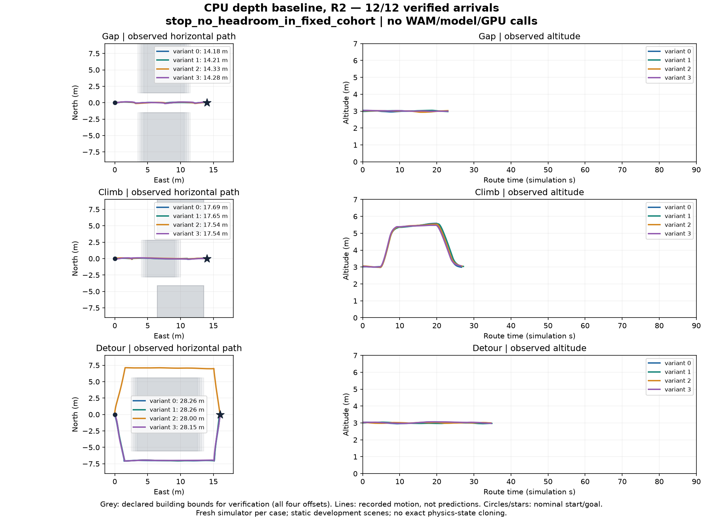
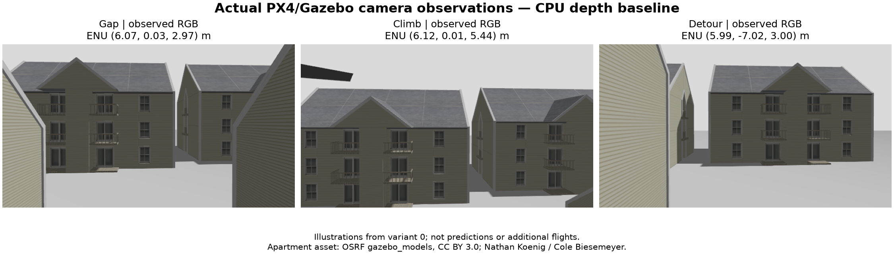

# Registered CPU headroom repeat R2 — 2026-09-24

This is a new twelve-case development cohort using the repaired contact-probe
lifecycle at commit `928cbf5cd57bcaed5e73f70b8be16e97685c775a`.
[Registration on PR #113](https://github.com/pome223/missionos/pull/113#issuecomment-5815010766)
preceded the first case. The [registration record](../assets/urban-headroom-r2-px4-20260924/registration.json)
binds source hashes, the frozen protocol, image, case order and resource guard.
The earlier cohort remains [closed as incomplete](urban-wam-headroom-20260924.md);
its three arrivals are not added to R2's denominator or success count.

The same static scene parameters and deterministic route/depth policy are reused.
This is a development repeat after an infrastructure repair, **not held-out data**,
randomized city coverage or an independent replication of learned-model benefit.
No scene, threshold or selector is changed in response to the new outcomes.

## Observed result and decision

All **12/12** registered cases reached the goal, completed the dwell, landed and
disarmed. Each passed the independent trajectory/contact verifier and removed its
owned simulator. No case failed, was retried, replaced or left unattempted.

| Static scene | Verified arrivals | Depth choice | Observed route length (m) | Maximum altitude (m) | Minimum envelope clearance (m) |
| --- | ---: | --- | ---: | ---: | ---: |
| Building gap | 4/4 | forward | 14.180–14.329 | 3.030–3.048 | 0.775 |
| Climb | 4/4 | climb | 17.541–17.691 | 5.476–5.587 | 0.809 |
| Lateral detour | 4/4 | left_detour or right_detour | 27.997–28.264 | 3.034–3.068 | 0.716 |

Clearance is the minimum over observed trajectory segments to the building AABBs,
minus the 0.6 m aircraft envelope. Building-contact notifications were zero;
each case separately passed a real positive contact control. Input age at dispatch
was **1.319–1.597 wall seconds**. Route execution took 22.964–34.852 simulation
seconds (114.835–174.260 wall seconds); these durations exclude preparation,
observation and landing. Arrival includes the separately verified landing/disarm.

`latest_depth` and `history_depth` chose the same route in all twelve cases. The
stale-map shadow chose forward in all twelve; the independent filter would reject
eight of those choices. These shadow decisions are **not eight observed crashes**
or a matched flight comparison. Only `history_depth` was flown.

The conservative extra-arrival ceiling is **12 - 12 = 0**, below the required
three. The registered decision is `stop_no_headroom_in_fixed_cohort`:
**no additional WAM inference, GPU rental or post-training in this fixed setup**.
This is useful baseline navigation evidence and a negative result for this
experiment's opportunity to establish WAM benefit. WAM was not invoked in R2.
There is no learned-navigation benefit claim or full candidate outcome matrix.
This arrival ceiling does not prove that route length or latency could never
improve; those gains were not established by this experiment.





The candidate templates are manually fixed by scene family. In particular, the
detour family offers forward/left/right, not a climb candidate. The result concerns
ranking those templates in static development scenes, not generating routes for
an arbitrary city. Fresh simulators do not establish exact physics-state cloning.
The camera images are actual Gazebo observations, not forecasts or real buildings.
See the [reviewed evidence and image attribution](../assets/urban-headroom-r2-px4-20260924/README.md).

The concrete engineering follow-up is to evaluate integration of this depth-based
baseline with MissionOS's normal PX4 simulator workflow. Reopening WAM research
would require a separately specified outcome gap and observable predictive cue,
established without model spend first; moving to training alone does not supply
that evidence.

## Fixed scope and stopping rule

Use four gap, four climb and four detour variants, in that order. Offset the
primary building(s) east by -0.45, -0.15, +0.15 and +0.45 m. The selector receives
an incomplete prior map and observed occupied surfaces; it does not receive truth
geometry, case identity, admissible-route masks or future outcomes. Execute the
frozen `history_depth` policy. `latest_depth` and `stale_map` choices are shadows,
not additional executed policies. A separate truth-based safety filter may reject
the fixed choice but may not substitute a route.

Retain the [original measurement contract](urban-wam-headroom-20260924.md): sixteen
aligned RGB-D/pose frames, at most 60 wall seconds input age, initial-position
error <=0.15 m, heading error <=0.03 rad and speed <=0.1 m/s. Require goal radius
0.3 m, one simulation second dwell, landing and disarm; route limits are 90
simulation seconds and 450 wall seconds. A real positive building-contact control,
observed sphere removal and zero probe exit are mandatory before flight.

Any incomplete case, contact, safety violation, runtime or measurement failure
stops the cohort without retry or replacement. Before each case require at least
512 MiB free storage. An incomplete measurement is not silently counted as a
learned-model failure. Record all attempted and unattempted cases. Collect twelve
baseline cases unless a stop condition occurs; retain the earlier cohort separately.

With B verified safe baseline arrivals, `oracle additional arrivals <= 12 - B`.
Ten or more baseline arrivals make the preregistered required gain of three
impossible **in these fixed conditions**. This upper bound does not require a
full candidate matrix and must not be described as one. A larger remaining bound
alone does not admit WAM: restoration/candidate outcomes, observability and a
fixed navigation scorer remain necessary. Additional model, Jev and GPU calls
permitted by this registration: **zero**. No physical hardware is used.

## Runtime reproduction

Use a new caller-local directory and verified pinned urban assets. Keep retained
instructions, signatures and raw sensor histories local.

```sh
python scripts/px4_urban_headroom_trial.py --phase freeze --output-dir "$RUN"
RUN_PX4_URBAN_WAM_TRIAL=1 python scripts/px4_urban_headroom_trial.py \
  --phase run --output-dir "$RUN" --assets-dir "$ASSETS" \
  --image sha256:79968fe25aa19d51c49fbd4a863ea9380f4efe6d9afabd1c579ddeffeb8b8c93 \
  --approved-instruction-ref "$RETAINED_INSTRUCTION_REF"
python scripts/verify_urban_headroom.py --root "$RUN" --output "$REPORT"
```

The actual local launch was:

```sh
RUN_PX4_URBAN_WAM_TRIAL=1 PYTHONPATH=. "$PYTHON" -u "$REGISTERED_LOCAL_DRIVER" > "$RUN_LOG" 2>&1
```

Here `$PYTHON`, `$REGISTERED_LOCAL_DRIVER` and `$RUN_LOG` denote caller-local paths.
The retained driver hash is published in `registration-timing.json`; the portable
repository CLI equivalent is shown above. R2's driver invoked the frozen
`run_case` API in the declared case order and checked the preregistered storage floor
before each case and ran the read-only cohort verifier after each completed case.
It stopped if verification failed. Neither that driver nor the registered runner
has GPU/model capability. Each case uses a fresh network-isolated simulator and
removes its owned container after completion or failure.
