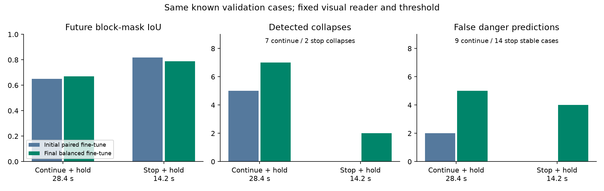
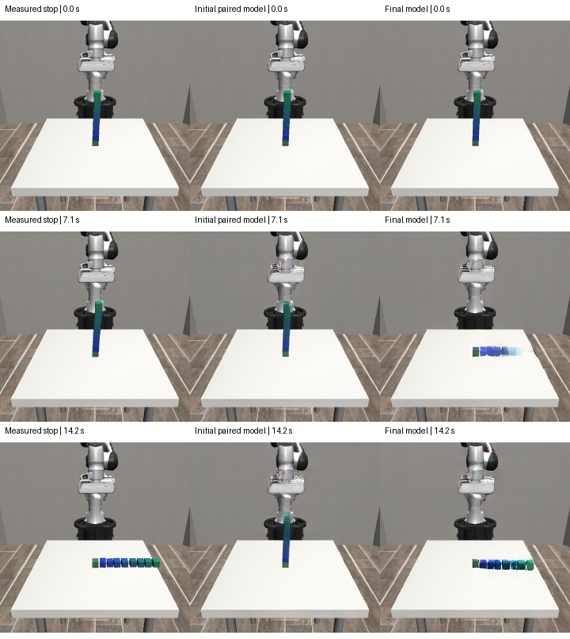

# Forecasting Whether Stopping Will Save the Tower

## A bounded terminal-hold study with ACWM and MissionOS

### Abstract

We extended a neural ACWM from a single placement forecast to two action-conditioned futures: placing the next block and then waiting for stability (28.4 seconds), or stopping immediately and waiting (14.2 seconds). Both futures use the same current image, state, physical properties, and registered placement plan. A first paired fine-tune improved video overlap but missed both stopping collapses in the validation set. We then added the six unused stopping-collapse examples available in the source training split and balanced training exposure across option and outcome. We kept the visual reader and threshold fixed. On the fixed primary validation generation, the final model detected 2/2 stopping collapses with 4 false alarms among 14 stable stops, and 7/7 continuation collapses with 5 false alarms among nine stable continuations.

MissionOS represents the two forecasts as model-inferred evidence with separate horizons. A loopback HTTP regression exercises their admission into Assurance and preserves the existing approval, Rules, dispatch-ticket, and measured-outcome boundaries. This study closes with the measured limitations and a reusable experimental contract; it does not report a new game-score benchmark.

## 1. Question and relation to earlier work

The online ACWM benchmark in [#110](../../agents/acwm-online-stacking-20260921.md) generated a 14.2-second placement future before actual SmolVLA execution. Three games subsequently collapsed after choosing to stop. The governed integration in [#111](../acwm-governed-stacking-20260921/REPORT.md) separately demonstrated the DeepSeek/approval/Rules/execution/verification path. The present work starts from the common Assurance architecture merged in [#108](https://github.com/pome223/missionos/pull/108).

Our question is concrete: **can the generated future distinguish “stop now and retain the tower” from “stop now but the tower still falls”?** We also extend the continuation forecast to include the same terminal hold. This is a model-and-contract follow-up, not another evaluation of LLM judgment.

Before training, we restored three known failure states, seeds 68006, 68022 and 68034. Stopping at nine blocks reproduced collapse and zero points in each. Stopping one placement earlier produced eight stable blocks after the full 14.2-second hold in all three. The resulting 24-point headroom is an observed counterfactual opportunity, not points earned by the new model. These states were excluded from training and validation and used only as a known-case diagnostic after model freezing.

## 2. Predictor and available information

The predictor is the previously adapted **ACWM neural VideoDiT future generator**, fine-tuned again. Its inputs are the current 240×240 image; current object poses and velocities; size, mass, friction and center-of-mass properties; robot state; count; and the registered next-placement target/macro. A 253-dimensional state vector conditions the neural generator. The two options have separate predeclared macro tokens. No realized future SmolVLA action sequence, future frame, or collapse label is an inference input.

Saved motor commands are used to replay **supervised target movies**, a different role from supplying future actions to the predictor. The six added stopping movies were re-rendered from saved simulator states, and their sampled drop labels agree with the source outcomes. All eleven positive stopping starts (nine training, two validation) were below the 30 mm collapse threshold initially; the largest initial drop was 11.93 mm. The positive labels therefore concern subsequent hold behavior. Small replay differences remain; the package does not claim bit-exact identity of every target trajectory.

Each option generates 37 frames. Continuation spans 568 simulator steps; stopping spans 284 steps at 20 Hz. Consequently continuation has twice the temporal spacing of the stopping video. We retain the existing 10-step diffusion inference and a frozen VAE. Future-only flow-matching loss weights the block region. Initial-frame masks and future target masks are training loss weights only, not inference inputs.

A separate logistic visual reader maps 28 image-derived features to an uncalibrated collapse score. The reader was fitted on the initial 72 measured training movies. The final experiment keeps this reader and its 0.5 threshold unchanged. It is the output interpreter, not a replacement for the neural future generator. Scores should not be interpreted as physical collapse probabilities or substituted directly into expected-score arithmetic.

## 3. Data and the fixed final attempt

The initial paired trial used 36 training starts × two branches: 72 movies. Its stopping branch contained only three collapse examples and 33 stable examples. Its continuation-plus-hold branch contained 15 collapses and 21 stable examples.

A scan of all 417 recorded placements in the source training split found nine stopping-collapse cases. We added the six not already selected, producing **78 training movies**: 42 stopping movies (9 collapse / 33 stable) and the unchanged 36 continuation movies. New stopping cases were 58017/8, 58025/7, 58028/10, 58035/7, 58038/10 and 58041/9; the number after the slash is the proposed next block, so the stopped tower has one fewer block.

Reloading the starting checkpoint reproduced all 32 primary readout scores and both published IoU metrics exactly before further training.

The final schedule allocated 180 training attempts to each option/outcome stratum: stop/stable, stop/collapse, continue/stable, continue/collapse. It used 720 further attempts, learning rate 2e-5, and the last checkpoint only. The run completed 720 successful parameter updates and 0 overflow skips in 720 attempts; optimization itself took 148.7 seconds.

Validation remained **16 physical starts, two branches each**, from six source-validation seeds. Ten starts belong to seed 59000; the cases are therefore clustered and are not 32 independent games. Stopping has 2 collapse / 14 stable outcomes, and continuation-plus-hold has 7 collapse / 9 stable outcomes. These validation starts had already been inspected in earlier work. This final attempt is a known-validation repair, not an independent held-out demonstration of general improvement.

The condition file and artifact digests were frozen before the final GPU run. A packaging issue initially made the encoder encounter macOS metadata sidecars; before any parameter update, enumeration was restricted to the declared training/validation filenames. Model, data and optimization conditions were unchanged. Model selection, threshold tuning and repeated attempts stopped there. Noise seed 195 is the primary measurement; 196 is a sensitivity check on the same physical starts. Sampling balance, six added movies and further optimization all changed together, so this is not a causal ablation of data count alone.

## 4. Measured results

| Model / noise | Future | IoU | Last 3 IoU | TP | FP | TN | FN | Generation p95 (s) |
|---|---|---:|---:|---:|---:|---:|---:|---:|
| Initial paired /195 | Continue + hold | 0.650 | 0.520 | 5 | 2 | 7 | 2 | 1.31 |
| Initial paired /195 | Stop + hold | 0.818 | 0.691 | 0 | 0 | 14 | 2 | 1.31 |
| Final balanced /195 | Continue + hold | 0.670 | 0.626 | 7 | 5 | 4 | 0 | 1.30 |
| Final balanced /195 | Stop + hold | 0.788 | 0.694 | 2 | 4 | 10 | 0 | 1.32 |
| Final balanced /196 | Continue + hold | 0.672 | 0.653 | 7 | 2 | 7 | 0 | 1.30 |
| Final balanced /196 | Stop + hold | 0.790 | 0.666 | 2 | 4 | 10 | 0 | 1.31 |

Figure 1. Continuation and stopping detection, and block-mask overlap, on the same known validation cases. Error bars are omitted because the cases are a small clustered diagnostic set, not independent games.



Each case's block-mask IoU is the mean over the 36 generated future frames, excluding the known initial frame. We then average cases equally within each option. Empty/empty masks count as IoU 1. Color masks use the same fixed rules before and after training. The last-three-frame metric isolates the end of the horizon. Per-case metrics and classifications are published; the verifier recomputes their aggregates. Full unquantized videos, training data and model weights are not included in this compact public package.

Generation p95 measures diffusion generation plus decoding from an already encoded current frame. It excludes image encoding, visual readout, network transport and MissionOS admission. It is not end-to-end decision latency.

The visual reader applied to **measured**, rather than generated, validation movies detects 7/7 continuation collapses and 1/2 stopping collapses, with no false positives. This separates an existing reading limitation from the generator's errors. Higher average IoU alone is insufficient: most stopping movies are stable, so a generator can preserve a plausible standing tower while missing the rare fall.

The final primary generation detected all seven continuation-collapse branches and both stopping-collapse branches. This is a concrete recovery of the missing stopping behavior. It also increased false danger predictions: continuation false positives rose from 2 to 5, and stopping false positives from 0 to 4. The continuation false-positive count exceeds the fixed limit of 3, so the primary gate fails. Noise 196 reduces continuation false positives to 2, but was not substituted for the predeclared primary noise.

Figure 2 shows what changed in an actual generated movie. The initial model leaves the tower standing, whereas the final model depicts fallen blocks by the end of the hold. It predicts that fall too early: at 7.1 seconds the measured tower still stands. In this case, last-three-frame IoU improves from 0.063 to 0.607, while whole-future IoU decreases from 0.645 to 0.484. Correctly flagging collapse and accurately reconstructing its timing are distinct results. The other positive stopping case is flagged despite being missed by the reader on the measured movie; the 2/2 classification result therefore should not be read as two accurate physical trajectories.



Figure 2. One fixed stopping-collapse case (seed 59000, before block 10). Left: measured movie; center: initial paired model; right: final balanced model. This example is not a replacement for the full case table.

The fixed primary gate requires each branch's IoU ≥0.5, continuation TP≥5/7 and FP≤3/9, stopping TP≥1/2 and FP≤4/14, generation p95≤120 seconds, all outputs and the full training schedule. The final model **did not pass** this predeclared primary gate. The second noise result is reported without using it to select a checkpoint or noise seed.

### Known failure-state diagnostic

| Seed | Current blocks | Continue score | Stop score | Measured stopping outcome |
|---|---:|---:|---:|---|
| 68006 | 8 | 0.9501 | 0.0162 | 8 stable points |
| 68006 | 9 | 1.0000 | 0.0789 | Collapse, 0 points |
| 68022 | 8 | 0.9904 | 0.1144 | 8 stable points |
| 68022 | 9 | 1.0000 | 0.1295 | Collapse, 0 points |
| 68034 | 8 | 0.9999 | 0.9756 | 8 stable points |
| 68034 | 9 | 0.9999 | 0.9999 | Collapse, 0 points |

These are current-state predictions at restored known starts, followed by comparison to saved/measured branch outcomes. We did not run a new sequential game, ask DeepSeek to select these options, or convert these scores into a claimed game total.

## 5. MissionOS contract and runtime boundary

The opt-in `StackingACWMOptionsPredictor` requires both continue and bank options, exact option horizons, pinned model/readout/policy bindings and a generation invocation reference. Each backend call receives an isolated copy of the same validated current input. Future-action and outcome fields are rejected before backend access. A missing or invalid branch makes the whole forecast unavailable.

`GovernedACWMOptionsSession` admits both forecasts into Assurance as model-inferred evidence. Its judge instruction explains the unequal horizons and the fact that stopping can fail. It does not fabricate expected points from uncalibrated scores. The existing bounded human pre-authorization, Rules checks, tickets and verifier remain separate. Jev is optional and is not enabled by this change.

A real loopback HTTP test covers prediction → Assurance intake → a synthetic judge → Rules/ticket → a synthetic measured-result receipt, including stale/approval/revision mismatch rejection. It also checks that a 14.2-second placement observation cannot verify a 28.4-second forecast. This exercises production boundary code with fixtures; it is not a new live-neural/DeepSeek/SmolVLA run. The adapter is experimental, has no default service startup, and does not replace the model used in the earlier online benchmark.

## 6. Closure and evidence

**The bounded improvement attempt is complete.** Additional stopping-collapse data and balanced training recovered stopping-collapse detections on the known validation cases, while exposing a false-alarm cost and residual timing errors. We retain the final measurements and the opt-in two-option contract, and leave the established online model unchanged.

The known-state diagnostic reinforces this choice. At eight blocks, all three continuation scores now exceed 0.5, but one stable stopping branch (68034) is also flagged. At nine blocks, the model still misses stopping collapse in 68006 and 68022. These residual errors and the failed primary gate are part of the result, rather than a reason to keep tuning until the report looks favorable.

The last training attempt, sensitivity generation and known-case checks complete this study. We do not add games until a desired result appears. The earlier 40-game totals remain unchanged. Any future work would begin as a separate question, with fresh validation and explicit compute authorization.

The public verifier checks artifact hashes, PNG structure/decompression, case counts/uniqueness, fixed labels, risk/threshold consistency, confusion matrices, per-case quality aggregates, the training exposure schedule and the declared gate. Negative tests deliberately corrupt rows, labels, aggregates, images and schedule records while refreshing the manifest, so a correct hash alone cannot hide an inconsistent result.

```sh
python docs/assets/acwm-stop-forecast-20260922/verify_report.py
python -m pytest docs/assets/acwm-stop-forecast-20260922/test_verify_report.py -q
```

The packet supports verification of published measurements and their internal consistency. Re-running neural training or physical simulation still requires the original model/data/runtime harness. GPU resources were deleted after local collection and checksum verification; costs are estimates rather than a finalized invoice.

### Artifact identities

| Artifact | SHA-256 |
|---|---|
| Starting paired ACWM | `0ff787c04f9394b8c83a18a6af158348138706e52015edd8767d94c28f6d9e9a` |
| Final ACWM | `dd7d4c941909ccf0ccdcbaad4ddd4c6353d2d35bac3c3975e322161bc3fe5310` |
| Unchanged visual reader | `162fc037bb3f3270be1270c16412c36688617190167a3536c0a19e00c221daac` |

The final VM had a one-hour automatic-deletion limit. The conservative cumulative cost estimate is $7.54 against the $10 cap, including a storage/network reserve; the exact invoice remains unconfirmed. Both the instance and its dedicated disk were verified absent.
