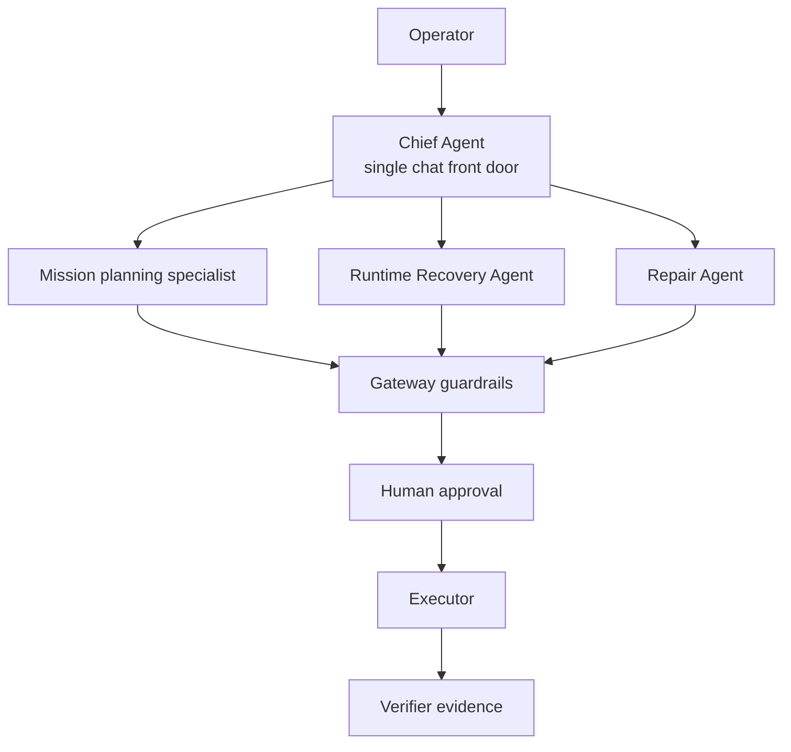
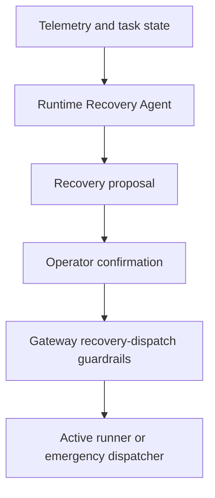
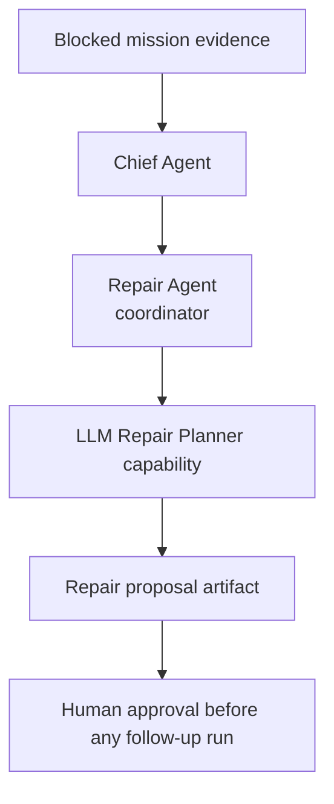

# MissionOS Agent Roles

MissionOS uses agents to judge and propose. Agents do not approve, dispatch,
execute, verify, or claim mission completion.

The shortest version is:

```text
LLM judges.
Human approves.
Rules constrain.
Executor acts.
Verifier checks.
Repair loops.
```

## Where Each Agent Appears

| Surface | What the operator is doing | Main agent or boundary |
| --- | --- | --- |
| `missionos chat` | Planning a mission, asking questions, approving/rejecting, asking for repair | Chief Agent plus specialist agents |
| `missionos operate` | Watching an active task and requesting in-flight recovery actions | Runtime Recovery Agent |
| `missionos chat` with `/repair` | Asking what to change after a blocked or failed mission | Repair Agent |
| `missionos watch` / `missionos map` | Reading evidence and route state | Display surfaces, not agents |

## The Simple Mental Model



The Chief Agent is the conversation front door. It reads the operator request
and proposes which specialist should think next. The Gateway still keeps the
authority boundary: it validates, records artifacts, asks for human approval,
and prevents unapproved execution.

## Mission Planning

Mission planning is the normal `missionos chat` flow.

```text
operator asks for a route
-> Chief Agent chooses mission_designer_plan
-> Mission Designer tools resolve route, weather, payload, terrain
-> MissionOS returns a bounded plan
-> human approves or asks for changes
```

This can produce a plan for PX4/Gazebo, but planning alone does not prepare
SITL, upload to PX4, dispatch, count progress, or prove delivery.

## Runtime Recovery

Runtime Recovery is the active-mission path. This is what `missionos operate`
is for.

The Runtime Recovery Agent can look at telemetry, route progress, battery,
altitude, terrain clearance, obstacle evidence, wind drift, and endurance risk.
It may propose bounded actions such as:

- `return_to_launch`
- `land`
- `adjust_altitude`
- `adjust_speed`
- `reroute`
- `avoid_obstacle`
- `operator_review`

Parameterized actions still require bounded numeric values and normal operator
confirmation. The agent proposal is not a dispatch.



## Repair

Repair is different from Runtime Recovery.

Repair is for after a mission is blocked, after a run fails verification, or
when MissionOS needs a better next-run plan. It is not the in-flight controller.

In the current UX, Repair appears through `missionos chat`:

```text
Mission blocked: wind_over_live_sitl_contract, payload_split_required.
Repair Agent can draft a next-run repair proposal.
Type /repair to analyze this blocked evidence.
```

Then `/repair` asks the Repair Agent to hand source-bound blocked evidence to
the LLM Repair Planner capability.



Repair may suggest changes like payload split, retry conditions, route
adjustments, or extra evidence collection. It still must not approve, dispatch,
execute, alter a live vehicle, claim progress, or claim delivery completion.

## What Is Not An Agent Yet

`missionos operate` is an operator console backed by Gateway routes and recovery
dispatch logic. It is not currently a separate "Operations Agent." It is where
the Runtime Recovery Agent's in-flight proposals and operator-approved recovery
commands are surfaced.

For desktop convenience, an interactive `missionos chat` live flight can open
`operate`, `watch`, and `map` companion terminals for the active task. Those
terminals are still just operator/evidence surfaces; closing chat stops the
companion terminals it started.

This distinction matters:

- Runtime Recovery Agent: active mission, telemetry-driven, can propose recovery.
- Repair Agent: post-block or next-run planning, can propose repair.
- Gateway: authority boundary, approval records, dispatch checks, execution
  routes, evidence persistence.
