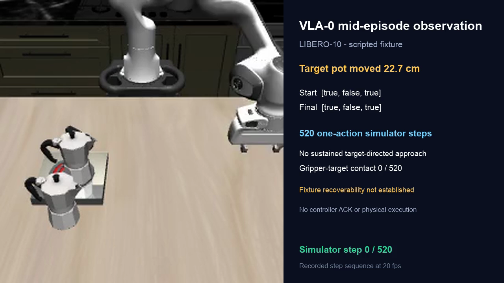

# Manipulation VLA Repair progress: GR00T, Cosmos Policy, and VLA-0

MissionOS is testing a narrow question that ordinary benchmark success does not
answer:

> After a manipulation task has partially succeeded and the world no longer
> looks like a normal episode start, can the policy produce a new trajectory
> that repairs the remaining failed predicate without breaking what is already
> correct?

This is why MissionOS keeps policy inference, human approval, bounded dispatch,
simulator effects, verifier predicates, controller ACK, and physical execution
as separate facts.

## Progress so far

| Policy | Control | Repair observation | Boundary |
| ------ | ------- | ------------------ | -------- |
| GR00T N1.7 | The same saved diagnostic snapshot was recoverable by a deterministic planner through the same 7D interface in 81 actions | GR00T did not recover it in 10 diagnostic clones across two instructions; the native same-world cohort also observed target improvement in 0/5 Repair loops | The saved-state displacement was only 4.1 mm, so this is a useful control but a threshold-adjacent case |
| Cosmos Policy LIBERO 2B | On the aligned 3 cm fixture, a privileged controller made contact after action 32, reached all three predicates after action 33, and retained them for 20 steps in 3/3 replays | Cosmos applied 128 actions but produced no contact, about 1 nm of target motion, and no predicate recovery | One checkpoint, task, fixture, and seed; diagnostic MuJoCo clone only |
| VLA-0 | The same 3 cm fixture, instruction, 128-action ceiling, and oracle admission | VLA-0 engaged and moved the target in 3/3 policy trials and entered all three predicates in 2/3, but the two successful traces each lost the repaired predicate on the fifth stationary hold step | Corrective targeting was observed; 20-step stable completion was 0/2 fixed-action replays and is not established |

The aligned Cosmos and VLA-0 rows are the clearest comparison because they use
the same snapshot digest, task, instruction, action ceiling, actual predicates,
and positive control. They separate three capabilities that a terminal success
bit would otherwise collapse:

1. **Target engagement.** Does the policy reach and move the failed object?
2. **Predicate entry.** Does the actual simulator ever reach `[true, true,
   true]`?
3. **Stable completion.** Does that conjunction survive 20 stationary hold
   steps without breaking a protected predicate?

Cosmos did not pass the first layer in its bounded 3 cm trial. VLA-0 passed the
first layer repeatedly and the second layer twice, but did not pass the third
layer in either replayed successful trace. The fresh stability trial also
showed variability: it contacted the target after action 67 and moved it by as
much as 14.06 cm, yet ended after 128 actions at `[true, false, true]` and never
entered the hold gate.

This supports an executor-dependent difference in corrective targeting. It
does not support a stable VLA-0 Repair claim, a general recovery rate, or a
claim about VLA architectures as a class.

The GR00T measurement uses a different failure state and is not a leaderboard
comparison. Together the results show why nominal task execution,
verifier-backed recoverability, target engagement, predicate entry, and stable
completion must be measured separately.

## Does the Cosmos result only apply to moka pots?

We added a second diagnostic task: pick up a black book and place it in the
back compartment of a desk caddy. The fixture starts from a successful
demonstration, injects a 3 cm horizontal displacement, and then lets the book
fall and settle. Its final displacement from the successful position is 5.31
cm. The actual predicate remains false, while both policy cameras visibly
change and the caddy and a protected mug remain fixed.

A privileged 7D controller contacts the book after action 9, reaches the
predicate after action 13, and then retains it for 20 stationary steps, in 33
total actions and 3/3 identical runs. Cosmos Policy also passes the
ordinary version of this task, reaching the actual goal predicate after 166
actions. On the displaced snapshot, however, it applies all 128 admitted
actions without contacting or moving the book. Its end effector moves from
18.14 cm away to a minimum of 14.65 cm at action 52, then finishes 20.67 cm
away. This is an approach followed by retreat, not a trajectory converging on
contact.

This strengthens the bounded observation that the tested Cosmos checkpoint's
failure is not unique to the moka-pot scene. It is still only one additional
task, init state, seed, and fixture. It does not establish a Cosmos Policy or
WAM failure rate, and it does not by itself explain which training or
architecture difference causes the behavior.

The pinned VLA-0 runner did not pass the nominal-control gate for this second
task: it applied the 520-action ceiling and the actual predicate remained
false. The displaced-snapshot Repair stage was therefore not run. This is not
a VLA-0 Repair failure and does not support an executor-to-executor Repair
comparison on the book fixture; it records only that VLA-0 Repair was
unmeasured under this fixed protocol because its nominal control did not pass.

The detailed contract is in the
[book-to-caddy comparison](../agents/libero-book-caddy-repair-comparison.md).

See the [GR00T recoverability control](groot-snapshot-recoverability.md) for the
earlier saved-state result. The older 22.7 cm VLA-0 experiment below is retained
as historical context; the aligned 3 cm comparison above is the primary result.
In that earlier record, the oracle recovered the fixture in 517/520 actions;
the separate VLA-0 trace showed no sustained or meaningful target-directed
approach and no gripper-target contact.

## Why the aligned 3 cm fixture is primary

The first Cosmos experiment used a 22.7 cm displacement. It was visibly clear,
but its privileged controller needed almost the entire 520-action budget and a
special push strategy. A later 0.5 cm fixture was easy for the controller, but
raised a fair question about whether the camera could see the displacement.

The final seed-aligned sweep selected 3 cm because it closed both problems:

- 2 cm still satisfied all predicates, so it was not a valid failure;
- 5 cm became unstable and settled much farther than requested, so it was
  rejected;
- 3 cm remained `[true, false, true]` through construction and fresh-restore
  settling;
- processed policy inputs changed by 3,565 pixels in the primary camera and
  6,595 in the wrist camera;
- the privileged controller recovered the exact snapshot in 3/3 runs, with
  contact after action 32, success after action 33, and 20 stable steps.

The snapshot SHA-256 is
`8064d6faeeb02a67a08649be0ca39529b4a79da459cf8d11493c0412bbc7b651`.
Both policy runners used the original instruction, no additional training, and
the same 128-action ceiling. Only actual LIBERO predicates established entry
or completion; model-generated future images did not.

## What the aligned comparison found

Cosmos Policy was not simply producing zero actions. Earlier pose and object
sensitivity probes showed that its action distribution changed. Target-specific
and wrong-target language controls also changed action values. But those
changes did not become semantic corrective targeting: in the admitted 3 cm
trial Cosmos made no contact, moved the target by only about 1 nm, and retained
`[true, false, true]` after 128 actions.

VLA-0 behaved differently on the exact same fixture:

- trial 1 contacted after action 66 and entered `[true, true, true]` after
  action 84;
- trial 2 contacted after action 70 and entered the conjunction after action
  83;
- trial 3 contacted after action 67 and moved the target substantially, but
  overshot or drifted and ended at `[true, false, true]` after 128 actions.

The first two trials originally stopped at their first conjunction. Their
recorded VLA-0 actions were therefore replayed from the digest-bound snapshot,
then followed by the same 20-step stationary hold used by the oracle. Both
replays reproduced their conjunction. Both retained it for four full hold
steps and lost the repaired predicate on the fifth, while the protected pot
remained well inside its fixed 5 mm bound.

The honest result is therefore not “VLA-0 repaired the fixture.” It is:

> On this fixture, VLA-0 repeatedly generated target-directed corrective
> motion and twice entered the required predicate conjunction, while Cosmos
> did not engage the target. Neither executor established the preregistered
> 20-step stable completion criterion.

These are diagnostic MuJoCo state clones. MissionOS did not run a live
`verify -> select -> execute -> verify` Repair loop, no independent controller
ACK was observed, and no physical robot execution occurred.

## The VLA-0 test

The task was the LIBERO-10 scene
`KITCHEN_SCENE8_put_both_moka_pots_on_the_stove`, with the original benchmark
instruction `put both moka pots on the stove` and init-state index 15.

The test had three deliberately separate parts:

1. **Nominal positive control.** The pinned upstream VLA-0 runner completed the
   unmodified task in 1/1 run within 520 actions. This weakens the explanations
   that the checkpoint was completely broken or could not solve this task at
   all. It does not establish a nominal success rate.
2. **Recoverability control.** A privileged scripted oracle received the exact
   same fixture through the pinned VLA-0 LIBERO environment's `original` 7D
   action interface and the same 520-action budget. It first reached
   `[true, true, true]` after 497 actions and maintained that vector for 20
   settling actions, for 517 actions total. The already correct pot and stove
   predicates remained satisfied. This proves that the fixture was recoverable
   under the tested interface and budget; it is not a VLA or MissionOS Repair.
3. **Governed Repair.** A test-only fixture moved the second pot approximately
   22.7 cm, leaving it approximately 7.0 cm outside the stove region. The first
   pot and the stove-on predicate remained satisfied. Only after the verifier
   confirmed `[true, false, true]` did MissionOS create one proposal, record one
   human approval, and admit one bounded dispatch.

VLA-0 then produced a fresh 8-by-7D prediction every step. The published
version-1 temporal ensemble selected one 7D action per invocation, with the
latest prediction weighted twice as heavily as each older aligned prediction.
The official checkpoint dataset statistics were loaded and verified.

The adapter constructs a numeric robot state, but the official VLA-0 LIBERO
configuration sets `return_proprio=false`. The Qwen model was therefore
conditioned on the two camera images, task language, and system prompt—not the
numeric robot state.

## What happened

The Repair used the official LIBERO-10 limit of 520 selected actions rather
than the earlier extended 720-action diagnostic budget.

- 520 model forwards produced 520 selected one-action simulator steps.
- The predicate vector remained `[true, false, true]` from start to finish.
- The minimum measured end-effector-to-target-center distance was approximately
  54.6 cm.
- Gripper-target contact was observed on 0 of 520 steps.
- The recorded frames show the arm moving on the right side of the workspace;
  no sustained or meaningful target-directed approach, grasp, or transport was
  observed.
- The already satisfied first-pot and stove predicates were maintained.
- No second attempt was authorized.

[Watch the 26-second annotated step-sequence video](../assets/vla0-libero-clear-fixture-repair.mp4).
It is rendered from the 521 recorded agent-view frames at 20 frames per second;
it is not real-time wall-clock playback.

## What this result supports

The strongest bounded statement is:

> A privileged oracle recovered the exact scripted 22.7 cm fixture through the
> same original 7D simulator action interface in 517 of 520 allowed actions,
> including 20 stable success steps, without a preserve violation. VLA-0
> completed one nominal official-runner control, but in the recoverable fixture
> observation it produced no sustained or meaningful target-directed approach;
> the minimum end-effector-to-target-center distance remained approximately
> 54.6 cm, no gripper-target contact occurred, and the predicate vector remained
> `[true, false, true]` through 520 actions.

This behavior was not close to the completion threshold, and the oracle closes
the missing recoverability gate. The result is therefore classified as
`bounded_recoverable_fixture_repair_not_observed`: evidence that this VLA-0
configuration did not repair this exact recoverable fixture under the tested
observation, adapter, and budget. It is not evidence that VLA-0 can never
repair recoverable states.

A mid-episode distribution shift is one hypothesis: VLA-0 completed one nominal
episode but did not produce sustained target-directed behavior after a large
object-only change. Fixture infeasibility is now excluded for this action
interface and budget. Because full adapter parity is not established,
mid-episode distribution shift remains the leading hypothesis rather than a
proven mechanism.

## What is still unresolved

The positive control used the pinned official runner; the Repair used the
MissionOS adapter. The adapter matches the published version-1 ensemble formula
and verified checkpoint statistics. However, the official positive-control
output did not save enough exact numeric prediction/action material to establish
full one-step action parity for the same observation. Adapter difference is
therefore reduced, but not completely excluded.

This report does **not** establish:

- a general VLA-0 nominal success or recovery rate;
- a naturally occurring policy failure—the 22.7 cm displacement was scripted;
- a general conclusion that VLA-0 lacks Repair capability;
- that VLA-0 has no possible recovery trajectory under another observation,
  adapter, prompt, or checkpoint;
- same-world Semantic Repair success;
- controller ACK, physical Panda execution, or real-world safety.

The official positive control is not a MissionOS Repair, approval, or dispatch.
The Repair did apply 520 actions in the simulator, but no independent controller
ACK was observed and no physical execution was invoked.

## Reproducibility record

The public runner in
[`scripts/run_vla0_libero_snapshot_recovery.py`](../../scripts/run_vla0_libero_snapshot_recovery.py)
has the same SHA-256 recorded by the completed measurement. The exact pinned
source revisions, checkpoint contract, dataset-statistics digest, result digest,
raw-action digest, frame-capture digest, media digests, and residual uncertainty
are in the
[publication companion record](../agents/evidence/20260825-vla0-libero-clear-fixture-repair-publication.json).
The companion is cross-checked against a
[normalized public observation manifest](../agents/evidence/20260825-vla0-libero-clear-fixture-repair-normalized-observation.json)
and a
[normalized oracle control](../agents/evidence/20260826-vla0-libero-displaced-fixture-oracle-normalized.json).
They retain only sanitized metrics and source digests, not raw actions or
private frame sequences.

The upstream VLA-0 source and weights are CC BY-NC 4.0 and are not copied into
this repository. Live execution remains opt-in and requires separately obtained,
revision-pinned source and checkpoint files.

The aligned 3 cm comparison and stability follow-up are recorded in the
[Cosmos evidence](../agents/evidence/cosmos-policy-libero-seed0-3cm-20260828.json),
[initial VLA-0 evidence](../agents/evidence/vla0-libero-seed0-3cm-20260828.json),
and [stability evidence](../agents/evidence/vla0-libero-seed0-3cm-stability-20260829.json).
The stability runner measures a fresh policy trial; the separate replay runner
uses only a prior digest-bound action trace and must not be counted as new policy
inference.
