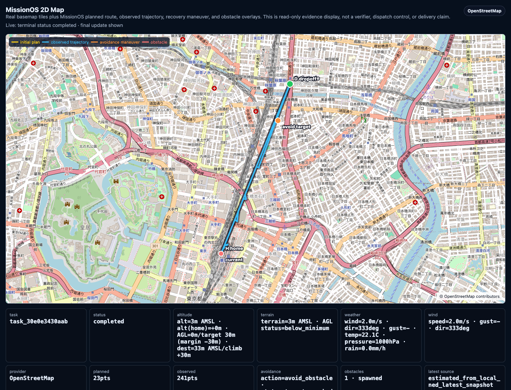

# MissionOS Chat: Obstacle Recovery Run

This page shows an actual local `missionos chat` run with a Tokyo Station to
Akihabara Station mission request and obstacle context.

The run exercised the LLM-backed chat path, human approval prompts, live SITL
startup, Recovery Agent proposals, operator-approved `avoid_obstacle`
dispatches, `missionos watch`, `missionos operate`, and the read-only map
overlay.

It did reach a terminal `completed` task state. It did not prove clean route
arrival at Akihabara, delivery completion, real hardware flight, or physical
execution. The run ended through obstacle recovery and return-to-launch
evidence, with MissionOS still keeping `delivery_completion=False` and
`physical_execution=False`.

## Scenario

The operator asked MissionOS to plan and run a drone mission:

```text
東京駅から秋葉原駅まで。障害物あり。ドローン任務を計画してください。
```

The operator approved each boundary step in chat:

1. approve the LLM-generated mission proposal
2. prepare SITL execution
3. start the live SITL environment
4. fly the mission
5. approve Recovery Agent `avoid_obstacle` proposals during the run

## Command

The sample used the production Gateway backend, local Ollama/Gemma, a dedicated
loopback port, and a longer CLI timeout.

```bash
MISSIONOS_GATEWAY_BACKEND=production \
MISSIONOS_LLM_BACKEND=ollama \
MISSIONOS_OLLAMA_MODEL=gemma4:26b \
missionos \
  --gateway-url http://127.0.0.1:18884 \
  --timeout 300 \
  --state-path /tmp/missionos-obstacle-chat-state.json \
  chat --autostart --enable-live-sitl \
  --history-path /tmp/missionos-obstacle-chat-history.txt \
  "東京駅から秋葉原駅まで。障害物あり。ドローン任務を計画してください。"
```

## Chat Flow

MissionOS first returned a bounded mission proposal:

```text
MissionOS: I built a bounded PX4/Gazebo mission proposal for Tokyo Station
-> Akihabara, wind=2.0m/s, payload=0.5kg. I did not approve, prepare SITL,
or dispatch.

route=mission_designer_plan
source=llm_dialogue_router_route_hint_mission_designer_plan_chief_internal_route_weather_tools
progress_counted=False
```

The operator pressed Enter through the visible prompts:

```text
MissionOS [Enter=approve, /back]> <Enter>
Approval recorded. I have not prepared SITL, dispatched, or counted progress.

MissionOS [Enter=prepare, /back]> <Enter>
SITL execution request prepared. I have not started PX4/Gazebo, uploaded a
mission, dispatched commands, or counted progress.

MissionOS [Enter=start, /back]> <Enter>
task_id=task_30e0e3430aab
startup_status=started
readiness_status=ready
mavlink_endpoint_observed=True

MissionOS [Enter=fly, /back]> <Enter>
```

After `fly`, MissionOS opened companion operator views for `operate`, `watch`,
and `map`, and the live SITL run began.

## Recovery Dispatches

During the run, the Recovery Agent repeatedly proposed `avoid_obstacle`. The
agent proposal did not create dispatch authority. Each command below required
operator approval; this run used `--yes` to represent that explicit approval.

```bash
missionos avoid-obstacle --task-id task_30e0e3430aab --target-x-m 99.942 --target-y-m 72.865 --altitude-m 45 --yes
missionos avoid-obstacle --task-id task_30e0e3430aab --target-x-m 350.638 --target-y-m 174.532 --altitude-m 45 --yes
missionos avoid-obstacle --task-id task_30e0e3430aab --target-x-m 591.87 --target-y-m 271.8 --altitude-m 45 --yes
missionos avoid-obstacle --task-id task_30e0e3430aab --target-x-m 938.525 --target-y-m 412.792 --altitude-m 45 --yes
missionos avoid-obstacle --task-id task_30e0e3430aab --target-x-m 1042.307 --target-y-m 483.122 --altitude-m 45 --yes
missionos avoid-obstacle --task-id task_30e0e3430aab --target-x-m 1456.389 --target-y-m 622.715 --altitude-m 45 --yes
```

Each dispatch returned the same important boundary signals:

```text
dispatch_status=queued_for_active_runner
recovery_action=avoid_obstacle
runner_ack=accepted
assist=target_reached
offboard_ack=accepted
resume=resumed_auto_mission
```

An ACK means the command was accepted by the runtime boundary. It is not the
same as mission success or delivery completion.

## What `missionos watch` Showed

`missionos watch` rendered a terminal map and live evidence summary:

```text
H=home
D=dropoff
◆=drone
p=initial plan
·=observed
a/A=avoid path/target
O=obstacle

progress=493m / 2.00km
terrain=5m AMSL
AGL=33m
drone=38m AMSL
task=task_30e0e3430aab status=running
operator_dispatch=queued_for_active_runner; action=avoid_obstacle; ack=accepted
overlay: planned=23pts · obstacles=1(spawned) · avoid=target_reached/target=True/resume=resumed_auto_mission/samples=0
alt(home)=32m ... battery=91.1% wp=-1/23 home_dist=493m
```

`watch` was useful for seeing the current task id, route progress, altitude
context, obstacle overlay, and whether the latest operator dispatch had been
accepted.

## What `missionos operate` Showed

`missionos operate` showed the Recovery Agent console. It listed available
operator commands and made the human approval boundary explicit:

```text
status | refresh
rtl
land
climb 45
speed 7
reroute 120 -20 (45)
avoid 40 20 (45)

Dispatches still go through recovery-dispatch and require human confirmation.
```

During the run, `operate` showed a proposal like this:

```text
Situation: The route appears battery-feasible.
Detected: telemetry is stale, obstacle or building risk.
Return: Returning now appears safe (home 320m; arrival battery 88%).

Operator review required; continuing is not recommended.
Suggested command: avoid 350.638 174.532 45
proposal=avoid_obstacle (proposal_guardrail_passed; dispatch_authority=False)
```

The important field is `dispatch_authority=False`: the agent proposed a
bounded recovery action, but the operator still had to approve dispatch.

## Map Screenshot

The map is a read-only evidence overlay. It does not dispatch commands, verify
delivery, or prove physical execution.



The final map rendered these counts:

```text
task=task_30e0e3430aab
status=completed
planned=23
observed=241
obstacles=1
avoidance_samples=5
```

The map shows the initial plan, observed trajectory, obstacle marker, avoidance
maneuver, home, current position, and dropoff marker. The lower panels also show
altitude, AGL, terrain status, weather, and the evidence source for the latest
position.

## Final Outcome

The task reached a terminal completed state:

```text
Task: task_30e0e3430aab (completed; dispatch=completed)
Process: auto_mission=completed; terminal_gates=True; dispatch=completed
Operator Dispatch: action=avoid_obstacle; runner_observed=True; ack=accepted
Operator Dispatch: landed=True; outcome=return_progress_observed
Post-run Return: action=return_to_launch; ack=True; final_landing_safe=True
Recovery Grounding: disarm_observed=True; latest_ground_confirmed=True
Claims: delivery_completion=False; physical_execution=False
```

This means the run completed as a bounded simulator recovery/return scenario.
It should not be described as an unchecked AI flight, real hardware execution,
or confirmed delivery to Akihabara.

## What This Proves

This run provides evidence that:

- `missionos chat` can drive the proposal, approval, prepare, start, and fly
  prompts for this scenario.
- Live SITL startup reached readiness.
- An obstacle was represented in the runtime/map evidence.
- The Recovery Agent produced `avoid_obstacle` proposals.
- Human-approved recovery dispatches reached the active runner and received ACKs.
- The map, watch, and operate views represented the same task id.
- The task reached a terminal completed state with return/grounding evidence.

## What This Does Not Prove

This run does not prove:

- real hardware flight
- unchecked LLM control
- clean arrival at Akihabara without recovery
- delivery completion
- physical execution
- that ACK alone means success
