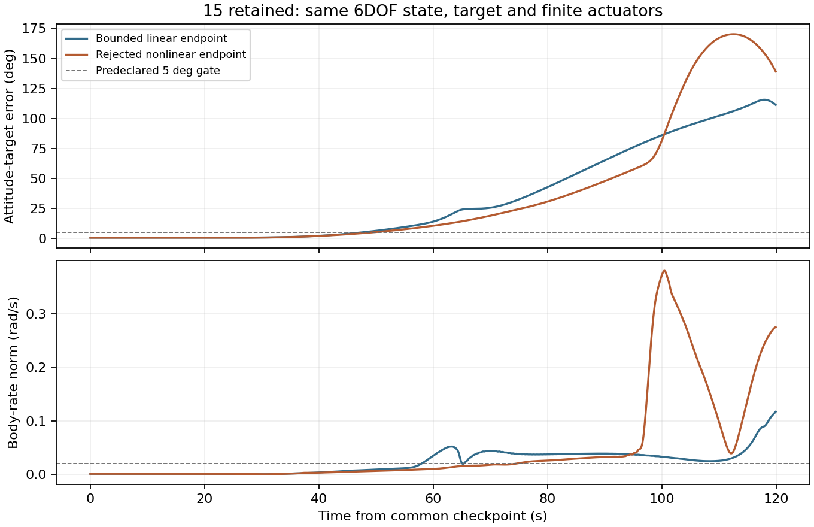

# Preparing a usable return tool for MissionOS

Repeated flights need guidance that can return with a changed payload inventory.
This development step extends the bounded finite-actuator allocator to Ship
flaps. The vehicle coefficients, RCS force and actuator limits are unchanged.
The candidate remains a local opt-in experiment, unavailable to MissionOS plans.
The improved returns require selecting retained-return guidance. The existing
`fixed_return` no-response path is unchanged and can still impact with retained
payloads; this experiment does not make that fallback safe.

In paired 180-second continuations from saved 25-retained entry states, the
legacy allocation reaches about 44 degrees of attitude error; the bounded
candidate stays near 0.5 degrees. Both methods stay below 5 degrees in the
predeclared 50–600 Pa diagnostic window; the large divergence occurs afterward.
These pairs use common 0.1-second steps and do not reproduce every step of the
old flight. They are control-tool evidence, not return qualification or AI calls.

The final candidate activates the new allocator only while the retained-return
policy is active, preserving the nominal controller after all payloads release.
Launch-derived records give the following results. The zero-retained row is
historical: it predates the explicit `application` field and recorded-use checks.
It was not rerun under the current scope; its archived verifier/source snapshot
applies, and the current verifier does not accept it as current-format evidence.

| Retained payloads | Contact speed | Tilt | Remaining fuel | Declared entry gate |
|---|---:|---:|---:|---|
| 25 | 3.34 m/s | 0.75 degrees | 45.93 t | Pass |
| 26 | 3.28 m/s | 0.72 degrees | 45.37 t | Pass |
| 0 | 4.55 m/s | 10.10 degrees | 74.21 t | Fail: tilt |

The frozen gate requires speed at most 5 m/s, tilt 5 degrees, body rate
0.02 rad/s and reserve 28 t. The zero-retained metrics equal the original
nominal trajectory, but that trajectory does not meet the pose condition.
The initial sweep stopped; counts 1–24 were not executed in that batch. An earlier global application
to the zero-retained case impacted at 8.46 m/s and was rejected.

After independent review, the active retained-payload domain was evaluated
separately, keeping the same four thresholds and the zero-retained failure.
Counts 1–14, 16, 25 and 26 pass. Count 15 contacts at 4.82 m/s but retains only
13.12 t, failing the 28 t reserve. Its terminal attitude-target error reaches
163.39 degrees, and the fuel estimate already exceeds onboard fuel when terminal
guidance activates. This is an unresolved attitude/control failure with a fuel
reserve shortfall, not simply low propellant loading. The sweep stops there;
counts 17–24 remain unexecuted. Full 0–26 qualification remains incomplete;
17 passing deterministic cases do not establish robustness to perturbations.

The saved 15-retained record starts terminal guidance around 12.90 km, with a
fuel estimate of 99.92 t against 96.84 t onboard. The terminal segment consumes
83.72 t over 136.84 seconds. The negative estimated fuel margin does not inhibit
the current trigger; this feasibility-check gap also belongs to step 4.
The underlying attitude/control cause remains unresolved.

A read-only comparison with 14 and 16 retained shows that 15 is already off
target before the flip: its last sampled entry command has 123.64 degrees of
attitude-target error and 0.465 rad/s body rate. The terminal maximum occurs at
the first terminal command. The measured tilt/rate raise the preparation estimate
to 27.53 seconds (about 16.4–16.6 seconds in the adjacent cases), explaining the
earlier state-based trigger. This localizes the fault before terminal activation;
it does not yet identify why entry tracking diverged.

A finer saved-checkpoint continuation reveals a limit cycle: a flap alternates
between about 50 and 52.5 degrees on successive 0.1-second control cycles. The
two-second flight samples can conceal this motion. RCS saturation follows as
the pressure rises. This is a control-tool problem, not a comparison of AI
against a scripted answer.

Replacing the one-step linear prediction with the same nonlinear plate law
does **not** cure it. A predeclared 120-second pair, starting at 4201.6 s and
2601 Pa, changes only allocation. Both continuations fail the whole-interval
5-degree/0.02-rad/s gate; the nonlinear candidate is rejected. This pressure
interval has no 50–600 Pa samples and cannot claim that earlier gate passed.

| Checkpoint continuation | Maximum attitude-target error | Maximum body rate |
|---|---:|---:|
| Existing bounded linear endpoint | 115.56 degrees | 0.117 rad/s |
| Rejected nonlinear endpoint | 170.25 degrees | 0.380 rad/s |

Static probes find balanced flap configurations at some actual saved poses,
but require angle changes of about 100 degrees from the failing configuration.
Those are existence examples, not feasible transfers or flight success. A
low-pressure prepositioning draft fails its static trim criterion in the exact
guidance target frame; no flight was run for that draft. Neither rejected
controller is enabled in normal code, and no full-flight sweep was admitted.
The next design must consider aerodynamic trim, the attitude reference and the
finite transfer together. General research on allocation and reentry control
supports examining these coupled constraints; it does not establish SpaceX's
implementation. See [NASA allocation research](https://ntrs.nasa.gov/citations/20100024149)
and [reentry control guidelines](https://ntrs.nasa.gov/citations/20020039166).

[Diagnostic records](../assets/starship-return-allocation-20261007/retained15-diagnostic.json)
bind the failed pair to its inputs, source snapshots and output hashes. The
[rejected patch](../assets/starship-return-allocation-20261007/rejected-nonlinear-endpoint.patch)
is reproducibility evidence against base `6e849bfb`, not an admitted policy.
Counts 17–24 and zero-retained full-flight tests remain unexecuted in this work.

Record checks pass under the respective captured checkers for the initial three
records, and under the reviewed scope for the 18 later runs. The first full 25/26 trials initially
failed verification because their CLI passed Python tuples to strict JSON
checkers. Reopening their persisted JSON passes both checkers without new
dynamics. The original failed verdicts remain recorded; the caller now serializes
before checking. [Source-bound summary](../assets/starship-return-allocation-20261007/summary.json).

The reviewed scope names `retained_policy_active_only_v1`. Independent record
checks require an allocation receipt matching the recorded commands in every
eligible sampled control cycle. Source hashes are included in the experiment
study and input records; they identify bytes, not processor execution attestation.

This establishes a promising retained-payload control change, not qualified
recovery across 0–26 payloads. Booster recovery, return-feasibility checks in
MissionOS, structural survival, readiness for reuse and repeated-flight operations
remain open. Numerical checks are tools for AI control; script superiority is
not this work's acceptance criterion.

See the [qualification contract](../agents/starship-mission-control-contract.md).
