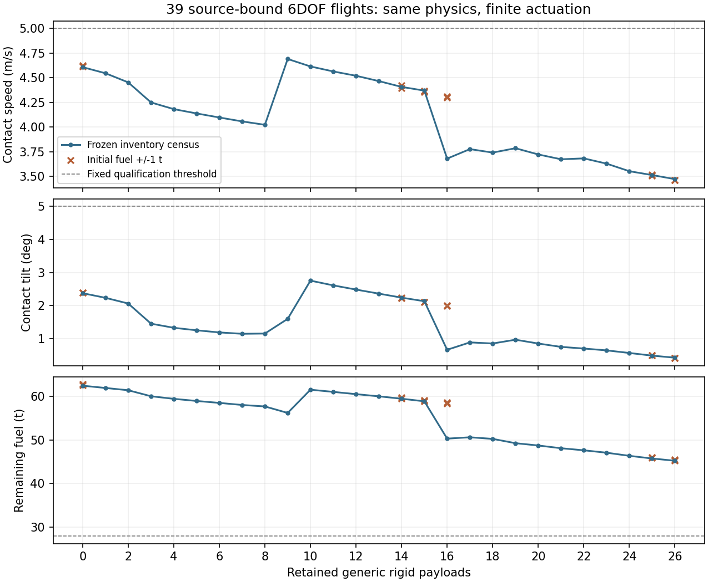

# A return tool MissionOS can use

MissionOS can make deployment and return decisions inside a preflight-approved
scope, execute them through a separate credential-free simulator, and check later
observations. The return tool now covers every retained inventory from 0 to 26 in
the declared model profile; it no longer relies on the fortunate 26-retained case.

The common controller prepares a balanced flap configuration and an entry bank
from the current mass, geometry and flow. Actual roll, flap motion and thrust
remain finite and are integrated in six degrees of freedom. Physical coefficients,
RCS force and the speed/pose/rate/reserve thresholds were not increased or relaxed.

All 27 inventories and 12 selected initial-fuel perturbations pass: 39 flights
with the same source. Speed is at most 5 m/s, contact tilt 5 degrees, body rate
0.02 rad/s and reserve at least 28 t. This is modeled contact qualification, not
thermal protection, structural survival, recovery, reuse or SpaceX validation.

Return decisions and no-response fallbacks now share a fresh numerical check.
It checks the qualified source/profile/backend, fuel uncertainty, an analytic
deorbit correction, orbital state, attitude and propulsion availability. It uses
the tested consumption envelope; it does not predict a complete new trajectory
for every state or prove all combinations inside a rectangular bound safe.

Five current conditions pass their declared scenario checks with actual Jev
decisions over the real HTTP approval/run boundary:

| Condition | Observed MissionOS behavior |
|---|---|
| Normal | Continue deployment; 26 bodies release; checked state-based return |
| Release fault | Collect a distinct mechanism report, stop deployment, return with retained inventory |
| Fuel shortage | Stop deployment and inhibit the infeasible return; integrate a bounded 30 s orbital coast |
| Tower unavailable | Keep deployment/return and choose the permitted diversion |
| Operations notice | Stop after one release and return with 25 bodies retained |

There are 19 actual Jev inference receipts and no conditional DeepSeek call in
this evaluation. The normal flight equals the updated fixed-timeline result.
This measures executed AI decisions and regression behavior; outperforming a
scenario-encoded script is not an acceptance criterion.

Two forced-hold/compound-response failures also return with retained inventory
inside the modeled contact gate. They lose the deployment objective and fail the
normal-mission comparison. Return recovery must not be reported as full mission
success. The fuel-shortage coast is likewise an unresolved mission, not a return.

The live normal scenario includes modeled booster water entry. Booster robustness,
water survival, tower catch, in-flight human reapproval and three-flight-per-day
fleet scheduling remain separate work.

[Qualification and source](../assets/starship-state-return-qualification/qualification.json)
· [Decisions, results and limits](../assets/starship-state-return-qualification/steps345-summary.json)
· [Earlier rejected candidates](starship-return-allocation.md)
