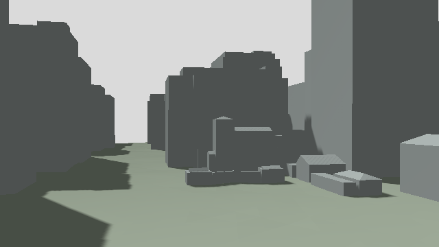
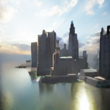
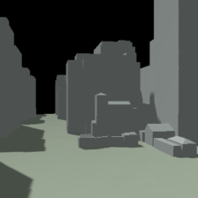

# 横浜街区で実VLA＋WAMを実行：予測画像が不整合で停止

**実モデルの推論は実施しましたが、モデル判断を2回反映して往復する目標は未達です。** D1でAP保持した後、実AeroVLAが移動を提案し、実ANWMが2候補の画像を予測しました。WAM画像が事前基準を満たさず、モデル区間の送信・移動は0回でした。配送地点への到達・帰還も、この試行では確認していません。

[実測軌跡と予測画像](index.html) · [機上映像（8倍速）](onboard-timelapse.mp4) · [停止記録の再検証](verified-failure.json) · [全試行](attempts.json)

固定ソース `fa0d0d216bf6b8bebce6e915564f7473ce5496ad`、run `yokohama-e9da88bd375a`。無風・静止建物、1機のPX4/Gazeboシミュレーションです。予定経路はAPが担当し、D1・D2の短い2区間だけをモデル提案に接続する試験でした。海上区間、荷物の投下、実機、10機運用、電力削減は対象外です。[固定条件](protocol.json)と[モデル識別子](model-identities.json)を保存しています。

## 今回の観測

| 項目 | 結果 |
|---|---|
| D1のAP保持 | 30.104秒。最大水平ずれ5.66 cm |
| モデル起動 | D1保持後、ホスト応答166.309秒 |
| AeroVLA | 飛行入力1回、`95 49 38</s>`、約4.85 mの移動提案 |
| VLA応答 | 16.900秒（転送・GPU再配置などを含む） |
| ANWM | 飛行入力1回、停止／VLA提案の2画像を予測 |
| WAM応答 | 50.894秒（2候補と転送などを含む） |
| モデル待ちのAP保持 | 起動要求から停止応答まで253.942秒、最大3Dずれ12.69 cm、最大速度0.053 m/s |
| モデルによる移動 | 0回。D2再判断・往復は未達 |
| 終了 | 権限失効、モデルプロセスとGPU計算プロセスの不在、シミュレータ終了を確認 |

起動は同一VMでの診断後で、ファイルキャッシュが温まった可能性があります。冷間起動の性能測定ではありません。モデル起動／ウォームアップは、この新しい飛行ではD1保持後に開始しています。別途行った合成入力の診断は飛行入力の回数に含めません。停止後は使い捨てSITLを終了しており、実機の中断着陸を検証したものではありません。

## 停止理由と画像

基準は有償試行前に固定し、実行後には変更していません。輪郭の対応だけでは予測の妥当性を認めず、明るさの差と観測済み領域も確認しました。

| 画像条件 | 停止候補 | VLA移動候補 | 合格基準 |
|---|---:|---:|---:|
| 既知画素割合（境界・穴の除外後） | 70.29% | **59.61%** | 60%以上 |
| 参照輪郭との対応 | 83.59% | 83.99% | 55%以上 |
| 輝度MAE（0–255） | **52.23** | **58.37** | 45以下 |

実観測は下のような灰色の街路です。



同じ位置に留まる候補でも、WAM予測には観測にない水面や高層建物が現れました。目視上も、閾値を少し変えれば済む不一致とは扱えません。



保存したサービス側の投影画像を、独立した過去RGBD投影と後から照合すると、停止候補の輝度MAEは1.08、輪郭対応99.83%でした。投影の時点では元の街路を保っています。[投影診断](projection-diagnostic.json)は追加推論なしの事後解析で、飛行時の合否を変更しません。未観測画素は黒であり、安全な空間を表しません。



したがって、確認できた課題は「観測を保った投影から、整合する学習モデル予測を得られていないこと」です。入力・条件付け・学習領域との適合性のどれが主因かは未確定です。学習領域との不一致は仮説であり、原因として断定しません。輪郭対応が高くても別の街を描けるため、この指標単独を障害物認識や安全保証に使えないことも分かりました。

次は追加の飛行より先に、**静止・移動ゼロの入力で元の街路を維持できるか**を小さな画像検証で確認します。入力正規化、条件付け、チェックポイントとの適合性を切り分け、その条件を満たしてから市街地の2回判断へ戻すのが妥当です。移動候補の既知領域不足も別に扱います。これらの追加有償試験はまだ実行していません。

## 修正と失敗を分けて保持

| 固定試行 | ソース | VLA / WAMの飛行入力回数 | 結果 |
|---|---|---:|---|
| [1回目](../yokohama-native-first-attempt/REPORT-ja.md) | `96b0c3ef` | 1 / 0 | CPU退避後もCUDA割当てが残り拒否。保存出力も短区間条件外 |
| [2回目](../yokohama-native-second-attempt/REPORT-ja.md) | `035e2b53` | 1 / 0 | 短区間生成範囲を固定。循環参照回収でもCUDA割当てが残り拒否 |
| 今回 | `fa0d0d21` | 1 / 1 | CUDA解放を修正。WAM画像不整合で移動前に拒否 |

3回は変更条件が異なるため、同一条件の成功率として集計しません。先の失敗を成功扱いに置き換えていません。別にSSH起動待ちの失敗1回と、CPUモデル代替の開発・検証試行があります。CPU最終検証では2回の移動反映と往復を確認しましたが、実モデル能力の証拠には数えません。

CUDA残留9,568,256 bytesは、モデルのテンソルではなくcuBLAS/Ltのワークスペースでした。明示的な解放により、合成入力診断と今回のVLA/WAM双方で、推論後の割当てが0になりました。[修正診断](cuda-repair-diagnostic.json)。CPUへの移動とempty_cacheだけではワークスペースが残る挙動は、[PyTorch 2.9の説明](https://docs.pytorch.org/docs/2.9/notes/cuda.html#cublas-workspaces)に対応します。割当て0はCUDAコンテキスト消滅や消費電力0を意味しません。

## 検証・費用・再実行

保存した観測・モデル応答・予測PNGのハッシュと画像判定を再計算し、拒否前に移動権限が発行・消費されず、モデル区間が送信されていないことを確認しました。専用の再検証結果 `failure_record_verified` は、失敗記録の整合性を意味します。飛行成功ではありません。完全飛行用Verifierは未到達のactivate/holdsがないため不合格／例外となり、[判断検証](verification-decisions.json)と[飛行検証の限界](verification-flight.json)を残しています。

実行環境は[街区の固定依存パッケージ](../yokohama-urban-scene/reproduce/requirements.txt)と専用モデル環境です。実行コマンドは次の通りです。パスは公開用の出力先別名で、原記録はrun IDとハッシュで識別します。プライベートな起動・停止設定は公開物に含めません。

```sh
python scripts/yokohama_sitl.py --phase flight --decision-backend native \
  --native-service-config /tmp/private-model-lifecycle.json --approve-sitl \
  --output-dir /tmp/new-yokohama-native --timeout-seconds 1500
python scripts/verify_yokohama_decisions.py /tmp/new-yokohama-native \
  --output /tmp/new-yokohama-native/decision-verification.json
python scripts/verify_yokohama_sitl.py /tmp/new-yokohama-native \
  --output /tmp/new-yokohama-native/verification.json
python docs/examples/yokohama-native-flight/reproduce/verify_rejected_run.py \
  --repo . --run /tmp/new-yokohama-native --output /tmp/verified-rejection.json
```

最後のコマンドは今回の停止理由を持つ原記録専用です。新しい成功条件には使いません。公開バンドルにはレビュー済みの数値・画像・映像・原記録ハッシュを含め、原ログは別に保持しています。ハッシュだけでは原記録全体の再検証はできません。[再生成スクリプト](reproduce/build_city_report.py)と[映像生成](reproduce/build_native_video.py)も保存しています。

全体テストは **3,348 passed / 3 warnings**。実行ソースのPython 3.11/3.13 CIも通過しています。[検証記録](validation.json)。これらはモデル性能の合格を意味しません。

累計費用は推定 **$10.0285 / $11**、今回の街区作業分は推定 **$1.6002**。請求確定額ではありません。モデルプロセス、所有するGPU VM・ディスク、SITLコンテナの終了・削除を確認済みです。[費用と終了記録](budget-cleanup.json)。

原典形状は横浜市・Project PLATEAUの公開データを加工しています。[帰属とライセンス](../yokohama-urban-scene/ATTRIBUTION.md)。
