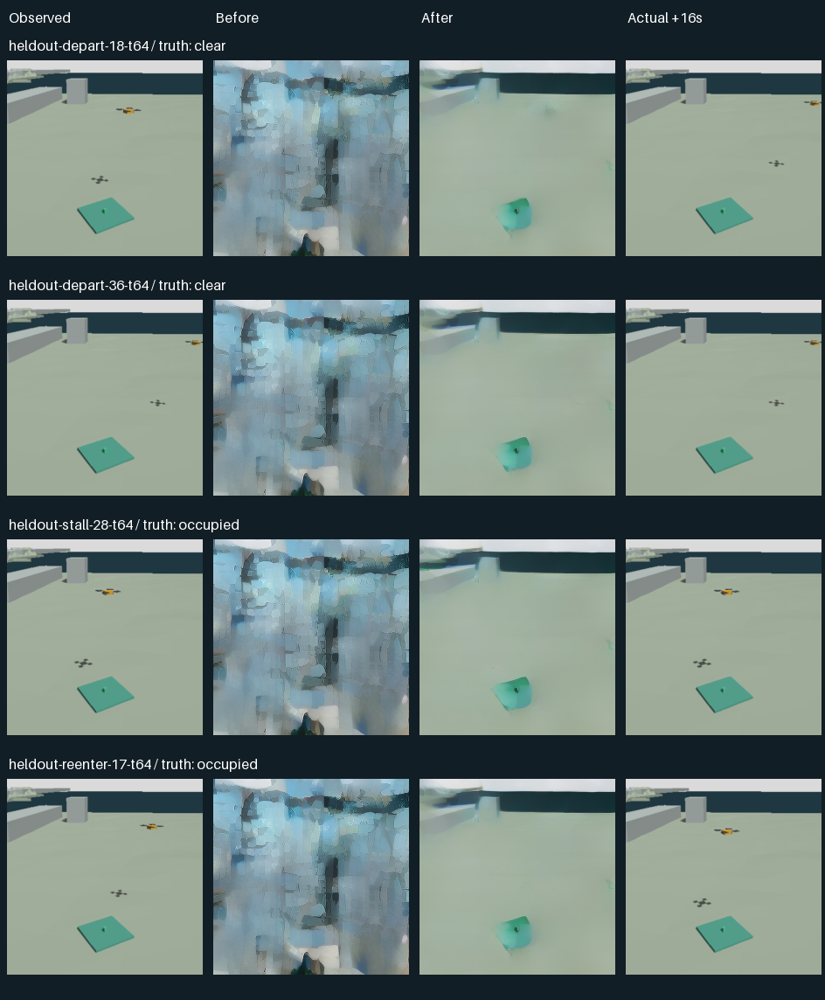

# 先行機を待つためのWAM追加学習

**実WAMを追加学習しました。画像全体の誤差は約81%減りましたが、先行機が予測画像から消えるため、待つ／進むの判断にはまだ採用できません。** 完璧な画質は目標にしていません。先行機がまだいる場面を「空き」としないことが、残る課題です。

[学習前後と実画像を比較](index.html) · [退出の実カメラ動画](videos/heldout-depart.mp4) · [再進入の動画](videos/heldout-reenter.mp4) · [数値記録](evaluation.json)

## 実施したこと

横浜街区で、先行機の「退出・途中停止・再進入」を新しい動作時刻で記録しました。CPU Gazeboの1,472フレームから学習用45組を作り、WAMを2,048ステップ追加学習しています。VLAの重みと飛行の安全Rulesは変更していません。

先に生成ステップ数と予測時間を分けて比較しました。同じ開発用観測では、16秒先の画像誤差は50ステップで33.94、250ステップでも31.46でした。生成回数を戻すだけでは直りません。短い0.25秒先は13.01／11.49でしたが、先行機の状態は正しく読めませんでした。開発用3件の不足を確認してから、事前に決めた条件で学習しています。

未来の評価記録は学習処理に渡していません。ただし、同じ場所・機体・経路を使うため、**新しい時刻4件のうち静止状態2件の画像履歴と、全4件の未来画像の画素は学習側と重複します。** 未知の外観や街への一般化を測った実験ではありません。以前の4件は、既に結果を見た再確認用として別集計しています。

## 結果

| 指標 | 学習前 | 学習後 |
|---|---:|---:|
| 新しい時刻4件：占有／空きの一致 | 1/4 | 2/4 |
| 同4件：誤った「空き」判定 | 1件 | **2件** |
| 同4件：判別不能 | 2件 | 0件 |
| 同4件：画像全体の平均誤差（0〜255） | 33.71 | 6.32 |
| 異なる画像履歴を持つ退出・再進入2件の一致 | 0/2 | 1/2 |
| 以前の4件：一致 | 1/4 | 2/4 |
| 以前の4件：誤った「空き」判定 | 1件 | **2件** |

現在画像の状態が続くと仮定する単純な比較は、両集計とも2/4です。理想的なRulesに勝つことは要求していません。

**学習後の8画像はすべて「空き」と読まれました。** 背景や着陸場所に近い形は戻りましたが、小さい先行機が残っていません。退出を当てた1件も、動きを理解した証拠にはなりません。未知が減ったことを成功とせず、誤った空き判定が増えた負の結果を保持します。



重みの変更・保存後の再読込み・固定した基底モデルの不変を確認しました。新しい重みは飛行サービスに登録していません。学習後の要求計算は約5.92〜6.10秒、モデル読込みは別に16.84秒でした。通信や機体への指示までを計った値ではありません。

## この動画と判断の範囲

観測は固定カメラで、先行機は動作を指定したGazeboの物体です。荷物はあらかじめ配置しています。この記録はAP保持・荷下ろし機構・実機飛行の検証ではなく、バッテリーの測定もありません。

WAMが予測するのは「自機が待ち続けた16秒後」の一点です。実際の待つ／進むの判断、途中の占有、進む候補との比較、配送・帰船は今回実行していません。海上APのみ、市街地だけモデルを利用する方針と、現在状態を確かめる独立したRulesは維持します。

次は**小さい先行機の存在・位置を失わないこと**を学習の中心に置き、短い時間の占有変化を開発用記録で確認します。今回も動く領域の誤差を重くしましたが十分ではありませんでした。生成画像の全体誤差をさらに下げるだけでは、今回の失敗を解決できません。時間幅を持った占有と両行動候補を確認できてから、MissionOSの待機・再観測・進入へ接続します。

## 費用・確認

追加概算 **$0.682329**、累計概算 **$18.532819 / $20**。請求確定額ではありません。所有VM・ディスク・収録コンテナの削除を確認し、処理後のCUDA割当ては0でした。

23回の実モデル推論、97個の回収ファイルのハッシュを確認しています。全体テストは3,576件通過、2件スキップ。公開データは次のコマンドでGPUなしに再検査できます。

```sh
python scripts/check_yokohama_pad_learning.py --bundle docs/examples/yokohama-pad-learning
```

[事前プロトコル](learning-protocol.json) · [学習と重みの記録](results/summary.json) · [費用・削除確認](cost.json) · [証拠一覧](evidence-manifest.json) · [詳細な契約と実行方法](../../agents/yokohama-pad-learning.md)

公開対象は準備済みの学習・評価入力、予測・実画像、計測記録、動画、実行ソースです。モデルの重みと全量の生RGBD記録はローカルに保存しています。出典は横浜市・Project PLATEAUを加工した街区です。[出典・ライセンス](../yokohama-urban-scene/ATTRIBUTION.md)。
