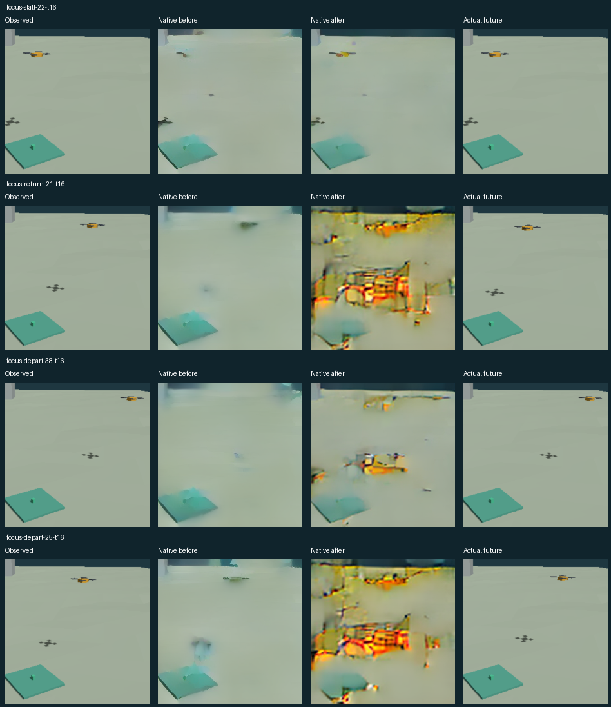

# 実WAM追加学習：戻る先行機の予測は改善せず

**今回の追加学習は飛行へ採用しません。** 占有・空きの一致は13/26から12/26、判別不能は13件から14件になりました。今は空いていても4秒後に先行機が戻る条件は、学習前後とも判別不能です。90%の精度は求めていませんが、今回の変更で待機判断に役立つ改善は確認できませんでした。

実ANWMの入力を先行機・パッド付近へ切り出し、1秒先と4秒先を予測しました。これは学習済みCPU状態モデルではありません。**今回は固定カメラの収録映像による実WAMの検証で、VLA・自機飛行・配送・帰船は実行していません。**

[画像と記録映像](index.html) · [数値結果](evaluation.json) · [条件](focus-protocol.json)

一部の静止場面では先行機の形が残りました。一方、戻る場面や退出後の画像では、実観測にない強い模様が現れています。画像全体の平均誤差も8.24から14.81へ増えました。誤った空き判定が0件でも、判別不能や崩れた画像を含むため、安全な予測を得たとは扱いません。[画像の目視確認](qualitative-review.json)



| 方法 | 占有／空きの一致 | 誤った空き | 判別不能 | 今は空きだが未来の占有を予測 |
|---|---:|---:|---:|---:|
| 現在画像を維持 | 23/26 | 1 | 1 | 0 |
| 実WAM・学習前 | 13/26 | 0 | 13 | 0 |
| 実WAM・学習後 | 12/26 | 0 | 14 | 0 |

新しい3つの動作時刻、14観測地点×2予測時間の28条件です。位置の境界にある2条件は正解が不明なため、一致数から除いています。重なる履歴と時間違いの予測を独立した飛行数とは扱いません。固定カメラ・機体・経路は学習と共通です。学習と画素単位で同じ16枚履歴は28条件中10条件あり、未知環境への汎化の証拠ではありません。未来画像が学習側の画像と完全一致する条件も28条件中10条件あります。[重複確認](overlap.json)。

数値は開発用画像で作った簡易読取りによります。生成画像に対する万能な認識器ではありません。実際の未来画像でも、移行中の先行機を判別できない条件があるため、画像も併せて確認します。

## 実モデルで変更したこと

元の640×360画像の固定領域を224×224に変換し、過去16枚・4 Hzだけを入力します。入力範囲は学習済みの既知場面を見て先に固定しました。評価時のモデル入力には、占有の正解ラベル、先行機の将来位置、予定表を含めません。評価用の未来画像はGPUへ渡していません。学習用の未来画像と、簡易読取り器の学習ラベルは学習資材としてGPU側にも配置しています。

自機が保持する候補だけを予測します。固定カメラで移動量ゼロなので、最新の実観測の切り出しを同じ視点の条件画像に使っています。従来の全画面・複数視点の飛行サービスとは異なる実験用入力です。飛行サービスの検証条件や登録済み重みは変更していません。

以前の実ANWM追加学習重みから開始し、開発用3例で必要性を判定しました。追加学習の有無は評価用正解を見て決めていません。今回は4,096更新、学習用208組。対象は最後の2つのTransformerブロックと既存出力部分で、他の重みとVAEは固定です。各学習ターゲットにある動く部分の誤差と、潜在画像の復元誤差を重くしました。保存した重みを読み込み直してから評価しています。

切り出し、予測時間、条件画像、学習範囲・損失が変わっています。この組合せの検証であり、各変更の効果を独立に特定した実験ではありません。前回の失敗を成功へ書き換えていません。[前回の実WAM追加学習](https://github.com/pome223/missionos/blob/68c78f5d91d583cbff55ebe1c1813194f6e130a7/docs/examples/yokohama-pad-learning/REPORT-ja.md)

## 境界・費用

完璧な画質や90%の精度、理想的Rulesへの勝利は条件にしていません。一方、予測画像の改善だけで飛行に有効とは認定しません。未来の一点の占有予測は、その間の進入経路の安全を保証しません。学習後の温まった推論は中央値4.52壁時計秒です。起動・転送は含みません。実時間と同速と仮定すると、28条件中28条件で予測対象時刻が計算完了までに過ぎます。飛行中の実時計との対応は未検証で、そのまま実時間の進入判断には使えません。VLAの提案、MissionOSの判断、Rules、AP実行、配送結果は次の接続検証で分けて確認する必要があります。

映像は今回のCPU Gazeboの実記録を4 Hz・等速で再生しています。先行機は台本で動く物体で、2台目の自律PX4ではありません。自機飛行も電力測定もないため、模擬バッテリー表示を付けていません。

累計上限を$20から**$23**へ更新しました。今回の追加概算は**$1.219**、累計概算は**$19.752**。請求確定額ではありません。VM・ディスクの削除とCPU収録コンテナの終了を確認しました。[費用・終了記録](cost.json)。時間単価は[公式料金表](https://cloud.google.com/products/compute/pricing/accelerator-optimized)を参照し、余裕を含む$1.80/hと転送分$0.40で見積もっています。

## E2E / Runtime Verification

CPU Gazeboで736枚を記録し、公開済みの学習用記録と分離しました。GPUでは固定したANWM基底モデル・以前の追加学習重みを実際に読み込み、推論・学習・保存後の再読み込みを実行しています。評価用正解はGPU外で照合しました。

```sh
python scripts/capture_yokohama_pad_motion.py --approve-sitl \
  --source-rig "$RIG" --case-set native-focus-v1 --output-dir "$CAPTURE"
python train_yokohama_pad_focus.py --root "$STAGING" --execute-training
python scripts/check_yokohama_pad_focus.py --bundle docs/examples/yokohama-pad-native-focus
```

最後のコマンドは保存された推論出力・時刻・重み識別子・画像判定をCPUで再検査します。GPU推論の再実行ではありません。実行時ソースと公開用に整形した保守ソースを分け、原記録を保存しています。[証拠一覧](evidence-manifest.json)

原典：横浜市・Project PLATEAUの加工データ。[出典とライセンス](https://github.com/pome223/missionos/blob/68c78f5d91d583cbff55ebe1c1813194f6e130a7/docs/examples/yokohama-urban-scene/ATTRIBUTION.md)
