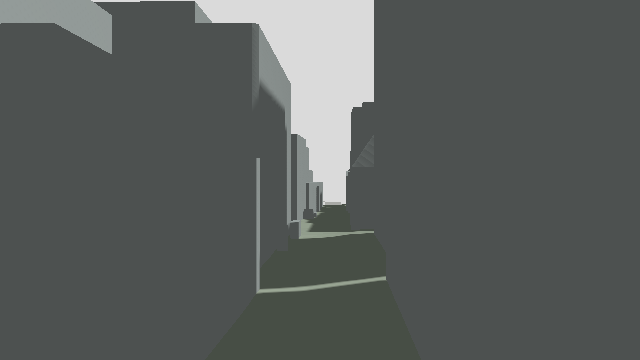

# 横浜の実街区で、PX4/Gazeboの衝突とAP保持を確認

横浜市のPLATEAU街区をGazeboへ読み込み、GPU推論を使わずに、衝突試験3項目とAPによる街区往復を確認しました。最終コホートは接触試験1回、飛行1回。飛行では7か所すべてで30秒以上のAUTO_LOITER保持が通り、出発パッドへ帰還・着陸・disarmを観測しました。

**この街区での実VLA＋WAM飛行は未実施です。** 固定のAP経路でのシミュレーションであり、荷物の配送完了、1 kmの海上往復、動く船、実機飛行は今回の成果に含みません。モデル用GPUの追加費用は **$0** です。

[実測軌跡の3Dリプレイ](index.html) · [機上映像（8倍速）](onboard-timelapse.mp4) · [接触の検証](verification-contacts.json) · [飛行の検証](verification-flight.json)



## 何が動いたか

153棟のLOD2建物、4橋梁、地形を含む約600 m四方の原典モデルを読み込みました。描画は原典形状、衝突には建物・橋梁の保守的な柱状メッシュと地形TINを使用しています。4 m四方の発着パッドは追加したシミュレーション要素です。

- **建物接触**：選定した建物の衝突形状へ試験球を意図的に重ね、Gazeboの接触イベントを確認。
- **地面接触**：地面へ試験球を落とし、地形との接触と鉛直方向の支持を確認。斜面を転がるため完全な静止の証明ではありません。
- **空き通路**：D2の試験球に接触がなく、位置のずれが2 cm未満であることを確認。

飛行はD1 → D2 → D3 →仮想配送地点→ D3 → D2 → D1です。往復の設計距離は約650 m、実測3D軌跡長は **688.6 m**（離着陸と保持中の移動を含む）。実測記録はシミュレータ時間 **544.0秒**、壁時計 **545.7秒**でした。

## 保持の実測

各地点で3秒以上の整定後に、30秒以上連続して測定しました。合格限界は事前に水平1 m、鉛直0.6 m、速度0.5 m/s、AUTO_LOITER・armed・airborneの継続、独立したGazebo位置観測の鮮度と2秒以内の観測間隔に固定しました。高度は原典標高18 mに対応するローカル高度約15.11 mです。

| 地点 | 保持秒数（sim） | 最大水平ずれ cm | 最大鉛直ずれ cm | 最大PX4速度 m/s |
|---|---:|---:|---:|---:|
| 00-D1 | 30.39 | 6.9 | 10.6 | 0.045 |
| 01-D2 | 30.05 | 19.0 | 8.4 | 0.099 |
| 02-D3 | 30.03 | 13.3 | 7.2 | 0.085 |
| 03-DELIVERY | 30.28 | 13.1 | 9.0 | 0.070 |
| 04-D3 | 30.26 | 8.0 | 11.4 | 0.074 |
| 05-D2 | 30.32 | 5.6 | 9.0 | 0.052 |
| 06-D1 | 30.12 | 13.9 | 9.5 | 0.070 |

全地点の最大水平ずれは **19.0 cm**、最大鉛直ずれは **11.4 cm** でした。モード切替の成功だけを保持とは扱わず、PX4テレメトリとGazeboの実位置から再計算しています。

機体と街区の接触イベントは観測されませんでした。記録された位置間を結ぶ線分の保守的な幾何チェックでは、機体基準点から高さが重なる衝突形状までの最小距離は **7.687 m**。仮定した半径1 mを差し引いた余裕は **6.687 m** です。これは観測点間の線分に対する確認で、未観測の連続軌道や実環境の安全保証ではありません。

## 画像と座標

機上の前向きRGB・距離画像と下向きRGBを取得しました。D2の固定カメラについて、取得した内部パラメータと画素中心を使い、事前に固定した24画素を原典三角形へのレイ交差と照合しました。**24/24一致、最大差 0.000132 m**（許容0.05 m）。これは描画座標系と原典形状の整合確認であり、PLATEAUの測量精度やWAM予測精度を表しません。

原典の標高をそのままPX4へ送らず、D1の地面＋12 cmの仮想パッド上面をローカル高さ0として変換しています。水平は投影座標から真東・真北への局所変換です。Gazeboの地理原点高度0もシミュレーション用です。

## 修正と失敗の記録

開発時にOBJの法線不足でDARTが衝突メッシュを無視し、物理エンジンが終了する問題を確認しました。面の向きを保って法線を追加し、面積0の描画三角形6面だけを除外しました。衝突メッシュ6,132面はすべて保持しています。接触トピックの実名、Python購読の終了順、起動直後の観測待ちも修正しました。

補助PosePublisherはIDと時刻を省略するため、最終版ではworldスコープの位置トピックだけを採用しています。カメラ照合では画素中心の半画素を入れない計算を修正し、試験球が映る接触試験画像を原典だけと比較しないようにしました。これらを成功した実モデル検証に数えません。

[全試行一覧](attempts.json)に開発試行と失敗の原記録ハッシュを残しました。最終判定に使うのは次の2回だけです。1回ずつの静的・無風条件の確認であり、反復信頼性の推定ではありません。

- 接触：`yokohama-90137d96a4eb`
- AP飛行：`yokohama-d8034ac7c65b`

[根拠一覧](evidence-manifest.json)は原記録、world、実行コード、形状のハッシュを結び付けています。リプレイは実測軌跡を表示し、機上映像は約2秒ごとの実カメラ記録を8倍速にしたものです。予測画像や架空の飛行アニメーションではありません。

## 再実行

Dockerと、[街区用の固定依存パッケージ](../yokohama-urban-scene/reproduce/requirements.txt)を導入した専用Python環境を使用します。今回のイメージはarm64の`px4io/px4-sitl-gazebo`、固定ID `sha256:79968fe25aa19d51c49fbd4a863ea9380f4efe6d9afabd1c579ddeffeb8b8c93`。CLIはイメージを自動取得しません。

```sh
python scripts/yokohama_sitl.py --phase contacts --approve-sitl \
  --output-dir /tmp/yokohama-contacts --timeout-seconds 140
python scripts/yokohama_sitl.py --phase flight --approve-sitl \
  --output-dir /tmp/yokohama-flight --timeout-seconds 1200
python scripts/verify_yokohama_sitl.py /tmp/yokohama-flight \
  --output /tmp/yokohama-flight-verification.json
```

実際のCLI → ネットワークなしの専用コンテナ → Gazeboの接触／センサー → PX4のミッションと保持 → 観測の再検証まで通しました。ソフトウェア描画を指定し、GPUデバイス要求がないことも確認しています。出力先は新規ディレクトリのみ。試験コンテナは終了後に削除します。12件の関連テストと、全体テスト3,312件が通りました（依存ライブラリ由来の警告3件）。実行承認フラグなしのCLI呼出しは拒否します。保持開始直前と開始時の同一sim時刻は、開始イベントと記録サンプル数で区間を特定して再検証しました。保持内のサンプルは除外していません。詳しい条件は[エージェント契約](../../agents/yokohama-sitl.md)にあります。

## 次に実VLA＋WAMへ接続するために

APで街区を移動・保持し、そこで新しい機上画像を取得できるところまで進みました。残る主要作業は、特定色の柱に依存する[現行WAMの読み取り](../../agents/ship-anwm-static.md)を一般の建物へ対応させ、[市街地内の観測更新ループ](../../agents/ship-urban-loop.md)へ実モデルを結ぶことです。

次の合格条件は、市街地内で少なくとも2回、再観測に基づく実VLA提案と実WAM予測が承認範囲・Rulesを通り、APの短区間移動へ反映された証拠を残すこと。市街地退出時に処理を停止し、遅延応答を拒否してから海上APへ渡します。理想条件のRulesを上回ることは要求しません。

今回の保持確認は30秒です。従来の約45〜50秒のWAM待ち時間や市街地での起動時間を含む保持、通信失敗、電池消費は今後の実測対象です。全行程の省電力性も未確認です。

出典・利用条件は[PLATEAU街区の帰属表示](../yokohama-urban-scene/ATTRIBUTION.md)に従います。
