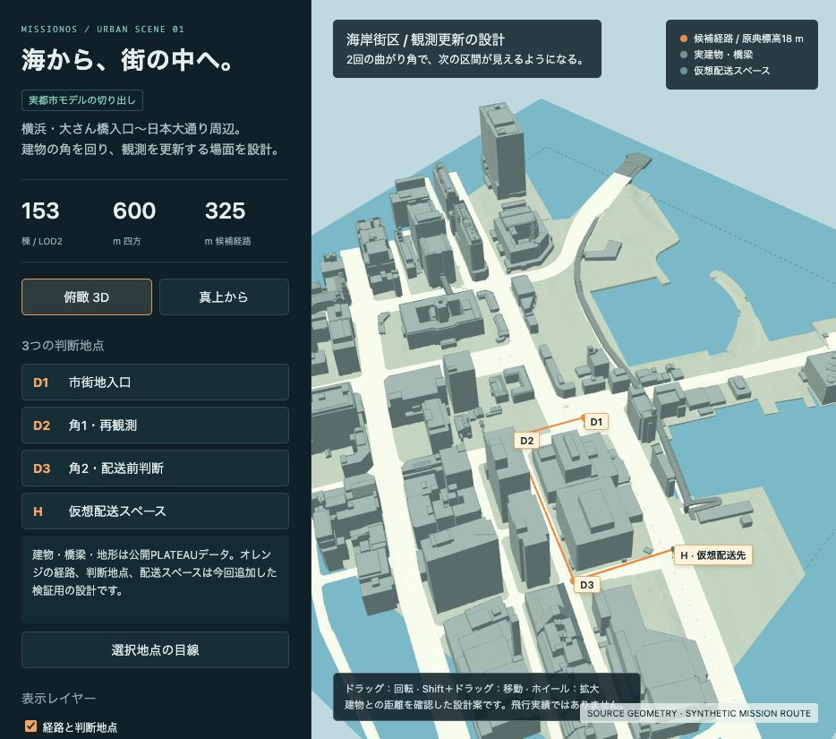
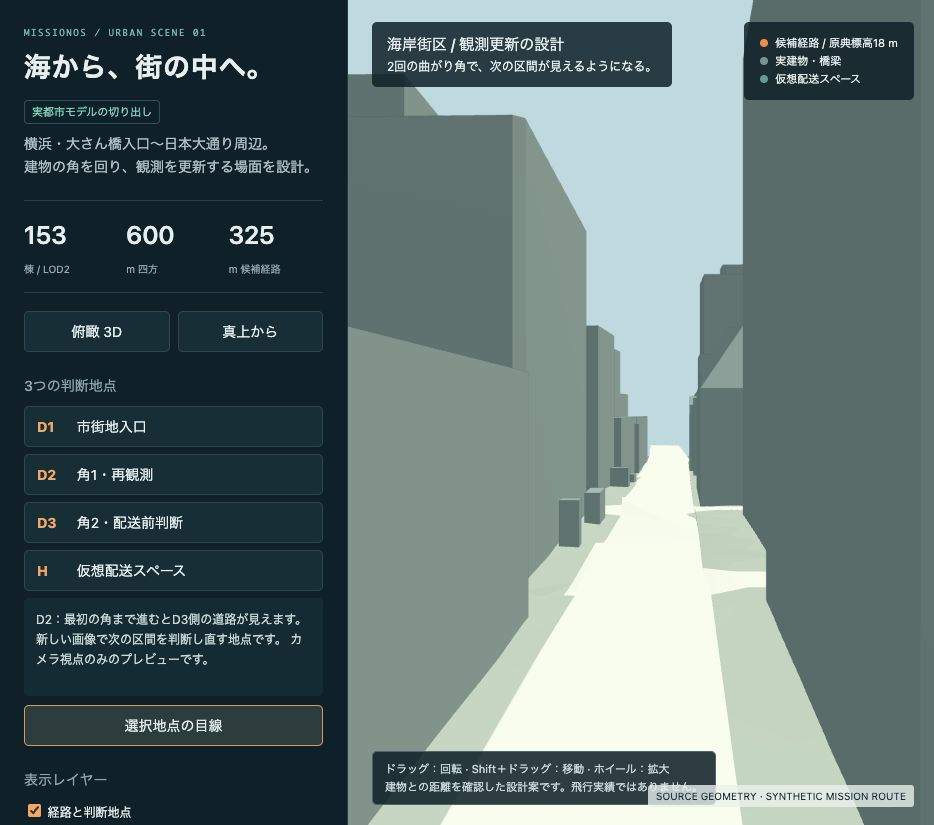

# 横浜の海岸街区：実都市モデルと観測更新の場面

横浜・大さん橋入口〜日本大通り周辺の公開PLATEAUデータから、**600 m四方・153棟の街区**を切り出しました。2回曲がる325 mの経路と、3つの判断地点を重ねた3Dプレビューを作成しました。これは場面の設計と幾何検証であり、実VLA＋WAMによる飛行結果ではありません。

[操作できる3Dプレビュー](index.html) · [3Dモデル（GLB）](urban-scene.glb) · [経路と判断地点](route.json)



## 作ったもの

| 項目 | 内容 |
|---|---|
| 場所 | 横浜・大さん橋入口〜日本大通り周辺 |
| 範囲 | 中心 35.4481°N, 139.6442°E、600 m四方。海岸と複数街区を一緒に含めるため500 m案から拡張 |
| 実データ | LOD2建物153棟、道路79オブジェクト、橋梁4オブジェクト、地形TIN |
| 形状 | 合計35,916三角形。写真テクスチャは使わず、形状を単色で表示 |
| 経路 | 325 m、90°の曲がり角2か所、D1〜D3の判断地点 |
| 短区間案 | 18区間、最大18.334 m。実行指令には接続していない |
| 配送先 | 半径3 mの仮想スペース。原典には存在せず、着陸・荷渡しは未試験 |
| 今回のGPU費用 | $0 |

建物は屋根と外壁のLOD2形状です。表示用GLBと元の建物・橋梁のOBJに加え、衝突判定へ取り込むための保守的な柱状モデルを別に用意しました。データと加工の詳細は[出典・ライセンス](ATTRIBUTION.md)および[source-manifest.json](source-manifest.json)に残しています。

## 観測を更新する理由を作る

D1で市街地内の保持を確認し、D2、D3へ順に進む構成です。

| 視線の対象 | 移動前 | 移動後 |
|---|---|---|
| D3側の道路 | D1からは建物に遮られる | D2まで進むと見通せる |
| 配送先 | D2からは建物に遮られる | D3まで進むと見通せる |

建物を上から見た図だけでなく、**元の3D三角形に対する視線の交差判定**でもこの2場面を確認しました。これは幾何学的な見通しの確認です。カメラ画像から建物を認識した、またはWAMが正しく将来を予測したという結果ではありません。



## 幾何チェックの結果

- 元の建物・橋梁の三角形と経路中心線の交差：0。
- 経路中心と、高さ18 m付近に存在する建物・橋梁の水平投影との最小距離：**7.698 m**。半径1 mの機体を仮定すると残り6.698 m。位置誤差や風の余裕はこの数値に含まない。
- 高度は原典の鉛直基準で18 m。経路上101点で調べた地面との差の最小値は14.704 m。AGL一定でもPX4のホーム相対高度でもない。
- 仮想配送スペース中心から全建物・橋梁の水平投影まで18.747 m。
- 衝突用の柱状OBJ：157成分、6,132三角形。全9,198辺の面共有数が2、面の向きが整合。元の投影を含むことも確認。物理エンジンでの接触試験は未実施。
- GLBの構造・数値・参照範囲、水平座標の原点往復変換、短区間の長さを確認。
- Khronos glTF Validator 2.0.0-dev.3.10：エラー・警告・ヒントすべて0（[結果](gltf-validation.json)）。
- 2回の再生成で、主要8ファイルがバイト単位で一致。入力キャッシュ欠落と破損の2ケースも生成前に拒否。
- ブラウザーで3D表示、上面表示、判断地点への移動、地点からの目線、表示レイヤーを確認。

機械可読な結果：[geometry-checks.json](geometry-checks.json)。3DプレビューはHTMLに形状と描画ライブラリを同梱しており、表示時の外部ネットワーク取得は不要です。建物全体を残す切り出しなので、600 mの境界を越える形状もあります。

## 次に接続するもの

海上はAPのみ、市街地の保持を確認してからVLA＋WAMを起動する方針を維持します。D1は市街地内の候補インターフェースです。沖合1 kmからD1までの飛行経路、APによる保持、都市モデルとPX4/Gazeboの原点・高度の対応は、まだ接続していません。

次はこの街区をシミュレーターへ読み込み、深度・接触判定とAPの保持をGPUなしで確認します。その後、現在の色付き障害物専用WAM判定を一般の建物に対応させます。モデル出力を使った判断更新、配送、都市退出時の推論終了、APへの引継ぎを同一飛行で検証する段階はその先です。

今回の街区には、樹木・電線・車・人・動的障害物・海風のモデルを追加していません。10機運用、動く船への着船、実機の消費電力は対象外です。

## 再生成

Python 3.11で以下の依存関係を使用しました。作業ディレクトリを明示し、入力は固定した公式ZIPの必要部分のみ取得します。全市の2.8 GBをダウンロードしません。

```sh
python -m pip install -r docs/examples/yokohama-urban-scene/reproduce/requirements.txt
python docs/examples/yokohama-urban-scene/reproduce/rebuild.py \
  --work-dir /tmp/missionos-yokohama-rebuild --allow-download
python -m http.server 8769 --bind 127.0.0.1 \
  --directory /tmp/missionos-yokohama-rebuild/preview
```

取得は約46.6 MB、上限50 MB。ZIPのETag・バイト範囲・CRC・圧縮前後SHA256を検査します。地形の一時展開に約459 MBのメモリーを使うため、生成時は約2 GB以上の空きメモリーを目安にします。検証済みキャッシュがあれば`--allow-download`を外して再実行できます。既存の生成済みプレビューを置き換える場合は`--replace-preview`を明示します。

詳細な座標・衝突形状・統合条件は[保守契約](https://github.com/pome223/missionos/blob/codex/ship-native-joint-public/docs/agents/yokohama-urban-scene.md)に記載しています。

公開元：[横浜市PLATEAUデータ](https://www.geospatial.jp/ckan/dataset/plateau-14100-yokohama-shi-2024)。公開カタログは2024年度表記、配布ZIP内READMEは2025年度表記です。この不一致も来歴として保持しています。
