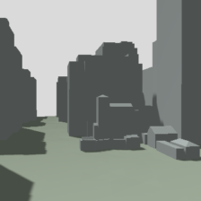
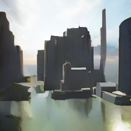
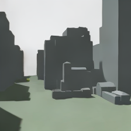

# WAM予測が別の街になる原因の切り分け

**投影画像の欠損と時間条件の組合せに、問題を絞れました。飛行の修正完了ではありません。** 同じ横浜画像でも、欠損のない現在画像と時間ゼロを与えると街区の見た目を保てました。VAEの単独復元も正常に近く、単純に「横浜の形をモデルが扱えない」とは言えません。一方、時間4の画像では数値基準を通っても水面の誤生成が残り、現在の画像基準だけでは採用できないことも分かりました。

[画像の比較](index.html) · [全数値](summary.json) · [固定条件](protocol.json) · [元の飛行結果](../yokohama-native-flight/REPORT-ja.md)

## 同じ入力で6条件を実行

元の停止記録 `yokohama-e9da88bd375a` の16枚の履歴を再利用しました。実ANWM・同じチェックポイント・seed 42・250 diffusion stepsです。追加の飛行、VLA呼出し、移動指令はありません。6条件はGPUを起動する前に固定し、すべての結果を保持しています。ルール方式に勝つかの比較ではありません。

| 条件 | 条件画像 | 時間入力 | 輝度MAE | 既存の画像数値基準 | 目視上の限界 |
|---|---|---:|---:|---|---|
| 横浜・元の条件 | RGBD投影 | 4 | 52.22 | 不合格 | 水面・異なる高層建物 |
| 横浜・時間だけ変更 | RGBD投影 | 0 | 50.21 | 不合格 | 誤生成が残る |
| 横浜・画像だけ変更 | 現在画像全体 | 4 | 28.72 | 合格 | **水面のような誤生成が残る** |
| 横浜・画像と時間を変更 | 現在画像全体 | 0 | 5.91 | 合格 | 元の街区に近い静止画像 |
| 公式データの静止参考入力 | 現在画像全体 | 4 | 7.76 | 合格 | 1枚の反復入力に限定 |
| 公式データの静止参考入力 | 現在画像全体 | 0 | 6.40 | 合格 | 1枚の反復入力に限定 |

時間入力は公式実装内で128で割られます。4を実飛行の1秒と対応付ける検証は未了です。0の診断は現在時刻・移動ゼロの画像保持であり、未来の障害物予測や移動後の視点の正しさを示しません。

横浜4条件は同じ過去RGBD参照と同じ既知領域で評価しました。元の数値基準は既知割合60%以上、輪郭100画素以上、輪郭対応55%以上、輝度MAE45以下、輪郭密度35%以下です。値を変更していません。参考入力は全画素を観測画像として評価した別条件であり、横浜との性能順位を付ける表ではありません。

元の予測PNGは**SHA-256まで完全一致**して再現しました。画素差は0です。今回のLinux側で作った参照投影と以前のローカル参照には輪郭1画素などの微差があるため、以前のMAE52.2281と今回の52.2248を同一の生数値とは扱いません。元の飛行判定は変更しません。

## どこで画像が崩れたか




投影画像の主な違いは、深度のない空が黒く欠けることでした。独立した過去RGBDの既知領域では現在画像との差がRGB MAE1.57、未知領域では216.67でした。未知領域の元画像は98.03%が一様な灰色の空で、投影では96.69%が黒です。これは[事後の画素解析](projection-difference.json)で、未知空間に障害物がない証明ではありません。

VAE単独の圧縮・復元では、横浜の現在画像と投影画像のRGB MAEはともに約0.94でした。平均潜在値と固定seedのサンプルの両方を実行しました。これに対してANWMを通すと大きく変わります。VAEの破損や一般的な画像正規化ミスを主因とする説明は、この結果とは合いません。




現在画像への置換は、黒い欠損だけでなく、過去複数フレームから作った投影の小さな差も変更しています。したがって「黒い画素だけが唯一の原因」とまでは断定しません。また、学習済みモデル内部でなぜ水面を補完するかは未解明です。**現時点の結論は、問題が入力の投影欠損と生成の時間条件に強く依存すること、そして数値合格をそのまま意味的な正しさにできないことです。**

## 接続仕様も照合

[公開コード](https://github.com/EmbodiedCity/ANWM.code/tree/657a80268505fa9149c4df502e35aa0f5bce11e5)と[公開チェックポイント](https://huggingface.co/EmbodiedCity/ANWM/tree/dfe59001de57a96d6620313897f09436c6940983)を確認しました。

- 公開設定は履歴4枚ですが、チェックポイントの位置埋込みは `(17, 196, 1152)` で履歴16枚用です。保存された学習設定名と過去の設定も16枚です。現行実装の16枚は正しく、4枚への変更は修正になりません。
- RGB順、4:3中央切抜き、224×224、画像の−1〜1正規化、VAE倍率0.18215、変位の3.30除算と正規化を学習側と照合しました。停止の正規化値は `[-1/3, 0, 0, 0]` です。全ゼロへの置換は正しい停止入力ではありません。
- 保存設定当時のモデル本体と現在の本体は一致します。今回確認したrollout/utilsの差は名称・メッセージ・コメントで、画像変換の変更ではありません。これらの一致は、あらゆる入力に対する動作保証ではありません。

[仕様照合記録](input-contract-audit.json) · [チェックポイントのメタデータ](checkpoint-metadata.json)。メタデータは505,580 bytesの範囲取得で調べ、その後のGPU診断で完全な重みのSHA-256を再確認しました。

## 修正へ進む条件

今回の「現在画像をそのまま渡す」「時間ゼロ」は診断条件です。移動先へそのまま現在画像を渡すと、視点変化や隠れた建物を無視します。その方式を飛行コードへ採用していません。元のWAM拒否、移動候補の既知割合59.61%不足、モデル移動0回という結果は残ります。

次は、**移動先の視点でも、過去に観測した画素を正しい位置に保つ投影を作り、未知領域を明示したまま確認すること**が必要です。空のように深度がない領域と、建物に遮られて見えない領域を同じ黒い欠損として扱う問題を切り分けます。静止再構成と未来予測の時間仕様も分け、固定した新しい移動候補・新しい観測で評価してから飛行へ戻します。数値指標だけで水面の誤生成を通した条件は、飛行の合格例に数えません。

## 費用・検証・再現範囲

追加は推定 **$0.4149**、累計は推定 **$10.4434 / $13**。請求確定額ではありません。1台のL4を646.289秒の観測時間内に終了し、VM・ブートディスクの不在を確認しました。最長1時間の自動削除も設定していました。[費用・終了記録](budget-cleanup.json)。

追加の実行境界は、元の入力 → 本番と同じNativeModel／公式rollout → 実チェックポイント → 6枚の生成画像 → 元の画像数値基準です。さらにVAEだけの復元を6通り実行しました。公開画像と数値は、次のCPUコマンドで再計算できます。

```sh
python docs/examples/yokohama-wam-diagnosis/reproduce/verify_bundle.py
```

`publication_record_verified` は公開記録の一致を意味します。飛行の合格ではありません。浮動小数点の集約差にのみ絶対誤差1e−10を認め、合否の閾値は変更しません。[実行した診断コード](reproduce/diagnose.py)と[固定条件](protocol.json)を保存しました。クラウド上の実行コマンドは、固定した入力・重み・補助コードを同じ作業フォルダに配置した上で `wam-venv/bin/python -u diagnose.py` です。元のRGBD履歴、完全な環境ログ、クラウド制御ログは非公開原記録として保持し、公開物だけでGPU生成を完全再実行できるとは主張しません。

公式データの参考画像は、最初のtar shardの最初のJPEG（`226.jpg`）を、出力を見る前に選びました。16枚の実飛行履歴ではなく同じ1枚の反復です。単一の画像・seedであり、未学習データの評価や一般的な性能比較ではありません。[取得経緯の補足](download-clarification.json)・[帰属](ATTRIBUTION.md)。
